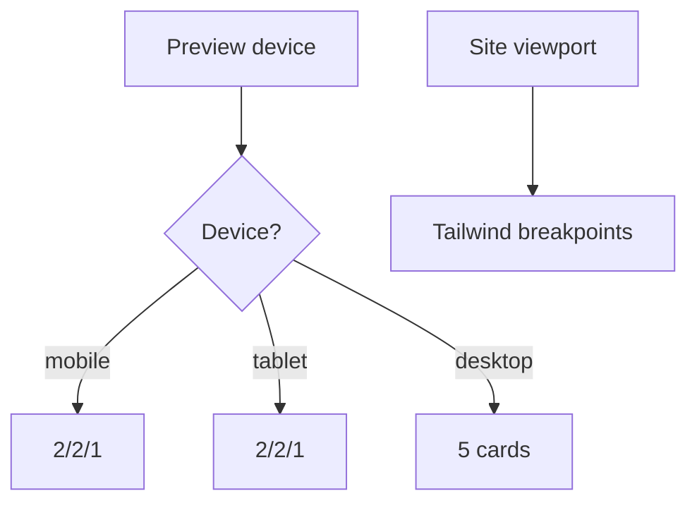

# I. Primer

## 1. TL;DR kiểu Feynman

- Site thật layout 1 đang đúng vì Tailwind breakpoint đo theo viewport thật.
- Preview trong admin chỉ thu nhỏ khung bằng width `375px/768px`, nhưng nhiều class `sm/md/lg/xl` vẫn đo theo viewport trang admin, nên preview bị sai responsive.
- `PreviewWrapper.tsx` đã có comment cảnh báo đúng lỗi này: preview layout phải branch theo `device` state, không dựa vào Tailwind breakpoint.
- Sẽ chỉ sửa nhánh `style === '1'` trong `BenefitsSectionShared.tsx` cho `context="preview"` để width/padding/text/icon đo theo `previewDevice`.
- Giữ site runtime hiện tại vì site đang đúng; không đổi logic Tiêu đề & Mô tả chung.

## 2. Elaboration & Self-Explanation

Lỗi nằm ở chỗ layout 1 hiện có một phần đã branch theo `previewDevice`, nhưng vẫn còn lẫn Tailwind breakpoint như `sm:`, `md:`, `lg:`, `xl:` bên trong preview. Khi mở admin trên desktop rồi chọn mobile preview, các class `sm/md/lg/xl` vẫn active theo kích thước màn hình admin, không theo khung mobile 375px. Vì vậy preview mobile/tablet không giống site thật.

Hướng đúng là tách rõ class width/card/content cho preview theo state:
- `previewDevice === 'mobile'`: 2 card mỗi hàng, item cuối full width.
- `previewDevice === 'tablet'`: 2 card mỗi hàng, item cuối full width.
- `previewDevice === 'desktop'`: 5 card mỗi hàng như desktop preview.

Còn site runtime tiếp tục dùng responsive Tailwind như hiện tại vì ngoài site không có preview shell, Tailwind breakpoint đo đúng viewport thật.

## 3. Concrete Examples & Analogies

Ví dụ: nếu admin đang mở trên màn hình 1440px và bấm icon Mobile, khung preview rộng 375px. Tailwind vẫn thấy viewport 1440px nên `xl:w-[calc(20%-1rem)]` có thể thắng nếu còn trong preview class. Sau sửa, mobile preview sẽ không có `xl:` trong class active của preview nữa; nó dùng trực tiếp `w-[calc(50%-0.375rem)]` hoặc `w-full` theo `previewDevice`.

Analogy: site thật là nhìn căn phòng bằng mắt thật; preview là nhìn qua mô hình thu nhỏ. Không thể dùng kích thước căn phòng thật để quyết định đồ trong mô hình, phải dùng kích thước mô hình.

# II. Audit Summary (Tóm tắt kiểm tra)

- Observation: `app/admin/home-components/_shared/hooks/usePreviewDevice.tsx` định nghĩa `mobile: w-[375px]`, `tablet: w-[768px]`, `desktop: w-full max-w-7xl`.
- Observation: `PreviewWrapper.tsx` có comment: `Tailwind sm/md/lg still reads the admin viewport, so preview layout classes must branch from device`.
- Observation: `BenefitsPreview.tsx` truyền `previewDevice={device}` vào `BenefitsSectionShared`.
- Observation: `BenefitsSectionShared.tsx` layout 1 đang dùng `isPreview` và `resolvedPreviewDevice`, nhưng vẫn còn class responsive `sm:`, `md:`, `lg:`, `xl:` trong preview branch.
- Observation: site runtime `BenefitsRuntimeSection.tsx` gọi `BenefitsSectionShared` với `context="site"`, không truyền `previewDevice`, nên nên giữ responsive Tailwind ở site.

# III. Root Cause & Counter-Hypothesis (Nguyên nhân gốc & Giả thuyết đối chứng)

- Root Cause Confidence: High.
- Nguyên nhân: preview branch vẫn còn phụ thuộc Tailwind viewport breakpoints thay vì hoàn toàn phụ thuộc `previewDevice` state.
- Counter-hypothesis 1: Do width của `PreviewWrapper` sai. Không chọn vì `deviceWidths` đã đúng 375/768 và có comment cảnh báo đúng vấn đề.
- Counter-hypothesis 2: Do site runtime sai. Không chọn vì user xác nhận site thật tablet/mobile đang tốt.
- Counter-hypothesis 3: Cần container query. Không cần trong scope này; repo pattern hiện tại đã dùng `previewDevice` state để giải quyết preview parity.

# IV. Proposal (Đề xuất)

1. Trong `BenefitsSectionShared.tsx`, tạo helper class riêng cho layout 1 preview:
   - `isLastLayoutOneItem = idx === displayedItems.length - 1`.
   - `previewDevice === 'mobile'`: card thường `w-[calc(50%-0.375rem)]`, card cuối `w-full`.
   - `previewDevice === 'tablet'`: card thường `w-[calc(50%-0.5rem)]`, card cuối `w-full`.
   - `previewDevice === 'desktop'`: card thường và card cuối `w-[calc(20%-1rem)]` để preview desktop giống source mẫu 5 card/hàng.
2. Tách class content preview để không còn `sm:`, `md:`, `lg:`, `xl:` trong branch preview layout 1:
   - icon size theo `previewDevice`: mobile/tablet/desktop;
   - padding theo `previewDevice`;
   - title/description size theo `previewDevice`;
   - number size/position theo `previewDevice`.
3. Giữ site branch như hiện tại hoặc chỉ gom lại rõ ràng:
   - site vẫn dùng `w-[calc(50%-0.375rem)] md:w-[calc(50%-0.5rem)] lg:w-[calc(33.333%-1rem)] xl:w-[calc(20%-1rem)]`;
   - site card cuối vẫn full width trước `lg`, rồi 3/5 columns đúng mẫu.
4. Không sửa:
   - `BenefitsPreview.tsx` nếu không cần;
   - `PreviewWrapper.tsx`;
   - create/edit load-save;
   - `SectionHeader` và logic Tiêu đề & Mô tả;
   - layout 2–6.

Legend: `2/2/1` = 2 card, 2 card, 1 card full width.

# V. Files Impacted (Tệp bị ảnh hưởng)

- Sửa: `app/admin/home-components/benefits/_components/BenefitsSectionShared.tsx` — chỉnh preview branch của layout 1 để responsive theo `previewDevice` state.
- Không sửa dự kiến: `app/admin/home-components/benefits/_components/BenefitsPreview.tsx` — đã truyền đúng `previewDevice={device}`.
- Không sửa dự kiến: `app/admin/home-components/_shared/components/PreviewWrapper.tsx` — đã có width state đúng và comment cảnh báo đúng.
- Không sửa dự kiến: `components/site/home/sections/BenefitsRuntimeSection.tsx` — site đang đúng, giữ runtime responsive.
- Không sửa dự kiến: `components/site/ComponentRenderer.tsx` — giữ wiring shared component.

# VI. Execution Preview (Xem trước thực thi)

1. Re-read nhánh `style === '1'` trong `BenefitsSectionShared.tsx`.
2. Tách helper class cho preview width/card/content theo `resolvedPreviewDevice`.
3. Loại bỏ `sm/md/lg/xl` khỏi preview-specific class layout 1.
4. Giữ site branch dùng Tailwind breakpoint.
5. Review tĩnh header chung và layout 2–6 không đổi.
6. Chạy `bunx tsc --noEmit`.
7. Commit thay đổi, không push.

# VII. Verification Plan (Kế hoạch kiểm chứng)

- Static review:
  - preview layout 1 branch không còn responsive Tailwind breakpoint quyết định width chính;
  - site branch vẫn giữ breakpoint viewport;
  - `BenefitsPreview.tsx` vẫn truyền `previewDevice`;
  - header chung không đổi.
- Typecheck: chạy `bunx tsc --noEmit`.
- Manual visual check:
  - edit URL: mobile preview = 2/2/1;
  - edit URL: tablet preview = 2/2/1;
  - edit URL: desktop preview = 5 card/hàng;
  - create Benefits preview cùng behavior;
  - site thật không regression.

# VIII. Todo

- [ ] Sửa preview branch layout 1 theo `previewDevice`.
- [ ] Giữ site branch responsive hiện tại.
- [ ] Review header chung và layout 2–6.
- [ ] Chạy `bunx tsc --noEmit`.
- [ ] Commit thay đổi, không push.

# IX. Acceptance Criteria (Tiêu chí chấp nhận)

- Preview mobile của layout 1 hiển thị 2/2/1 theo state khung preview, không theo viewport admin.
- Preview tablet của layout 1 hiển thị 2/2/1 theo state khung preview, không theo viewport admin.
- Preview desktop layout 1 hiển thị 5 card/hàng.
- Site thật vẫn giữ responsive đúng hiện tại.
- Tiêu đề & Mô tả chung không đổi logic.
- Layout 2–6 không đổi.

# X. Risk / Rollback (Rủi ro / Hoàn tác)

- Rủi ro thấp: chỉ chỉnh branch preview/site class của layout 1, không đổi data contract.
- Rủi ro: desktop preview trong container admin hẹp có thể wrap nếu không đủ không gian thực tế; width `max-w-7xl` vẫn cho phép 5 card khi đủ rộng.
- Rollback: revert commit mới hoặc khôi phục nhánh `style === '1'` về commit `f6e61cac`.

# XI. Out of Scope (Ngoài phạm vi)

- Không đổi design layout 1 đã được duyệt là đẹp.
- Không đổi site runtime ngoài việc giữ parity.
- Không đổi PreviewWrapper global vì có thể ảnh hưởng component khác.
- Không đổi layout 2–6.

# XII. Open Questions (Câu hỏi mở)

- Không có câu hỏi bắt buộc; user đã xác định rõ expected preview mobile/tablet là `2/2/1` và site đang đúng.