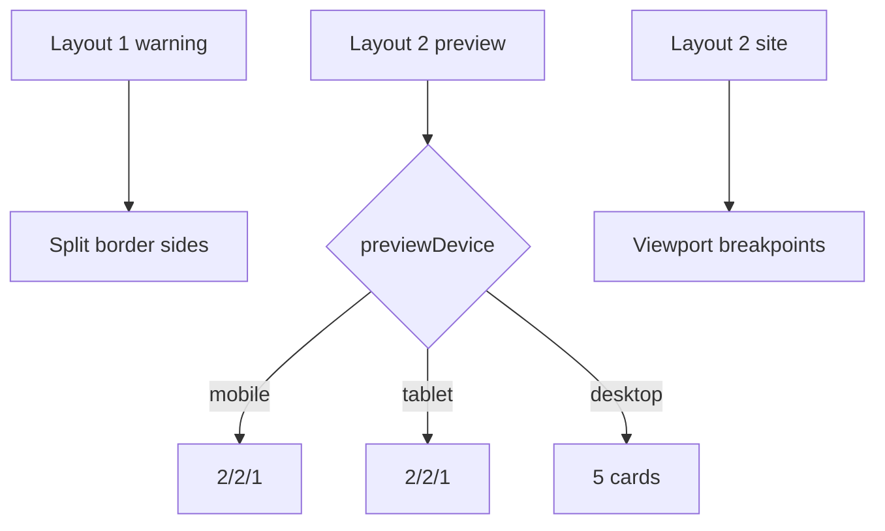

# I. Primer

## 1. TL;DR kiểu Feynman

- Console warning đến từ Layout 1 đang set cùng lúc `borderColor` và `borderBottomColor` inline style trên `<article>`.
- React/Next cảnh báo vì `borderColor` là shorthand còn `borderBottomColor` là longhand cùng nhóm property.
- Sẽ sửa bằng cách không mix shorthand/longhand: dùng `borderTopColor`, `borderRightColor`, `borderLeftColor`, `borderBottomColor` riêng biệt.
- Layout 2 hiện đang dùng `grid md:grid-cols-2 xl:grid-cols-5`, nên preview mobile/tablet vẫn có nguy cơ đo theo viewport admin.
- Sẽ đổi Layout 2 sang responsive giống Layout 1: preview đo theo `previewDevice`, site thật dùng breakpoint site, desktop 5 cột, mobile/tablet 2/2/1.

## 2. Elaboration & Self-Explanation

Có 2 vấn đề chung trong cùng khu vực `BenefitsSectionShared.tsx`:

1. Warning style: ở Layout 1, `<article>` đang có inline style:
   - `borderColor: tokens.cardBorder`
   - `borderBottomColor: tokens.primary`

React không thích mix shorthand `borderColor` với longhand `borderBottomColor`, vì khi rerender có thể remove/update không nhất quán. Fix đúng là tách thành `borderTopColor`, `borderRightColor`, `borderLeftColor`, `borderBottomColor`.

2. Layout 2 responsive: hiện Layout 2 dùng grid class `md:grid-cols-2 xl:grid-cols-5`. Với site thật thì ổn vì breakpoint đo viewport thật, nhưng preview admin phải đo theo state của khung preview (`previewDevice`). Vì vậy Layout 2 nên học đúng pattern Layout 1 mới: preview branch dùng width cố định theo `previewDevice`; site branch dùng Tailwind breakpoint.

## 3. Concrete Examples & Analogies

Ví dụ:
- Preview mobile Layout 2 với 5 items sẽ là: hàng 1 có 2 card, hàng 2 có 2 card, hàng 3 có 1 card full width.
- Preview tablet cũng 2/2/1.
- Site desktop rộng sẽ 5 card/hàng.

Analogy: `borderColor` giống sơn cả 4 cạnh một lần, còn `borderBottomColor` là sơn lại cạnh dưới riêng. React cảnh báo vì đang vừa sơn tất cả vừa sơn riêng; cách sạch là sơn từng cạnh rõ ràng.

# II. Audit Summary (Tóm tắt kiểm tra)

- Observation: Warning stack chỉ vào `BenefitsSectionShared.tsx:291` trong Layout 1 `<article>`.
- Observation: Layout 1 inline style có `borderColor` + `borderBottomColor` cùng lúc.
- Observation: Layout 2 hiện ở `style === '2'`, wrapper là `grid gap-4` + `md:grid-cols-2 xl:grid-cols-5`.
- Observation: `BenefitsPreview.tsx` đã truyền `previewDevice={device}` vào shared component, nên có đủ dữ liệu để layout 2 branch theo state preview.
- Observation: site runtime đang gọi cùng `BenefitsSectionShared` với `context="site"`, nên cần giữ branch site dùng breakpoint thật.

# III. Root Cause & Counter-Hypothesis (Nguyên nhân gốc & Giả thuyết đối chứng)

- Root Cause Confidence: High.
- Nguyên nhân warning: mix shorthand `borderColor` và longhand `borderBottomColor` trong inline style.
- Nguyên nhân responsive Layout 2: preview dùng Tailwind breakpoint viewport admin thay vì `previewDevice` state.
- Counter-hypothesis 1: Cần sửa `PreviewWrapper`. Không chọn vì wrapper đã truyền width và comment cảnh báo đúng; từng component phải branch theo device.
- Counter-hypothesis 2: Cần đổi dữ liệu items/layout config. Không chọn vì lỗi là render class/style.
- Counter-hypothesis 3: Cần đổi tất cả layouts. Không chọn vì user chỉ yêu cầu Layout 2 và warning hiện tại nằm Layout 1.

# IV. Proposal (Đề xuất)

1. Fix warning Layout 1:
   - thay inline style article Layout 1 từ:
     - `borderColor: tokens.cardBorder`
     - `borderBottomColor: tokens.primary`
   - thành:
     - `borderTopColor: tokens.cardBorder`
     - `borderRightColor: tokens.cardBorder`
     - `borderLeftColor: tokens.cardBorder`
     - `borderBottomColor: tokens.primary`
2. Sửa Layout 2 wrapper từ `grid` sang pattern flex-wrap giống Layout 1:
   - preview:
     - mobile: card thường `w-[calc(50%-0.375rem)]`, card cuối `w-full`
     - tablet: card thường `w-[calc(50%-0.5rem)]`, card cuối `w-full`
     - desktop: `w-[calc(20%-1rem)]`
   - site:
     - card thường: `w-[calc(50%-0.375rem)] md:w-[calc(50%-0.5rem)] lg:w-[calc(33.333%-1rem)] xl:w-[calc(20%-1rem)]`
     - card cuối: `w-full lg:w-[calc(33.333%-1rem)] xl:w-[calc(20%-1rem)]`
3. Giữ UI riêng của Layout 2:
   - vẫn card center, icon circle, title/description, accent bar dưới.
   - không copy toàn bộ visual của Layout 1; chỉ copy responsive layout behavior.
4. Fix border style Layout 2 nếu cần tránh warning tương tự:
   - nếu Layout 2 chỉ set `borderColor` không set `borderBottomColor` thì có thể giữ.
   - nếu thêm border-bottom accent riêng thì cũng dùng longhand đầy đủ để tránh warning.
5. Không đổi:
   - `BenefitsPreview.tsx`
   - create/edit load-save
   - SectionHeader / Tiêu đề & Mô tả chung
   - Layout 3–6.

# V. Files Impacted (Tệp bị ảnh hưởng)

- Sửa: `app/admin/home-components/benefits/_components/BenefitsSectionShared.tsx` — fix style warning Layout 1 và đổi responsive Layout 2.
- Không sửa dự kiến: `app/admin/home-components/benefits/_components/BenefitsPreview.tsx` — đã truyền đúng `previewDevice`.
- Không sửa dự kiến: `components/site/home/sections/BenefitsRuntimeSection.tsx` — site dùng shared component nên tự hưởng Layout 2 mới.
- Không sửa dự kiến: `components/site/ComponentRenderer.tsx` — giữ wiring hiện tại.

# VI. Execution Preview (Xem trước thực thi)

1. Sửa inline style border của Layout 1 article.
2. Đổi Layout 2 container từ grid sang flex-wrap.
3. Thêm branch width theo `isPreview/resolvedPreviewDevice` giống Layout 1.
4. Giữ content Layout 2, chỉ chỉnh class/padding nếu cần để responsive không vỡ.
5. Review tĩnh không đụng header chung và Layout 3–6.
6. Chạy `bunx tsc --noEmit`.
7. Commit thay đổi, không push.

# VII. Verification Plan (Kế hoạch kiểm chứng)

- Static review:
  - không còn mix `borderColor` + `borderBottomColor` trong Layout 1 article.
  - Layout 2 preview branch không dùng `md/xl` để quyết định cột.
  - Layout 2 site branch vẫn dùng breakpoint thật.
- Typecheck: chạy `bunx tsc --noEmit`.
- Manual visual check:
  - warning console biến mất khi rerender Layout 1.
  - Layout 2 preview mobile = 2/2/1.
  - Layout 2 preview tablet = 2/2/1.
  - Layout 2 preview desktop/site desktop = 5 card/hàng.
  - Header chung không đổi.

# VIII. Todo

- [ ] Fix warning border style Layout 1.
- [ ] Sửa responsive Layout 2 preview theo `previewDevice`.
- [ ] Sửa responsive Layout 2 site theo pattern Layout 1.
- [ ] Chạy `bunx tsc --noEmit`.
- [ ] Commit thay đổi, không push.

# IX. Acceptance Criteria (Tiêu chí chấp nhận)

- Không còn console warning về `borderBottomColor` conflict với `borderColor` ở Layout 1.
- Layout 2 preview mobile hiển thị 2/2/1 theo khung preview.
- Layout 2 preview tablet hiển thị 2/2/1 theo khung preview.
- Layout 2 desktop/site desktop hiển thị 5 card/hàng.
- Không đổi logic Tiêu đề & Mô tả chung.
- Không đổi Layout 3–6.

# X. Risk / Rollback (Rủi ro / Hoàn tác)

- Rủi ro thấp: chỉ chỉnh class/style trong shared component.
- Rủi ro: Layout 2 card content dài có thể làm chiều cao lệch; behavior hiện tại cũng vậy, chỉ đổi wrap/width.
- Rollback: revert commit mới hoặc khôi phục nhánh Layout 1/2 trong `BenefitsSectionShared.tsx`.

# XI. Out of Scope (Ngoài phạm vi)

- Không đổi thiết kế visual Layout 1 đã ổn.
- Không redesign Layout 2 ngoài responsive grid/wrap.
- Không đổi dữ liệu thật hoặc schema.
- Không đổi PreviewWrapper global.

# XII. Open Questions (Câu hỏi mở)

- Không có câu hỏi bắt buộc; yêu cầu đã rõ: fix warning và làm Layout 2 responsive giống Layout 1 cho cả preview và site.