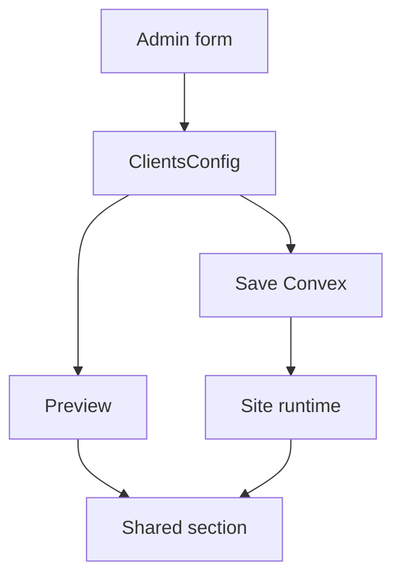

# I. Primer

## 1. TL;DR kiểu Feynman
- Hiện `clients` đang trùng vai trò với `partners`: đều là logo/đối tác/khách hàng.
- Hướng an toàn nhất: giữ route/type nội bộ `clients`/`Clients` để không phải migrate data, nhưng đổi toàn bộ UI và config thành component mới: **Banner ảnh thương hiệu**.
- Component mới vẫn có `Tiêu đề & Mô tả`, còn phần cấu hình chính chỉ còn tối đa 4 ảnh.
- Mỗi ảnh gồm `image/url` và `link`; nếu `link` trống thì render như ảnh thường, không bọc thẻ `<a>`.
- Preview và site sẽ dùng chung shared section để tránh lệch giao diện.

## 2. Elaboration & Self-Explanation
`partners` hiện đã làm tốt phần logo đối tác. `clients` hiện cũng là logo khách hàng/marquee nên bị trùng mục đích. Thay vì tạo thêm một type mới và phải migrate nhiều nơi, ta chuyển nội dung `Clients` thành một component ảnh ngắn, dùng cho banner/visual highlight trên homepage.

Tên đề xuất: **Banner ảnh thương hiệu**. Tên này rõ hơn “banner” đơn thuần vì phân biệt với `Hero Banner` đầu trang và `Gallery` nhiều ảnh. Nó nói đúng mục đích: một dải/block ảnh ngắn, ít ảnh, có thể dẫn link khi click.

Về kỹ thuật, vẫn giữ `COMPONENT_TYPE = 'Clients'`, route `/admin/home-components/create/clients`, folder code `clients`, nhưng đổi label/description, form, type, constants, preview và runtime renderer. Cách này nhỏ, dễ rollback và tránh ảnh hưởng thống kê/query theo exact `type`.

## 3. Concrete Examples & Analogies
Ví dụ config mới dự kiến:

```ts
{
  items: [
    { url: '/uploads/banner-1.webp', link: '/sale' },
    { url: '/uploads/banner-2.webp', link: '' }
  ],
  style: 'grid',
  hideHeader: false,
  showTitle: true,
  subtitle: 'Ưu đãi nổi bật',
  showSubtitle: true
}
```

Nếu item 1 có link `/sale`, site render ảnh có thể click. Nếu item 2 link trống, site chỉ render ảnh.

Analogy: trước đây `clients` giống một kệ trưng logo khách hàng, trùng với kệ `partners`. Ta giữ nguyên vị trí cái kệ trong cửa hàng, nhưng đổi công năng thành kệ trưng **poster/banner ảnh nổi bật** gồm tối đa 4 poster.

# II. Audit Summary (Tóm tắt kiểm tra)

- `lib/home-components/componentTypes.ts` đang có `Clients` label “Khách hàng (Marquee)”, route `clients`, position 17.
- `app/admin/home-components/create/clients/page.tsx` hardcode `COMPONENT_TYPE = 'Clients'`, đang dùng `ClientsForm`, `ClientsPreview`, `DEFAULT_CLIENTS_CONFIG`.
- `app/admin/home-components/clients/_types/index.ts` hiện là contract logo-list: item có `url`, `link`, `name`; style có 6 biến thể logo.
- `app/admin/home-components/clients/_components/ClientsForm.tsx` hiện cho tối đa 20 logo và có field `name`.
- `app/admin/home-components/clients/_components/ClientsPreview.tsx` + `ClientsSectionShared.tsx` render logo grid/marquee/carousel.
- `components/site/home/sections/ClientsRuntimeSection.tsx` đang dùng lại `ClientsSectionShared`, đây là điểm tốt để giữ parity preview/site.
- `components/site/ComponentRenderer.tsx` cũng có case `Clients` và inline `ClientsSection`; cần cập nhật/giữ tương thích để mọi đường render đều đúng.
- `components/modules/homepage/wizard/default-configs.ts` đang trả `DEFAULT_CLIENTS_CONFIG` cho type `Clients`.
- `convex/schema.ts` dùng `type: v.string()`, nên không bị union schema chặn; tuy nhiên Convex stats/query dùng exact type string nên rename type rộng sẽ rủi ro hơn.

# III. Root Cause & Counter-Hypothesis (Nguyên nhân gốc & Giả thuyết đối chứng)

## 1. Root Cause Confidence (Độ tin cậy nguyên nhân gốc)

**High.** Evidence từ registry và code form/render cho thấy `Clients` và `Partners` cùng xoay quanh logo khách hàng/đối tác. `Partners` đã có route/form/shared components riêng và user xác nhận thiết kế tốt, nên `Clients` trở thành component trùng mục đích.

## 2. Counter-Hypothesis (Giả thuyết đối chứng)

- Có thể giữ `Clients` làm “khách hàng tiêu biểu” và `Partners` làm “đối tác”, nhưng UI hiện tại của `Clients` vẫn là logo-list/marquee nên khác biệt không đủ rõ.
- Có thể tạo type mới `BrandBanner` thay vì sửa `Clients`; nhưng sẽ tăng scope: thêm route mới, registry mới, renderer mới, wizard/default, có thể cần data migration nếu muốn thay thế trong danh sách hiện tại.
- Vì user yêu cầu “chuyển đổi home-component clients”, hướng giữ `Clients` nội bộ và đổi công năng là phù hợp hơn.

# IV. Proposal (Đề xuất)

## 1. Tên component

- Label UI: **Banner ảnh thương hiệu**
- Description UI: **Hiển thị 1–4 ảnh banner, có thể gắn link khi click**
- Type/route nội bộ giữ nguyên: `Clients` / `clients`

## 2. Contract mới

```ts
export interface ClientItem {
  url: string;
  link: string;
}

export interface ClientEditorItem extends ClientItem {
  id: string;
  inputMode: 'upload' | 'url';
}

export type ClientsStyle = 'single' | 'duo' | 'grid' | 'feature';

export interface ClientsConfig {
  items: ClientItem[];
  style: ClientsStyle;
  hideHeader?: boolean;
  showTitle?: boolean;
  subtitle?: string;
  showSubtitle?: boolean;
  headerAlign?: 'left' | 'center' | 'right';
  titleColorPrimary?: boolean;
  subtitleAboveTitle?: boolean;
  uppercaseText?: boolean;
  showBadge?: boolean;
  badgeText?: string;
}
```

Ghi chú: bỏ `name`, bỏ `texts` theo từng style vì user chỉ cần ảnh + link và giữ Tiêu đề/Mô tả.

## 3. Form mới

- Tối thiểu 1 item, tối đa 4 item.
- Mỗi item có:
  - upload ảnh hoặc URL ảnh;
  - link dẫn tùy chọn;
  - nút reorder;
  - nút xóa nếu còn hơn 1 item.
- Folder upload đổi từ `clients` sang `brand-banners` hoặc `home-banners` để tên file/asset đúng nghĩa mới.
- UI copy đổi từ “Logo khách hàng” sang “Ảnh banner”.

## 4. Preview/Site mới

- `ClientsSectionShared` sẽ được viết lại thành shared section cho ảnh banner.
- Normalize chỉ giữ tối đa 4 ảnh, bỏ item rỗng nếu không có `url`.
- Render rule:
  - 1 ảnh: full-width banner, aspect video/wide.
  - 2 ảnh: grid 2 cột desktop, 1 cột mobile.
  - 3 ảnh: 1 ảnh lớn + 2 ảnh nhỏ.
  - 4 ảnh: grid 2x2.
- Nếu `link` trống: render `<div>`/`figure`.
- Nếu `link` có giá trị: render `<a href=...>` với `target` phù hợp nếu external.



# V. Files Impacted (Tệp bị ảnh hưởng)

## 1. UI admin create/edit

- Sửa: `app/admin/home-components/create/clients/page.tsx` — hiện tạo logo khách hàng; đổi default title, upload naming, max item 4, bỏ style/text logo, dùng form/preview mới.
- Sửa: `app/admin/home-components/clients/[id]/edit/page.tsx` — hiện edit logo-list; đổi load/save theo config banner mới, bỏ `ClientsTextsForm`, đổi copy “Clients” thành “Banner ảnh thương hiệu”.
- Sửa: `app/admin/home-components/clients/_components/ClientsForm.tsx` — hiện form logo nhiều item; đổi thành form ảnh banner tối đa 4, chỉ `url` + `link`.
- Sửa/xóa khỏi render: `app/admin/home-components/clients/_components/ClientsTextsForm.tsx` — không còn cần nếu bỏ text per style; có thể để file không dùng hoặc xóa nếu không còn import.

## 2. Shared preview/site

- Sửa: `app/admin/home-components/clients/_types/index.ts` — đổi contract từ logo-list sang image-banner list.
- Sửa: `app/admin/home-components/clients/_lib/constants.ts` — đổi default config, styles và label.
- Sửa: `app/admin/home-components/clients/_components/ClientsPreview.tsx` — đổi title preview/copy/info và style switch theo banner.
- Sửa: `app/admin/home-components/clients/_components/ClientsSectionShared.tsx` — rewrite layout render ảnh 1–4 item, xử lý link optional.
- Sửa nếu cần: `app/admin/home-components/clients/_lib/colors.ts` — giữ token hiện có nếu đủ dùng; chỉ đổi description/copy nếu có.

## 3. Site/runtime/wiring

- Sửa: `components/site/home/sections/ClientsRuntimeSection.tsx` — đổi cast/type/default style theo banner config mới, vẫn dùng shared section.
- Sửa: `components/site/ComponentRenderer.tsx` — cập nhật import/inline `ClientsSection` để không còn render logo-list cũ.
- Sửa: `components/modules/homepage/wizard/default-configs.ts` — `case 'Clients'` vẫn trả `DEFAULT_CLIENTS_CONFIG`, nhưng default mới là banner ảnh.
- Sửa: `lib/home-components/componentTypes.ts` — đổi label/description của `Clients`, giữ route/value.
- Sửa nếu còn surfaced: `app/admin/home-components/_shared/legacy/HomeComponentLegacyEditor.tsx` — đổi label icon/copy nếu xuất hiện trong UI legacy.

## 4. Hướng dẫn nội bộ nếu cần

- Sửa nếu UI đang hiển thị guide link: `app/system/huong-dan/_data/guides.ts` — đổi text “clients” cũ sang “Banner ảnh thương hiệu”. Không tạo README/docs mới.

# VI. Execution Preview (Xem trước thực thi)

1. Đọc lại các file impacted ngay trước khi sửa để tránh stale context.
2. Cập nhật types/constants: contract mới, style mới, default `items` 1 ảnh rỗng, header config giữ nguyên.
3. Rewrite form `ClientsForm`: max 4, min 1, upload/url + link, bỏ name/logo wording.
4. Rewrite shared section `ClientsSectionShared`: normalize 1–4 ảnh, render layout theo số lượng/style, link optional.
5. Cập nhật create page: default title “Banner ảnh thương hiệu”, upload naming/folder, submit config mới.
6. Cập nhật edit page: load config cũ an toàn, normalize fallback, save config mới, bỏ `ClientsTextsForm`.
7. Cập nhật preview và runtime renderer để preview/site cùng dùng shared section.
8. Cập nhật registry label/default config/legacy copy.
9. Tự review tĩnh: import unused, type mismatch, null-safety, backward compatibility dữ liệu cũ.
10. Commit thay đổi sau khi review diff. Theo AGENTS.md không tự chạy lint/unit test; nếu có code TS thay đổi thì chỉ chạy `bunx tsc --noEmit` trước commit theo rule repo, trừ khi user yêu cầu không chạy.

# VII. Verification Plan (Kế hoạch kiểm chứng)

- Static review (bắt buộc):
  - Không còn UI copy “Logo khách hàng”, “Marquee”, “Clients” ở surface người dùng chính của component.
  - `items` không vượt quá 4 ở form/create/edit/normalize.
  - `link` trống không tạo anchor click.
  - Preview và runtime cùng dùng shared renderer.
  - `HeaderConfigSection` vẫn giữ tiêu đề/mô tả.
- Type check:
  - Chạy `bunx tsc --noEmit` trước commit vì có thay đổi TypeScript, theo instruction repo.
- Manual tester checklist sau bàn giao:
  - Mở `/admin/home-components/create/clients` thấy “Banner ảnh thương hiệu”.
  - Upload 1, 2, 3, 4 ảnh đều preview đúng.
  - Không thể thêm ảnh thứ 5.
  - Ảnh có link click được trên site; ảnh link trống không điều hướng.
  - Component render ngoài site không còn dạng logo/marquee cũ.

# VIII. Todo

- [ ] Cập nhật contract/types/default cho `Clients` thành banner ảnh thương hiệu.
- [ ] Rewrite form create/edit cho tối đa 4 ảnh, mỗi ảnh có upload/URL và link tùy chọn.
- [ ] Rewrite preview/shared/site runtime để render ảnh 1–4 item và giữ parity.
- [ ] Cập nhật label/description/default config/wizard/legacy copy liên quan.
- [ ] Review tĩnh, chạy typecheck theo rule repo nếu được phép sau khi thoát spec, rồi commit.

# IX. Acceptance Criteria (Tiêu chí chấp nhận)

- `/admin/home-components/create/clients` không còn là form logo khách hàng; hiển thị component **Banner ảnh thương hiệu**.
- Form chính chỉ cho tối đa 4 ảnh.
- Mỗi ảnh chỉ cần upload/URL ảnh và link tùy chọn.
- Vẫn có khu vực `Tiêu đề & Mô tả` như hiện tại.
- Preview admin và site runtime dùng cùng cấu trúc layout ảnh.
- `partners` không bị chỉnh logic và vẫn là component logo đối tác chính.
- Existing `type = 'Clients'` vẫn render được, không cần data migration.
- Không phát sinh lỗi TypeScript do import/type cũ còn sót.

# X. Risk / Rollback (Rủi ro / Hoàn tác)

- Rủi ro backward compatibility: component `Clients` cũ có nhiều logo/name/texts; sau đổi sẽ chỉ dùng tối đa 4 ảnh và bỏ `name/texts`. Mitigation: normalize lấy 4 item đầu có `url`, bỏ qua field cũ.
- Rủi ro naming nội bộ: code vẫn tên `Clients` nhưng UI là Banner ảnh thương hiệu. Đây là tradeoff để tránh migrate type/route/stats.
- Rollback: revert commit sẽ khôi phục toàn bộ form/render logo-list cũ vì thay đổi tập trung trong folder `clients` và wiring liên quan.

# XI. Out of Scope (Ngoài phạm vi)

- Không đổi schema Convex.
- Không migrate dữ liệu thật hàng loạt.
- Không sửa hoặc refactor `partners`.
- Không tạo home-component type mới như `BrandBanner` trừ khi user muốn đổi scope.
- Không thêm gallery/lightbox/carousel phức tạp ngoài yêu cầu 1–4 ảnh.

# XII. Open Questions (Câu hỏi mở)

Không có câu hỏi bắt buộc. Tôi sẽ mặc định dùng tên **Banner ảnh thương hiệu**, giữ internal type `Clients`, và thiết kế layout tự thích nghi theo số lượng ảnh 1–4.