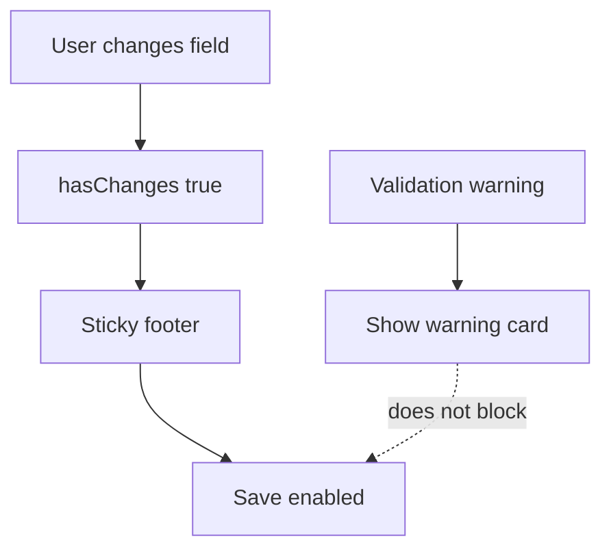

# I. Primer

## 1. TL;DR kiểu Feynman

- Nút vẫn không bấm được vì code Contact edit vẫn đang tự truyền `disableSave={!hasChanges || hasValidationErrors || isSubmitting}`.
- Các home-component khác không làm vậy; họ chỉ dựa vào `hasChanges` và `isSubmitting` của footer.
- Nghĩa là chỉ cần còn warning validation thì Contact bị khóa lưu, dù user chỉ sửa header hợp lệ.
- Cách sửa đúng theo pattern repo: bỏ `hasValidationErrors` khỏi điều kiện disable; warning vẫn hiện nhưng không chặn lưu.
- Đồng thời đổi copy warning từ “Chưa thể lưu...” sang kiểu cảnh báo không blocking.

## 2. Elaboration & Self-Explanation

Observation: file `app/admin/home-components/contact/[id]/edit/page.tsx` hiện vẫn có:

```tsx
disableSave={!hasChanges || hasValidationErrors || isSubmitting}
```

Observation: `HomeComponentStickyFooter` đã tự biết disable khi `hasChanges === false || isSubmitting` nếu không truyền `disableSave`. Đây cũng là pattern các edit page khác trong repo đang dùng.

Observation: Contact là outlier (ngoại lệ) duy nhất trong grep kết quả đang gắn validation vào disable save. Vì vậy save button bị khóa là đúng theo code hiện tại, không phải lỗi browser hay CSS.

Decision: bỏ cơ chế blocking này, giữ validation ở mức warning. Như vậy Contact edit sẽ hành xử giống các component khác trong repo và user bấm lưu được.

## 3. Concrete Examples & Analogies

Ví dụ hiện tại:
- user đổi `headerAlign`
- `hasChanges = true`
- nhưng `hasValidationErrors = true`
- kết quả: label là `Lưu thay đổi` nhưng button disabled

Sau khi sửa:
- user đổi `headerAlign`
- `hasChanges = true`
- warning validation vẫn hiện nếu có
- button vẫn bấm được và save như các component khác

Analogy: giống đèn cảnh báo trên xe. Đèn cảnh báo có thể sáng để nhắc kiểm tra, nhưng không nên khóa luôn cửa xe khiến bạn không thể lái xe vào garage để sửa.

# II. Audit Summary (Tóm tắt kiểm tra)

- `app/admin/home-components/contact/[id]/edit/page.tsx` vẫn chứa `disableSave={!hasChanges || hasValidationErrors || isSubmitting}`.
- `app/admin/home-components/_shared/components/HomeComponentStickyFooter.tsx` mặc định đã disable đúng nếu `hasChanges === false || isSubmitting`.
- Grep nhiều edit page khác cho thấy họ chỉ truyền `hasChanges`, không khóa bởi validation riêng.
- Validation Contact vẫn hữu ích để hiển thị warning inline, nhưng không nên là điều kiện chặn save.

# III. Root Cause & Counter-Hypothesis (Nguyên nhân gốc & Giả thuyết đối chứng)

Độ tin cậy nguyên nhân gốc: High.

1. Triệu chứng quan sát được là gì (expected vs actual)?
   - Expected: có thay đổi thì nút `Lưu thay đổi` bấm được.
   - Actual: có thay đổi nhưng nút vẫn disabled.
2. Phạm vi ảnh hưởng (user, module, môi trường)?
   - Contact edit page trong admin.
3. Có tái hiện ổn định không? điều kiện tái hiện tối thiểu?
   - Có. Chỉ cần `hasChanges=true` và `hasValidationErrors=true`.
4. Mốc thay đổi gần nhất (commit/config/dependency/data)?
   - Các fix trước giữ nguyên blocking validation tại footer Contact edit.
5. Dữ liệu nào đang thiếu để kết luận chắc chắn?
   - Không cần thêm dữ liệu runtime; code path đã đủ rõ.
6. Có giả thuyết thay thế hợp lý nào chưa bị loại trừ?
   - `isSubmitting=true` treo. Khả năng thấp vì label không chuyển sang `Đang lưu...`.
7. Rủi ro nếu fix sai nguyên nhân là gì?
   - Có thể vẫn còn khóa save nếu sửa copy warning mà quên bỏ condition disable.
8. Tiêu chí pass/fail sau khi sửa?
   - Button enabled khi `hasChanges=true` và `isSubmitting=false`, bất kể warning validation.

# IV. Proposal (Đề xuất)

1. Sửa `app/admin/home-components/contact/[id]/edit/page.tsx`:
   - Giữ `validationResult`, `hasValidationErrors`, `validationMessages` để hiển thị warning.
   - Bỏ prop `disableSave` khỏi `HomeComponentStickyFooter`, hoặc tối thiểu đổi thành `disableSave={!hasChanges || isSubmitting}`.
   - Khuyến nghị: bỏ hẳn prop để dùng đúng default behavior của footer như các page khác.

2. Đổi copy warning để phản ánh non-blocking:
   - Từ: `Chưa thể lưu vì còn dữ liệu chưa hợp lệ:`
   - Thành: `Có dữ liệu cần kiểm tra thêm:`

3. Không đổi validation rule nữa trong bước này:
   - Mục tiêu là sửa UX disable button, không tiếp tục mở rộng scope validate từng field.



# V. Files Impacted (Tệp bị ảnh hưởng)

- Sửa: `app/admin/home-components/contact/[id]/edit/page.tsx` — hiện dùng validation để disable save; sẽ đổi thành warning-only và giữ footer theo pattern chuẩn repo.

# VI. Execution Preview (Xem trước thực thi)

1. Mở lại Contact edit page file.
2. Bỏ `disableSave={!hasChanges || hasValidationErrors || isSubmitting}` khỏi footer.
3. Đổi warning copy thành non-blocking.
4. Static review để chắc `handleSubmit` không bị đổi behavior ngoài ý muốn.
5. Chạy `bunx tsc --noEmit`.
6. Commit local, không push.

# VII. Verification Plan (Kế hoạch kiểm chứng)

- TypeScript: chạy `bunx tsc --noEmit`.
- Manual QA:
  - Vào `/admin/home-components/contact/js78cjhejvwwepktdxht8rkr7s85rhgy/edit`.
  - Đổi một tùy chọn header.
  - Nút `Lưu thay đổi` phải enabled và bấm được.
  - Nếu còn warning validation, warning vẫn hiện nhưng không chặn save.
  - Reload lại sau save, thay đổi vẫn giữ.

# VIII. Todo

- [ ] Bỏ validation khỏi điều kiện disable save của Contact edit.
- [ ] Đổi warning copy thành non-blocking.
- [ ] Chạy `bunx tsc --noEmit`.
- [ ] Commit thay đổi, không push.

# IX. Acceptance Criteria (Tiêu chí chấp nhận)

- Nút `Lưu thay đổi` của Contact edit bấm được khi có thay đổi.
- Validation warning nếu có chỉ cảnh báo, không disable nút.
- Footer Contact edit hành xử giống các home-component edit khác.
- TypeScript pass.

# X. Risk / Rollback (Rủi ro / Hoàn tác)

- Rủi ro thấp: có thể lưu cùng warning validation đang tồn tại.
- Tradeoff chấp nhận được vì đây là pattern nhất quán với phần còn lại của repo.
- Rollback: revert commit mới.

# XI. Out of Scope (Ngoài phạm vi)

- Không sửa dữ liệu thật record `js78...`.
- Không đổi sâu validation rule URL/Zalo/link.
- Không sửa các home-component khác.