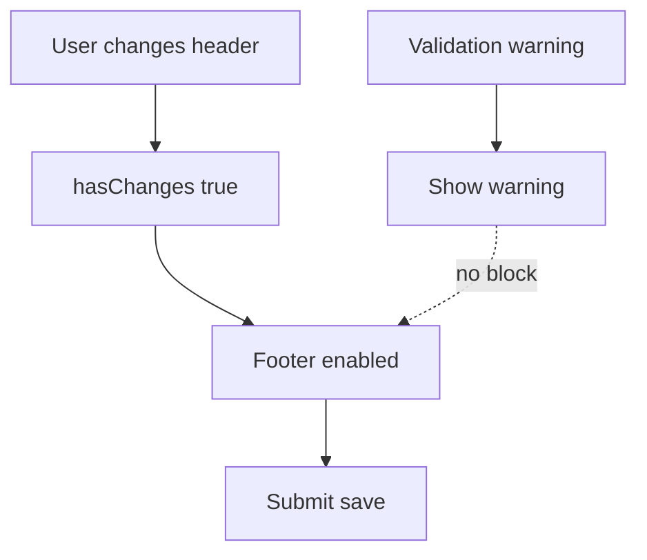

# I. Primer

## 1. TL;DR kiểu Feynman

- Nút vẫn không bấm được vì Contact edit là trang duy nhất đang truyền `disableSave={!hasChanges || hasValidationErrors || isSubmitting}` vào footer.
- Các home-component khác chỉ truyền `hasChanges`, không khóa nút bằng validation riêng.
- Screenshot cho thấy label là `Lưu thay đổi`, nghĩa là `hasChanges=true`; vậy phần đang khóa nhiều khả năng là `hasValidationErrors=true`.
- Cách sửa đúng theo pattern repo: validation Contact chỉ cảnh báo, không disable nút lưu.
- Khi bấm lưu, Contact sẽ save giống các component khác; warning vẫn hiện để người dùng biết có dữ liệu cần xem lại.

## 2. Elaboration & Self-Explanation

Observation: `HomeComponentStickyFooter` tự disable khi `hasChanges === false || isSubmitting`. Các edit page khác như Clients, Benefits, Stats, Hero... chỉ truyền `hasChanges={hasChanges}`, không tự truyền `disableSave` theo validation.

Observation: chỉ `contact/[id]/edit/page.tsx` truyền thêm `disableSave={!hasChanges || hasValidationErrors || isSubmitting}`. Vì vậy dù footer hiển thị `Lưu thay đổi`, button vẫn disabled nếu bất kỳ validation field nào fail.

Observation: Contact validation đang kiểm tra các dữ liệu phụ như `mapEmbed`, `contactItems.href`, `socialLinks.url`. Một số field có thể đến từ dữ liệu cũ/settings/manager con, và không liên quan tới thao tác user đang chỉnh header. Vì thế khóa save toàn trang là UX sai trong ngữ cảnh này.

Decision: đổi validation Contact edit từ blocking (chặn lưu) sang non-blocking warning (cảnh báo nhưng vẫn cho lưu), đồng bộ với pattern các home-component khác.

## 3. Concrete Examples & Analogies

Ví dụ code hiện tại của Contact:

```tsx
disableSave={!hasChanges || hasValidationErrors || isSubmitting}
```

Pattern repo ở các component khác:

```tsx
<HomeComponentStickyFooter
  isSubmitting={isSubmitting}
  hasChanges={hasChanges}
  submitLabel="Lưu thay đổi"
/>
```

Analogy: giống form có một cảnh báo phụ ở mục mạng xã hội nhưng người dùng chỉ sửa tiêu đề section. Không nên khóa cửa toàn bộ form; chỉ cần cảnh báo để người dùng biết.

# II. Audit Summary (Tóm tắt kiểm tra)

- `app/admin/home-components/contact/[id]/edit/page.tsx`: có `hasChanges=true` nhưng `disableSave` vẫn có thể true vì `hasValidationErrors`.
- `app/admin/home-components/_shared/components/HomeComponentStickyFooter.tsx`: button disabled theo prop `disableSave` nếu prop này được truyền.
- Grep các edit page khác cho thấy các home-component khác dùng footer với `hasChanges` nhưng không truyền `disableSave` theo validation.
- `validateContactConfig` vẫn hữu ích để hiển thị warning, nhưng không nên là điều kiện khóa nút lưu toàn trang.

# III. Root Cause & Counter-Hypothesis (Nguyên nhân gốc & Giả thuyết đối chứng)

Độ tin cậy nguyên nhân gốc: High.

1. Triệu chứng quan sát được: button hiện text `Lưu thay đổi` nhưng bị disabled/click không được.
2. Phạm vi ảnh hưởng: Contact edit page, đặc biệt record đang có validation fail sẵn.
3. Tái hiện ổn định: nếu `hasChanges=true` và `hasValidationErrors=true`, footer label là `Lưu thay đổi` nhưng `disabled=true`.
4. Mốc thay đổi gần nhất: các fix trước vẫn giữ `hasValidationErrors` trong `disableSave`.
5. Dữ liệu thiếu: chưa đọc trực tiếp record Convex thật, nhưng code path + screenshot đủ để xác định trạng thái `hasChanges=true` và button bị disabled bởi condition còn lại.
6. Giả thuyết thay thế: `isSubmitting=true` treo. Khả năng thấp vì screenshot không hiển thị `Đang lưu...`; label vẫn là `Lưu thay đổi`.
7. Rủi ro nếu fix sai: có thể cho lưu config có URL phụ chưa hợp lệ; nhưng đây là behavior nhất quán với các home-component khác và warning vẫn còn.
8. Tiêu chí pass/fail: sau khi đổi header ở Contact edit, nút `Lưu thay đổi` phải bấm được dù warning validation còn hiện.

# IV. Proposal (Đề xuất)

1. Sửa `app/admin/home-components/contact/[id]/edit/page.tsx`:
   - Giữ `validationResult`, `hasValidationErrors`, `validationMessages` để hiển thị cảnh báo.
   - Đổi footer từ:
     ```tsx
     disableSave={!hasChanges || hasValidationErrors || isSubmitting}
     ```
     sang một trong hai hướng tương đương pattern repo:
     ```tsx
     disableSave={!hasChanges || isSubmitting}
     ```
     hoặc bỏ hẳn `disableSave` để footer tự xử lý bằng `hasChanges` + `isSubmitting`.
   - Khuyến nghị: bỏ prop `disableSave` để giống các edit page khác nhất.

2. Điều chỉnh warning text:
   - Đổi từ “Chưa thể lưu...” thành “Có dữ liệu cần kiểm tra...” vì warning không còn blocking.
   - Giữ danh sách lỗi để user biết chỗ cần xem lại.

3. Không đổi validation rule thêm nữa:
   - Không tiếp tục vá từng kiểu URL/iframe một vì vấn đề chính là UX khóa save toàn trang.

4. Chạy typecheck và commit:
   - `bunx tsc --noEmit`.
   - Commit local, không push.



# V. Files Impacted (Tệp bị ảnh hưởng)

- Sửa: `app/admin/home-components/contact/[id]/edit/page.tsx` — hiện khóa save bằng validation; sẽ đổi validation thành warning không chặn lưu.

# VI. Execution Preview (Xem trước thực thi)

1. Update footer props trong Contact edit để không dùng `hasValidationErrors` làm điều kiện disabled.
2. Đổi copy warning từ blocking sang non-blocking.
3. Static review: label footer, disabled condition, submit handler.
4. Chạy `bunx tsc --noEmit`.
5. Commit thay đổi, không push.

# VII. Verification Plan (Kế hoạch kiểm chứng)

- TypeScript: chạy `bunx tsc --noEmit`.
- Manual QA:
  - Vào `/admin/home-components/contact/js78cjhejvwwepktdxht8rkr7s85rhgy/edit`.
  - Đổi một option header như align/title color/badge.
  - Button `Lưu thay đổi` phải enabled và click được.
  - Nếu validation warning còn hiện, warning không được chặn save.
  - Save xong reload, header config vẫn giữ.

# VIII. Todo

- [ ] Bỏ validation khỏi điều kiện disable save của Contact edit.
- [ ] Đổi warning copy thành non-blocking.
- [ ] Chạy `bunx tsc --noEmit`.
- [ ] Commit thay đổi, không push.

# IX. Acceptance Criteria (Tiêu chí chấp nhận)

- Nút `Lưu thay đổi` trên Contact edit click được khi có thay đổi.
- Validation warning nếu có chỉ cảnh báo, không disable nút.
- Behavior footer Contact edit giống các home-component khác.
- TypeScript pass.

# X. Risk / Rollback (Rủi ro / Hoàn tác)

- Rủi ro thấp-trung bình: có thể lưu một số URL phụ chưa hợp lệ, nhưng đây là behavior nhất quán hơn với repo và tránh khóa người dùng khỏi các thay đổi hợp lệ.
- Rollback: revert commit mới nếu muốn validation tiếp tục blocking.

# XI. Out of Scope (Ngoài phạm vi)

- Không sửa dữ liệu thật record `js78...`.
- Không đổi validation rule URL/Zalo/link thêm nữa.
- Không sửa các home-component khác.