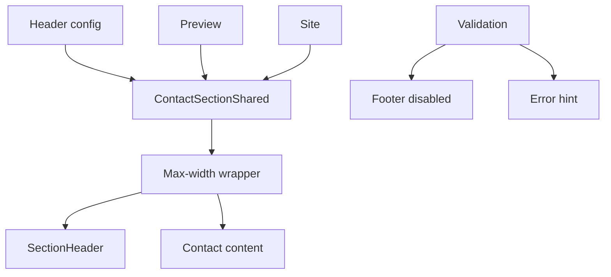

# I. Primer

## 1. TL;DR kiểu Feynman

- Contact đang có 2 lỗi tách nhau: preview không có header shared, còn site thật có header nhưng header nằm ngoài container nên bị văng sát mép trái.
- Benefits xử lý đúng: `SectionHeader` nằm cùng `mx-auto max-w-* space-y-*` với content, không render header bên ngoài container.
- Contact site hiện render `SectionHeader` ở `components/site/ContactSection.tsx` bên ngoài `ContactSectionShared`, nên không cùng max-width với content.
- Cách sửa đúng: đưa `SectionHeader` vào `ContactSectionShared`, bên trong `containerClass`, trước `{content}`; gỡ header rời khỏi site wrapper để tránh double header.
- Nút `Lưu thay đổi` disabled là do validation fail; cần hiện lý do ngắn để user biết field nào đang chặn.

## 2. Elaboration & Self-Explanation

Observation: `ContactPreview.tsx` truyền `config` và `title` vào `ContactSectionShared`, nhưng `ContactSectionShared.tsx` không render `SectionHeader`. Vì vậy các tùy chọn `Tiêu đề & Mô tả` không hiện trong preview dù page-level state đã đổi.

Observation: `components/site/ContactSection.tsx` đang render `SectionHeader` trước `ContactSectionShared`. Header này không nằm trong `ContactSectionShared` container (`max-w-6xl mx-auto`), nên trên site thật nếu căn trái nó dính ra ngoài như screenshot.

Observation: Benefits create preview render đúng theo cấu trúc: `<section px-4>
<SectionHeader/><BenefitsSectionShared skipHeader/>
</section>`. Điểm quan trọng là header và content cùng một wrapper max-width.

Decision: áp dụng cùng nguyên tắc cho Contact nhưng ở tầng shared: `<section>
<SectionHeader/><content/>
</section>`. Như vậy preview và site đều dùng cùng renderer, header luôn nằm trong max-width.

## 3. Concrete Examples & Analogies

Ví dụ Benefits đúng: `BenefitsPreview.tsx` có `section className="px-4 py-10"`, bên trong là `div className="mx-auto max-w-6xl space-y-6"`, rồi mới đến `SectionHeader` và content.

Ví dụ Contact sai: site render `SectionHeader` ngoài shared container, còn content Contact nằm trong `ContactSectionShared` container riêng; vì hai phần không chung hộp nên header bị văng ngoài.

Analogy: header và content phải đứng trong cùng một cái khay có chiều rộng cố định. Hiện Contact đặt tiêu đề ngoài khay, còn khối liên hệ trong khay, nên tiêu đề chạy sát mép bàn.

# II. Audit Summary (Tóm tắt kiểm tra)

- `app/admin/home-components/contact/_components/ContactPreview.tsx`: truyền đúng `config`/`title` xuống shared section, nhưng shared section không render header.
- `app/admin/home-components/contact/_components/ContactSectionShared.tsx`: có `containerClass = getRootContainerClass(...)`, nhưng chỉ đặt `{content}` trong container; chưa có `SectionHeader`.
- `components/site/ContactSection.tsx`: render `SectionHeader` rời bên ngoài `ContactSectionShared`, gây lệch max-width/spacing và có nguy cơ double header nếu shared được sửa.
- `app/admin/home-components/benefits/_components/BenefitsPreview.tsx`: reference đúng cho container: `section px-4` → `div mx-auto max-w-6xl space-y-6` → `SectionHeader` + content.
- `app/admin/home-components/contact/[id]/edit/page.tsx`: footer disabled khi `hasValidationErrors` true nhưng chưa có message rõ.

# III. Root Cause & Counter-Hypothesis (Nguyên nhân gốc & Giả thuyết đối chứng)

Độ tin cậy nguyên nhân gốc: High.

1. Triệu chứng quan sát được: preview không hiện header shared; site thật hiện header nhưng văng sát trái ngoài khối contact.
2. Phạm vi ảnh hưởng: Contact create/edit preview và site runtime Contact.
3. Tái hiện ổn định: Contact preview luôn không có `SectionHeader` vì shared renderer không render; site header luôn ở ngoài shared container vì wrapper site render rời.
4. Mốc thay đổi gần nhất: commit trước chỉ merge state header vào config, chưa xử lý renderer/container.
5. Dữ liệu thiếu: chưa đọc record Convex thật `js78...`, nhưng lỗi container/renderer được xác nhận bằng code và screenshot.
6. Giả thuyết thay thế: CSS global làm header văng. Khả năng thấp vì Benefits/Clients dùng header trong max-width wrapper và không bị cùng lỗi.
7. Rủi ro nếu fix sai: site có thể double header nếu không bỏ `SectionHeader` cũ khỏi site wrapper; spacing có thể đổi nhẹ.
8. Tiêu chí pass/fail: Contact preview có header shared; site header nằm cùng max-width với content; không double header; save disabled có message.

# IV. Proposal (Đề xuất)

1. Sửa `ContactSectionShared` để render shared header trong cùng max-width container:
   - Import `SectionHeader`.
   - Đổi container thành có spacing, ví dụ `cn(containerClass, 'space-y-6')`.
   - Render `SectionHeader` trước `{content}`:
     - `title={title}`
     - `subtitle={config.subtitle}`
     - `badgeText={config.badgeText}`
     - `hideHeader={config.hideHeader}`
     - `showTitle={config.showTitle}`
     - `showSubtitle={config.showSubtitle}`
     - `showBadge={config.showBadge}`
     - `headerAlign={config.headerAlign}`
     - `titleColorPrimary={config.titleColorPrimary}`
     - `subtitleAboveTitle={config.subtitleAboveTitle}`
     - `uppercaseText={config.uppercaseText}`
     - `brandColor={tokens.primary}`
   - Giữ các heading nội bộ (`info.texts.heading`, `info.heading`) vì đó là nội dung layout Contact/form, không phải section header shared.

2. Sửa `components/site/ContactSection.tsx` để tránh header rời và double header:
   - Bỏ import `SectionHeader`.
   - Bỏ import/usage `extractSectionHeaderConfig` nếu không còn dùng.
   - Không render `SectionHeader` bên ngoài nữa.
   - Truyền `normalizedConfig` vào `ContactSectionShared`; header fields đã nằm trong config qua `normalizeContactConfig`.

3. Sửa Contact edit UX khi button disabled:
   - Tạo `validationResult = useMemo(() => validateContactConfig(configWithHeader), [configWithHeader])`.
   - `hasValidationErrors = !validationResult.isValid`.
   - Build message ngắn từ errors:
     - `mapEmbed`: “URL bản đồ không hợp lệ.”
     - `contactItems`: “Có link trong dữ liệu liên hệ không hợp lệ.”
     - `socialLinks`: “Có URL mạng xã hội không hợp lệ.”
   - Hiển thị callout/card nhỏ trước `HomeComponentStickyFooter` khi invalid, để user hiểu vì sao không bấm được.
   - Giữ `disableSave` hiện tại để không cho lưu dữ liệu invalid.

4. Review create Contact:
   - Vì preview dùng `ContactSectionShared`, create sẽ tự có header shared sau fix.
   - Nếu create không khóa save theo validation thì không thêm UX mới ngoài scope.

# V. Files Impacted (Tệp bị ảnh hưởng)

- Sửa: `app/admin/home-components/contact/_components/ContactSectionShared.tsx` — hiện chỉ render Contact content trong max-width; sẽ thêm `SectionHeader` trong cùng container để preview/site parity.
- Sửa: `components/site/ContactSection.tsx` — hiện render `SectionHeader` ngoài Contact container; sẽ bỏ header rời và để shared renderer xử lý.
- Sửa: `app/admin/home-components/contact/[id]/edit/page.tsx` — hiện disable save do validation nhưng không giải thích; sẽ thêm validation result và message gần footer.
- Kiểm tra: `app/admin/home-components/create/contact/page.tsx` — đảm bảo sau khi shared renderer sửa, create preview nhận header đúng mà không cần thêm wrapper.

# VI. Execution Preview (Xem trước thực thi)

1. Đọc lại 3 file touched để tránh lệch với working tree mới.
2. Thêm `SectionHeader` vào `ContactSectionShared` trong `containerClass` giống Benefits/Clients.
3. Gỡ header rời khỏi `components/site/ContactSection.tsx` và dọn unused imports.
4. Thêm validation callout vào Contact edit, giữ disabled behavior.
5. Static review các style: modern/floating/grid/elegant/minimal/centered vẫn render content như cũ; chỉ thêm section header bên ngoài content card.
6. Chạy `bunx tsc --noEmit`.
7. Commit thay đổi, không push.

# VII. Verification Plan (Kế hoạch kiểm chứng)

- TypeScript: chạy `bunx tsc --noEmit` sau khi sửa.
- Static review:
  - `ContactSectionShared` có đúng một `SectionHeader` bên trong max-width wrapper.
  - `components/site/ContactSection.tsx` không còn render header riêng.
  - Header/content cùng một `containerClass` và có spacing rõ.
- Manual QA cho tester:
  - `/admin/home-components/create/contact`: đổi badge/title/subtitle/align/uppercase/title primary; preview đổi ngay.
  - `/admin/home-components/contact/[id]/edit`: đổi các option header; preview đổi ngay và save được khi config valid.
  - Site thật: header nằm trong cùng max-width với khối Contact, căn trái không văng sát mép màn hình.
  - Site thật: không xuất hiện 2 header.
  - Khi có URL invalid: button disabled và hiển thị lý do.

# VIII. Todo

- [ ] Sửa `ContactSectionShared` render `SectionHeader` trong max-width container.
- [ ] Bỏ `SectionHeader` rời khỏi `components/site/ContactSection.tsx`.
- [ ] Thêm validation hint cho Contact edit khi save disabled.
- [ ] Review create Contact preview sau shared fix.
- [ ] Chạy `bunx tsc --noEmit`.
- [ ] Commit thay đổi, không push.

# IX. Acceptance Criteria (Tiêu chí chấp nhận)

- Contact preview hiển thị và cập nhật `Tiêu đề & Mô tả` shared ở create/edit.
- Contact site header nằm trong max-width container giống Benefits, không văng ra mép trái.
- Contact site không bị double header.
- Nút `Lưu thay đổi` nếu disabled do validation phải có message giải thích.
- Không đổi schema và không sửa dữ liệu thật.
- TypeScript pass.

# X. Risk / Rollback (Rủi ro / Hoàn tác)

- Rủi ro trung bình: thêm shared header vào renderer có thể làm spacing Contact thay đổi nhẹ ở cả preview/site.
- Giảm rủi ro bằng cách đặt header trong wrapper `space-y-6`, giống Benefits, và không động vào layout cards/map/form.
- Rollback: revert commit mới; commit trước vẫn giữ page-level merge header state.

# XI. Out of Scope (Ngoài phạm vi)

- Không redesign layout Contact.
- Không thay đổi validation rule URL/Zalo/link.
- Không chỉnh dữ liệu record thật `js78...`.
- Không sửa các home-component khác ngoài dùng làm reference.