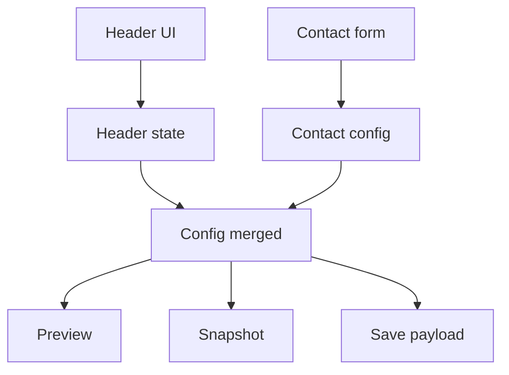

# I. Primer

## 1. TL;DR kiểu Feynman

- Trang Contact đã có section chung `Tiêu đề & Mô tả`, nhưng preview/dirty-check vẫn đọc config cũ nên nhìn như “không nhận”.
- Benefits làm đúng vì trước khi preview/save nó luôn merge state header riêng vào config preview.
- Contact đang bị “nửa migrate”: có shared header mới, nhưng vẫn còn block `Header Configuration` cũ trong `ConfigEditor`.
- Cách sửa nhỏ nhất: tạo config đã merge header cho create/edit, dùng nó cho preview/save/snapshot, rồi bỏ block header cũ trong `ConfigEditor`.
- Không đổi schema, không đổi renderer site, không thêm tính năng.

## 2. Elaboration & Self-Explanation

Observation: `create/contact/page.tsx` render `HeaderConfigSection` và khi submit có merge `headerState`, nhưng `ContactPreview` lại nhận `normalizedConfig` từ `config` cũ, chưa chứa headerState mới. Vì vậy user chỉnh “Tiêu đề & Mô tả” nhưng preview không phản ánh ngay.

Observation: `contact/[id]/edit/page.tsx` cũng render `HeaderConfigSection`, save có merge header fields, nhưng `currentSnapshot`, `hasChanges`, `hasValidationErrors` và `ContactPreview` dùng `normalizedConfig` chưa merge header local state. Vì vậy edit chỉ đổi header có thể không bật trạng thái lưu/preview đúng.

Observation: `contact/_components/ConfigEditor.tsx` vẫn có card riêng `Header Configuration`, trong khi user đã chỉ rõ phần này phải độc lập và là shared component giống Benefits.

Decision: bám pattern Benefits: header shared là source of truth cho UI “Tiêu đề & Mô tả”; form Contact chỉ quản lý dữ liệu contact/form/social/texts.

## 3. Concrete Examples & Analogies

Ví dụ cụ thể: ở Benefits create, preview gọi `buildPreviewConfig({ state, header: { hideHeader, showTitle, subtitle, ... } })`; Contact hiện chỉ gọi `config={normalizedConfig}` nên thiếu phần `{ subtitle, headerAlign, showBadge }` mới từ shared header.

Analogy: giống có 2 bảng điều khiển cho cùng một bóng đèn. Bảng mới đã gắn nút, nhưng dây preview vẫn nối vào bảng cũ, nên bấm bảng mới không thấy đèn đổi. Sửa là nối preview/save về đúng bảng mới và bỏ bảng cũ gây nhiễu.

# II. Audit Summary (Tóm tắt kiểm tra)

- `app/admin/home-components/create/contact/page.tsx`: có `HeaderConfigSection`, submit merge header đúng, nhưng preview chưa merge header.
- `app/admin/home-components/contact/[id]/edit/page.tsx`: có `HeaderConfigSection`, submit merge header đúng, nhưng preview/currentSnapshot/hasChanges chưa merge header.
- `app/admin/home-components/contact/_components/ConfigEditor.tsx`: còn block `Header Configuration` trùng với shared header.
- `app/admin/home-components/create/benefits/page.tsx`: reference đúng, build preview config bằng cách merge state editor + header state trước khi đưa vào preview.
- `app/admin/home-components/contact/_lib/normalize.ts`: đã support đầy đủ shared header fields trong normalize/payload/snapshot, nên không cần đổi schema.

# III. Root Cause & Counter-Hypothesis (Nguyên nhân gốc & Giả thuyết đối chứng)

Độ tin cậy nguyên nhân gốc: High.

1. Triệu chứng quan sát được: expected là chỉnh section `Tiêu đề & Mô tả` ở Contact create/edit phải phản ánh vào preview/save như Benefits; actual là Contact preview/dirty-check vẫn dùng config chưa merge header local state.
2. Phạm vi ảnh hưởng: home-component Contact ở cả create và edit trong admin.
3. Tái hiện ổn định: vào `/admin/home-components/create/contact`, đổi subtitle/badge/headerAlign trong section shared; preview vẫn lấy `normalizedConfig` cũ. Edit có pattern tương tự.
4. Mốc thay đổi gần nhất: Contact đã được migrate một phần sang `HeaderConfigSection`, nhưng `ConfigEditor` cũ và preview/snapshot chưa được đồng bộ.
5. Dữ liệu thiếu: chưa chạy UI browser để quan sát trực tiếp vì đang ở spec mode; evidence hiện tại là static code path.
6. Giả thuyết thay thế: `ContactPreview` hoặc `ContactSectionShared` không render header fields. Chưa loại trừ hoàn toàn, nhưng normalize/payload đã có fields và pattern chính sai ngay tại page-level nên root cause page-level là đủ mạnh.
7. Rủi ro nếu fix sai: header preview có thể vẫn lệch, hoặc edit save không bật khi chỉ đổi header.
8. Tiêu chí pass/fail: đổi bất kỳ shared header field ở Contact create/edit phải thấy preview đổi và edit phải bật `Lưu thay đổi`.

# IV. Proposal (Đề xuất)

Sửa theo hướng nhỏ, giống Benefits:

1. Tạo helper/config memo ở Contact create:
   - `previewConfig = normalizeContactConfig({ ...config, ...headerState fields })`.
   - Dùng `previewConfig` cho `ContactPreview`.
   - Giữ submit hiện tại nhưng có thể tái dùng cùng logic để tránh lệch.

2. Tạo helper/config memo ở Contact edit:
   - `configWithHeader = normalizeContactConfig({ ...config, hideHeader, showTitle, subtitle, showSubtitle, headerAlign, titleColorPrimary, subtitleAboveTitle, uppercaseText, showBadge, badgeText })`.
   - Dùng `configWithHeader` cho `currentSnapshot`, `hasValidationErrors`, `ContactPreview`, và submit payload.
   - Khi `onStyleChange`, update từ config hiện tại nhưng giữ header source ở local shared state.

3. Xóa block `Header Configuration` khỏi `ConfigEditor`:
   - Bỏ phần card header trùng lặp.
   - Bỏ import/usage `ToggleSwitch` nếu không còn dùng ở file đó.
   - Giữ các card dữ liệu Contact, form fields, social links, dynamic texts.

# V. Files Impacted (Tệp bị ảnh hưởng)

- Sửa: `app/admin/home-components/create/contact/page.tsx` — hiện quản lý create Contact và render preview; sẽ merge shared header state vào preview config.
- Sửa: `app/admin/home-components/contact/[id]/edit/page.tsx` — hiện quản lý edit Contact, dirty-check và save; sẽ dùng config đã merge header cho preview/snapshot/validation/save.
- Sửa: `app/admin/home-components/contact/_components/ConfigEditor.tsx` — hiện còn UI header cũ; sẽ bỏ card header duplicate để shared header là UI duy nhất.

# VI. Execution Preview (Xem trước thực thi)

1. Đọc lại 3 file affected để lấy context mới nhất.
2. Thêm memo/helper merge header vào create contact.
3. Thêm memo/helper merge header vào edit contact và thay các usage liên quan.
4. Xóa card `Header Configuration` cũ khỏi `ConfigEditor`, dọn import không dùng do thay đổi này.
5. Static review: kiểm tra typing, stale closure, duplicate source of truth, compatibility với data cũ.
6. Commit thay đổi sau khi review diff; theo rule dự án, không chạy lint/build, chỉ chạy `bunx tsc --noEmit` trước commit nếu user approve triển khai code.

# VII. Verification Plan (Kế hoạch kiểm chứng)

- TypeScript: sau khi sửa code, chạy `bunx tsc --noEmit` theo rule dự án trước commit.
- Static review bắt buộc vì project cấm tự chạy lint/unit test.
- Manual QA đề xuất cho tester:
  - Create Contact: đổi `Phụ đề`, `Badge`, `Căn lề`, `Ẩn header`; preview đổi ngay.
  - Edit Contact: đổi chỉ `Phụ đề` hoặc `Badge`; nút `Lưu thay đổi` bật và preview đổi ngay.
  - Save edit rồi reload; header fields vẫn giữ.
  - `ConfigEditor` không còn card `Header Configuration` trùng lặp.

# VIII. Todo

- [ ] Sửa create Contact merge header vào preview config.
- [ ] Sửa edit Contact merge header vào preview/snapshot/validation/save.
- [ ] Xóa UI header duplicate khỏi Contact ConfigEditor.
- [ ] Static review và chạy `bunx tsc --noEmit`.
- [ ] Commit thay đổi, không push.

# IX. Acceptance Criteria (Tiêu chí chấp nhận)

- Contact create dùng section shared `Tiêu đề & Mô tả` làm nguồn cấu hình header duy nhất.
- Contact edit dùng section shared `Tiêu đề & Mô tả` làm nguồn cấu hình header duy nhất.
- Preview Contact phản ánh ngay các field header shared ở cả create và edit.
- Edit Contact nhận diện thay đổi khi chỉ đổi header shared.
- Không còn UI `Header Configuration` cũ trong Contact `ConfigEditor`.
- Không đổi schema hoặc runtime contract ngoài phần cần thiết.

# X. Risk / Rollback (Rủi ro / Hoàn tác)

- Rủi ro thấp: thay đổi chủ yếu là page-level merge state và bỏ UI trùng.
- Rủi ro compatibility thấp: `normalizeContactConfig`, `toContactConfigPayload`, `toContactSnapshot` đã có shared header fields.
- Rollback: revert commit sẽ đưa Contact về trạng thái hiện tại.

# XI. Out of Scope (Ngoài phạm vi)

- Không refactor toàn bộ Contact component.
- Không đổi site renderer hoặc layout 6 styles nếu không phát hiện lỗi trực tiếp khi triển khai.
- Không chỉnh Benefits hoặc các home-component khác.
- Không chạy lint/unit test theo rule dự án.