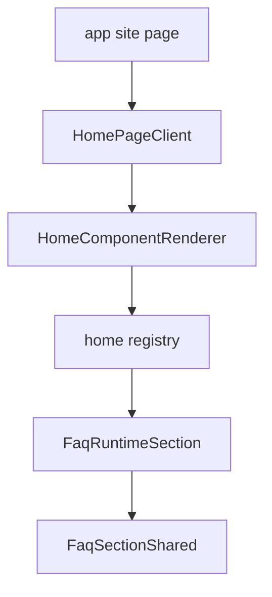

# I. Primer

## 1. TL;DR kiểu Feynman
- Lần fix trước chỉnh `components/site/ComponentRenderer.tsx`, nhưng homepage thật không đi qua file đó cho FAQ.
- Site thật đang render FAQ qua registry mới: `components/site/home/registry.tsx` → `components/site/home/sections/FaqRuntimeSection.tsx`.
- `FaqRuntimeSection.tsx` hiện chỉ gọi `FaqSectionShared`, không render `SectionHeader`, nên section header chắc chắn không hiện trên site thật.
- Fix đúng là thêm shared header vào `FaqRuntimeSection.tsx`, rồi truyền `suppressInternalHeader` xuống `FaqSectionShared` giống preview.
- Không cần đổi Convex data/schema; chỉ sửa đúng runtime surface đang được homepage dùng.

## 2. Elaboration & Self-Explanation
Observation (Quan sát): `app/(site)/page.tsx` lấy `api.homeComponents.listActive`, `HomePageClient` render từng item bằng `HomeComponentRenderer`. `HomeComponentRenderer` tra `homeComponentRegistry`, và registry map `FAQ: FaqRuntimeSection`. Vì vậy site thực không dùng `FAQSection` trong legacy `ComponentRenderer.tsx` khi component type là `FAQ`.

Inference (Suy luận): Lần trước chỉ sửa legacy path nên preview có thể đúng, fallback legacy có thể đúng, nhưng homepage thực vẫn dùng `FaqRuntimeSection.tsx` cũ. File này chưa import `SectionHeader`, chưa gọi `extractSectionHeaderConfig`, và chưa truyền `suppressInternalHeader`, nên không thể hiện section header chung.

Decision (Quyết định): sửa trực tiếp `components/site/home/sections/FaqRuntimeSection.tsx` theo pattern đang có ở `BenefitsRuntimeSection.tsx`/`ClientsRuntimeSection.tsx`: extract header config, render shared `SectionHeader`, sau đó render `FaqSectionShared` và suppress internal header khi shared header có nội dung.

## 3. Concrete Examples & Analogies
- Ví dụ cụ thể: `components/site/home/registry.tsx:98` map `FAQ` sang `FaqRuntimeSection`, còn fix trước nằm ở `components/site/ComponentRenderer.tsx`, chỉ dùng khi registry không có section component tương ứng.
- Analogy: đã sửa đúng “cánh cửa phụ” (`ComponentRenderer`) nhưng khách đang đi “cánh cửa chính” (`HomeComponentRenderer` + registry), nên site thật vẫn không đổi.

# II. Audit Summary (Tóm tắt kiểm tra)
- `components/site/home/registry.tsx`: `FAQ: FaqRuntimeSection`.
- `components/site/home/HomeComponentRenderer.tsx`: nếu registry có section component thì render component mới; chỉ fallback sang `LegacyComponentRenderer` khi không có registry entry.
- `components/site/home/sections/FaqRuntimeSection.tsx`: hiện không render `SectionHeader`; chỉ truyền `description/buttonText/buttonLink` vào `FaqSectionShared`.
- `components/site/home/sections/BenefitsRuntimeSection.tsx`: có pattern đúng để render shared `SectionHeader` trước shared section.
- `components/site/home/sections/ClientsRuntimeSection.tsx`: có pattern đúng để extract header config rồi truyền header props vào shared section.

# III. Root Cause & Counter-Hypothesis (Nguyên nhân gốc & Giả thuyết đối chứng)

Root Cause Confidence (Độ tin cậy nguyên nhân gốc): High.

- Triệu chứng quan sát được: site thật vẫn không thấy section header sau commit trước.
- Phạm vi ảnh hưởng: homepage FAQ runtime path mới (`components/site/home/sections/FaqRuntimeSection.tsx`).
- Tái hiện tối thiểu: homepage có active FAQ component với config header; `HomePageClient` render qua registry.
- Mốc thay đổi gần nhất: repo có runtime registry mới tách khỏi legacy `ComponentRenderer`; fix trước chỉ chạm legacy FAQSection.
- Dữ liệu thiếu: chưa đọc record Convex thật để xác nhận header text có trong config, nhưng code path đủ chứng minh `FaqRuntimeSection` không render shared header dù config có.
- Giả thuyết thay thế hợp lý: nếu record chưa lưu `badgeText/subtitle/show*`, sau khi sửa runtime vẫn chỉ thấy title nếu `showTitle=true`; nếu `hideHeader=true` thì header vẫn không hiện theo cấu hình.
- Rủi ro nếu fix sai: header có thể bị lặp nếu không suppress internal header khi shared header bật.
- Tiêu chí pass/fail: site homepage thực hiện `SectionHeader` của FAQ giống preview; FAQ card không lặp title nội bộ khi header chung có nội dung.

# IV. Proposal (Đề xuất)

1. Sửa `components/site/home/sections/FaqRuntimeSection.tsx`:
   - Import `SectionHeader` từ `app/admin/home-components/_shared/components/SectionHeader`.
   - Import `extractSectionHeaderConfig` từ `app/admin/home-components/_shared/hooks/useSectionHeaderState`.
   - Extract `headerConfig = extractSectionHeaderConfig(config)`.
   - Tính `hasSharedHeader` theo cùng logic preview/runtime legacy:
     - `!hideHeader`
     - và có title/subtitle/badge text tương ứng với `showTitle/showSubtitle/showBadge`.
   - Render wrapper `<section className="px-4 py-10">
...` để giống legacy path hiện tại.
   - Render `<SectionHeader ... />` trước `FaqSectionShared`.
   - Truyền `suppressInternalHeader={hasSharedHeader}` vào `FaqSectionShared`.

2. Không chỉnh create/edit:
   - Create/edit đã lưu và truyền header fields.
   - Vấn đề nằm ở runtime site path.

3. Giữ legacy `ComponentRenderer.tsx` đã sửa:
   - Không revert vì vẫn là fallback hợp lệ nếu registry thiếu hoặc page khác dùng legacy renderer.

# V. Files Impacted (Tệp bị ảnh hưởng)

- Sửa: `components/site/home/sections/FaqRuntimeSection.tsx` — runtime thực của FAQ trên homepage; thêm render shared section header và suppress internal FAQ header khi cần.
- Không sửa: `components/site/ComponentRenderer.tsx` — legacy/fallback path đã được chỉnh trước, giữ nguyên.
- Không sửa: `app/admin/home-components/faq/_components/FaqPreview.tsx` — preview đã có logic suppress internal header.
- Không sửa: `app/admin/home-components/faq/_components/FaqSectionShared.tsx` — contract `suppressInternalHeader` đã có, chỉ cần runtime mới dùng.

# VI. Execution Preview (Xem trước thực thi)

1. Mở `FaqRuntimeSection.tsx`.
2. Thêm 2 imports cho shared header config/render.
3. Tạo `headerConfig` và `hasSharedHeader`.
4. Bọc output bằng section/container giống legacy renderer.
5. Render `SectionHeader` trước `FaqSectionShared`.
6. Truyền `suppressInternalHeader={hasSharedHeader}`.
7. Chạy `bunx tsc --noEmit` vì có thay đổi TSX.
8. Commit local, không push.

# VII. Verification Plan (Kế hoạch kiểm chứng)

- Static review:
  - FAQ registry path dùng `FaqRuntimeSection`.
  - Header fields đi từ Convex config → `extractSectionHeaderConfig` → `SectionHeader`.
  - `FaqSectionShared` nhận `suppressInternalHeader` để không lặp title nội bộ.
- Typecheck:
  - Chạy `bunx tsc --noEmit`.
- Manual visual do tester:
  - Mở homepage `localhost:3000`.
  - Kiểm tra FAQ active component thấy badge/subtitle/title như preview nếu config có text.
  - Tắt `hideHeader`/`showTitle`/`showSubtitle`/`showBadge` trong admin rồi lưu, site phản ánh đúng.

# VIII. Todo

- [ ] Sửa `components/site/home/sections/FaqRuntimeSection.tsx` render shared header.
- [ ] Truyền `suppressInternalHeader` vào `FaqSectionShared` trong runtime thực.
- [ ] Chạy `bunx tsc --noEmit`.
- [ ] Commit local, không push.

# IX. Acceptance Criteria (Tiêu chí chấp nhận)

- Site thật homepage FAQ hiển thị section header chung khi config bật và có nội dung.
- Preview create/edit và site thật dùng cùng logic suppress internal header.
- Không bị lặp hai header khi shared header đang bật.
- Không đổi schema/data Convex.
- TypeScript pass.

# X. Risk / Rollback (Rủi ro / Hoàn tác)

- Rủi ro thấp: chỉ sửa runtime FAQ surface đang thiếu header.
- Rủi ro layout: thêm wrapper section/container có thể thay đổi spacing FAQ site; chọn class giống legacy path để giảm lệch.
- Rollback: revert file `components/site/home/sections/FaqRuntimeSection.tsx`; data không ảnh hưởng.

# XI. Out of Scope (Ngoài phạm vi)

- Không chỉnh dữ liệu thật Convex trong task này.
- Không refactor toàn bộ runtime registry.
- Không thay đổi UI style FAQ ngoài header parity.