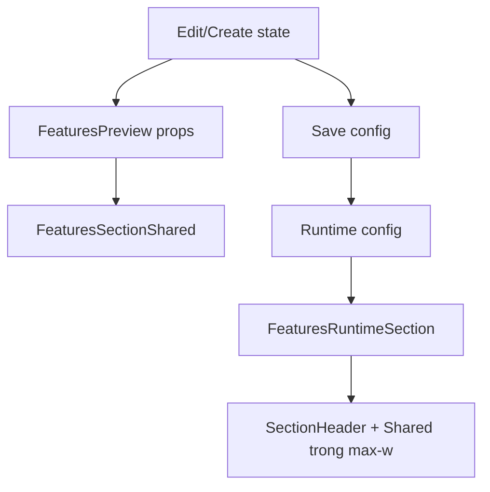

# I. Primer

## 1. TL;DR kiểu Feynman

- Component `Features` đang lưu được Tiêu đề & Mô tả ra site thật, nhưng preview 6 layout chưa đọc bộ config header đó.
- Site thật đang render `SectionHeader` bên ngoài container của `FeaturesSectionShared`, nên header có thể “văng” khỏi max-width/spacing của home-component.
- Footer “Lưu thay đổi” không bật khi sửa subtitle/badge/toggle header vì snapshot dirty-state hiện chỉ so `title`, `active`, `items`, `style`.
- Sẽ copy pattern đã fix ở `clients`, `contact`, `faq`: đưa header config vào preview, đưa header vào cùng wrapper max-width với content, và đưa toàn bộ header fields vào snapshot.
- Sẽ thêm collapse/expand toggle cho các section cấu hình khác của Features, giống hướng `contact`/`faq`: create mở mặc định, edit đóng mặc định.

## 2. Elaboration & Self-Explanation

Hiện `Features` có 2 “đường hiển thị”: preview trong admin và site runtime ngoài trang thật. Site runtime đã đọc `extractSectionHeaderConfig(config)` rồi render `SectionHeader`, nên người dùng thấy Tiêu đề & Mô tả ngoài site. Nhưng `FeaturesPreview` chỉ truyền `sectionTitle={title}` vào `FeaturesSectionShared`, không truyền `subtitle`, `badgeText`, `showSubtitle`, `headerAlign`, v.v. Vì vậy preview của 6 layout không phản ánh đầy đủ phần Tiêu đề & Mô tả.

Vấn đề max-width là do `components/site/home/sections/FeaturesRuntimeSection.tsx` render `<SectionHeader />` và `<FeaturesSectionShared />` như 2 sibling trong fragment. Trong khi `FeaturesSectionShared` tự có padding/content riêng, header không nằm trong cùng wrapper `section px-4 py-10` + `mx-auto max-w-6xl`. Pattern gần đây ở FAQ/Clients cho thấy header nên nằm trong cùng container với shared section để không lệch width.

Vấn đề footer lưu thay đổi nằm ở `serializeState()` trong edit page: nó chưa include header config. Khi đổi subtitle hoặc các toggle header, `currentState` vẫn giống `initialState`, nên `hasChanges` không bật.

## 3. Concrete Examples & Analogies

Ví dụ cụ thể: nếu user sửa `subtitle` từ rỗng thành “Nền tảng giúp vận hành nhanh hơn”, site thật có thể hiển thị dòng này vì runtime đọc config, nhưng preview admin không đổi vì `FeaturesPreview` không nhận `subtitle`. Đồng thời sticky footer vẫn disabled vì `subtitle` không nằm trong `serializeState()`.

Analogy: giống như có 2 bản in của cùng một poster. Bản treo ngoài cửa hàng đã nhận dòng mô tả mới, nhưng bản preview trong máy thiết kế vẫn dùng mẫu cũ; nút “Lưu” cũng không sáng vì hệ thống chỉ kiểm tra ảnh chính, chưa kiểm tra dòng mô tả.

# II. Audit Summary (Tóm tắt kiểm tra)

- Đã đọc route user nêu: `app/admin/home-components/features/[id]/edit/page.tsx`.
- Đã đọc create page: `app/admin/home-components/create/features/page.tsx`.
- Đã đọc preview/shared/runtime:
  - `app/admin/home-components/features/_components/FeaturesPreview.tsx`
  - `app/admin/home-components/features/_components/FeaturesSectionShared.tsx`
  - `components/site/home/sections/FeaturesRuntimeSection.tsx`
- Đã đọc type/constants:
  - `app/admin/home-components/features/_types/index.ts`
  - `app/admin/home-components/features/_lib/constants.ts`
- Đã đối chiếu pattern từ ~20 commit gần nhất:
  - `dcdb98dd` / `bb59f6aa`: clients preview nhận shared header config + dirty snapshot include header fields.
  - `4ef96821`: FAQ runtime bọc `SectionHeader` và shared section trong `section px-4 py-10` + `mx-auto max-w-6xl`.
  - `f62947e8`: contact fix header nằm trong container để không văng khỏi section.
  - `119f6cc1` / `196b2594`: thêm toggle section, edit đóng mặc định, create mở mặc định.

# III. Root Cause & Counter-Hypothesis (Nguyên nhân gốc & Giả thuyết đối chứng)

## 1. Root Cause Confidence (Độ tin cậy nguyên nhân gốc: High)

- High vì evidence trực tiếp trong code:
  - `FeaturesPreview` không có props cho `hideHeader`, `subtitle`, `showSubtitle`, `badgeText`, `headerAlign`, v.v.
  - `FeaturesSectionShared` tự render header hardcode với mô tả cố định `Khám phá những tính năng...`, không dùng shared `SectionHeader` contract.
  - `FeaturesRuntimeSection` render `SectionHeader` ngoài wrapper/max-width của shared section.
  - `serializeState()` trong edit page không include header fields.

## 2. Audit protocol 5/8 câu bắt buộc

1. Triệu chứng: preview 6 layout không nhận Tiêu đề & Mô tả; site thật nhận nhưng header bị lệch max-width; đổi section mô tả không trigger footer lưu.
2. Phạm vi: `Features` home-component trong admin create/edit preview và site runtime.
3. Tái hiện tối thiểu: vào edit Features, sửa subtitle/badge/header toggle; preview không phản ánh đủ và sticky footer không bật nếu chỉ đổi header fields.
4. Mốc thay đổi gần nhất: commit gần đây đã fix cùng class lỗi ở `clients`, `contact`, `faq`, `benefits`.
5. Dữ liệu thiếu: chưa visual-test trên browser do đang ở spec mode và project rule cấm tự chạy integration/lint; sẽ kiểm chứng tĩnh + typecheck sau khi user duyệt.
6. Giả thuyết thay thế: có thể `SectionHeader` global render ngoài bởi parent site page; nhưng evidence trong `FeaturesRuntimeSection.tsx` cho thấy chính section runtime đang render header ngoài container.
7. Rủi ro nếu fix sai: duplicate header hoặc mất header internal của một số layout nếu không xử lý `skipHeader`/wrapper nhất quán.
8. Pass/fail: preview 6 styles hiển thị đúng title/subtitle/badge/toggle; site header nằm trong max-width; sticky footer bật khi đổi subtitle/badge/toggle; save persist config.

# IV. Proposal (Đề xuất)

## 1. Sửa preview nhận đầy đủ header config

- Mở rộng `FeaturesPreviewProps` thêm các props shared header giống `ClientsPreview`/`FaqPreview`:
  - `hideHeader`, `showTitle`, `subtitle`, `showSubtitle`, `headerAlign`, `titleColorPrimary`, `subtitleAboveTitle`, `uppercaseText`, `showBadge`, `badgeText`.
- Từ edit/create page truyền toàn bộ state này vào `<FeaturesPreview />`.
- Trong preview, render `FeaturesSectionShared` theo contract shared header, không chỉ `title`.

## 2. Chuẩn hóa `FeaturesSectionShared` để render shared header trong cùng container

- Import và dùng `SectionHeader` trong `FeaturesSectionShared` hoặc truyền các props header xuống để shared section render header nhất quán.
- Loại bỏ/hạn chế `renderSectionHeader()` hardcode hiện tại; thay bằng shared `SectionHeader` để các toggle như show/hide title, subtitle, badge, uppercase, align hoạt động giống component khác.
- Giữ `skipHeader` để runtime có thể tránh duplicate nếu cần, nhưng hướng đề xuất là cho shared section tự render header trong cùng wrapper content.

## 3. Sửa site runtime max-width

- Cập nhật `FeaturesRuntimeSection.tsx` theo pattern FAQ/Clients:
  - bọc bằng `<section className="px-4 py-10">`
  - bên trong `
`
  - render `SectionHeader` và `FeaturesSectionShared skipHeader={true}` trong cùng container; hoặc nếu dời header vào shared section, runtime chỉ gọi shared section với header props.
- Giải pháp ưu tiên: ít thay đổi nhất là runtime bọc `SectionHeader` + `FeaturesSectionShared` trong cùng `section/div max-w-6xl`, giữ `skipHeader={true}`. Preview cũng theo cùng pattern hoặc shared nhận header props.

## 4. Sửa dirty-state footer

- Mở rộng `serializeState()` trong `features/[id]/edit/page.tsx` để include toàn bộ header fields:
  - `hideHeader`, `showTitle`, `subtitle`, `showSubtitle`, `headerAlign`, `titleColorPrimary`, `subtitleAboveTitle`, `uppercaseText`, `showBadge`, `badgeText`.
- Cập nhật `setInitialState()` sau load và sau save.
- Cập nhật `currentState useMemo` dependencies tương ứng.

## 5. Thêm toggle section cho các phần khác

- Theo yêu cầu “thêm toggle section ở các phần khác như section Tiêu đề và Mô tả”:
  - Edit: `headerExpanded` đổi mặc định `false`; thêm `componentExpanded`, `featuresExpanded` mặc định `false`.
  - Create: giữ `headerExpanded` mặc định `true`; thêm `featuresExpanded` mặc định `true`.
- Bọc/collapse các card:
  - `Thông tin component` trong edit.
  - `Danh sách tính năng` trong create/edit.
- Dùng pattern card header clickable + `ChevronDown`, giống `HeaderConfigSection`/Contact.

# V. Files Impacted (Tệp bị ảnh hưởng)

## UI / Admin create-edit

- Sửa: `app/admin/home-components/features/[id]/edit/page.tsx`  
  Vai trò hiện tại: load/save Features, quản lý state, dirty footer, preview.  
  Thay đổi: include header fields trong snapshot, truyền header props vào preview, thêm collapse state cho các card và edit mặc định đóng.

- Sửa: `app/admin/home-components/create/features/page.tsx`  
  Vai trò hiện tại: tạo mới Features, state header qua `useSectionHeaderState`, preview.  
  Thay đổi: truyền header props vào preview, thêm toggle section `Danh sách tính năng` mặc định mở.

## Preview / Shared

- Sửa: `app/admin/home-components/features/_components/FeaturesPreview.tsx`  
  Vai trò hiện tại: selector 6 styles + device preview, gọi shared section.  
  Thay đổi: nhận full shared header config và truyền xuống render preview.

- Sửa: `app/admin/home-components/features/_components/FeaturesSectionShared.tsx`  
  Vai trò hiện tại: render 6 layout Features cho preview/site.  
  Thay đổi: dùng shared header config/`SectionHeader` thay header hardcode; giữ `skipHeader` để tránh duplicate; đảm bảo 6 style cùng contract.

## Site runtime

- Sửa: `components/site/home/sections/FeaturesRuntimeSection.tsx`  
  Vai trò hiện tại: đọc config runtime và render header + shared section cho site.  
  Thay đổi: đưa header và content vào cùng max-width wrapper hoặc truyền header props vào shared section để header không văng khỏi container.

# VI. Execution Preview (Xem trước thực thi)

1. Cập nhật type props của `FeaturesPreview` và `FeaturesSectionShared` cho shared header config.
2. Sửa render header trong `FeaturesSectionShared` để không còn hardcode subtitle/badge khi có shared config.
3. Sửa `FeaturesRuntimeSection` theo max-width wrapper pattern từ FAQ/Clients.
4. Sửa edit page: dirty snapshot include header fields + truyền preview props + collapse states.
5. Sửa create page: truyền preview props + collapse state cho `Danh sách tính năng`.
6. Review tĩnh: kiểm tra import unused, props thiếu, fallback style vẫn cuối, buttons vẫn `type="button"`.
7. Sau khi user duyệt và code xong: chạy `bunx tsc --noEmit` theo project rule nếu có thay đổi TS/code; không chạy lint/build.
8. Commit toàn bộ thay đổi theo project rule, không push.

# VII. Verification Plan (Kế hoạch kiểm chứng)

- Static review (bắt buộc):
  - Header props được truyền đủ từ create/edit → preview → shared/runtime.
  - `hasChanges` bật khi đổi `subtitle`, `badgeText`, `showSubtitle`, `hideHeader`, `headerAlign`, v.v.
  - `FeaturesRuntimeSection` không render header ngoài max-width.
  - 6 styles vẫn render được và fallback `renderIconGridStyle()` vẫn an toàn.
- Typecheck:
  - Chạy `bunx tsc --noEmit` sau khi code được duyệt vì có thay đổi TypeScript.
- Manual QA do tester/user:
  - Vào URL edit user cung cấp.
  - Đổi subtitle/badge/toggle, xác nhận footer “Lưu thay đổi” bật.
  - Duyệt 6 layout preview, xác nhận header config áp dụng đồng nhất.
  - Save, mở site thật, xác nhận header nằm trong max-width section.

# VIII. Todo

- [ ] Mở rộng contract header cho `FeaturesPreview`/`FeaturesSectionShared`.
- [ ] Sửa runtime max-width cho Features site section.
- [ ] Sửa dirty-state snapshot trong edit page.
- [ ] Thêm collapse/expand section cho create/edit Features.
- [ ] Tự review tĩnh và chạy `bunx tsc --noEmit`.
- [ ] Commit thay đổi, không push.

# IX. Acceptance Criteria (Tiêu chí chấp nhận)

- Preview của cả 6 styles Features nhận đúng Tiêu đề & Mô tả: title, subtitle, badge, show/hide, align, uppercase, title brand color.
- Site thật hiển thị header Features trong cùng max-width/container với nội dung component, không “văng” ra ngoài.
- Khi chỉ đổi nội dung trong section mô tả/header config, sticky footer “Lưu thay đổi” bật.
- Save xong config persist và reload edit page vẫn giữ đúng giá trị.
- Các section trong Features create/edit có toggle collapse/expand; edit đóng mặc định, create mở mặc định theo pattern gần đây.
- Không đổi behavior ngoài scope của Features.

# X. Risk / Rollback (Rủi ro / Hoàn tác)

- Rủi ro duplicate header nếu vừa render `SectionHeader` ngoài runtime vừa shared section cũng render header. Mitigation: dùng `skipHeader` rõ ràng hoặc chọn một source render header duy nhất.
- Rủi ro spacing/padding thay đổi nhẹ trong site vì thêm wrapper max-width. Mitigation: copy pattern đã dùng ở FAQ/Clients (`px-4 py-10`, `mx-auto max-w-6xl space-y-6`).
- Rollback: revert commit thay đổi Features; dữ liệu config cũ vẫn tương thích vì chỉ dùng fields đã tồn tại trong `FeaturesConfig`.

# XI. Out of Scope (Ngoài phạm vi)

- Không refactor toàn bộ hệ home-components.
- Không đổi schema Convex.
- Không sửa visual design của 6 layout ngoài việc đưa header vào đúng contract/container.
- Không chạy lint/build theo project rule; chỉ typecheck sau khi có code change.

# XII. Open Questions (Câu hỏi mở)

Không có ambiguity cần hỏi thêm. Hướng sửa tốt nhất là copy pattern đã được chứng minh ở `clients/contact/faq` vì đúng với vấn đề user mô tả và ít rủi ro nhất.