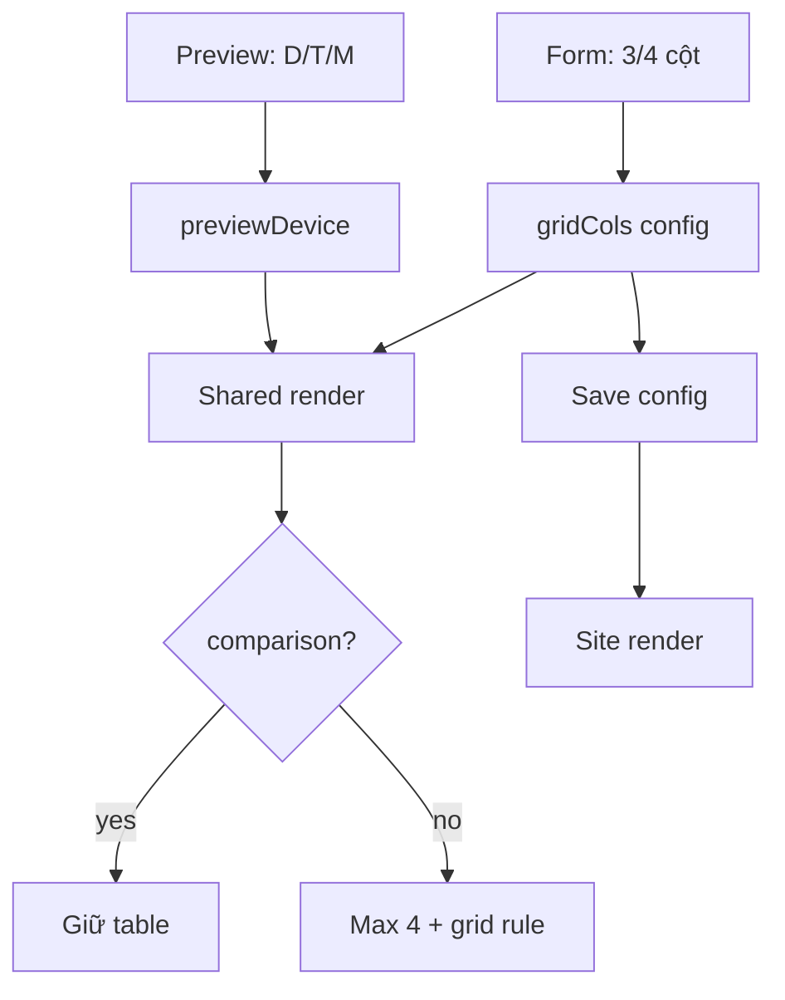

# I. Primer

## 1. TL;DR kiểu Feynman
- Preview Pricing phải khôi phục đúng 3 nút chung: `Desktop`, `Tablet`, `Mobile`, giống mọi home-component.
- Chọn grid 3/4 cột không nằm trong cụm nút preview, mà nằm trong form cấu hình riêng, học theo Services edit: `Số cột desktop` với 2 nút `3 cột` và `4 cột`.
- Pricing tối đa 4 gói để tránh vỡ layout.
- Grid 3: desktop/tablet 3 cột, mobile 1 cột.
- Grid 4: desktop 4 cột, tablet/mobile 2 cột.
- Không thay đổi layout `comparison` theo grid mới.

## 2. Elaboration & Self-Explanation
Yêu cầu mới làm rõ một điểm quan trọng: `Desktop/Tablet/Mobile` là điều khiển thiết bị preview chung của toàn hệ thống, không được biến thành `Desktop 3/Desktop 4`. Pattern đúng đã có ở Services:

- `ServicesPreview.tsx` vẫn dùng `usePreviewDevice()` và `PreviewWrapper` mặc định, nên luôn có 3 nút preview.
- `services/[id]/edit/page.tsx` có một card config riêng `Số cột desktop`, gồm 2 nút `3 cột` / `4 cột`.
- `ServicesSectionCore.tsx` nhận `desktopColumns` và tự tính grid theo `device` trong preview hoặc breakpoint ở runtime.

Vì vậy Pricing nên học đúng pattern này: giữ PreviewWrapper nguyên bản, thêm config chọn `Số cột desktop` trong create/edit form, rồi để `PricingSectionShared` dùng `gridCols` + `previewDevice` để render đúng số cột theo thiết bị.

## 3. Concrete Examples & Analogies
Ví dụ: trong Pricing edit, admin chọn `Số cột desktop = 4 cột`. Sau đó trong preview vẫn bấm nút `Tablet` như mọi component khác. Khi preview ở tablet, Pricing hiển thị 2 cột vì config desktop là 4. Nếu admin đổi `Số cột desktop = 3 cột`, cùng nút `Tablet` sẽ hiển thị 3 cột.

Analogy: nút `Desktop/Tablet/Mobile` giống chọn “kích thước màn hình để xem thử”, còn `3 cột/4 cột` giống “thiết kế layout”. Hai nút này khác nhiệm vụ, không nên gộp chung.

# II. Audit Summary (Tóm tắt kiểm tra)

Scope & impacted paths:
- `app/admin/home-components/create/pricing/page.tsx`
- `app/admin/home-components/pricing/[id]/edit/page.tsx`
- `app/admin/home-components/pricing/_components/PricingPreview.tsx`
- `app/admin/home-components/pricing/_components/PricingSectionShared.tsx`
- `app/admin/home-components/pricing/_lib/constants.ts`
- `app/admin/home-components/pricing/_types/index.ts`
- `components/site/PricingSection.tsx`
- `app/admin/home-components/_shared/components/PreviewWrapper.tsx`

Evidence đã đọc:
- `ServicesPreview.tsx` dùng `usePreviewDevice()` + `PreviewWrapper` mặc định, truyền `device` vào `ServicesSectionCore`.
- `services/[id]/edit/page.tsx` có card `Số cột desktop`, render 2 nút `[3, 4]` với style button nhất quán.
- `ServicesSectionCore.tsx` dùng `desktopColumns` + `device` để preview: mobile 1, tablet 2/3 tùy config, desktop 3/4.
- Diff Pricing hiện tại đã thêm custom device section vào `PreviewWrapper` và `PricingPreview`, nhưng hướng này phá consistency theo feedback mới.

Source of truth:
- Config source: `PricingConfig.gridCols?: 3 | 4` trong `_types/index.ts` và normalize ở `_lib/constants.ts`.
- Grid selector source: create/edit form, học theo card `Số cột desktop` của Services.
- Preview device source: `usePreviewDevice()` + `PreviewWrapper` mặc định, chỉ có `desktop/tablet/mobile`.
- Render source: `PricingSectionShared`, dùng chung cho preview và site.

Preview ↔ Site parity map:

| Surface | File | Contract cần giữ |
|---|---|---|
| Create | `create/pricing/page.tsx` | form chọn `Số cột desktop`, default 3, add plan tối đa 4, submit lưu `gridCols` |
| Edit | `[id]/edit/page.tsx` | load/save `gridCols`, dirty snapshot tính `gridCols`, add plan tối đa 4 |
| Preview | `PricingPreview.tsx` | giữ 3 nút preview mặc định; truyền `previewDevice={device}` và `gridCols` vào shared |
| Shared UI | `PricingSectionShared.tsx` | grid theo `gridCols` + `previewDevice`; render tối đa 4; không đổi comparison |
| Site | `components/site/PricingSection.tsx` | truyền `gridCols` vào shared; runtime dùng container/browser breakpoint |
| Wrapper | `PreviewWrapper.tsx` | rollback/remove `customDeviceSection` để không phá consistency nếu không còn dùng |

Checklist pass/fail hiện tại theo diff đọc được:
- Fail cần sửa: custom preview buttons `Desktop 3/Desktop 4` đang sai direction, cần khôi phục default 3 nút.
- Fail cần sửa: `PreviewWrapper` đang thêm `customDeviceSection`; nếu chỉ Pricing dùng và không còn cần, nên rollback để giữ component chung sạch.
- Fail cần sửa: create submit chưa lưu `gridCols`.
- Fail cần sửa: edit `toSnapshot` chưa chứa `gridCols`, state initializer còn thiếu fallback rõ.
- Fail cần sửa: compact layout còn `slice(0, 6)`.
- Cần thêm: UI chọn `Số cột desktop` trong create/edit giống Services.

# III. Root Cause & Counter-Hypothesis (Nguyên nhân gốc & Giả thuyết đối chứng)

Root Cause Confidence (Độ tin cậy nguyên nhân gốc): High.

Reason: Services code cung cấp pattern trực tiếp trong repo. Diff Pricing hiện tại đi lệch pattern bằng cách gộp chọn grid vào device preview buttons.

Trả lời audit tối thiểu:
1. Triệu chứng quan sát được: Pricing preview có nguy cơ khác các home-component vì thay 3 nút preview thành 4 nút custom.
3. Tái hiện tối thiểu: mở Pricing preview sau diff hiện tại sẽ thấy cụm `Desktop 3/Desktop 4/Tablet/Mobile`, không giống Services/PreviewWrapper mặc định.
5. Dữ liệu thiếu: chưa chạy UI browser để chụp visual; evidence hiện tại là source code/diff.
6. Giả thuyết thay thế: có thể giữ `customDeviceSection` để component khác dùng sau này. Không recommend vì chưa có nhu cầu khác, YAGNI, và user yêu cầu không phá consistency.
7. Rủi ro nếu fix sai: preview toàn web mất nhất quán hoặc grid config không lưu, dẫn đến preview/site lệch.
8. Tiêu chí pass/fail: Pricing preview chỉ có 3 nút Desktop/Tablet/Mobile; grid 3/4 nằm trong form config; responsive đúng; comparison không đổi.

Counter-hypothesis:
- Có thể chỉ đổi labels custom buttons thành icon desktop/tablet/mobile. Bác bỏ vì vẫn gộp 2 concept khác nhau; Services đã tách rõ config `desktopColumns` khỏi preview device.

# IV. Proposal (Đề xuất)

1. Rollback PreviewWrapper customization:
   - Xóa prop `customDeviceSection` khỏi `PreviewWrapper` nếu không còn call site nào cần.
   - Giữ lại render mặc định 3 nút `Desktop`, `Tablet`, `Mobile` như trước.

2. Khôi phục PricingPreview theo pattern Services:
   - Dùng lại `const { device, setDevice } = usePreviewDevice()`.
   - Truyền `device={device}`, `setDevice={setDevice}`, `deviceWidthClass={deviceWidths[device]}` vào `PreviewWrapper`.
   - Bỏ `DeviceMode`, `DEVICE_MODES`, `Grid3X3`, `LayoutGrid`, `Tablet`, `Smartphone`, `cn`, và logic `activeGridCols` theo desktop button.
   - Truyền `previewDevice={device}` và `gridCols={gridColsProp}` vào `PricingSectionShared`.
   - Info preview có thể giữ ngắn: `${plans.length}/4 gói • ${modeLabel} • ${gridColsProp} cột`.

3. Thêm UI chọn số cột desktop trong Pricing create/edit:
   - Học trực tiếp Services card:
     - Label: `Số cột desktop`.
     - 2 nút trong `grid grid-cols-2 gap-2`.
     - Options `[3, 4]`, label `${option} cột`.
     - Selected style dùng class giống Services (`border-blue-500 bg-blue-50...`).
   - Đặt trong section/cấu hình pricing hiện có để không làm rối preview controls.
   - `onClick={() => setPricingConfig(prev => ({ ...prev, gridCols: option as 3 | 4 }))}`.

4. Fix save/load contract:
   - Create: thêm `gridCols: pricingConfig.gridCols` vào submit payload.
   - Edit: thêm `gridCols` vào `toSnapshot` type và 3 snapshot: initial/current/after save.
   - Edit initializer: thêm `gridCols: DEFAULT_PRICING_CONFIG.gridCols ?? 3` vào state ban đầu.
   - Payload edit đang spread `...pricingConfig`, giữ để lưu `gridCols`.

5. Fix render max 4 + responsive grid:
   - Giới hạn display plans tối đa 4 sau filter, để dữ liệu cũ/import >4 không làm vỡ layout.
   - Không xóa dữ liệu trong DB; chỉ giới hạn UI add và render.
   - Với layout grid (`cards`, default/compact):
     - Preview mode có `previewDevice`:
       - `gridCols=3`: desktop `grid-cols-3`, tablet `grid-cols-3`, mobile `grid-cols-1`.
       - `gridCols=4`: desktop `grid-cols-4`, tablet `grid-cols-2`, mobile `grid-cols-2`.
     - Runtime site không có `previewDevice`:
       - `gridCols=3`: `grid-cols-1 @md:grid-cols-3`.
       - `gridCols=4`: `grid-cols-2 @lg:grid-cols-4`.
   - Với layout `comparison`: giữ table/overflow hiện tại và slice tối đa 4 như đang có.
   - Với layout không phải grid (`horizontal`, `minimal`, `featured`): không ép grid 3/4, nhưng vẫn render tối đa 4 để đúng yêu cầu max item.

6. Giữ site parity:
   - `components/site/PricingSection.tsx` đã truyền `gridCols={safeConfig.gridCols === 4 ? 4 : 3}`; giữ và rà static.
   - `PricingSectionShared` là source chung nên preview/site không lệch.

# V. Files Impacted (Tệp bị ảnh hưởng)

## UI / Admin form
- Sửa: `app/admin/home-components/create/pricing/page.tsx` — hiện quản lý create pricing; sẽ thêm UI `Số cột desktop` giống Services, lưu `gridCols` khi submit, giữ giới hạn add tối đa 4.
- Sửa: `app/admin/home-components/pricing/[id]/edit/page.tsx` — hiện quản lý edit pricing; sẽ thêm/chuẩn hóa UI `Số cột desktop`, load/save/snapshot `gridCols`, giữ giới hạn add tối đa 4.

## Preview / Shared rendering
- Sửa: `app/admin/home-components/pricing/_components/PricingPreview.tsx` — hiện đã bị custom hóa device buttons; sẽ khôi phục dùng `usePreviewDevice` và 3 nút mặc định, truyền `previewDevice` vào shared.
- Sửa: `app/admin/home-components/pricing/_components/PricingSectionShared.tsx` — hiện render pricing shared; sẽ giới hạn tối đa 4 plans và tính grid theo `gridCols + previewDevice`, trừ comparison.
- Sửa: `app/admin/home-components/_shared/components/PreviewWrapper.tsx` — hiện diff có `customDeviceSection`; sẽ rollback/remove để giữ consistency toàn web nếu không còn dùng.

## Config / Runtime site
- Sửa: `app/admin/home-components/pricing/_lib/constants.ts` — hiện default/normalize pricing config; giữ `gridCols` fallback và có thể thêm `MAX_PRICING_PLANS = 4`.
- Sửa: `app/admin/home-components/pricing/_types/index.ts` — hiện type pricing config; giữ `gridCols?: 3 | 4`.
- Sửa: `components/site/PricingSection.tsx` — hiện runtime site section; giữ truyền `gridCols`, chỉ rà parity nếu cần.

# VI. Execution Preview (Xem trước thực thi)

1. Rollback phần custom device trong `PreviewWrapper`.
2. Khôi phục `PricingPreview` về `usePreviewDevice` giống Services; bỏ custom Desktop 3/4 buttons.
3. Thêm block `Số cột desktop` vào create/edit Pricing theo class của Services.
4. Bổ sung `gridCols` vào create submit và edit snapshot.
5. Sửa `PricingSectionShared` để `previewDevice` thực sự điều khiển class preview, runtime dùng container query, max 4 item.
6. Static review imports/types/parity.
7. Chạy `bunx tsc --noEmit` theo rule repo sau khi sửa code.
8. Commit local, không push.

# VII. Verification Plan (Kế hoạch kiểm chứng)

Static review:
- `PreviewWrapper` không còn `customDeviceSection` nếu không có nhu cầu khác.
- `PricingPreview` dùng `usePreviewDevice()` và không còn custom 4 device buttons.
- Create/edit có UI `Số cột desktop` giống Services.
- Create submit payload có `gridCols`.
- Edit snapshot initial/current/after-save có `gridCols`.
- Shared grid rule đúng:
  - Preview + grid 3: desktop/tablet 3, mobile 1.
  - Preview + grid 4: desktop 4, tablet/mobile 2.
  - Runtime + grid 3: `grid-cols-1 @md:grid-cols-3`.
  - Runtime + grid 4: `grid-cols-2 @lg:grid-cols-4`.
- Comparison giữ table/overflow, không bị đổi sang grid.
- Không còn unused imports.

Typecheck:
- Chạy `bunx tsc --noEmit` sau khi sửa code.
- Không chạy lint/unit test vì `AGENTS.md` cấm tự chạy lint/unit test.

Manual handoff cho tester:
- Pricing preview vẫn có đúng 3 nút Desktop/Tablet/Mobile.
- Chọn `3 cột`, test Desktop/Tablet/Mobile.
- Chọn `4 cột`, test Desktop/Tablet/Mobile.
- Thêm gói đến 4, nút thêm disabled.
- Layout comparison vẫn như cũ.

# VIII. Todo

1. Rollback custom device section khỏi PreviewWrapper/PricingPreview.
2. Thêm UI `Số cột desktop` trong create/edit Pricing theo Services.
3. Lưu/load/dirty snapshot `gridCols` đầy đủ.
4. Sửa shared render max 4 và grid responsive theo `previewDevice`.
5. Review tĩnh + chạy `bunx tsc --noEmit`.
6. Commit local, không push.

# IX. Acceptance Criteria (Tiêu chí chấp nhận)

- Pricing preview chỉ có 3 nút device mặc định: Desktop, Tablet, Mobile.
- Grid 3/4 được chọn bằng form config riêng `Số cột desktop`, không nằm trong preview device buttons.
- UI chọn 3/4 cột nhất quán với Services.
- Không thể thêm quá 4 pricing plans từ create/edit UI.
- Render preview/site không hiển thị quá 4 plans để tránh vỡ layout.
- `gridCols=3`: desktop/tablet 3 cột, mobile 1 cột.
- `gridCols=4`: desktop 4 cột, tablet/mobile 2 cột.
- Layout `comparison` không bị đổi sang grid mới.
- TypeScript pass với `bunx tsc --noEmit`.
- Có commit local sau khi hoàn thành, không push.

# X. Risk / Rollback (Rủi ro / Hoàn tác)

- Risk: dữ liệu cũ có hơn 4 plans vẫn tồn tại nhưng chỉ render 4. Đây là intentional theo yêu cầu; không xóa data để rollback an toàn.
- Risk: runtime dùng container query `@md/@lg`, nên parent cần `@container`; site hiện có `@container`, preview cần giữ wrapper context hiện tại.
- Rollback: revert commit local; thay đổi chủ yếu UI/config optional nên rollback đơn giản.

# XI. Out of Scope (Ngoài phạm vi)

- Không đổi schema Convex.
- Không migrate/xóa dữ liệu pricing cũ.
- Không refactor toàn bộ Pricing.
- Không đổi behavior Services.
- Không đổi layout `comparison` ngoài giữ giới hạn 4 vốn đang phù hợp.
- Không chạy lint/unit test theo rule repo.