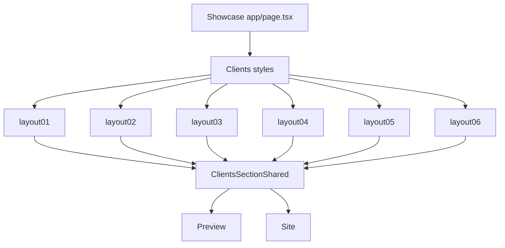

# I. Primer

## 1. TL;DR kiểu Feynman
- Tôi đã đọc thư mục `C:\Users\VTOS\Downloads\testimonials-component-showcase`; nội dung thực tế là **6 layout banner ảnh**, không phải testimonials review.
- Vì repo vừa chuyển `clients` thành **Banner ảnh thương hiệu**, showcase này khớp trực tiếp với component `clients` mới hơn là `testimonials`.
- Hướng triển khai: học đúng 6 bố cục từ showcase và thay 4 style hiện tại của `clients` bằng 6 style tương ứng.
- Vẫn giữ contract mỗi item: `url` + `link`; vẫn tối đa 4 ảnh vì yêu cầu trước đó là 1–4 ảnh.
- Layout 05 trong showcase cần 3 ảnh, Layout 06 cần 4 ảnh; nếu thiếu ảnh thì render số ảnh đang có, không tự bịa ảnh.

## 2. Elaboration & Self-Explanation
Showcase user đưa có file chính `app/page.tsx` với tiêu đề “6 BỐ CỤC BẢN BANNER”. Trong đó có reusable `Banner` component dùng ảnh fill, bo góc, ring nhẹ, hover zoom và 6 section `Layout 01` đến `Layout 06`.

Repo hiện có `testimonials` là component đánh giá khách hàng thật với quote/rating/avatar/slider/marquee. Nếu copy 6 layout banner vào testimonials thì sẽ sai domain. Nhưng `clients` vừa được đổi thành banner ảnh thương hiệu nên đây là nơi phù hợp nhất để học theo 6 layout đó.

Vì vậy plan sẽ chỉnh **Banner ảnh thương hiệu (`Clients`)**, không chỉnh `Testimonials`, trừ khi user muốn ép áp dụng vào testimonials thật. Hướng này bám đúng evidence và tránh làm hỏng component review đang có.

## 3. Concrete Examples & Analogies
Ví dụ mapping style mới:

```ts
export type ClientsStyle = 'layout01' | 'layout02' | 'layout03' | 'layout04' | 'layout05' | 'layout06';
```

- `layout02`: 1 banner full-width giống showcase Layout 02.
- `layout04`: 2 banner ngang song song giống showcase Layout 04.
- `layout06`: 4 banner dọc/portrait giống showcase Layout 06.

Analogy: component Banner ảnh thương hiệu hiện giống một khung treo poster đã dùng được, nhưng mới có 4 kiểu treo. Showcase của bạn là bộ “6 cách treo poster” đã thiết kế sẵn; ta chỉ thay hệ treo của component hiện tại để có đủ 6 cách đó.

# II. Audit Summary (Tóm tắt kiểm tra)

- Observation: `C:\Users\VTOS\Downloads\testimonials-component-showcase\app\page.tsx` tồn tại và chứa 6 section Layout 01–06.
- Evidence: file showcase dùng `Banner` component với `rounded-xl md:rounded-2xl`, `ring-1 ring-black/5`, `group-hover:scale-105`, overlay hover nhẹ.
- Evidence: showcase header ghi “6 BỐ CỤC BẢN BANNER”, không có dữ liệu quote/rating/avatar của testimonials.
- Repo `testimonials` hiện có 6 style thật: `cards`, `slider`, `marquee`, `showcase`, `quote`, `minimal` trong `app/admin/home-components/testimonials/_types/index.ts`.
- Repo `clients` hiện có contract banner mới: `ClientItem { url, link }`, `ClientsStyle = 'single' | 'duo' | 'grid' | 'feature'`, preview/site cùng dùng `ClientsSectionShared`.
- Inference: showcase nên áp dụng vào `clients`/Banner ảnh thương hiệu, không áp dụng vào `testimonials` review.

# III. Root Cause & Counter-Hypothesis (Nguyên nhân gốc & Giả thuyết đối chứng)

## 1. Root Cause Confidence (Độ tin cậy nguyên nhân gốc)

**High.** User nói “6 layout” và thư mục đặt tên testimonials, nhưng code thực tế là banner image layouts. Vì `clients` hiện đã là banner ảnh thương hiệu, áp dụng vào `clients` là hướng đúng nhất về mục đích sử dụng.

## 2. Counter-Hypothesis (Giả thuyết đối chứng)

- Có thể user thật sự muốn sửa `testimonials`, nhưng showcase không có testimonial primitives nên sẽ phải diễn dịch lại từ banner sang review cards, rủi ro lệch ý cao.
- Có thể giữ 4 style hiện tại và chỉ polish UI, nhưng user nói “làm 6 layout rồi cứ thế học theo”, nên nên chuyển thành đủ 6 style.
- Có thể cho phép hơn 4 ảnh để giống showcase Layout 05/06 hoàn chỉnh, nhưng yêu cầu trước đó đã chốt tối đa 4 ảnh; 6 layout showcase cũng không cần quá 4 ảnh.

# IV. Proposal (Đề xuất)

## 1. Scope chính

Áp dụng 6 layout từ showcase vào **Banner ảnh thương hiệu** tại route/type nội bộ `clients`/`Clients`.

Không chỉnh logic `Testimonials` trong đợt này.

## 2. Style contract mới

Đổi từ:

```ts
'single' | 'duo' | 'grid' | 'feature'
```

sang:

```ts
'layout01' | 'layout02' | 'layout03' | 'layout04' | 'layout05' | 'layout06'
```

Label UI:

- `layout01`: Layout 01 — Mosaic 1 lớn + 3 phụ
- `layout02`: Layout 02 — Banner full-width
- `layout03`: Layout 03 — 1 ngang trên + 2 dưới
- `layout04`: Layout 04 — 2 banner ngang
- `layout05`: Layout 05 — 3 banner landscape
- `layout06`: Layout 06 — 4 banner dọc

## 3. Layout mapping từ showcase



## 4. Behavior giữ nguyên

- Mỗi item vẫn là ảnh + link tùy chọn.
- Link trống không render anchor.
- Link external mở tab mới với `rel="noopener noreferrer"`.
- Preview và site dùng chung `ClientsSectionShared`.
- Form vẫn tối đa 4 ảnh.
- Empty state giữ như hiện tại.

## 5. Visual grammar học từ showcase

- Bo góc: `rounded-xl md:rounded-2xl`.
- Ring nhẹ: `ring-1 ring-black/5`.
- Nền ảnh loading/empty: `bg-gray-100/50` hoặc token tương đương.
- Hover zoom: scale ảnh nhẹ, duration dài và smooth.
- Overlay hover rất nhẹ, không che nội dung ảnh.
- Gap: mobile `gap-3`, desktop `md:gap-5`.

# V. Files Impacted (Tệp bị ảnh hưởng)

## 1. Banner ảnh thương hiệu (`clients`)

- Sửa: `app/admin/home-components/clients/_types/index.ts` — đổi `ClientsStyle` từ 4 style sang 6 layout mới.
- Sửa: `app/admin/home-components/clients/_lib/constants.ts` — đổi `CLIENTS_STYLES`, default style thành `layout02` hoặc `layout01`.
- Sửa: `app/admin/home-components/clients/_lib/colors.ts` — cập nhật `calculateClientsAccentBalance` theo 6 style mới để TypeScript không lỗi.
- Sửa: `app/admin/home-components/clients/_components/ClientsSectionShared.tsx` — triển khai render 6 layout theo showcase, giữ wrapper link optional.
- Sửa: `app/admin/home-components/clients/_components/ClientsPreview.tsx` — cập nhật info text/label mô tả cho 6 layout.

## 2. Create/Edit/runtime phụ thuộc style

- Sửa nếu cần: `app/admin/home-components/create/clients/page.tsx` — đảm bảo default style mới dùng đúng `DEFAULT_CLIENTS_CONFIG.style`.
- Sửa nếu cần: `app/admin/home-components/clients/[id]/edit/page.tsx` — normalize style cũ `single/duo/grid/feature` sang layout mới để backward compatibility.
- Sửa nếu cần: `components/site/home/sections/ClientsRuntimeSection.tsx` — fallback style từ `single` sang layout mới.
- Sửa nếu cần: `components/site/ComponentRenderer.tsx` — fallback/normalize tự đi qua shared helper, chỉ chỉnh nếu typecheck yêu cầu.

# VI. Execution Preview (Xem trước thực thi)

1. Đọc lại các file `clients` trước khi sửa để tránh stale context.
2. Đổi union type + style constants sang 6 layout.
3. Thêm backward normalize:
   - `single -> layout02`
   - `duo -> layout04`
   - `grid -> layout06` hoặc `layout05` tùy item count
   - `feature -> layout01`
4. Rewrite phần render trong `ClientsSectionShared` thành 6 nhánh layout.
5. Cập nhật preview info text để user hiểu từng layout.
6. Chạy static review: import unused, style mapping, link optional, item slicing tối đa 4.
7. Chạy `bunx tsc --noEmit` vì có thay đổi TS, theo rule repo.
8. Commit thay đổi, không push.

# VII. Verification Plan (Kế hoạch kiểm chứng)

- Typecheck: `bunx tsc --noEmit`.
- Static review:
  - `CLIENTS_STYLES` có đủ 6 layout.
  - `normalizeClientsStyleSafe` nhận style mới và map style cũ.
  - `ClientsPreview` hiển thị đúng 6 option.
  - `ClientsSectionShared` có đủ layout01–layout06.
  - Không đổi `Testimonials` review component.
- Manual tester checklist:
  - Vào `/admin/home-components/create/clients` thấy 6 layout trong preview switcher.
  - Thử 1 ảnh với Layout 02 render full-width.
  - Thử 2 ảnh với Layout 04 render 2 banner ngang.
  - Thử 3 ảnh với Layout 03/Layout 05 render không vỡ.
  - Thử 4 ảnh với Layout 01/Layout 06 render đúng mosaic/portrait grid.
  - Ảnh có link click được; ảnh không link không điều hướng.

# VIII. Todo

- [ ] Đổi style contract Banner ảnh thương hiệu sang 6 layout.
- [ ] Render 6 layout theo showcase trong shared section.
- [ ] Cập nhật preview labels/info text và backward normalize style cũ.
- [ ] Review tĩnh, chạy typecheck, commit.

# IX. Acceptance Criteria (Tiêu chí chấp nhận)

- Component `Banner ảnh thương hiệu` có đúng 6 layout học từ showcase.
- Preview và site render cùng layout vì dùng chung `ClientsSectionShared`.
- Form vẫn giới hạn tối đa 4 ảnh.
- Không chỉnh `Testimonials` review component.
- Existing configs cũ `single/duo/grid/feature` vẫn không crash và được map sang layout mới.
- `bunx tsc --noEmit` pass.
- Có commit mới sau khi hoàn tất.

# X. Risk / Rollback (Rủi ro / Hoàn tác)

- Rủi ro: tên thư mục showcase là testimonials nhưng nội dung là banner; nếu user thật sự muốn chỉnh `Testimonials`, scope này sẽ lệch. Mitigation: plan này nêu rõ chỉ chỉnh `clients` vì evidence code là banner.
- Rủi ro dữ liệu cũ: style cũ không còn trong union. Mitigation: normalize map style cũ sang style mới.
- Rollback: revert commit mới để quay lại 4 style hiện tại.

# XI. Out of Scope (Ngoài phạm vi)

- Không sửa `app/admin/home-components/testimonials/*`.
- Không tăng giới hạn ảnh quá 4.
- Không thêm lightbox/gallery/carousel mới.
- Không thay đổi schema Convex.

# XII. Open Questions (Câu hỏi mở)

Không có câu hỏi bắt buộc. Tôi sẽ mặc định áp dụng showcase vào **Banner ảnh thương hiệu (`clients`)** vì code showcase là banner ảnh, không phải testimonials.