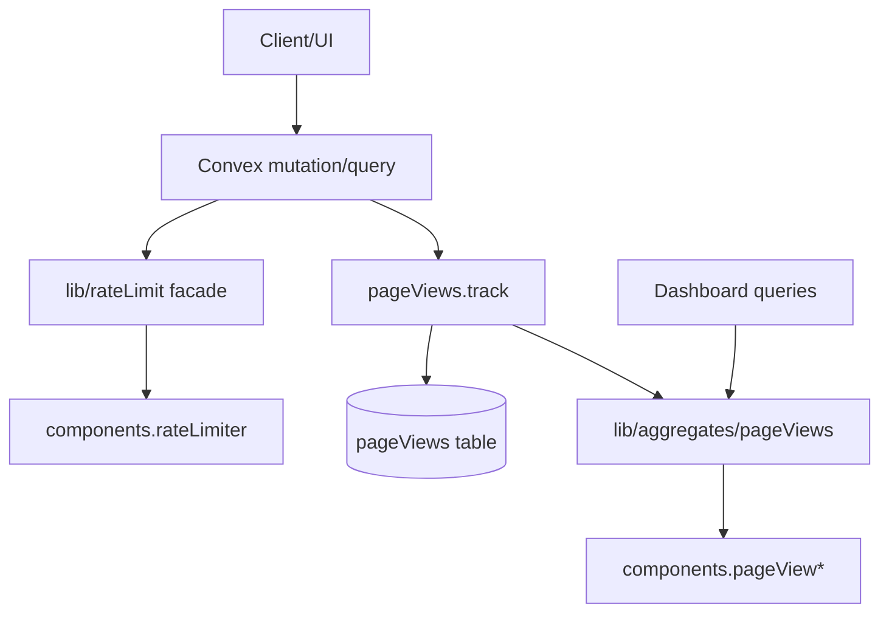

# I. Primer

## 1. TL;DR kiểu Feynman

- Ta sẽ cài đúng **2 component Tier 0**: `@convex-dev/rate-limiter` và `@convex-dev/aggregate` qua `convex/convex.config.ts`, không gắn rải rác từng file.
- `Rate Limiter (Giới hạn tần suất)` sẽ có **một source of truth** ở `convex/lib/rateLimit.ts`; module khác chỉ gọi helper, không tự tạo rule riêng.
- `Aggregate (Bộ đếm/tổng hợp O(log n))` sẽ bắt đầu từ hot path rõ nhất: `pageViews`, vì dashboard hiện đọc tối đa `10_000` records rồi filter/group trong JS.
- Không convert toàn bộ counter table hiện có trong một lần, vì dễ lệch dữ liệu; thay vào đó tạo pattern chuẩn để các domain sau dùng lại.
- Giữ rollback dễ: không xóa `rateLimitBuckets`/counter tables cũ trong phase đầu; chuyển đọc/ghi theo từng surface có kiểm soát.

## 2. Elaboration & Self-Explanation

Docs chính thức nói Convex Component được đăng ký bằng `convex/convex.config.ts`; sau codegen sẽ có `components.<name>` trong `convex/_generated/api`. Repo hiện **chưa có** `convex/convex.config.ts`, `components` chưa xuất hiện trong generated API, dù đã có package `@convex-dev/rate-limiter` trong `package.json`.

Rate limiter hiện đang tự viết bằng bảng `rateLimitBuckets` trong `convex/lib/rateLimit.ts`, và hiện chỉ thấy dùng ở `convex/contactInbox.ts`. Ta sẽ giữ file này làm facade (lớp cửa vào duy nhất) nhưng thay engine bên trong sang component chính thức để tránh source-of-truth bị tách đôi.

Aggregate sẽ không thay mọi counter thủ công ngay. Repo đã có nhiều bảng counter như `userStats`, `productStats`, `contactInboxStats`, `mediaStats`; thay hết một lượt sẽ cần backfill/migration rộng. Hot path rõ nhất theo audit là `convex/pageViews.ts`: các query dashboard đều `.take(MAX_PAGEVIEWS_LIMIT)` rồi filter/group theo thời gian, path, referrer, device ở JS. Vì vậy phase đầu sẽ tích hợp Aggregate cho **pageview count theo bucket thời gian và dimension chính**, còn `uniqueVisitors` giữ logic cũ hoặc chuyển sau bằng thiết kế session riêng.

## 3. Concrete Examples & Analogies

Ví dụ cụ thể: `app/admin/dashboard/page.tsx` gọi `api.pageViews.getTrafficStats`, `getTrafficChartData`, `getTopPages`, `getTrafficSources`, `getDeviceStats`. Hiện mỗi query đọc nhiều `pageViews`; sau tích hợp, `pageViews.track` sẽ ghi record và cập nhật aggregate trong cùng mutation, dashboard đọc số liệu từ aggregate thay vì quét `10_000` records.

Analogy: thay vì mỗi lần xem dashboard phải mở cả sổ nhật ký 10.000 dòng để đếm, ta duy trì một bảng tổng hợp cập nhật ngay khi có dòng mới. Dashboard chỉ nhìn bảng tổng hợp đã chuẩn hóa.

# II. Audit Summary (Tóm tắt kiểm tra)

- Docs-seeker/source đã đọc:
  - `https://www.convex.dev/components/llms.txt`: directory 94 components, Rate Limiter mô tả app-layer rate limiting, Aggregate mô tả counts/sums O(log n).
  - `https://docs.convex.dev/components/using-components`: component dùng qua `defineApp()`, `app.use(component)`, generated `components.<name>`.
  - npm `@convex-dev/rate-limiter@0.3.2`: API `RateLimiter`, `limit`, `check`, `reset`, `getValue`, `hookAPI`, token bucket/fixed window, sharding, transactional rollback.
  - npm/GitHub metadata `@convex-dev/aggregate@0.2.x`: component count/sum O(log n), dùng `TableAggregate`/`DirectAggregate`, update aggregate cùng write path, cần backfill/idempotent khi bảng đã có dữ liệu.
- Repo evidence:
  - `package.json`: đã có `@convex-dev/rate-limiter`, chưa có `@convex-dev/aggregate`.
  - `convex/convex.config.ts`: chưa tồn tại.
  - `convex/_generated/api.d.ts`: chưa có `components`.
  - `convex/lib/rateLimit.ts`: tự implement token bucket qua `rateLimitBuckets`.
  - `convex/contactInbox.ts:112`: đang gọi `consumeRateLimit(ctx, \`contact:${getClientIdentifier()}\`, "mutation")`.
  - `convex/pageViews.ts`: dashboard queries đọc `MAX_PAGEVIEWS_LIMIT = 10_000` rồi filter/group trong JS.
  - `app/admin/dashboard/page.tsx:70-74`: dashboard gọi 5 query traffic từ `api.pageViews`.

# III. Root Cause & Counter-Hypothesis (Nguyên nhân gốc & Giả thuyết đối chứng)

## 1. Root Cause Confidence (Độ tin cậy nguyên nhân gốc: High)

- **Observation:** Tier 0 component chưa thật sự được wire vì thiếu `convex/convex.config.ts` và generated `components`.
- **Observation:** Rate limit đang tự viết, mới dùng ở contact inbox, key public hiện là global qua `getClientIdentifier()`.
- **Observation:** Page view analytics có read amplification rõ ràng do mỗi query đọc nhiều records và aggregate ở JS.
- **Inference:** Nếu tích hợp manh mún trực tiếp trong từng module, rules/aggregates sẽ phân tán và khó rollback.
- **Decision:** Tạo source-of-truth layer trước, rồi migrate các hot paths theo phase.

## 2. Counter-Hypothesis (Giả thuyết đối chứng)

- Có thể chỉ thêm client debounce để giảm calls; nhưng không giải quyết abuse server-side và không thay thế app-layer transactional rate limiting.
- Có thể chỉ thêm index cho `pageViews`; nhưng top pages/source/device vẫn cần group/count theo nhiều dimension, Aggregate phù hợp hơn cho dashboard summary.
- Có thể convert toàn bộ counter tables sang Aggregate ngay; nhưng scope rộng, cần backfill nhiều domain và dễ làm lệch dữ liệu.

# IV. Proposal (Đề xuất)

## 1. Kiến trúc tổng thể

Ghi chú: `RL` là source-of-truth cho rate limit; `AGW` là source-of-truth cho pageViews aggregate.

## 2. Rate Limiter plan

- Thêm component config:
  - `convex/convex.config.ts` dùng `defineApp`, `app.use(rateLimiter)`.
- Giữ `convex/lib/rateLimit.ts` làm facade duy nhất:
  - Define named rules tập trung: `contactSubmit`, `authLogin`, `adminMutation`, `dangerousMutation`.
  - Map API hiện tại `checkRateLimit` / `consumeRateLimit` sang `RateLimiter.limit/check` để giảm thay đổi callsite.
  - Trả shape cũ `{ allowed, remaining, resetIn }` để UI/module hiện tại ít bị ảnh hưởng.
- Migrate usage ban đầu:
  - `convex/contactInbox.ts`: chuyển từ rule generic `mutation` sang rule rõ domain `contactSubmit`.
  - `convex/auth.ts`: thêm rate limit cho `verifySystemLogin` và `verifyAdminLogin` bằng key email normalized; reset sau login thành công nếu phù hợp.
- Không xóa `rateLimitBuckets` trong phase đầu; để rollback/cleanup sau khi chạy ổn.

## 3. Aggregate plan

- Cài `@convex-dev/aggregate` và đăng ký nhiều component instance theo tên rõ trong `convex/convex.config.ts`, ví dụ:
  - `pageViewsByTime`
  - `pageViewsByPathTime`
  - `pageViewsBySourceTime`
  - `pageViewsByDeviceTime`
- Tạo `convex/lib/aggregates/pageViews.ts` làm source-of-truth:
  - helper normalize bucket ngày/tháng/năm hoặc timestamp bucket;
  - helper `recordPageViewAggregates(ctx, docLike)` gọi aggregate insert/update tương ứng;
  - helper read cho `getTrafficStats`, `getTrafficChartData`, `getTopPages`, `getTrafficSources`, `getDeviceStats`.
- Sửa `convex/pageViews.ts`:
  - `track` vẫn insert record gốc vào `pageViews` để giữ dữ liệu raw;
  - sau insert, update aggregate trong cùng mutation;
  - query dashboard đọc aggregate cho pageview count/top breakdown.
- Backfill source-of-truth:
  - thêm internal mutation/action backfill idempotent cho pageViews hiện có, chạy theo batch/pagination;
  - trong giai đoạn chưa backfill, dashboard có fallback dùng logic cũ hoặc chỉ switch read sau khi backfill xong.
- Không convert `uniqueVisitors` ngay bằng Aggregate vì cần dedupe session/time bucket riêng; giữ logic cũ hoặc lên phase riêng với session aggregate table.

# V. Files Impacted (Tệp bị ảnh hưởng)

## 1. Config / dependencies

- **Sửa:** `package.json` — hiện đã có `@convex-dev/rate-limiter`; sẽ thêm `@convex-dev/aggregate`.
- **Sửa:** `bun.lock` — cập nhật lockfile tương ứng.
- **Thêm:** `convex/convex.config.ts` — đăng ký `rateLimiter` và các aggregate component instances, là root config cho Convex Components.

## 2. Rate limiter

- **Sửa:** `convex/lib/rateLimit.ts` — giữ facade hiện tại nhưng chuyển implementation sang `@convex-dev/rate-limiter`, define named rules tập trung.
- **Sửa:** `convex/contactInbox.ts` — dùng helper domain `contactSubmit` thay vì generic/global mutation limit.
- **Sửa:** `convex/auth.ts` — thêm limit cho system/admin login attempts để bảo vệ public login mutations.
- **Giữ nguyên:** `convex/schema.ts` phần `rateLimitBuckets` — chưa xóa để rollback an toàn.

## 3. Aggregate/pageviews

- **Thêm:** `convex/lib/aggregates/pageViews.ts` — source-of-truth cho pageview aggregate write/read.
- **Sửa:** `convex/pageViews.ts` — cập nhật `track` và dashboard queries để dùng aggregate/fallback đúng cách.
- **Sửa nếu cần:** `app/admin/dashboard/page.tsx` — chỉ thay nếu return shape hoặc loading behavior cần giữ tương thích; ưu tiên không đổi UI.

## 4. Generated files

- **Sửa tự động:** `convex/_generated/api.d.ts` và liên quan — sau codegen sẽ có `components` API.

# VI. Execution Preview (Xem trước thực thi)

1. Đọc lại docs package trong local/npm để xác nhận import path và version exact.
2. Cài `@convex-dev/aggregate` bằng `bun add`.
3. Tạo `convex/convex.config.ts` với `rateLimiter` và aggregate instances.
4. Chạy Convex codegen/dev command phù hợp để sinh `components` types.
5. Refactor `convex/lib/rateLimit.ts` thành facade dùng `RateLimiter`.
6. Áp rate limit cho `contactInbox.submitContactInquiry`, `auth.verifySystemLogin`, `auth.verifyAdminLogin`.
7. Tạo `convex/lib/aggregates/pageViews.ts` và wire `pageViews.track`.
8. Thêm backfill idempotent cho pageViews aggregate; giữ fallback dashboard trong lúc chưa backfill.
9. Review static: imports, generated component names, return shapes, null-safety, rollback path.
10. Commit toàn bộ thay đổi sau khi verification pass.

# VII. Verification Plan (Kế hoạch kiểm chứng)

- Không chạy `npm run lint` hoặc unit test theo rule repo.
- Chạy `bunx convex codegen` hoặc lệnh Convex tương đương cần thiết để validate component wiring/generate `components`.
- Chạy `bunx tsc --noEmit 2>&1 | Select-Object -First 10` vì có thay đổi TypeScript/Convex code trước commit theo rule repo.
- Static review bắt buộc:
  - `convex/_generated/api.d.ts` có `components.rateLimiter` và aggregate component names.
  - `convex/lib/rateLimit.ts` không còn tự query/patch `rateLimitBuckets` trong path mới.
  - `pageViews.track` insert raw record và update aggregate cùng transaction.
  - Dashboard query return shape giữ nguyên.
  - Không có secret/API key mới trong diff.
- Runtime/manual verification cho tester:
  - Submit contact nhiều lần nhanh → bị chặn đúng thông báo.
  - Login sai nhiều lần → bị chặn, login đúng sau cooldown/reset hoạt động.
  - Dashboard traffic vẫn hiển thị đúng shape, không crash khi aggregate chưa backfill.
  - Sau backfill, số pageviews aggregate gần khớp legacy count trong cùng period.

# VIII. Todo

1. Cài và wire `@convex-dev/aggregate` + `convex/convex.config.ts`.
2. Generate Convex component API.
3. Refactor centralized rate limit facade.
4. Áp rate limiter cho contact + auth login mutations.
5. Tạo centralized pageViews aggregate layer.
6. Wire `pageViews.track` và dashboard read fallback.
7. Thêm backfill idempotent cho pageViews aggregate.
8. Static review + `bunx tsc --noEmit 2>&1 | Select-Object -First 10`.
9. Commit thay đổi.

# IX. Acceptance Criteria (Tiêu chí chấp nhận)

- `convex/convex.config.ts` tồn tại và đăng ký đủ component Tier 0.
- `@convex-dev/aggregate` có trong dependency/lockfile; `@convex-dev/rate-limiter` vẫn dùng package official hiện có.
- Generated API có `components` cho `rateLimiter` và pageview aggregate instances.
- Tất cả rate limit rule được define tập trung ở `convex/lib/rateLimit.ts`.
- Contact form và auth login dùng official Rate Limiter qua facade, không tự viết bucket mới.
- PageViews aggregate có source-of-truth helper; `pageViews.track` cập nhật raw table + aggregate.
- Dashboard pageViews queries giữ return shape cũ.
- Không xóa schema/table cũ trong phase đầu.
- TypeScript check không báo lỗi mới trong 10 dòng đầu output.
- Có commit local, không push.

# X. Risk / Rollback (Rủi ro / Hoàn tác)

- **Risk:** Rate limit quá chặt có thể block user thật. **Rollback:** chỉnh rules tập trung trong `convex/lib/rateLimit.ts` hoặc tạm bypass helper.
- **Risk:** Aggregate lệch nếu write path bypass helper. **Rollback:** dashboard fallback về legacy query trong `convex/pageViews.ts`; raw `pageViews` vẫn được giữ.
- **Risk:** Backfill chưa chạy xong làm số liệu thiếu. **Rollback:** chưa switch read hoàn toàn hoặc giữ fallback cho empty aggregate.
- **Risk:** Component generated names sai. **Rollback:** sửa `convex/convex.config.ts`, chạy codegen lại; không đụng dữ liệu raw.
- **Risk:** `rateLimitBuckets` legacy tồn tại thừa. **Rollback/cleanup:** để nguyên phase đầu; cleanup schema/data là phase riêng sau khi ổn định.

# XI. Out of Scope (Ngoài phạm vi)

- Không chuyển toàn bộ `userStats`, `productStats`, `mediaStats`, `contactInboxStats`, `promotionStats` sang Aggregate trong phase này.
- Không xóa `rateLimitBuckets` hoặc migration cleanup dữ liệu cũ.
- Không thiết kế unique visitor aggregate/session dedupe nâng cao trong phase đầu.
- Không tích hợp Workflow/Migrations/R2/Resend/Workpool.
- Không thay đổi UI dashboard trừ khi bắt buộc để giữ tương thích dữ liệu.