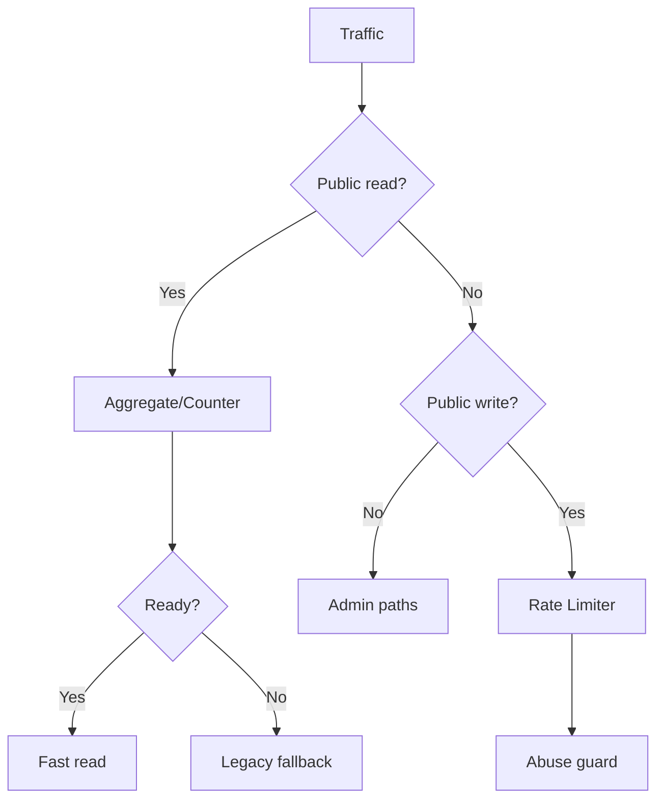

# I. Primer

## 1. TL;DR kiểu Feynman

- Đúng: spec trước nghiêng về `/admin`; spec mới phải đổi trọng tâm sang **public/user read paths** vì read traffic luôn lớn hơn write.
- Với 2 component này, `Aggregate` phải là trọng tâm chính cho read-heavy paths; `Rate Limiter` chỉ là lớp bảo vệ write/abuse.
- Tier 0 nên ưu tiên public analytics/read đang scan nhiều: `usageStats.getBandwidthData` phần `pageViews`, public count/list count cho posts/products/services, và booking public availability/month overview nếu có scan/filter.
- Tier 1-2 xử lý public user actions: customer auth, wishlist/cart/booking/contact, nhưng không để write throttling lấn át tối ưu read.
- Tier 3-4 mới đụng aggregate mới cho bookings/contact/comments/activityLogs vì cần backfill, readiness, mutable-state handling.

## 2. Elaboration & Self-Explanation

Mình cập nhật lại theo nguyên tắc: **Read tuyệt đối quan trọng hơn write**. Vì vậy thứ tự ưu tiên không còn là “admin safety first”, mà là:

1. Public read path nhiều người truy cập: trang home, list/detail sản phẩm/bài viết/dịch vụ, landing pages, booking public.
2. Public reactive/client reads: `useQuery` trên site như home components, voucher promotions, contact data, wishlist page.
3. Public/user writes chỉ đứng sau: page view tracking, customer login/register, booking/contact/wishlist/cart.
4. Admin-only reads/writes xếp sau vì traffic thấp hơn.

Evidence đã audit read-only:

- Public routes gọi Convex nhiều ở `app/(site)/**`: `ia.resolveUnifiedDetail`, `ia.resolveUnifiedCategory`, `products.getBySlug`, `services.getBySlug`, `posts.getBySlug`, `landingPages.getBySlug`, `listPublishedByType`, `listPublishedWithOffset`, `countPublished`.
- Client public components có `useQuery`: `components/site/VoucherPromotionsSection.tsx`, `components/site/useContactPageData.ts`, `app/(site)/_components/HomePageClient.tsx`, wishlist page.
- `convex/usageStats.ts:getBandwidthData` vẫn còn `pageViews.take(10_000)` và `activityLogs.take(5000)`.
- Existing Aggregate mới chỉ chắc chắn cover `pageViews`; aggregate mới cho posts/products/services/bookings là migration-level work.

## 3. Concrete Examples & Analogies

Ví dụ public read: trang `/products` thường có list + count published. Nếu mỗi visitor đều khiến Convex đếm bằng cách fetch nhiều products rồi `.length`, read cost tăng theo số record. Aggregate/counter-style read giúp câu hỏi “có bao nhiêu sản phẩm published?” trở thành O(log n)/component count thay vì O(n) scan bounded.

Analogy: website public giống cửa hàng đông khách. Ta không tối ưu phòng kế toán `/admin` trước quầy bán hàng. Quầy bán hàng cần bảng giá/tồn kho/tổng số được chuẩn bị sẵn để phục vụ 1000 khách đọc nhanh; việc ghi đơn hàng vẫn cần bảo vệ, nhưng không phải nguồn tải chính.

# II. Audit Summary (Tóm tắt kiểm tra)

Kết luận audit:

- `Aggregate` nên dẫn dắt Tier 0-3 vì read-heavy hơn write-heavy.
- `Rate Limiter` vẫn cần nhưng chủ yếu để giảm abuse, không trực tiếp làm public pages đọc nhanh hơn.
- Những aggregate đã có (`pageViews`) nên tận dụng tối đa trước khi tạo aggregate mới.
- Aggregate mới chỉ nên tạo khi metric là count/group rõ ràng, có update/delete lifecycle rõ, và có fallback/readiness.

# III. Root Cause & Counter-Hypothesis (Nguyên nhân gốc & Giả thuyết đối chứng)

## 1. Root Cause Confidence (Độ tin cậy nguyên nhân gốc): High

Root cause còn lại: spec cũ ưu tiên safety/admin tương đối nhiều, trong khi thực tế bottleneck tiềm năng lớn hơn nằm ở public reads lặp lại và các count/list/count-by-filter paths.

Evidence:

- Public site có nhiều `client.query(api.*)` trong server/layout và nhiều `useQuery` client-side.
- Public reads được gọi theo traffic visitor, admin reads được gọi theo traffic nội bộ.
- `usageStats.getBandwidthData` vẫn có raw scan lớn cho analytics.

## 2. Counter-Hypothesis

- Nếu project nhỏ, bounded scans hiện tại có thể chưa thành bottleneck. Do đó Tier 3-4 cần Convex Insights hoặc log production trước khi làm.
- Một số public server routes có thể được Next.js cache ở tầng web, làm Convex read ít hơn tưởng tượng. Nhưng reactive `useQuery` client-side vẫn tạo subscription/read pressure riêng.

# IV. Proposal (Đề xuất)

## Tier 0 — Public/read-first, near-zero risk

| Hạng mục | Target | Thay đổi | Lợi ích ước tính | Risk | Rollback |
|---|---|---|---:|---|---|
| Dùng pageViews aggregate cho bandwidth chart | `convex/usageStats.ts:getBandwidthData` | Thay phần `pageViews.take(10_000)` bằng `countPageViewBuckets`; fallback raw nếu aggregate chưa ready | Giảm read pageViews `70-95%` cho chart | Thấp-vừa | Revert đoạn query |
| Public count published audit | `posts.countPublished`, `products.countPublished`, `services.countPublished` | Trước mắt audit code exact; nếu đang scan/fetch để count thì ưu tiên dùng counter hiện có hoặc aggregate read có readiness | Có thể giảm count reads `50-95%` | Thấp nếu dùng counter sẵn; vừa nếu aggregate mới | Fallback count hiện tại |
| Public list/count pairing | `listPublishedWithOffset` + `countPublished` callsites | Không đổi UI; xác định nơi list page gọi count riêng và đảm bảo count path không scan rộng | Giảm read phụ trên list pages `20-60%` | Thấp | Revert function call |
| Preserve pageViews fallback | `convex/pageViews.ts` | Giữ readiness/fallback; không ép aggregate khi chưa backfill | Tránh sai số liệu | Thấp | N/A |

## Tier 1 — Public/user write guard nhưng không ảnh hưởng read

| Hạng mục | Target | Thay đổi | Lợi ích ước tính | Risk | Rollback |
|---|---|---|---:|---|---|
| Customer auth limiter | `auth.registerCustomer`, `auth.verifyCustomerLogin` | Limit theo normalized email, reset khi thành công | Giảm brute-force/spam `70-95%` | Thấp | Gỡ limiter |
| Wishlist/cart/user mutations | `wishlist.toggle/add/remove`, cart mutations nếu public | Limit nhẹ theo customerId/session; không chặn read pages | Giảm write spam `50-90%` | Vừa nếu key sai | Gỡ limiter |
| Booking/contact public writes | Đã có booking/contact; rà key | Giữ key cụ thể theo identity/date/source; không global | Giảm false positive | Thấp | Revert key |

## Tier 2 — Public read aggregate mới có kiểm soát

| Hạng mục | Target | Thay đổi | Lợi ích ước tính | Risk | Rollback |
|---|---|---|---:|---|---|
| Products published aggregate | `products.countPublished`, category counts | Aggregate/counter theo `status/categoryId`; chỉ dùng khi ready/no-search | `50-90%` trên product listing counts | Vừa | Feature flag/fallback |
| Posts published aggregate | `posts.countPublished`, category counts | Aggregate theo `status/categoryId/publishedAt` | `50-90%` trên posts listing | Vừa | Fallback existing |
| Services published aggregate | `services.countPublished`, category counts | Aggregate theo `status/categoryId` | `40-85%` | Vừa | Fallback existing |
| Landing pages count/list by type | `landingPages.listPublishedByType`, `listAllPublished` | Chỉ aggregate count nếu count path hot; list vẫn index/pagination | `30-70%` | Vừa | Fallback pagination |

## Tier 3 — Public booking/read-heavy nhưng mutable, cần backfill kỹ

| Hạng mục | Target | Thay đổi | Lợi ích ước tính | Risk | Rollback |
|---|---|---|---:|---|---|
| Booking availability aggregate | `bookings.getPublicAvailability`, `getPublicMonthOverview` | Aggregate theo `serviceId/date/slot/status`; update on create/status cancel | Giảm collect/filter booking `50-90%` | Cao vì status mutable | Fallback raw bookings |
| Comments/rating summary aggregate | `comments.getRatingSummary` trên product/service detail | Aggregate/counter theo targetId/type/rating | Giảm repeated detail read `40-85%` | Vừa-cao | Fallback current summary |
| Home public component digest/aggregate | `homeComponents.listActive`, snapshots/categories | Chỉ nếu Insights cho thấy reactive cost cao | `20-60%` | Vừa-cao | Keep old query |

## Tier 4 — Chỉ làm khi có measurement rõ, risk cao

| Hạng mục | Target | Thay đổi | Lợi ích ước tính | Risk | Rollback |
|---|---|---|---:|---|---|
| Unique visitors aggregate | `pageViews.getTrafficStats`, chart visitors | Thiết kế session/time digest hoặc aggregate namespace session | Có thể bỏ scan `10k` cho visitors | Cao: distinct semantics | Fallback scan |
| ActivityLogs bandwidth aggregate | `usageStats.getBandwidthData` | Aggregate activityLogs theo time/targetType | Giảm `activityLogs.take(5000)` `50-90%` | Cao: wiring rộng | Fallback scan |
| Full public read model | Products/posts/services/landing/homepage unified digest | Digest/aggregate layer cho public site | Lớn nếu traffic cao | Rất cao, dễ over-engineer | Feature flag |

# V. Files Impacted (Tệp bị ảnh hưởng)

## Public read ưu tiên

- Sửa/audit: `convex/usageStats.ts` — hiện có raw scan `pageViews`; đổi sang aggregate bucket cho phần pageview.
- Audit trước khi sửa: `convex/posts.ts`, `convex/products.ts`, `convex/services.ts` — public `countPublished` và `listPublished*` là nhóm read-heavy hơn admin.
- Audit trước khi sửa: `convex/landingPages.ts` — public `listPublishedByType`, `getBySlug`, `listAllPublished` ảnh hưởng SEO/public routes.
- Audit trước khi sửa: `convex/bookings.ts` — public availability/month overview là read-heavy nếu booking page nhiều traffic.

## Public/user write guard

- Sửa: `convex/auth.ts` — customer auth limiter.
- Audit/sửa sau: `convex/wishlist.ts`, cart-related files, `convex/bookings.ts`, `convex/contactInbox.ts` — chỉ thêm limiter nếu không ảnh hưởng read UX.

## Aggregate infra nếu sang Tier 2+

- Sửa: `convex/convex.config.ts` — thêm component aggregate mới theo từng domain, không batch quá rộng.
- Thêm: `convex/lib/aggregates/products.ts`, `posts.ts`, `services.ts`, `bookings.ts` nếu được duyệt từng tier.

# VI. Execution Preview (Xem trước thực thi)

1. Tier 0 đọc-trước:
   - Audit exact implementation của `countPublished` trong posts/products/services.
   - Đổi `usageStats.getBandwidthData` pageview count sang aggregate bucket với readiness/fallback.
   - Chỉ sửa count public nếu có counter/aggregate sẵn hoặc thay đổi cực nhỏ.
2. Tier 1 write guard:
   - Thêm customer auth limiter.
   - Không đụng broad admin/destructive mutations trong vòng này.
3. Verify:
   - `bunx convex codegen`
   - `bunx tsc --noEmit 2>&1 | Select-Object -First 10`
4. Review diff/secrets và commit.
5. Tier 2+ chỉ làm sau khi có approval riêng vì bắt đầu tạo aggregate mới/backfill.

# VII. Verification Plan (Kế hoạch kiểm chứng)

- Static:
  - `bunx convex codegen`
  - `bunx tsc --noEmit 2>&1 | Select-Object -First 10`
- Behavior:
  - Public pages vẫn trả same shape/data.
  - Khi aggregate not ready: fallback raw vẫn chạy.
  - Khi aggregate ready: pageview bucket count không đọc `pageViews.take(10_000)` nữa.
  - Customer login/register throttle chỉ xảy ra khi spam, thành công reset đúng.
- Performance evidence:
  - Ước tính read reduction theo code path trước/sau.
  - Nếu có quyền/được yêu cầu sau: dùng Convex Insights để đo documents read/bytes read.

# VIII. Todo

1. Audit public read functions: products/posts/services/landingPages/bookings.
2. Implement Tier 0 read-first changes.
3. Add Tier 1 customer auth limiter nếu không conflict behavior.
4. Run codegen/typecheck.
5. Review diff/secrets.
6. Commit, không push.

# IX. Acceptance Criteria (Tiêu chí chấp nhận)

- Spec và implementation ưu tiên public read hơn admin write.
- Không tạo aggregate mới trong Tier 0 nếu chưa cần.
- Không bỏ fallback legacy/readiness.
- Không làm thay đổi schema ở Tier 0.
- Không ảnh hưởng public page shape hoặc UX.
- Codegen/typecheck pass.
- Commit local, không push.

# X. Risk / Rollback (Rủi ro / Hoàn tác)

- Rủi ro read aggregate: số liệu sai nếu aggregate chưa ready; giảm bằng readiness + fallback.
- Rủi ro write limiter: throttle nhầm; giảm bằng key cụ thể theo email/customer/session, không dùng global.
- Rollback Tier 0: revert commit là đủ; không có schema migration.
- Tier 2+ rollback cần feature flag/fallback vì có component/backfill mới.

# XI. Out of Scope (Ngoài phạm vi)

- Không tối ưu toàn bộ admin trong vòng read-first này.
- Không triển khai aggregate mới cho mọi module cùng lúc.
- Không refactor authorization/RBAC.
- Không chạy production mutation/backfill thật nếu chưa được yêu cầu.
- Không push remote.

# XII. Open Questions (Câu hỏi mở)

Không có blocker cho Tier 0 read-first. Với Tier 2-4, nên lấy Convex Insights trước để tránh over-engineering.