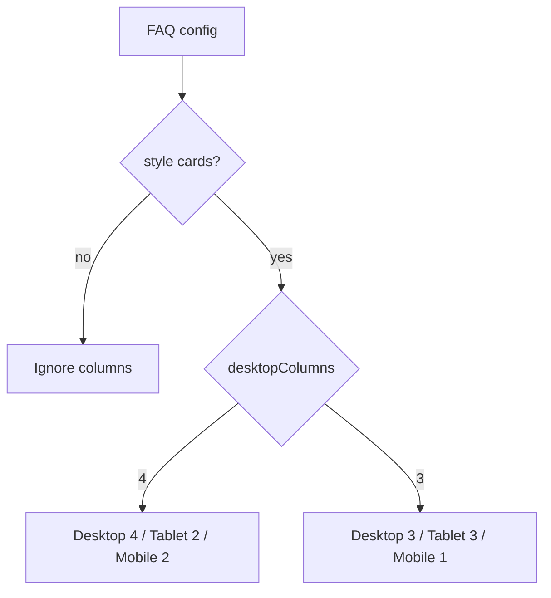

# I. Primer

## 1. TL;DR kiểu Feynman

- FAQ đang có một phần form giống Stats, nhưng chưa đồng bộ create/edit/preview/site.
- Create FAQ đã dùng `HeaderConfigSection`, còn edit FAQ vẫn có card title legacy nên bị lệch pattern.
- `spacing` đã xuất hiện ở create nhưng edit/site/preview chưa lưu và render đầy đủ.
- FAQ Grid cần thêm `desktopColumns: 3 | 4` theo logic Stats: desktop 4 → tablet/mobile 2; desktop 3 → tablet 3/mobile 1.
- FAQ cần thêm `rounded` áp dụng toàn bộ layout theo lựa chọn của bạn: không bo / bo ít / bo nhiều.
- Màu hardcode, brand border và Wine List palette sẽ được token hóa để custom color `/system/home-components` chạy đúng.

## 2. Elaboration & Self-Explanation

FAQ là một home-component có nhiều bề mặt: form create, form edit, preview trong admin, và runtime ngoài site. Nếu chỉ sửa form mà runtime không đọc config thì người dùng thấy admin đúng nhưng site vẫn sai.

Hiện Stats là component tham chiếu tốt nhất vì nó đã có: `HeaderConfigSection`, `Cấu hình hiển thị`, `desktopColumns`, `spacing`, custom font, custom color và runtime đọc config rõ ràng. FAQ sẽ học pattern này nhưng không copy mù: FAQ không có ảnh nên không thêm upload; FAQ không có carousel nên không thêm Embla trừ khi sau này có layout vuốt thật.

## 3. Concrete Examples & Analogies

Ví dụ cụ thể: khi chọn FAQ Grid `desktopColumns = 4`, preview desktop/site sẽ hiển thị 4 cột; tablet và mobile sẽ dùng 2 cột. Khi chọn `desktopColumns = 3`, tablet vẫn 3 cột và mobile xuống 1 cột để câu hỏi/câu trả lời không bị bó chữ.

Analogy: coi create/edit/preview/site như 4 màn hình cùng xem một công tắc. Nếu form có công tắc `spacing` nhưng site không nối dây, bật/tắt trong admin sẽ không làm đèn ngoài site đổi. Việc này là nối dây đầy đủ, không chỉ thêm nút.

# II. Audit Summary (Tóm tắt kiểm tra)

- Observation: `app/admin/home-components/create/faq/page.tsx` đã dùng `HeaderConfigSection` và truyền custom font/color vào preview.
- Observation: `app/admin/home-components/faq/[id]/edit/page.tsx` còn card legacy “FAQ / Tiêu đề hiển thị” trước `HeaderConfigSection`, không giống Stats edit.
- Observation: `FaqConfig` có `spacing?: SectionSpacing`, create có lưu `spacing`, nhưng edit không load/save/pass preview đầy đủ; `FaqPreview` khai báo prop `spacing` nhưng chưa destructure/use.
- Observation: `components/site/home/sections/FaqRuntimeSection.tsx` đang hardcode `className="py-8 px-3"`, không dùng `getSectionSpacingClassName` như Stats.
- Observation: `FaqSectionShared.tsx` có grid hardcode `grid-cols-3` / `@5xl:grid-cols-3`, chưa có `desktopColumns`.
- Observation: `FaqSectionShared.tsx` có nhiều màu hardcode (`text-gray-*`, `bg-white`, hex Wine List) và active border dùng brand token như `border-[var(--token-primary)]`.
- Observation: FAQ không có image field và không có carousel/Embla layout hiện tại, nên không thêm upload/Embla vào FAQ để tránh scope thừa.

# III. Root Cause & Counter-Hypothesis (Nguyên nhân gốc & Giả thuyết đối chứng)

- Root Cause Confidence (Độ tin cậy nguyên nhân gốc): **High**.
- Reason: các file create/edit/preview/runtime cho thấy cùng một config (`spacing`, header fields) chưa được load-save-render xuyên suốt; grid và color token cũng đang hardcode trực tiếp trong shared renderer.

## 1. Root Cause

FAQ được nâng cấp từng phần: create đã theo pattern mới, nhưng edit/runtime/shared section vẫn giữ nhiều logic cũ. Vì vậy parity giữa admin preview và site chưa đạt contract home-component.

## 2. Counter-Hypothesis

- Giả thuyết khác: lỗi chỉ nằm ở preview. Bị loại một phần vì runtime site cũng hardcode `py-8 px-3` và không đọc `spacing`.
- Giả thuyết khác: Stats đã có rounded option nên chỉ cần copy. Không đúng theo audit: Stats hiện có spacing/fullWidth/desktopColumns, nhưng chưa thấy rounded config thật sự; rounded cho FAQ là bổ sung mới theo yêu cầu.
- Giả thuyết khác: Wine List có thể giữ hardcode vì là style đặc biệt. Bạn đã chọn token hóa giữ vibe, nên spec sẽ chuyển Wine List sang token/custom color.

# IV. Proposal (Đề xuất)

## 1. Chuẩn hóa form create/edit

- Giữ FAQ có header chuẩn như Stats ở cả create/edit.
- Xóa card title legacy ở edit FAQ để không trùng với `HeaderConfigSection`.
- Dùng một bộ state rõ ràng cho header + display config trong edit, tương tự Stats.

## 2. Thêm `Cấu hình hiển thị` cho FAQ

- Thêm subsection giống Stats, gồm:
  - `SectionSpacingControl`: `normal | compact | none`.
  - `rounded`: `none | sm | lg` với nhãn UI: không bo góc / bo góc ít / bo góc nhiều.
  - `desktopColumns: 3 | 4` chỉ hiển thị/áp dụng khi selected layout là `cards` (Grid).
- Không thêm fullWidth trừ khi trong lúc implement thấy FAQ cần thật sự; hiện user chỉ yêu cầu spacing/rounded/grid columns.

## 3. Cập nhật config contract

- Mở rộng `FaqConfig`:
  - `spacing?: SectionSpacing`
  - `rounded?: FaqRounded`
  - `desktopColumns?: 3 | 4`
- Thêm normalize helper tương tự Stats:
  - `normalizeFaqSpacing`
  - `getFaqSectionSpacingClassName`
  - `normalizeFaqRounded`
  - `getFaqRoundedClassName`
  - `normalizeFaqDesktopColumns`

## 4. Preview ↔ Site parity map

| Surface | File | Contract cần giữ |
|---|---|---|
| Create | `app/admin/home-components/create/faq/page.tsx` | lưu header + spacing + rounded + desktopColumns |
| Edit | `app/admin/home-components/faq/[id]/edit/page.tsx` | load/save/hasChanges đầy đủ, bỏ card legacy |
| Preview | `app/admin/home-components/faq/_components/FaqPreview.tsx` | nhận spacing/rounded/desktopColumns và render giống runtime |
| Shared UI | `app/admin/home-components/faq/_components/FaqSectionShared.tsx` | grid responsive, rounded, token colors, no ellipsis |
| Site | `components/site/home/sections/FaqRuntimeSection.tsx` | đọc config và truyền vào shared section, dùng spacing class |

## 5. Grid responsive logic cho FAQ Cards

- `desktopColumns = 4`:
  - desktop: 4 cột
  - tablet: 2 cột
  - mobile: 2 cột
- `desktopColumns = 3`:
  - desktop: 3 cột
  - tablet: 3 cột
  - mobile: 1 cột

## 6. Color/token cleanup

- Giữ custom color source từ `getFaqColors(...)`.
- Thay màu hardcode trong `FaqSectionShared.tsx` bằng token có sẵn hoặc token bổ sung trong `faq/_lib/colors.ts` nếu thiếu.
- Border hạn chế dùng màu thương hiệu: active/focus border ưu tiên neutral black/white/slate phù hợp; brand dùng cho text/icon/accent nhẹ.
- Wine List: token hóa giữ cảm giác wine bằng tint từ primary/secondary + neutral, không giữ hex cứng.

## 7. Header alignment và long text

- Shared `SectionHeader` hoặc wrapper FAQ sẽ được giới hạn max-width phù hợp khi `left/right`, tránh vượt quá max width item/container.
- Không dùng `truncate`, `line-clamp`, `...` cho câu hỏi/câu trả lời; ưu tiên `break-words`, `text-pretty`, `leading-relaxed`.

## 8. Embla và Upload

- FAQ hiện không có layout vuốt và không có image field.
- Vì vậy spec **không thêm Embla** và **không thêm upload ảnh** cho FAQ trong lần này.
- Nếu sau này FAQ có carousel/image layout, sẽ áp dụng Embla API + state prev/next và uploader/crop theo Stats.

# V. Files Impacted (Tệp bị ảnh hưởng)

## 1. UI / Admin form

- Sửa: `app/admin/home-components/create/faq/page.tsx` — hiện là create surface của FAQ; sẽ thêm display config state/submit/preview props cho rounded + desktopColumns, giữ header pattern.
- Sửa: `app/admin/home-components/faq/[id]/edit/page.tsx` — hiện là edit surface của FAQ; sẽ bỏ card title legacy, load/save/hasChanges spacing/rounded/desktopColumns, pass props vào preview.
- Sửa: `app/admin/home-components/faq/_components/FaqForm.tsx` — hiện quản lý danh sách FAQ và config riêng `two-column`; có thể giữ nguyên nếu display config đặt ở page như Stats, chỉ chỉnh nếu cần tách component nhỏ.

## 2. Shared / Preview / Runtime

- Sửa: `app/admin/home-components/faq/_components/FaqPreview.tsx` — hiện chưa dùng `spacing`; sẽ dùng spacing/rounded/desktopColumns và giữ custom font.
- Sửa: `app/admin/home-components/faq/_components/FaqSectionShared.tsx` — hiện render layout FAQ chung; sẽ thêm rounded/grid responsive/token color cleanup.
- Sửa: `components/site/home/sections/FaqRuntimeSection.tsx` — hiện hardcode spacing; sẽ normalize spacing và truyền rounded/desktopColumns vào shared section.

## 3. Types / Constants / Colors

- Sửa: `app/admin/home-components/faq/_types/index.ts` — thêm type `FaqRounded`, `FaqSpacing`, desktop columns và helper normalize/className.
- Sửa: `app/admin/home-components/faq/_lib/constants.ts` — thêm default `spacing`, `rounded`, `desktopColumns`.
- Sửa: `app/admin/home-components/faq/_lib/colors.ts` — bổ sung token nếu cần để thay hardcoded colors và token hóa Wine List.

# VI. Execution Preview (Xem trước thực thi)

1. Đọc lại file FAQ/Stats liên quan trước khi sửa để giữ đúng import/style hiện tại.
2. Mở rộng `FaqConfig` + defaults + normalize helpers.
3. Thêm UI `Cấu hình hiển thị` vào FAQ create/edit theo pattern Stats.
4. Sửa edit FAQ: bỏ title card legacy, load/save/hasChanges cho `spacing`, `rounded`, `desktopColumns`.
5. Sửa `FaqPreview`: destructure/use `spacing`, truyền `rounded`, `desktopColumns` xuống shared section.
6. Sửa `FaqRuntimeSection`: dùng spacing class và truyền config đầy đủ xuống shared section.
7. Sửa `FaqSectionShared`: grid responsive cho `cards`, rounded class cho toàn layout, token hóa màu và border.
8. Tự review tĩnh: create/edit parity, no ellipsis, custom font/color, token usage, legacy config fallback.
9. Sau khi được duyệt và implement: chạy `bunx tsc --noEmit 2>&1 | Select-Object -First 10` theo rule repo; không chạy lint/build.
10. Commit thay đổi sau khi typecheck pass, không push.

# VII. Verification Plan (Kế hoạch kiểm chứng)

- Static review (tự review tĩnh): kiểm tra `FaqConfig` load/save/render đủ ở create/edit/preview/site.
- Typecheck: chạy `bunx tsc --noEmit 2>&1 | Select-Object -First 10` sau khi sửa code.
- Visual checklist do tester/runtime phụ trách theo rule repo:
  - `/admin/home-components/create/faq`: header, spacing, rounded, Grid columns hoạt động.
  - FAQ edit page: load record cũ không mất config; save lại giữ config mới.
  - Site runtime: spacing/rounded/grid giống preview.
  - `/system/home-components`: custom color/font FAQ vẫn ảnh hưởng preview/site.

# VIII. Todo

- [ ] Mở rộng FAQ types/defaults/helpers.
- [ ] Thêm display config vào FAQ create.
- [ ] Chuẩn hóa FAQ edit theo Stats, bỏ card legacy.
- [ ] Cập nhật preview/runtime/shared section cho spacing/rounded/columns.
- [ ] Token hóa màu hardcode và Wine List.
- [ ] Tự review tĩnh + chạy typecheck theo rule repo.
- [ ] Commit thay đổi, không push.

# IX. Acceptance Criteria (Tiêu chí chấp nhận)

- FAQ create/edit đều có `Tiêu đề và mô tả` theo Stats và có thể ẩn toàn bộ header.
- FAQ create/edit đều có `Cấu hình hiển thị` gồm spacing, rounded, desktop columns cho Grid/Cards.
- Spacing lưu vào config và render đúng ở preview + site.
- Rounded áp dụng toàn bộ layout theo 3 mức: không bo / ít / nhiều.
- FAQ Grid/Cards tuân thủ responsive rule đã chọn: 4 → 2/2, 3 → 3/1.
- Không thêm Embla/upload cho FAQ vì hiện không có carousel/image field.
- Không còn ellipsis/truncate/line-clamp cho câu hỏi/câu trả lời FAQ.
- Custom font vẫn truyền qua preview và không bị mất ở site/runtime surface hiện có.
- Custom color từ `/system/home-components` vẫn resolve đúng; Wine List không còn hex palette cứng.
- Active border không dùng brand làm border chính; ưu tiên neutral black/white/slate phù hợp.
- Typecheck pass trước khi commit.

# X. Risk / Rollback (Rủi ro / Hoàn tác)

- Risk: thay đổi shared renderer có thể ảnh hưởng tất cả layout FAQ cùng lúc. Giảm rủi ro bằng helper normalize và fallback default.
- Risk: records cũ thiếu `spacing/rounded/desktopColumns`. Giảm rủi ro bằng normalize + default config.
- Risk: token hóa Wine List làm vibe khác nhẹ. Giảm rủi ro bằng giữ cấu trúc layout, chỉ đổi source màu sang token/tint.
- Rollback: revert commit sau khi implement; config cũ vẫn tương thích vì field mới optional.

# XI. Out of Scope (Ngoài phạm vi)

- Không chuẩn hóa toàn bộ home-components khác ngoài FAQ.
- Không thêm image upload cho FAQ vì FAQ hiện không có field ảnh.
- Không thêm Embla carousel cho FAQ vì không có layout vuốt hiện tại.
- Không sửa `/system/home-components` trừ khi audit trong lúc implement phát hiện FAQ type chưa được hỗ trợ custom color/font.
