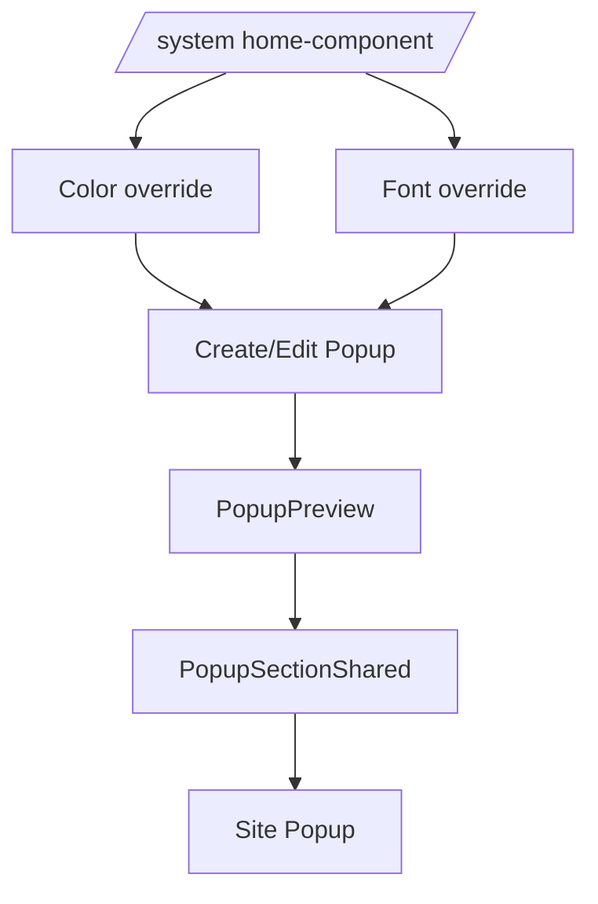

# I. Primer

## 1. TL;DR kiểu Feynman

1. Không thêm `HeaderConfigSection` cho Popup vì Popup là overlay z-index cao, không cần section header như Stats.
2. Vẫn học Stats ở phần quan trọng: custom font, custom color, spacing, bo góc, form grouping và preview/site parity.
3. Create Popup sẽ truyền `useTypeFontOverrideState` vào `ComponentFormWrapper` để font custom được lưu theo `/system/home-component` giống Stats.
4. Edit Popup sẽ lưu/dirty-track cả custom color + custom font + `spacing` + config hiện có.
5. Popup không có grid item/carousel, nên rule desktop 3/4 và Embla là không áp dụng cho component hiện tại.

## 2. Elaboration & Self-Explanation

Popup không nên có header ngoài như Stats vì nó không render như một section trong luồng trang; nó là modal/overlay. Vì vậy hướng đúng là giữ card title hiện có cho tên component, nhưng chuẩn hóa các phần hệ thống: màu custom, font custom, spacing, bo góc và ảnh. `ComponentFormWrapper` ở create đã có sẵn slot để nhận custom font/color state và tự save vào `homeComponentSystemConfig`, nên Popup create chỉ cần nối đúng giống Stats. Edit không dùng wrapper đó, nên phải tự thêm `TypeFontOverrideCard`, mutation `setTypeFontOverride`, dirty tracking và preview font.

## 3. Concrete Examples & Analogies

Ví dụ: với Stats create, `effectiveFont.fontVariable` được chuyển thành `fontStyle = { '--font-active': 'var(...)' }` và truyền vào preview. Popup cũng cần đường truyền tương tự: `/system/home-component` chọn font Popup → create/edit resolve font → `PopupPreview` → `PopupSectionShared` → text trong popup dùng `font-active`.

Analogy: không cần gắn “biển tên section” lên một popup đang nổi giữa màn hình; nhưng vẫn cần popup nhận đúng “màu áo” và “font chữ” từ hệ thống.

# II. Audit Summary (Tóm tắt kiểm tra)

1. `create/popup/page.tsx` hiện có custom color state nhưng chưa có `useTypeFontOverrideState`; custom color create đã truyền vào wrapper, nhưng preview mới dùng `primary`, chưa truyền `secondary/mode`.
2. `popup/[id]/edit/page.tsx` hiện có `TypeColorOverrideCard` và mutation save màu, nhưng chưa có `TypeFontOverrideCard`, chưa save font override, chưa dirty-track font.
3. `PopupForm.tsx` hiện có `cornerRadius` nhưng nằm trong nhóm “Nội dung”, chưa có nhóm “Cấu hình hiển thị” giống Stats.
4. `PopupConfig` chưa có `spacing`; `normalizePopupConfig` chưa normalize spacing cho dữ liệu cũ.
5. `PopupPreview.tsx` và `PopupSectionShared.tsx` chưa nhận `fontStyle/fontClassName`; shared runtime đang hardcode `popupFontStyle` với `--font-active` fallback nhưng chưa được inject từ create/edit.
6. Ảnh Popup dùng `SettingsImageUploader`, đã có Upload/URL/Dán/Cắt, nhưng chưa truyền `cropAspectRatio` theo style.
7. Text chính trong popup phần lớn wrap bình thường, nhưng cần rà thêm `heading/description/note/button` để tránh ellipsis và thêm `break-words/text-balance` hợp lý.
8. Popup không có item grid nên desktop 3/4 không áp dụng.
9. Popup không có carousel/swipe layout nên Embla prev/next không áp dụng.

# III. Root Cause & Counter-Hypothesis (Nguyên nhân gốc & Giả thuyết đối chứng)

## 1. Root Cause Confidence (Độ tin cậy nguyên nhân gốc)

High — evidence trong file: Stats đã có `useTypeFontOverrideState`, `fontStyle`, `fontClassName`, `TypeFontOverrideCard`; Popup create/edit/shared chưa nối các phần này. Popup form cũng đã có bo góc nhưng chưa có `spacing` và chưa gom vào “Cấu hình hiển thị”.

## 2. Counter-Hypothesis (Giả thuyết đối chứng)

Có thể chỉ cần `ComponentFormWrapper` fallback tự xử lý font ở create mà không truyền state thủ công. Tuy nhiên để preview dùng đúng font ngay trong form như Stats, vẫn cần lấy `effectiveFont` ở Popup create và truyền xuống `PopupPreview/PopupSectionShared`.

# IV. Proposal (Đề xuất)

1. Create Popup — nối custom font giống Stats, không thêm header:
   - Import `useTypeFontOverrideState`.
   - Lấy `customFontState`, `effectiveFont`, `showFontCustomBlock`, `setCustomFontState`.
   - Truyền `customFontState/showFontCustomBlock/setCustomFontState` vào `ComponentFormWrapper`.
   - Tạo `fontStyle` và truyền vào `PopupPreview`.
   - Giữ title input mặc định của wrapper, không dùng `HeaderConfigSection`, không `skipTitleInput`.

2. Create/Edit Popup — kiểm tra custom color đáp ứng `/system/home-component`:
   - Create tiếp tục dùng `useTypeColorOverrideState(COMPONENT_TYPE, { seedCustomFromSettingsWhenTypeEmpty: true })` và wrapper save màu.
   - Preview nhận đủ `primary`, `secondary`, `mode` nếu `PopupSectionShared` cần dual color token sau này; trước mắt vẫn đảm bảo `primary` đang là effective primary.
   - Edit giữ `TypeColorOverrideCard`, `setTypeColorOverride`, `resolveSecondaryByMode`; rà dirty tracking để so sánh đúng secondary resolved.

3. Edit Popup — thêm font override giống Stats:
   - Import `TypeFontOverrideCard`, `useTypeFontOverrideState`, `setTypeFontOverride`.
   - Thêm `customFontChanged` vào `hasChanges`.
   - Khi submit, nếu `showFontCustomBlock` thì gọi `setTypeFontOverride({ type: 'Popup', enabled, fontKey })`.
   - Sau save, cập nhật `setInitialFontCustom`.
   - Render `TypeFontOverrideCard` cạnh `TypeColorOverrideCard` trong sticky side panel.
   - Truyền `fontStyle/fontClassName` vào `PopupPreview`.

4. Config Popup — thêm spacing backward-compatible:
   - Thêm type `PopupSpacing = SectionSpacing`.
   - Thêm `spacing: PopupSpacing` vào `PopupConfig`.
   - Thêm default `spacing: DEFAULT_SECTION_SPACING` trong `DEFAULT_POPUP_CONFIG`.
   - Thêm normalize bằng `normalizeSectionSpacing(raw.spacing)` trong `normalizePopupConfig`.
   - Không thêm các header fields như `showTitle/subtitle/headerAlign` vì user đã xác nhận Popup không cần header.

5. PopupForm — chuẩn hóa nhóm “Cấu hình hiển thị”:
   - Tạo section “Cấu hình hiển thị” giống Stats.
   - Đưa `SectionSpacingControl` vào section này.
   - Di chuyển `cornerRadius` vào section này với 3 option: không bo góc / bo góc ít / bo góc nhiều.
   - Đưa `colorIntensity` và `showIcon` vào section này nếu phù hợp, vì đây là thuộc tính hiển thị.
   - Giữ các section popup-specific: “Nội dung”, “CTA”, “Ảnh”, “Hiển thị”.

6. Ảnh Popup — crop ratio theo style:
   - Thêm helper resolve crop ratio theo `config.style`.
   - `image-only`, `split-visual`, `full-screen`: ưu tiên `wide169` hoặc `landscape43` tùy layout đang hiển thị.
   - `center-card`, `minimal-alert`, `side-panel`, `bottom-sheet`: dùng `square` hoặc ratio gọn để không vỡ modal.
   - Truyền `cropAspectRatio` vào `SettingsImageUploader` để nút Cắt hiển thị đúng label.

7. Preview/site shared — font/spacing/text wrapping:
   - `PopupPreview` nhận `fontStyle`, `fontClassName`.
   - `PopupSectionShared` nhận và áp vào wrapper/runtime để `--font-active` có hiệu lực.
   - Áp dụng `spacing` an toàn vào padding/gap trong card hoặc overlay content, không tạo section header/section wrapper ngoài luồng.
   - Rà `PopupText`, `PopupActions`, `PopupImage` để nội dung chính dùng wrap đầy đủ: `break-words`, `text-balance` cho heading, `whitespace-normal` cho button khi cần; không dùng `truncate` cho heading/description/note/CTA quan trọng.

# V. Files Impacted (Tệp bị ảnh hưởng)

1. Sửa: `app/admin/home-components/create/popup/page.tsx` — thêm font override state, truyền font custom vào wrapper và preview; giữ title input mặc định.
2. Sửa: `app/admin/home-components/popup/[id]/edit/page.tsx` — thêm font override card/save/dirty tracking, truyền font vào preview, rà custom color tracking.
3. Sửa: `app/admin/home-components/popup/_types/index.ts` — thêm `PopupSpacing` và `spacing`; không thêm header config fields.
4. Sửa: `app/admin/home-components/popup/_lib/constants.ts` — thêm default/normalize spacing và giữ backward compatibility.
5. Sửa: `app/admin/home-components/popup/_components/PopupForm.tsx` — tách “Cấu hình hiển thị”, chuyển bo góc vào đó, thêm spacing control, crop ratio cho ảnh.
6. Sửa: `app/admin/home-components/popup/_components/PopupPreview.tsx` — nhận/truyền font style/class và nếu cần truyền đủ color tokens.
7. Sửa: `app/admin/home-components/popup/_components/PopupSectionShared.tsx` — áp dụng font/spacing/wrap text trong shared renderer.
8. Có thể sửa nhẹ: `components/site/PopupSection.tsx` — chỉ nếu cần truyền thêm props sau khi shared props thay đổi; vẫn giữ `normalizePopupConfig` làm source of truth.

# VI. Execution Preview (Xem trước thực thi)

1. Cập nhật type/default/normalize spacing trước.
2. Cập nhật `PopupForm` để có “Cấu hình hiển thị” và image crop ratio.
3. Cập nhật create page để thêm font override state và preview font.
4. Cập nhật edit page để thêm font override card, save, dirty tracking và preview font.
5. Cập nhật `PopupPreview/PopupSectionShared` để nhận font/spacing và xử lý text wrap.
6. Review tĩnh custom color: create wrapper save đúng, edit mutation save đúng, preview dùng effective primary; không làm mất dual-mode data.
7. Chạy typecheck theo repo rule sau khi được duyệt.
8. Commit thay đổi nếu verify pass.

# VII. Verification Plan (Kế hoạch kiểm chứng)

1. Typecheck: chạy `bunx tsc --noEmit 2>&1 | Select-Object -First 10`.
2. Static review create:
   - Có `useTypeFontOverrideState`.
   - Wrapper nhận `customFontState/showFontCustomBlock/setCustomFontState`.
   - Preview nhận font style/class.
3. Static review edit:
   - Có `TypeFontOverrideCard`.
   - Submit save `setTypeFontOverride`.
   - `hasChanges` tính cả font/color/spacing/config.
4. Static review config:
   - Config cũ thiếu `spacing` vẫn normalize về default.
5. Manual QA do tester:
   - `/admin/home-components/create/popup`: đổi custom font/color trong form và xem preview đổi đúng.
   - Edit Popup: đổi font/color/spacing rồi save, reload vẫn giữ.
   - Ảnh có Upload/URL/Dán/Cắt với crop label đúng.
   - Long text không bị `...`.

# VIII. Todo

1. Thêm spacing vào Popup type/default/normalize.
2. Chuẩn hóa `PopupForm` với “Cấu hình hiển thị”.
3. Thêm custom font flow cho create Popup.
4. Thêm custom font save/dirty tracking cho edit Popup.
5. Cập nhật `PopupPreview/PopupSectionShared` cho font/spacing/text wrap.
6. Review custom color parity với `/system/home-component`.
7. Chạy typecheck và commit sau khi pass.

# IX. Acceptance Criteria (Tiêu chí chấp nhận)

1. Popup không có `HeaderConfigSection` và không thêm header fields không cần thiết.
2. Create Popup có custom font flow giống Stats và preview đổi font đúng.
3. Edit Popup có `TypeFontOverrideCard`, save được font, dirty tracking đúng.
4. Custom color Popup vẫn lấy/lưu theo `/system/home-component` ở create và edit.
5. Popup có `spacing` trong config, normalize backward-compatible.
6. `PopupForm` có nhóm “Cấu hình hiển thị” gồm spacing, bo góc, độ đậm màu/icon nếu phù hợp.
7. Ảnh Popup có crop ratio hợp lý theo style.
8. Text chính không bị ellipsis.
9. Typecheck pass.

# X. Risk / Rollback (Rủi ro / Hoàn tác)

- Rủi ro chính là edit dirty tracking sai khi thêm font/color/spacing.
- Giảm rủi ro bằng cách bám pattern Stats edit và chỉ thêm field cần thiết.
- Rollback bằng revert commit; không đổi schema Convex, chỉ đổi config object backward-compatible.

# XI. Out of Scope (Ngoài phạm vi)

- Không thêm header/title/subtitle section cho Popup.
- Không thêm grid desktop 3/4 vì Popup không có item grid.
- Không thêm Embla vì Popup không có layout vuốt.
- Không refactor các home-component khác.
- Không chạy lint/build; chỉ typecheck theo instruction repo.