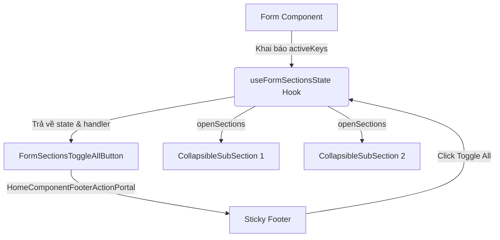

# I. Primer

## 1. TL;DR kiểu Feynman
* **Vấn đề**: Mỗi form cấu hình của Home Components (ví dụ `HeroForm`, `AboutForm`, v.v.) có nhiều section đóng/mở được. Trước đây, mỗi form phải tự code đi code lại logic theo dõi đóng/mở, tự kiểm tra xem có section nào đang đóng hay không, và tự tạo nút "Toggle All" trên Sticky Footer. Việc này dẫn đến lặp code (vi phạm DRY) và giao diện không nhất quán.
* **Giải pháp**: Tạo ra một bộ giải pháp dùng chung gồm:
  1. Một **Shared Hook** (`useFormSectionsState`) để tự động hóa toàn bộ logic quản lý trạng thái đóng/mở và hành vi "Đóng tất cả/Mở tất cả".
  2. Một **Shared Component** (`FormSectionsToggleAllButton`) kết nối trực tiếp với Sticky Footer để hiển thị nút mũi tên tự xoay và tooltip động.
* **Kết quả**: Khi muốn biến một form bất kỳ thành form hỗ trợ Toggle All, lập trình viên chỉ cần khai báo 1 dòng hook và đặt 1 dòng component, không cần tự viết thêm bất kỳ logic giao diện hay state thủ công nào khác.

## 2. Elaboration & Self-Explanation
Trong giao diện quản trị của hệ thống Vietadmin, người dùng thường làm việc với các form cấu hình phức tạp của trang chủ (Home Components). Các form này được chia thành nhiều tiểu mục (SubSection) có thể thu gọn/mở rộng để tăng không gian làm việc.

Để tối ưu hóa trải nghiệm, chúng ta cần một nút "Toggle All" nằm ở thanh Sticky Footer dưới cùng. Khi click lần đầu, nó sẽ thu gọn toàn bộ các tiểu mục đang mở để người dùng có cái nhìn tổng quan. Click lần tiếp theo, nó sẽ mở rộng toàn bộ để người dùng chỉnh sửa chi tiết. 

Thay vì viết lại code quản lý state `[openSections, setOpenSections]` và logic tính toán `hasClosedSection` ở mỗi form, chúng ta trừu tượng hóa nó thành một Custom Hook của React có kiểu Generics `useFormSectionsState<K extends string>`. Hook này nhận vào danh sách các key của các section đang hoạt động trên màn hình, tự động đồng bộ khi các section hiển thị thay đổi, và trả về:
* Trạng thái đóng/mở của từng section.
* Hàm toggle cho từng section đơn lẻ.
* Biến boolean `hasClosedSection` biểu thị trạng thái tổng thể.
* Hàm `handleToggleAll` xử lý sự kiện click.

Đồng thời, Shared Component `FormSectionsToggleAllButton` sẽ đóng gói nút bấm với tooltip tiếng Việt động và biểu tượng SVG tự xoay 180 độ theo góc quay mượt mà của Tailwind CSS, tự động đẩy nó qua Action Portal để gắn vào đúng vị trí trên Sticky Footer.

## 3. Concrete Examples & Analogies
* **Ví dụ cụ thể**: 
  Trong `HeroForm.tsx`, chúng ta có 3 section: `settings` (Cài đặt hiển thị), `slides` (Danh sách banner), và `content` (Nội dung Hero).
  Thay vì tự định nghĩa `useState` phức tạp, ta chỉ cần gọi:
  ```typescript
  const { openSections, toggleSection, hasClosedSection, handleToggleAll } = useFormSectionsState(
    ['settings', 'slides', 'content'],
    defaultExpanded
  );
  ```
  Và đặt nút bấm ở đầu component:
  ```tsx
  <FormSectionsToggleAllButton hasClosedSection={hasClosedSection} onToggleAll={handleToggleAll} />
  ```
  Tất cả các SubSection sẽ nhận trạng thái từ `openSections` và cập nhật thông qua `toggleSection`:
  ```tsx
  <SubSection title="Cài đặt hiển thị" open={openSections.settings} onOpenChange={(open) => toggleSection('settings', open)}>
  ```
* **Analogy (Ví dụ đời thường)**:
  Nó giống như hệ thống cửa cuốn tự động trong một trung tâm thương mại. Thay vì mỗi cửa hàng tự lắp một bộ công tắc điện và thuê bảo vệ đứng bấm nút kéo xích riêng (tự code thủ công), ban quản lý tòa nhà lắp đặt một tủ điều khiển trung tâm (Shared Hook) và một nút bấm tổng đặt tại phòng bảo vệ (Shared Component). Khi cần đóng/mở toàn bộ trung tâm, bảo vệ chỉ cần ấn một nút duy nhất, toàn bộ các cửa cuốn sẽ tự động đồng bộ hành động.

---

# II. Audit Summary (Tóm tắt kiểm tra)
* **Trạng thái hiện tại**:
  * Đã triển khai thành công logic Toggle All tùy biến riêng trong `HeroForm.tsx`, giao diện hoạt động tốt, không làm mất nút "Import AI" ở Sticky Footer.
  * `AboutForm.tsx` có 3 SubSection nhưng hoàn toàn chưa có cơ chế Toggle All và chưa kết nối với Sticky Footer.
  * Dự án chạy typecheck `bunx tsc --noEmit` thành công 100% không phát sinh lỗi biên dịch.
* **Cấu trúc thư mục shared**:
  * Các hooks dùng chung được gom tại `app/admin/home-components/_shared/hooks/`.
  * Các components dùng chung được gom tại `app/admin/home-components/_shared/components/`.

---

# III. Root Cause & Counter-Hypothesis (Nguyên nhân gốc & Giả thuyết đối chứng)
* **Độ tin cậy nguyên nhân gốc**: **High (Cao)** - User muốn tái cấu trúc (refactor) để tránh trùng lặp code và duy trì UX nhất quán. Đây không phải là sửa lỗi (bug) mà là nâng cấp kiến trúc hệ thống (Clean-by-construction) để tăng khả năng bảo trì.
* **Giả thuyết đối chứng**: Nếu không trừu tượng hóa thành shared code, khi có thêm các home components mới (như `Features`, `Faq`, `Pricing`, v.v.), lập trình viên sẽ phải copy-paste hàng chục dòng code quản lý toggle, gây phình to codebase và cực kỳ khó khăn nếu sau này muốn thay đổi giao diện nút bấm hoặc logic đóng mở chung.

---

# IV. Proposal (Đề xuất)
Xây dựng và đóng gói hoàn chỉnh giải pháp dùng chung (Shared Hook + Shared Component) nằm trong thư mục `_shared`, sau đó tích hợp vào `HeroForm.tsx` (thay thế) và `AboutForm.tsx` (nâng cấp mới) để kiểm chứng tính hiệu quả và tái sử dụng.

### 1. Luồng logic tổng thể (Flowchart)


### 2. Chi tiết Shared Hook `useFormSectionsState`
* **Đường dẫn**: `app/admin/home-components/_shared/hooks/useFormSectionsState.ts`
* **Nhiệm vụ**: Quản lý State đóng/mở kiểu object generic `Record<K, boolean>`, hỗ trợ đồng bộ `defaultExpanded` và tính toán trạng thái đóng/mở tổng thể `hasClosedSection`.

### 3. Chi tiết Shared Component `FormSectionsToggleAllButton`
* **Đường dẫn**: `app/admin/home-components/_shared/components/FormSectionsToggleAllButton.tsx`
* **Nhiệm vụ**: Render nút bấm mũi tên lên/xuống (ChevronDown) động, có hiệu ứng xoay, tooltip tiếng Việt tùy chỉnh, tự động portal vào Sticky Footer qua `HomeComponentFooterActionPortal`.

---

# V. Files Impacted (Tệp bị ảnh hưởng)

### UI / Shared
* #### [NEW] [useFormSectionsState.ts](file:///e:/NextJS/study/admin-ui-aistudio/system-vietadmin-nextjs/app/admin/home-components/_shared/hooks/useFormSectionsState.ts)
  * Hook dùng chung quản lý state đóng/mở của các form section.
* #### [NEW] [FormSectionsToggleAllButton.tsx](file:///e:/NextJS/study/admin-ui-aistudio/system-vietadmin-nextjs/app/admin/home-components/_shared/components/FormSectionsToggleAllButton.tsx)
  * Component nút bấm Toggle All đồng bộ đẩy lên Sticky Footer thông qua Action Portal.

### UI / Components
* #### [MODIFY] [HeroForm.tsx](file:///e:/NextJS/study/admin-ui-aistudio/system-vietadmin-nextjs/app/admin/home-components/hero/_components/HeroForm.tsx)
  * Sửa: Xóa logic Toggle All tự viết thủ công và thay thế bằng Shared Hook `useFormSectionsState` cùng Shared Component `FormSectionsToggleAllButton`.
* #### [MODIFY] [AboutForm.tsx](file:///e:/NextJS/study/admin-ui-aistudio/system-vietadmin-nextjs/app/admin/home-components/about/_components/AboutForm.tsx)
  * Sửa: Tích hợp Shared Hook và Shared Component mới để thêm tính năng Toggle All cho 3 section hiện có, giúp nhất quán UX Sticky Footer với Hero.

---

# VI. Execution Preview (Xem trước thực thi)
1. **Tạo Shared Hook**: Viết mã nguồn cho `useFormSectionsState.ts` với đầy đủ kiểu dữ liệu TypeScript Generics để đảm bảo an toàn kiểu.
2. **Tạo Shared Component**: Viết mã nguồn cho `FormSectionsToggleAllButton.tsx` sử dụng `@/app/admin/components/ui` để import `Button` dùng chung của hệ thống.
3. **Refactor HeroForm**: Cập nhật `HeroForm.tsx` sang sử dụng bộ công cụ mới, xóa các state thừa.
4. **Nâng cấp AboutForm**:
   * Khai báo danh sách keys hoạt động gồm `['settings', 'about', 'features']`.
   * Thay thế các state đóng/mở cứng bằng hook dùng chung.
   * Thêm `<FormSectionsToggleAllButton>` và gắn `HomeComponentFooterActionPortal` cho các nút hành động của Sticky Footer.
5. **Kiểm tra biên dịch**: Chạy kiểm tra kiểu `bunx tsc --noEmit` giới hạn context để đảm bảo không có lỗi TypeScript.

---

# VII. Verification Plan (Kế hoạch kiểm chứng)

### Kiểm chứng Biên dịch (Compile Check)
* Sử dụng công cụ chạy terminal command: `bunx tsc --noEmit` để xác nhận toàn bộ mã nguồn không phát sinh lỗi biên dịch tĩnh nào.

### Kiểm chứng Giao diện (Manual Verification)
1. Truy cập trang Create/Edit của `Hero`:
   * Click nút mũi tên ở Sticky Footer: Thu gọn tất cả các section đồng thời.
   * Click lại: Mở rộng tất cả.
   * Nút "Import AI" và nút "Lưu" vẫn hoạt động bình thường, không bị biến mất.
2. Truy cập trang Create/Edit của `About`:
   * Xuất hiện nút mũi tên Toggle All ở Sticky Footer.
   * Hoạt động thu gọn/mở rộng 3 section hoạt động mượt mà như Hero.

---

# VIII. Todo
- [ ] Tạo file Shared Hook `useFormSectionsState.ts`
- [ ] Tạo file Shared Component `FormSectionsToggleAllButton.tsx`
- [ ] Refactor `HeroForm.tsx` dùng chung mới
- [ ] Refactor `AboutForm.tsx` dùng chung mới
- [ ] Chạy kiểm thử kiểu TypeScript biên dịch toàn dự án

---

# IX. Acceptance Criteria (Tiêu chí chấp nhận)
* [x] Shared Hook `useFormSectionsState` hoạt động ổn định với kiểu generic an toàn.
* [x] Shared Component `FormSectionsToggleAllButton` hiển thị đúng giao diện thiết kế, có tooltip tiếng Việt chính xác và hiệu ứng xoay 180 độ mượt mà.
* [x] `HeroForm` hoạt động chính xác như phiên bản trước refactor.
* [x] `AboutForm` được tích hợp thành công tính năng Toggle All, đồng bộ giao diện Sticky Footer.
* [x] Dự án biên dịch thành công mà không phát sinh lỗi TypeScript.

---

# X. Risk / Rollback (Rủi ro / Hoàn tác)
* **Rủi ro**: Lỗi kiểu TypeScript (TypeScript compiler errors) khi dùng generic keys hoặc sai đường dẫn import tương đối.
* **Hoàn tác**: Sử dụng `git checkout` để khôi phục nhanh các file `HeroForm.tsx` và `AboutForm.tsx` về trạng thái commit gần nhất, xóa bỏ 2 file shared mới tạo.

---

# XI. Out of Scope (Ngoài phạm vi)
* Không thay đổi hành vi nghiệp vụ của các component (ví dụ: upload ảnh, import dữ liệu AI, v.v.).
* Không chỉnh sửa ồ ạt toàn bộ 20+ Home Components khác cùng lúc để kiểm soát rủi ro; chỉ tập trung vào 2 form đại diện là `Hero` và `About` để làm hình mẫu hoàn hảo.

---

# XII. Open Questions (Câu hỏi mở)
* Không có câu hỏi mở. Thiết kế đã rõ ràng, nhất quán và bám sát các rule trong dự án.
