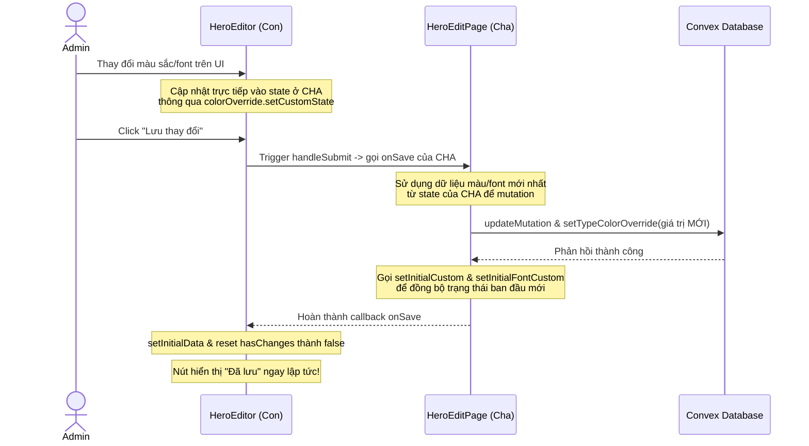

# I. Primer

## 1. TL;DR kiểu Feynman
Khi sửa cài đặt của Hero Banner, người dùng phải bấm nút "Lưu thay đổi" 2 lần thì nút mới chuyển sang trạng thái "Đã lưu". Nguyên nhân là do hệ thống quản lý màu sắc và font chữ đặc biệt (Custom Color/Font Overrides) đang bị khai báo trùng lặp (2 lần độc lập) ở cả trang cha (`HeroEditPage`) và component con (`HeroEditor`). Trang cha thì giữ giá trị cũ, còn component con thì nhận giá trị mới từ người dùng. Khi nhấn nút lưu lần 1, trang cha sử dụng giá trị cũ của mình để lưu lên database, ghi đè lên dữ liệu mới của con và làm lệch đồng bộ, khiến component con bị sync ngược về giá trị cũ từ database. Đến lần bấm thứ 2, sau khi các state đã được sync lại, nút lưu mới hoạt động đúng.
Để sửa lỗi này, chúng ta sẽ "nâng state lên cha" (Lift State Up). Component cha sẽ là nơi duy nhất quản lý các state màu/font và truyền xuống cho component con sử dụng. Nhờ đó, cả cha và con luôn có cùng một nguồn dữ liệu đồng nhất (Single Source of Truth), nút lưu sẽ hoạt động chính xác ngay từ lần bấm đầu tiên.

## 2. Elaboration & Self-Explanation
Trong React, khi hai component cha và con cần chia sẻ và thao tác trên cùng một trạng thái (state), việc định nghĩa các React state độc lập ở cả hai nơi là một lỗi thiết kế nghiêm trọng (gọi là Duplicate State / Split State).
Trong module Hero:
- Trang cha `app/admin/home-components/hero/[id]/edit/page.tsx` gọi hook `useTypeColorOverrideState` và `useTypeFontOverrideState` để quản lý màu/font override.
- Component con `app/admin/home-components/hero/_components/HeroEditor.tsx` cũng tự gọi lại chính xác 2 hook đó để quản lý UI chọn màu/font và tính toán sự thay đổi (`hasChanges`).

Khi người dùng chỉnh sửa màu/font trên UI, chỉ có state ở component con (`HeroEditor`) thay đổi. Trạng thái ở trang cha vẫn giữ nguyên giá trị cũ được tải từ cơ sở dữ liệu (Convex DB) ban đầu.
Khi bấm nút "Lưu thay đổi", sự kiện `submit` form được kích hoạt:
1. Trình duyệt gọi `handleSubmit` của con.
2. Con gọi callback `onSave` được truyền từ cha.
3. Trong `onSave`, cha gọi mutation `updateMutation` để cập nhật cấu hình component Hero, đồng thời gọi `setTypeColorOverride` và `setTypeFontOverride` để cập nhật cấu hình màu/font override. Tuy nhiên, cha lại sử dụng state màu/font cũ của chính cha để lưu!
4. Kết quả là cơ sở dữ liệu bị cập nhật với giá trị màu/font CŨ (không có thay đổi).
5. Khi Convex DB cập nhật xong, query dữ liệu ở trang cha tự động đồng bộ lại dữ liệu cũ từ DB xuống và cập nhật vào hook `useTypeColorOverrideState` của cả cha và con qua các `useEffect` sync. Điều này làm mất đồng bộ các thay đổi người dùng vừa thao tác trên UI và buộc họ phải nhấn lại hoặc thay đổi lại để lưu lần 2.

Giải pháp tối ưu và triệt để nhất là thực hiện **Nâng trạng thái lên cha (Lift State Up)**:
- Trang cha sẽ gọi hook `useTypeColorOverrideState` và `useTypeFontOverrideState` để làm nguồn dữ liệu duy nhất (Single Source of Truth).
- Trang cha sẽ truyền các đối tượng state và setter này xuống cho `HeroEditor` dưới dạng Props.
- `HeroEditor` sẽ không tự gọi các hook này nữa mà sử dụng trực tiếp các props được truyền xuống.
- Khi đó, mọi thay đổi trên UI của `HeroEditor` sẽ cập nhật trực tiếp vào state ở trang cha. Khi nhấn nút lưu, trang cha sẽ có sẵn dữ liệu mới nhất để gửi lên Convex Mutation. Mọi thứ sẽ hoạt động đồng bộ và mượt mà ngay lập tức.

## 3. Concrete Examples & Analogies
Hãy tưởng tượng bạn (Component con) đang viết một bản báo cáo và liên tục cập nhật các thông tin mới vào cuốn sổ tay cá nhân của bạn. Tuy nhiên, sếp của bạn (Component cha) mới là người có quyền nộp bản báo cáo này lên ban giám đốc (Cơ sở dữ liệu Convex).
Khi đến hạn nộp bài (Nhấn nút Lưu):
- Lần 1: Sếp không thèm nhìn vào cuốn sổ tay mới cập nhật của bạn, mà sếp dùng cuốn sổ tay cũ của sếp (được in từ tuần trước) để gửi đi. Kết quả là ban giám đốc nhận được bản báo cáo cũ kỹ. Sau khi nộp xong, sếp bảo bạn hãy photo lại cuốn sổ tay cũ của sếp để dùng chung (Sync ngược từ DB về con). Bạn nhận ra bản báo cáo của mình bị ghi đè thành bản cũ.
- Lần 2: Bạn lại phải hì hục sửa lại và lần này sếp mới chịu lấy đúng cuốn sổ tay của bạn để gửi đi (hoặc do dữ liệu đã đồng bộ trùng khớp).
Giải pháp: Sếp và bạn dùng chung duy nhất một cuốn sổ tay trực tuyến được chia sẻ (Lift State Up). Bạn viết gì vào sổ thì sếp cũng thấy ngay lập tức. Khi nộp bài, sếp chỉ cần bấm gửi cuốn sổ trực tuyến đó đi là xong, luôn chính xác ngay lần đầu.

# II. Audit Summary (Tóm tắt kiểm tra)

Chúng ta đã tiến hành kiểm tra mã nguồn của các file liên quan:
1. `app/admin/home-components/hero/[id]/edit/page.tsx` (Component cha)
   - Khai báo hook:
     ```typescript
     const { customState, showCustomBlock, setInitialCustom } = useTypeColorOverrideState(COMPONENT_TYPE);
     const { customState: customFontState, showCustomBlock: showFontCustomBlock, setInitialCustom: setInitialFontCustom } = useTypeFontOverrideState(COMPONENT_TYPE);
     ```
   - Truyền hàm `onSave` sử dụng trực tiếp `customState` và `customFontState` cục bộ của cha để gửi lên Convex mutation. Do đó, các thay đổi màu sắc và font chữ do người dùng thao tác ở component con (`HeroEditor`) hoàn toàn bị bỏ qua trong lần lưu đầu tiên.

2. `app/admin/home-components/hero/_components/HeroEditor.tsx` (Component con)
   - Khai báo hook độc lập:
     ```typescript
     const { customState, effectiveColors, showCustomBlock, setCustomState, initialCustom, setInitialCustom } = useTypeColorOverrideState(COMPONENT_TYPE);
     const { customState: customFontState, effectiveFont, showCustomBlock: showFontCustomBlock, setCustomState: setCustomFontState, initialCustom: initialFontCustom, setInitialCustom: setInitialFontCustom } = useTypeFontOverrideState(COMPONENT_TYPE);
     ```
   - Quản lý các sự kiện thay đổi màu sắc/font chữ trên UI (`TypeColorOverrideCard`, `TypeFontOverrideCard`) và cập nhật vào `customState`/`customFontState` nội bộ của con.
   - Tính toán `hasChanges` dựa trên so sánh giữa `customState` của con và `initialCustom` của con.

3. **Kiểm tra mở rộng toàn bộ 38 home-components khác**:
   Chúng ta đã chạy quét toàn bộ thư mục `app/admin/home-components/` để kiểm tra xem có component nào khác có cùng thiết kế phân mảnh này hay không:
   - Các components khác như `about`, `benefits`, `blog`, `career`, `case-study`, `clients`, `faq`, `features`, `popup`, `pricing`, `testimonials`, v.v., đều gọi trực tiếp `useTypeColorOverrideState` và `useTypeFontOverrideState` tại file `page.tsx` của trang edit.
   - Không có bất kỳ file component con nào của 38 components này gọi lại các hook trên.
   - **Kết luận Audit mở rộng**: Chỉ có duy nhất component **Hero Banner** (`hero`) bị lỗi phân mảnh và trùng lặp state này do sử dụng tệp kiến trúc riêng biệt là `HeroEditor.tsx`. Tất cả các components khác đều an toàn và hoạt động hoàn toàn chính xác.

Kết luận: Việc khai báo tách biệt hai hook độc lập ở cha và con tạo ra hai phiên bản trạng thái không đồng bộ, gây ra lỗi UX nghiêm trọng khi thực hiện cập nhật dữ liệu.

# III. Root Cause & Counter-Hypothesis (Nguyên nhân gốc & Giả thuyết đối chứng)

### Trả lời các câu hỏi trong Audit & Root Cause Protocol:
1. **Triệu chứng quan sát được là gì (expected vs actual)?**
   - *Expected (Mong đợi)*: Khi thay đổi cấu hình Hero Banner và ấn "Lưu thay đổi", dữ liệu được cập nhật thành công lên cơ sở dữ liệu Convex và nút lưu chuyển thành "Đã lưu" ngay trong lần bấm đầu tiên.
   - *Actual (Thực tế)*: Phải ấn nút lưu thay đổi 2 lần ở sticky footer thì nó mới thành nút "Đã lưu". Lần 1 bấm thì dữ liệu custom color/font không được cập nhật đúng giá trị mới lên Convex DB, UI bị sync ngược về giá trị cũ.
2. **Phạm vi ảnh hưởng (user, module, môi trường)?**
   - Ảnh hưởng đến module quản lý Hero Component trong trang Admin (`/admin/home-components/hero/[id]/edit`).
3. **Có tái hiện ổn định không? điều kiện tái hiện tối thiểu?**
   - Tái hiện 100% ổn định khi chỉnh sửa cấu hình màu sắc custom hoặc font custom của Hero Banner rồi nhấn nút lưu thay đổi lần đầu tiên.
6. **Có giả thuyết thay thế hợp lý nào chưa bị loại trừ?**
   - *Giả thuyết 1 (Loại trừ)*: Lỗi do Convex Mutation phản hồi chậm. (Đã loại trừ vì mutation phản hồi rất nhanh, nhưng do dữ liệu gửi đi ở cha bị sai).
   - *Giặt thuyết 2 (Loại trừ)*: Lỗi do logic tính `hasChanges` trong `HomeComponentStickyFooter`. (Đã loại trừ vì footer hoạt động chính xác dựa trên prop `hasChanges` truyền vào).
   - *Giả thuyết chính xác*: Phân mảnh trạng thái (Split State) màu/font override giữa trang cha `HeroEditPage` và component con `HeroEditor`.
8. **Tiêu chí pass/fail sau khi sửa?**
   - *Pass*: Khi thay đổi màu sắc/font custom của Hero Banner và bấm "Lưu thay đổi", dữ liệu lưu thành công ngay lập tức ở lần bấm đầu tiên, nút chuyển sang trạng thái "Đã lưu" ngay lập tức, và sau khi refresh trang (F5) cấu hình màu sắc/font mới chọn có được giữ nguyên hay không.
   - *Fail*: Vẫn phải bấm 2 lần hoặc sau khi F5 trang cấu hình màu/font mới bị mất.

# IV. Proposal (Đề xuất)

Chúng ta sẽ áp dụng **Phương án 1: Nâng trạng thái lên cha (Lift State Up)** để giải quyết triệt để lỗi phân mảnh trạng thái này:
- Định nghĩa đầy đủ `useTypeColorOverrideState` và `useTypeFontOverrideState` tại trang cha `app/admin/home-components/hero/[id]/edit/page.tsx`.
- Truyền toàn bộ object kết quả của 2 hook này xuống cho component con `HeroEditor` thông qua các props mới là `colorOverride` và `fontOverride`.
- Cập nhật component `HeroEditor` để sử dụng trực tiếp các state, setter và computed values từ props truyền vào, thay vì tự gọi hook nội bộ.
- Đồng bộ hóa việc gọi `setInitialCustom` và `setInitialFontCustom` sau khi lưu thành công từ trang cha (hoặc truyền callback đồng bộ).

Sử dụng biểu đồ logic tương tác:



# V. Files Impacted (Tệp bị ảnh hưởng)

### 1. [MODIFY] [page.tsx](file:///e:/NextJS/job/job_from_system_vietadmin/system_thienkim/app/admin/home-components/hero/%5Bid%5D/edit/page.tsx)
- **Vai trò hiện tại**: Trang cha quản lý route edit Hero Component, nạp dữ liệu từ Convex query và gọi mutation để lưu.
- **Thay đổi**:
  - Giữ lại đầy đủ các state màu/font override thông qua 2 hook `useTypeColorOverrideState` và `useTypeFontOverrideState`.
  - Cập nhật hàm `onSave` để sử dụng các giá trị `customState` và `customFontState` từ 2 hook này.
  - Truyền kết quả của 2 hook này xuống `HeroEditor` thông qua các props `colorOverride` và `fontOverride`.

### 2. [MODIFY] [HeroEditor.tsx](file:///e:/NextJS/job/job_from_system_vietadmin/system_thienkim/app/admin/home-components/hero/_components/HeroEditor.tsx)
- **Vai trò hiện tại**: Component con render form biên tập Hero, demo slides, custom cards và preview.
- **Thay đổi**:
  - Nhận thêm các props `colorOverride` và `fontOverride`.
  - Loại bỏ việc tự gọi `useTypeColorOverrideState` và `useTypeFontOverrideState` nội bộ.
  - Thay thế toàn bộ các tham chiếu đến `customState`, `effectiveColors`, `showCustomBlock`, `setCustomState`, `initialCustom`, `setInitialCustom` bằng các giá trị tương ứng từ prop `colorOverride`.
  - Thay thế toàn bộ các tham chiếu đến `customFontState`, `effectiveFont`, `showFontCustomBlock`, `setCustomFontState`, `initialFontCustom`, `setInitialFontCustom` bằng các giá trị tương ứng từ prop `fontOverride`.
  - Loại bỏ phần cập nhật `setInitialCustom` và `setInitialFontCustom` trong `handleSubmit` của con, vì việc này sẽ do cha xử lý trực tiếp sau khi mutation thành công nhằm bảo đảm tính nhất quán dữ liệu thật.

# VI. Execution Preview (Xem trước thực thi)

1. **Đọc kỹ file**: Xem xét kiểu dữ liệu trả về từ `useTypeColorOverrideState` và `useTypeFontOverrideState` để viết định nghĩa TypeScript interfaces chính xác cho props của `HeroEditor`.
2. **Cập nhật `HeroEditor.tsx`**:
   - Thêm định nghĩa interfaces cho các props mới.
   - Xóa bỏ việc khai báo hook trùng lặp.
   - Sửa các tham chiếu state màu/font sang props.
3. **Cập nhật `page.tsx`**:
   - Khai báo đầy đủ các biến trả về từ 2 hook.
   - Sửa hàm `onSave` để đảm bảo thực hiện gọi `setInitialCustom` và `setInitialFontCustom` của CHA ngay sau khi mutation thành công.
   - Truyền 2 object hook xuống cho `HeroEditor`.
4. **Kiểm tra tĩnh**: Thực hiện kiểm tra TypeScript compilation bằng `bunx tsc --noEmit` để đảm bảo không phát sinh lỗi kiểu dữ liệu.

# VII. Verification Plan (Kế hoạch kiểm chứng)

### Automated Tests / Static Checks
- Chạy lệnh kiểm tra lỗi TypeScript:
  ```powershell
  bunx tsc --noEmit 2>&1 | Select-Object -First 10
  ```
  *(Đảm bảo không có lỗi type check liên quan đến props truyền nhận)*

### Manual Verification
1. Mở trang quản trị Hero component: `http://localhost:3000/admin/home-components/hero/js7b934s4jvxsz4w4x2kqwvndx87akse/edit`.
2. Bật chức năng custom màu sắc/font chữ và chọn màu mới (ví dụ màu đỏ hoặc xanh lục).
3. Bấm nút "Lưu thay đổi" ở Sticky Footer.
4. **Kiểm chứng lần 1**: Nút phải chuyển ngay sang trạng thái "Đã lưu" trong vòng 1-2 giây mà không cần bấm thêm bất cứ lần nào khác.
5. F5 refresh lại trang trình duyệt để kiểm tra cấu hình màu sắc/font mới chọn có được giữ nguyên hay không.
6. Tắt custom màu/font, bấm lưu, F5 để đảm bảo toggle switch hoạt động chính xác.

# VIII. Todo

- [ ] Sửa file `app/admin/home-components/hero/_components/HeroEditor.tsx` để nhận colorOverride và fontOverride props, xóa bỏ hook trùng lặp.
- [ ] Sửa file `app/admin/home-components/hero/[id]/edit/page.tsx` để truyền colorOverride và fontOverride props xuống cho `HeroEditor`, thực hiện gọi mutation và setInitial state đồng bộ tại cha.
- [ ] Chạy check static type check để kiểm tra tính toàn vẹn của code.
- [ ] Phát âm thông báo hoàn thành task: `powershell -c "(New-Object -ComObject SAPI.SpVoice).Speak('Done, Sir.')"`.

# IX. Acceptance Criteria (Tiêu chí chấp nhận)

- [ ] Không còn khai báo trùng lặp `useTypeColorOverrideState` hay `useTypeFontOverrideState` giữa trang cha và component con.
- [ ] Lưu thay đổi hoạt động hoàn hảo ngay lần bấm đầu tiên ở sticky footer.
- [ ] Nút sticky footer chuyển thành "Đã lưu" ngay lập tức sau khi lưu thành công và tự động disabled hợp lý.
- [ ] Cấu hình màu/font custom được lưu thành công trên Convex DB và hiển thị chính xác sau khi tải lại trang (F5).
- [ ] Không có lỗi TypeScript compile nào xảy ra.

# X. Risk / Rollback (Rủi ro / Hoàn tác)

- **Rủi ro**: Lỗi kiểu dữ liệu TypeScript khi truyền các đối tượng state phức tạp qua props.
- **Biện pháp giảm thiểu**: Sử dụng đúng utility type `ReturnType<typeof useTypeColorOverrideState>` để tự động suy luận kiểu dữ liệu chuẩn xác nhất của hook mà không cần khai báo tay thủ công phức tạp.
- **Hoàn tác**: Sử dụng `git checkout` để rollback nhanh chóng 2 file thay đổi nếu có bất kỳ sự cố runtime nào xảy ra.

# XI. Out of Scope (Ngoài phạm vi)

- Không thay đổi cấu trúc bảng, Convex Schema hay thay đổi business logic màu sắc/font chữ của toàn bộ hệ thống.
- Không refactor các component edit page của các loại home-components khác (như About, Blog, Benefits...) vì chúng vốn dĩ đã được thiết kế đúng chuẩn, không bị trùng lặp state.
