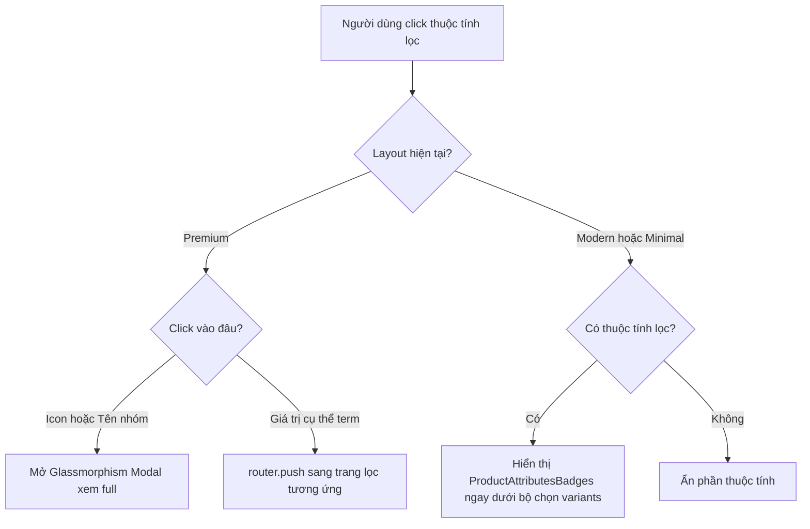

# I. Primer

## 1. TL;DR kiểu Feynman
* **Vấn đề 1 (Premium Layout)**: Khi click vào thuộc tính (attribute) ở dải ngang phía dưới của giao diện Premium, nó luôn mở ra khung xem đầy đủ chữ (modal) chứ không đưa khách hàng đến trang lọc sản phẩm tương ứng. Giao diện Classic thì hoạt động hoàn toàn đúng.
  * *Giải pháp*: Tách biệt thao tác click. Click vào Icon hoặc Tiêu đề nhóm -> Hiện modal phóng to chữ. Click vào từng giá trị (term) cụ thể -> Dẫn link điều hướng tới trang lọc sản phẩm (Filter page) y hệt Classic.
* **Vấn đề 2 (Modern & Minimal Layouts)**: Thuộc tính lọc sản phẩm (Attributes) chỉ xuất hiện ở màn hình xem trước (preview) chứ ngoài trang web thực tế thì hoàn toàn bị ẩn đi.
  * *Giải pháp*: Do trang web thực tế chưa truyền dữ liệu thuộc tính (`productAttributesMap`, `productTypeId`) vào hai giao diện Modern và Minimal, đồng thời bản thân hai giao diện này cũng thiếu khối hiển thị (JSX) dành cho thuộc tính. Ta sẽ truyền dữ liệu đầy đủ và thêm khối hiển thị tương ứng ngay dưới bộ chọn biến thể (Variant Selector).

## 2. Elaboration & Self-Explanation
* **Vì sao Premium bị lỗi điều hướng?**
  Trong code hiện tại của Premium layout, toàn bộ khối thuộc tính được bọc bởi sự kiện `onClick` mở modal xem full. Do đó, dù người dùng cố tình click vào chữ của một giá trị cụ thể, trình duyệt vẫn kích hoạt sự kiện mở modal của khối cha thay vì chuyển trang. Chúng ta cần xóa bỏ `onClick` ở khối cha, chỉ gắn sự kiện mở modal vào phần Icon và Tiêu đề nhóm. Đối với phần giá trị, ta sẽ bóc tách chuỗi chữ thô thành các thẻ `` riêng biệt đại diện cho từng giá trị (term) và gắn sự kiện click điều hướng bằng `router.push` tương tự như Classic.
* **Vì sao Modern & Minimal ở trang thực bị ẩn thuộc tính?**
  Khi xem trước (preview), hệ thống truyền dữ liệu demo (`demoAttributes`) và render trực tiếp qua `<PreviewAttributesBadges>`. Nhưng ở trang thực, container `ProductDetailPage` khi hiển thị ModernStyle và MinimalStyle lại quên không truyền prop `productAttributesMap` và `productTypeId`. Đồng thời, hai Style này trên trang thực cũng chưa hề khai báo destructure props và chưa gọi `<ProductAttributesBadges>` để vẽ giao diện. Chúng ta sẽ khắc phục bằng cách bổ sung đồng bộ ở cả nơi truyền (container) và nơi nhận (ModernStyle / MinimalStyle).

## 3. Concrete Examples & Analogies
* **Ví dụ cụ thể**: 
  Sản phẩm có thuộc tính "Dung tích: 10ml, 50ml, 100ml".
  * *Premium cũ*: Ấn vào bất kỳ đâu ("Dung tích", icon cái chai, hay chữ "10ml") đều hiện popup Glassmorphism nói rằng "Dung tích: 10ml, 50ml, 100ml".
  * *Premium mới*: 
    * Ấn vào icon cái chai hoặc chữ "DUNG TÍCH" -> Hiện popup Glassmorphism.
    * Ấn vào chữ "10ml" -> Chuyển hướng trình duyệt đến trang `/tinh-dau/dung-tich/10ml` để lọc toàn bộ tinh dầu dung tích 10ml.
* **Ví dụ đời thường**: 
  Nó giống như một menu giấy trong nhà hàng. Phiên bản cũ chỉ cho phép bạn chỉ tay vào cả dòng "Nước ngọt: Coca, Pepsi" và người phục vụ sẽ giải thích "đây là nước ngọt". Phiên bản mới cho phép bạn chỉ tay vào chữ "Coca" thì người phục vụ mang đúng lon Coca ra (chuyển hướng lọc), còn nếu chỉ tay vào tiêu đề "Nước ngọt" thì họ mới giải thích định nghĩa nhóm nước ngọt đó.

---

# II. Audit Summary (Tóm tắt kiểm tra)
* **Tệp tin kiểm tra**: [ProductDetailPage.tsx](file:///e:/NextJS/job/job_from_system_vietadmin/system_thienkim/app/%28site%29/_components/details/ProductDetailPage.tsx)
* **Kết quả kiểm tra**:
  1. Dòng 1010-1067: `PremiumStyle` nhận dữ liệu thật `productAttributesMap` và `productTypeId` thành công.
  2. Dòng 1126-1178 và 1181-1233: `ModernStyle` và `MinimalStyle` hoàn toàn thiếu hai props `productAttributesMap` và `productTypeId`.
  3. Dòng 3475 (`ModernStyle`) và Dòng 4128 (`MinimalStyle`): Không destructure `productAttributesMap` và `productTypeId` trong tham số đầu vào. Đồng thời hoàn toàn thiếu component `<ProductAttributesBadges>` để vẽ các huy hiệu thuộc tính.
  4. Dòng 3249 và 3293 (`PremiumStyle`): Đang bọc cứng `onClick={() => setActiveAttrModal(...)}` cho toàn bộ dải, làm mất khả năng tương tác của từng giá trị term riêng lẻ.

---

# III. Root Cause & Counter-Hypothesis (Nguyên nhân gốc & Giả thuyết đối chứng)
* **Root Cause 1 (Premium Layout navigation)**: Sự kiện `onClick` mở modal được đăng ký ở cấp độ container cha của từng thẻ thuộc tính, nuốt chửng các tương tác của con. Đồng thời, các giá trị thuộc tính chỉ được nối chuỗi thô (`valuesStr`) thay vì render thành các phần tử tương tác độc lập.
* **Root Cause 2 (Modern & Minimal Layout visibility)**: Sự bất đồng bộ (decoupling) giữa code Preview và trang thực. Code Preview được cập nhật render attributes qua prop `demoAttributes`, nhưng trang thực sử dụng dữ liệu từ database thông qua `productAttributesMap` lại chưa được nối dây (wiring) dữ liệu và chưa có khối render JSX.
* **Giả thuyết đối chứng (Counter-Hypothesis)**: Nếu chỉ thêm render thuộc tính vào Modern/Minimal mà không truyền props từ container của trang thực, thuộc tính vẫn sẽ ẩn. Do đó việc truyền prop và nhận prop là hai hành động song song bắt buộc.

---

# IV. Proposal (Đề xuất)

### 1. Nối dây truyền dữ liệu trong container ProductDetailPage
* Truyền `productAttributesMap` và `productTypeId` vào `<ModernStyle>` và `<MinimalStyle>`.

### 2. Định nghĩa Props nhận và Render tại ModernStyle & MinimalStyle
* Thêm hai props vào destructured parameters.
* Render `<ProductAttributesBadges>` ngay dưới Variant Selector.

### 3. Tái cấu trúc cấu trúc click thuộc tính của PremiumStyle
* Khai báo `const router = useRouter();` trong `PremiumStyle`.
* Tạo helper `handleShowModal` để mở Glassmorphism popup.
* Loại bỏ `onClick` tổng ở khối bao ngoài. Gắn `onClick={handleShowModal}` vào Icon và Group Name.
* Lặp qua `groupItem.terms` để render các `` tương tác riêng biệt, gọi điều hướng giống như Classic layout.

---

# V. Files Impacted (Tệp bị ảnh hưởng)
* **Sửa**: [ProductDetailPage.tsx](file:///e:/NextJS/job/job_from_system_vietadmin/system_thienkim/app/%28site%29/_components/details/ProductDetailPage.tsx)
  * Vai trò hiện tại: Trang chi tiết sản phẩm phía client, chứa logic xử lý chính và định nghĩa 4 Style giao diện (Classic, Modern, Minimal, Premium).
  * Thay đổi: Nối dây truyền dữ liệu cho Modern/Minimal; tích hợp component hiển thị badge thuộc tính lọc cho Modern/Minimal; cấu trúc lại click dải thuộc tính Premium điều hướng sang bộ lọc hoặc mở modal.

---

# VI. Execution Preview (Xem trước thực thi)
1. **Bước 1**: Cập nhật container `ProductDetailPage` truyền `productAttributesMap` và `productTypeId` cho `<ModernStyle>` (dòng ~1178) và `<MinimalStyle>` (dòng ~1233).
2. **Bước 2**: Sửa tham số nhận prop của `function ModernStyle` (dòng 3475) và `function MinimalStyle` (dòng 4128) để destructure hai biến này.
3. **Bước 3**: Chèn khối JSX hiển thị `<ProductAttributesBadges>` ngay bên dưới `<VariantSelector>` trong `ModernStyle` và `MinimalStyle`.
4. **Bước 4**: Thêm `const router = useRouter();` vào `PremiumStyle` (dòng ~2599). Cập nhật `PremiumStyleProps` để khai báo thêm `enableProductTypes` và `productTypeSlugMap` dưới dạng optional.
5. **Bước 5**: Sửa khối render thuộc tính trong `PremiumStyle`: gỡ bỏ `onClick` ở thẻ bọc ngoài, chèn `onClick` mở modal vào Icon và Group Name, lặp qua `terms` để sinh liên kết điều hướng bằng `router.push`.
6. **Bước 6**: Truyền thêm `enableProductTypes` và `productTypeSlugMap` vào `<PremiumStyle>` tại container.

---

# VII. Verification Plan (Kế hoạch kiểm chứng)
* **Tự kiểm tra Static (Static Review)**:
  * Sử dụng kiểm tra kiểu TypeScript để đảm bảo không lỗi kiểu (Typecheck pass 100%).
  * Đảm bảo tất cả các thẻ mở/đóng HTML/JSX đều đồng bộ, không phá hỏng giao diện Premium, Modern và Minimal.

---

# VIII. Todo
- [ ] Cập nhật interface `PremiumStyleProps` để hỗ trợ các prop `enableProductTypes` và `productTypeSlugMap`.
- [ ] Cập nhật phần gọi `<PremiumStyle>` trong container trang thực truyền đầy đủ `enableProductTypes` và `productTypeSlugMap`.
- [ ] Cấu trúc lại tương tác click thuộc tính trong `PremiumStyle` (Dữ liệu thực): tách biệt click Icon/Title mở modal, và click từng term chuyển hướng tới filter.
- [ ] Cập nhật phần gọi `<ModernStyle>` và `<MinimalStyle>` trong container trang thực truyền `productAttributesMap` và `productTypeId`.
- [ ] Sửa tham số destructured props của `ModernStyle` và `MinimalStyle` để nhận hai biến trên.
- [ ] Thêm JSX hiển thị `<ProductAttributesBadges>` vào dưới `<VariantSelector>` trong cả `ModernStyle` và `MinimalStyle`.
- [ ] Thực hiện Typecheck dự án để đảm bảo an toàn tuyệt đối.
- [ ] Phát âm thanh báo Done khi kết thúc.

---

# IX. Acceptance Criteria (Tiêu chí chấp nhận)
* **Giao diện Premium**: 
  * Click vào Icon thuộc tính hoặc Tiêu đề nhóm -> Mở modal Glassmorphism xem đầy đủ thuộc tính một cách chính xác.
  * Click vào từng giá trị (term) cụ thể -> Trình duyệt điều hướng mượt mà sang trang lọc tương ứng (`router.push` giống Classic).
* **Giao diện Modern và Minimal (Trang thực)**:
  * Hiển thị đầy đủ dải huy hiệu thuộc tính lọc (Attributes Badges) ngay bên dưới bộ chọn biến thể (Variant Selector) nếu sản phẩm có gán thuộc tính lọc.
* **Chất lượng code**:
  * Typecheck không có bất kỳ lỗi compile nào liên quan đến props truyền nhận hay định dạng kiểu dữ liệu.

---

# X. Risk / Rollback (Rủi ro / Hoàn tác)
* **Rủi ro**: Lỗi TypeScript do kiểu prop không khớp hoặc import thiếu `useRouter` trong Style component.
* **Hoàn tác**: Sử dụng `git checkout` khôi phục lại trạng thái ban đầu của file `ProductDetailPage.tsx` rất đơn giản vì chỉ thay đổi cục bộ một file duy nhất.

---

# XI. Out of Scope (Ngoài phạm vi)
* Thay đổi cơ chế filter ở trang danh sách sản phẩm.
* Thay đổi cấu trúc Schema Convex hoặc cơ sở dữ liệu.
