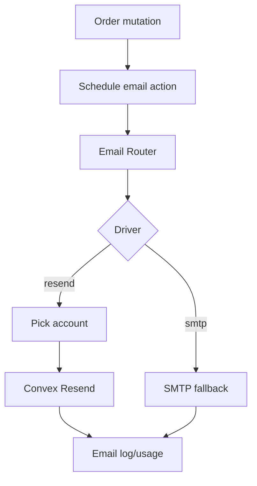
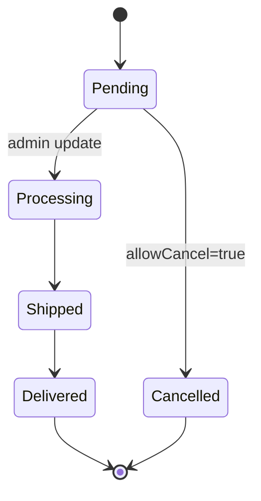

# I. Primer

## 1. TL;DR kiểu Feynman

- Ta sẽ thêm một lớp **Email Service (dịch vụ email)** thật mỏng: code order chỉ gọi `sendOrderEmail(...)`, còn bên trong tự chọn SMTP hay Resend.
- `/system/integrations` sẽ cho dev cấu hình **1 hoặc nhiều Resend account/API key**; hệ thống chọn account còn quota để gửi, tránh đụng trần free tier đã cấu hình.
- Khi khách đặt hàng thành công, shop và khách nhận email xác nhận; khi đơn giao thành công, khách/shop nhận email trạng thái.
- Trang thank-you phải nói rõ: nếu muốn **theo dõi hoặc hủy đơn**, khách nên kích hoạt/tạo tài khoản; nút hủy chỉ có khi trạng thái đơn còn `allowCancel` theo cấu hình **Cấu hình cửa hàng → Trạng thái đơn**.
- Admin sửa khách hàng ở `/admin/customers/[id]/edit` phải dùng cùng kiểu địa chỉ với checkout: `text`, `2-level`, hoặc `3-level`, để dữ liệu không lệch.

## 2. Elaboration & Self-Explanation

Hiện tại hệ thống đã có SMTP trong `/system/integrations`, OTP khách hàng dùng `convex/email.ts` với `nodemailer`, và order flow tạo notification nội bộ trong `convex/orders.ts`. Nhưng chưa có abstraction chung để gửi email order qua Resend, chưa có điều phối nhiều API key, và email order chưa được gắn vào mutation bằng scheduler/action.

Convex Resend Component chính thức phù hợp vì nó có queue, batch, retry, rate limiting, idempotency và test mode. Tuy nhiên quota Resend free tier là quota phía Resend: **100 emails/day, 3.000 emails/month**, nhiều `To/CC/BCC` tính riêng từng recipient, rate limit mặc định **5 requests/second per team**. Vì vậy nếu dev nhập nhiều Resend account, ta cần tự lưu quota usage đơn giản để chọn account còn quota, không random mù.

Về địa chỉ, checkout đang đọc `orders.addressFormat` và có UI 2 cấp/3 cấp, nhưng customer edit chỉ có `address` + `city` text. Nếu checkout bắt khách chọn tỉnh/quận/phường mà admin customer lại sửa text tự do thì dữ liệu khách và dữ liệu đơn sẽ lệch. Cần dùng chung component/logic địa chỉ.

## 3. Concrete Examples & Analogies

- **Ví dụ email:** Dev nhập 2 Resend account trong `/system/integrations`, mỗi account free mặc định `100/day`. Hôm nay account A đã gửi 100 recipient, account B mới gửi 20; đơn hàng mới sẽ dùng account B. Nếu cả hai hết quota, hệ thống không làm fail đặt hàng mà ghi email pending/failed và báo nội bộ.
- **Ví dụ hủy đơn:** Khách đặt hàng xong ở `/checkout/thank-you?...`, thấy card: “Muốn theo dõi/hủy đơn? Kích hoạt tài khoản.” Sau khi tạo mật khẩu, vào `/account/orders`; nút **Hủy đơn** chỉ hiện nếu status hiện tại có `allowCancel=true` trong tab **Trạng thái đơn**.
- **Analogy:** Order mutation giống quầy thu ngân; không nên bắt quầy thu ngân tự chạy đi gửi thư. Nó chỉ tạo phiếu “cần gửi email”, còn Email Service là bưu cục tự chọn tài khoản Resend phù hợp để giao thư.

# II. Audit Summary (Tóm tắt kiểm tra)

## 1. Documentation evidence

- Convex Resend Component chính thức: `@convex-dev/resend`, cài bằng `npm install @convex-dev/resend`, cấu hình `app.use(resend)` trong `convex/convex.config.ts`, dùng `new Resend(components.resend, options)` và `sendEmail()` để queue email.
- Component hỗ trợ queued/batched delivery, retry, rate limiting, Resend idempotency keys, webhook, status/cancel email, và mặc định `testMode: true`.
- Resend official quotas: Free account có **100 emails/day**, **3.000 emails/month**; sent + inbound đều tính quota; nhiều recipients trong `To/CC/BCC` tính riêng; rate limit mặc định **5 req/sec per team**.

## 2. Repo evidence

| Khu vực | Evidence | Nhận xét |
|---|---|---|
| Integrations hiện tại | `app/system/integrations/page.tsx` | SMTP-only, keys `mail_*`, test email qua Next route. |
| Test email hiện tại | `app/api/system/integrations/test-email/route.ts` | Dùng `nodemailer`, chưa hỗ trợ Resend. |
| OTP email | `convex/email.ts` | `sendOtpEmail` dùng SMTP/nodemailer; nên đi qua Email Service mới để Resend cũng gửi OTP được. |
| Order placed | `convex/orders.ts:placeOrder` | Tạo order + notification nội bộ; chưa schedule email. |
| Order status update | `convex/orders.ts:update`, `updateStatus`, `updatePaymentStatus` | Chưa so sánh old/new để gửi email delivered/cancelled đúng một lần. |
| Resend package | `package.json` | Có `nodemailer`, chưa có `@convex-dev/resend`. |
| Convex config | `convex/convex.config.ts` | Chưa `app.use(resend)`. |
| Customer address | `convex/schema.ts:customers` | Chỉ có `address?: string`, `city?: string`; chưa có structured address. |
| Customer edit | `app/admin/customers/[id]/edit/page.tsx` | Form tự do `address/city`, chưa ăn theo `orders.addressFormat`. |
| Checkout address | `app/(site)/checkout/page.tsx` | Có address format `text/2-level/3-level`, gửi order bằng `shippingAddress` string. |
| Cancel config | `OrderStatusesEditor.tsx`, `lib/orders/statuses.ts` | Có `allowCancel` trên từng status. |
| Customer cancel | `app/(site)/account/orders/page.tsx` | UI hiển thị nút hủy theo `allowCancel`, nhưng đang gọi `api.orders.cancel`. |
| Backend cancel | `convex/orders.ts:cancel`, `cancelByCustomer` | `cancel` không kiểm ownership; `cancelByCustomer` còn check hardcode `pending/confirmed`, chưa dùng `allowCancel`. |
| Thank-you claim | `app/(site)/checkout/thank-you/page.tsx` | Đã có claim banner, nhưng cần bổ sung copy theo dõi/hủy đơn và tránh dùng `passwordHash` từ public customer query. |

# III. Root Cause & Counter-Hypothesis (Nguyên nhân gốc & Giả thuyết đối chứng)

## 1. Root Cause Confidence (Độ tin cậy nguyên nhân gốc)

**High.** Email order hiện chưa có abstraction/hook, integrations chỉ SMTP, order mutations chỉ tạo notification nội bộ. Customer address lệch vì checkout có structured address theo module setting nhưng customer edit/schema chỉ string. Cancel flow có UI theo `allowCancel` nhưng backend customer cancel chưa thống nhất theo `allowCancel` và ownership.

## 2. Counter-Hypothesis

- **“Chỉ cần gọi Resend trực tiếp trong `placeOrder`.”** Không nên: Convex mutation không nên gọi network; gửi email phải qua action/scheduler để order không fail vì email.
- **“Chỉ lưu địa chỉ string là đủ.”** Không đủ nếu cần prefill/sửa đúng 2 cấp/3 cấp; string không thể parse ngược ổn định.
- **“Nhiều API key cùng Resend team sẽ tăng quota.”** Sai theo docs: rate limit scope theo team; nhiều key cùng team chia sẻ pool. Pool nhiều account chỉ hợp lệ khi dev cấu hình quota riêng và dùng đúng điều khoản Resend.

# IV. Proposal (Đề xuất)

## 1. Email abstraction đơn giản

Tạo một lớp `Email Service` trong Convex:

### a) Settings trong `/system/integrations`

Giữ backward compatible SMTP, thêm Resend:

- `mail_driver`: `smtp | resend`
- `mail_from_email`, `mail_from_name`
- `order_notification_emails`: danh sách email chủ shop nhận thông báo đơn.
- `resend_accounts`: JSON hoặc UI list đơn giản:
  - `id`
  - `label`
  - `apiKey` / masked API key
  - `fromEmail` / `fromName` override tùy account
  - `enabled`
  - `dailyLimit` mặc định `100`
  - `monthlyLimit` mặc định `3000`
  - `testMode` mặc định an toàn là `true`, dev tắt khi production.
- UI nhắc rõ: nhiều API key cùng một Resend team **không tăng quota**; quota free tier là theo account/team.

### b) Convex Resend setup

- Cài `@convex-dev/resend`.
- Sửa `convex/convex.config.ts`: `app.use(resend)`.
- Tạo `convex/email.ts` hoặc tách `convex/email/service.ts`:
  - `sendTransactionalEmail` action/internalAction.
  - Nếu driver `resend`: chọn account còn quota rồi `new Resend(components.resend, { apiKey, testMode }).sendEmail(...)`.
  - Nếu driver `smtp`: giữ logic nodemailer hiện tại.
- Webhook Resend để tracking là optional phase 2; spec này ưu tiên gửi order/OTP ổn định trước.

### c) Quota/account routing

Thêm bảng/counter tối thiểu:

- `emailProviderUsageDaily`: `accountId`, `dateKey`, `recipientCount`, index `by_account_date`.
- `emailProviderUsageMonthly`: `accountId`, `monthKey`, `recipientCount`, index `by_account_month`.
- `emailDispatchLogs`: `eventType`, `orderId?`, `recipient`, `provider`, `accountId`, `status`, `emailId?`, `idempotencyKey`, `createdAt`.

Routing:

1. Tính `recipientCount` theo số email thực tế nhận.
2. Lọc account `enabled` và dưới `dailyLimit/monthlyLimit`.
3. Chọn account ít dùng nhất trong ngày hoặc round-robin deterministic.
4. Reserve/increment usage trước khi enqueue để tránh vượt quota do concurrency.
5. Nếu send action fail trước khi enqueue, rollback hoặc ghi `failed` và giảm reservation nếu thiết kế đơn giản cho phép.
6. Nếu hết quota: không block order; ghi log `skipped_quota_exhausted` và tạo notification nội bộ.

## 2. Email events trong order flow

### a) Khi đặt hàng thành công

Sau `OrdersModel.create` và notification nội bộ trong `placeOrder`:

- Schedule `sendOrderPlacedEmails`.
- Gửi cho khách:
  - Mã đơn, tổng tiền, danh sách sản phẩm, phương thức thanh toán/vận chuyển, link tra cứu/kích hoạt tài khoản.
- Gửi cho chủ shop:
  - Mã đơn, khách, SĐT/email, địa chỉ, tổng tiền, link admin order.

Email failure không làm fail order.

### b) Khi đơn giao thành công

Trong `update` / `updateStatus`:

- Load old order trước patch.
- Patch status.
- Nếu status mới là “delivered/success” và status cũ khác:
  - Schedule `sendOrderDeliveredEmails`.
- Xác định delivered status theo thứ tự an toàn:
  1. Setting explicit trong future config nếu có.
  2. Status config `isFinal=true` và key/label không chứa `cancel`, `refund`, `hủy`.
  3. Fallback key `Delivered`.

### c) Khi hủy đơn

- Khi customer/admin hủy thành công, schedule `sendOrderCancelledEmails` cho khách + shop.
- Không gửi trùng nếu status không đổi.

## 3. Thank-you page: nhắc tạo tài khoản để theo dõi/hủy đơn

Bổ sung yêu cầu mới của user:

- Card trên `/checkout/thank-you?...` phải ghi rõ:
  - `Muốn theo dõi hoặc hủy đơn? Hãy kích hoạt tài khoản bằng email/SĐT vừa đặt hàng.`
  - `Nút hủy chỉ xuất hiện khi đơn còn ở trạng thái cho phép hủy theo Cấu hình cửa hàng → Trạng thái đơn.`
- Nếu order status hiện tại có `allowCancel=true`, copy nên là:
  - `Đơn hiện còn có thể hủy trực tuyến sau khi bạn kích hoạt tài khoản.`
- Nếu `allowCancel=false`, copy nên là:
  - `Đơn hiện không còn ở bước cho hủy trực tuyến; vui lòng liên hệ shop nếu cần hỗ trợ.`
- CTA:
  - `Kích hoạt tài khoản để theo dõi/hủy đơn`
  - Link nên có `redirectTo=/account/orders?orderId=<id>` để sau khi claim/login xong về đúng đơn.
- Không dùng `customerDoc.passwordHash` ở frontend/public query. Thay bằng query an toàn kiểu `api.auth.getCustomerClaimStateByOrder({ orderId })` hoặc backend trả `canClaimAccount` mà không expose hash.

## 4. Cancel flow phải bám cấu hình Trạng thái đơn

Hiện có `allowCancel` trong status config và UI account orders đã đọc nó. Cần backend thống nhất:

- Thêm mutation customer-safe: `cancelOwnOrder({ token, orderId })` hoặc dùng session token hiện có để xác minh customer.
- Không dùng `api.orders.cancel` public cho customer UI nếu mutation này không kiểm ownership.
- `cancelOwnOrder`:
  1. Verify customer session token.
  2. Load order, check `order.customerId === session.customerId`.
  3. Load `getOrderStatusSettings`.
  4. Chỉ cho hủy nếu current status config có `allowCancel=true`.
  5. Patch sang cancelled status.
  6. Hoàn kho nếu đang áp dụng stock check.
  7. Schedule cancelled email.
- Cập nhật `cancelByCustomer` nếu còn dùng tra cứu bằng SĐT: bỏ hardcode `pending/confirmed`, dùng `allowCancel`.

## 5. Customer address parity với checkout

### a) Schema structured address

Thêm fields optional vào `customers`:

- `addressFormat?: 'text' | '2-level' | '3-level'`
- `addressDetail?: string`
- `provinceCode?: string`, `provinceName?: string`
- `districtCode?: string`, `districtName?: string`
- `wardCode?: string`, `wardName?: string`

Giữ `address` và `city` để backward compatible/search/display.

### b) Checkout gửi structured address

- Khi `addressFormat='text'`: lưu `address` text như hiện tại.
- Khi `2-level/3-level`: gửi thêm object `customerAddress` vào `placeOrder`:
  - `format`, `detail`, `province`, `district?`, `ward`.
- `placeOrder` patch customer bằng structured fields và compose `address` string cho legacy display.
- `shippingAddress` của order vẫn là snapshot string để giữ lịch sử đơn không bị thay đổi khi customer sửa địa chỉ sau này.

### c) Customer edit dùng cùng format

- `app/admin/customers/[id]/edit/page.tsx` đọc `orders.addressFormat`.
- Render component địa chỉ chung với checkout:
  - `text`: input text.
  - `2-level`: Province + Ward + Detail.
  - `3-level`: Province + District + Ward + Detail.
- Nếu customer cũ chỉ có string address, hiển thị legacy trong text fallback; không cố parse tự động.

# V. Files Impacted (Tệp bị ảnh hưởng)

## 1. Dependencies / Convex component

- `Sửa: package.json`  
  Thêm `@convex-dev/resend`.

- `Sửa: convex/convex.config.ts`  
  Import và `app.use(resend)`.

## 2. Email service / schema

- `Sửa: convex/schema.ts`  
  Thêm bảng usage/log email và structured customer address fields.

- `Sửa: convex/email.ts`  
  Tách abstraction gửi email, route SMTP/Resend, dùng Resend component, giữ OTP hiện tại chạy qua service mới.

- `Thêm/Sửa: convex/emailTemplates.ts` hoặc helper tương đương  
  Template HTML đơn giản cho order placed/delivered/cancelled/OTP.

## 3. Integrations UI

- `Sửa: app/system/integrations/page.tsx`  
  Thêm mode Resend, list account/API key, quota defaults, order notification emails, masked secret UI, test send theo driver.

- `Sửa: app/api/system/integrations/test-email/route.ts`  
  Hỗ trợ Resend hoặc chuyển sang gọi Convex email action để tránh duplicate logic.

## 4. Orders / cancel / thank-you

- `Sửa: convex/orders.ts`  
  Schedule order emails, compare status transitions, customer-safe cancel, customer address structured patch, delivered/cancelled email hooks.

- `Sửa: app/(site)/checkout/page.tsx`  
  Gửi structured address object theo `addressFormat`; không bắt login.

- `Sửa: app/(site)/checkout/thank-you/page.tsx`  
  Bổ sung copy theo dõi/hủy đơn, CTA redirect after claim, không đọc/expose `passwordHash`.

- `Sửa: app/(site)/account/orders/page.tsx`  
  Dùng customer-safe cancel mutation và giữ nút hủy theo `allowCancel`.

## 5. Customer admin

- `Sửa: app/admin/customers/[id]/edit/page.tsx`  
  Dùng address UI theo `orders.addressFormat`, lưu structured fields và legacy display string.

- `Sửa: convex/customers.ts`  
  Update validator/mutation/query trả structured address fields an toàn.

## 6. Shared UI/helper

- `Thêm: components/address/AddressFields.tsx` hoặc vị trí phù hợp  
  Dùng lại cho checkout và customer edit.

- `Thêm: lib/address/format.ts`  
  Helper compose address string, normalize address payload.

# VI. Execution Preview (Xem trước thực thi)

1. Đọc lại latest files vì nhiều file đã được sửa ngoài session.
2. Thêm dependency/config Convex Resend.
3. Thêm schema email usage/log + customer structured address.
4. Implement Email Service mỏng: SMTP hiện tại + Resend router + quota selection.
5. Cập nhật `/system/integrations` để cấu hình Resend accounts và test send.
6. Hook email vào `placeOrder`, status delivered, cancelled.
7. Sửa cancel backend để dùng `allowCancel` + ownership.
8. Cập nhật thank-you copy/CTA tạo tài khoản để theo dõi/hủy đơn.
9. Tách/shared address fields và áp dụng vào checkout + customer edit.
10. Static review: không làm checkout bắt login, không log secrets, không gửi email duplicate.

# VII. Verification Plan (Kế hoạch kiểm chứng)

- **Email config:** cấu hình SMTP vẫn gửi test được; cấu hình Resend 1 account gửi test được; nhiều account chọn account còn quota.
- **Quota:** account đạt `dailyLimit` không được chọn nữa; nhiều recipients tính đúng số lượng.
- **Order placed:** đặt hàng guest vẫn thành công dù email fail; email khách/shop được log/scheduled.
- **Delivered:** đổi status sang delivered/success gửi email đúng một lần; save lại order không gửi trùng.
- **Cancel:** nút hủy chỉ hiện khi `allowCancel=true`; backend cũng chặn nếu không allow; customer không hủy được đơn của người khác.
- **Thank-you:** guest thấy CTA “kích hoạt tài khoản để theo dõi/hủy đơn” và copy giải thích rule hủy theo Trạng thái đơn.
- **Address parity:** đổi `orders.addressFormat` sang text/2-level/3-level thì checkout và admin customer edit hiển thị cùng kiểu; customer lưu lại không lệch với format.
- **Validation:** theo rule repo, ưu tiên static review kỹ; khi implementation nếu chạy validator thì giới hạn output, không tự chạy lint/unit test nếu rule dự án vẫn cấm.

# VIII. Todo

- [ ] Thêm Convex Resend dependency/config.
- [ ] Thiết kế settings Resend accounts trong `/system/integrations`.
- [ ] Thêm schema usage/log email và structured customer address.
- [ ] Implement Email Service SMTP/Resend + quota router.
- [ ] Hook order placed/delivered/cancelled emails.
- [ ] Sửa thank-you CTA/copy theo dõi/hủy đơn + redirect claim.
- [ ] Sửa cancel flow dùng `allowCancel` + ownership.
- [ ] Đồng bộ address UI checkout và customer edit.
- [ ] Static review secrets/quota/guest checkout/no duplicate.

# IX. Acceptance Criteria (Tiêu chí chấp nhận)

- Dev chỉ cần vào `/system/integrations`, nhập 1 hoặc nhiều Resend account/API key, from email/name, email chủ shop là order email hoạt động.
- Nếu nhiều Resend accounts, hệ thống chọn account còn quota theo `dailyLimit/monthlyLimit`; không vượt configured quota khi còn lựa chọn khác.
- Nếu email provider lỗi/hết quota, đặt hàng vẫn thành công và có log/notification để xử lý.
- Khách và chủ shop nhận email khi đặt hàng; khách/shop nhận email khi đơn được giao thành công; email không gửi trùng khi save lại.
- Thank-you page cho guest giải thích rõ muốn theo dõi/hủy đơn thì kích hoạt tài khoản; hủy đơn phụ thuộc `allowCancel` trong **Cấu hình cửa hàng → Trạng thái đơn**.
- Customer chỉ hủy được đơn của chính mình; backend không chỉ dựa vào UI.
- Checkout và admin customer edit dùng cùng address format `text/2-level/3-level`; customer data không lệch format với đơn hàng.

# X. Risk / Rollback (Rủi ro / Hoàn tác)

- **Secrets trong DB:** hiện SMTP password cũng lưu trong `settings`; Resend API key nếu lưu tương tự phải mask UI, không log, và có thể chuyển sang env/secrets sau.
- **Quota free-tier:** nhiều API key cùng team không tăng quota; UI cần nhắc dev dùng quota đúng điều khoản Resend.
- **Email duplicate:** cần idempotency key theo `eventType:orderId:recipient` và old/new status compare.
- **Schema structured address:** dữ liệu cũ không parse lại được hoàn hảo; rollback-safe bằng optional fields và giữ legacy `address/city`.
- **Cancel security:** sửa backend cancel có thể thay đổi hành vi hiện tại; cần QA kỹ account orders.
- **Rollback:** revert Resend component/config/email hooks; vì order flow schedule email async nên rollback không ảnh hưởng tạo đơn.

# XI. Out of Scope (Ngoài phạm vi)

- Không làm marketing/bulk campaign.
- Không bắt buộc login trước checkout.
- Không build full Resend webhook dashboard trong phase đầu; webhook tracking có thể làm sau.
- Không tự động migrate/parse toàn bộ địa chỉ cũ sang structured fields.