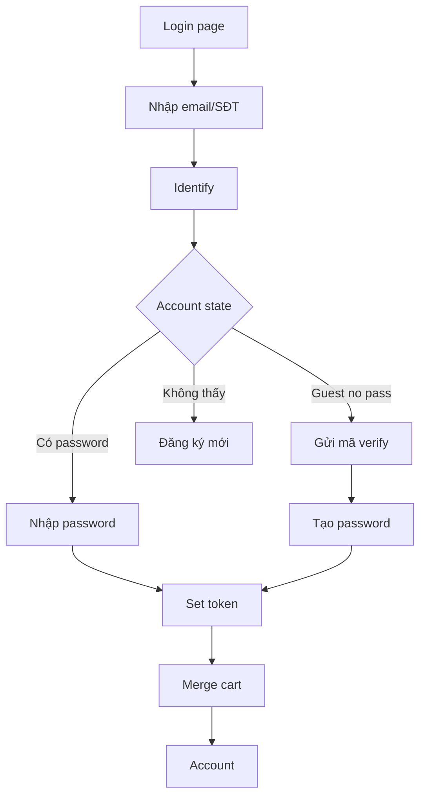
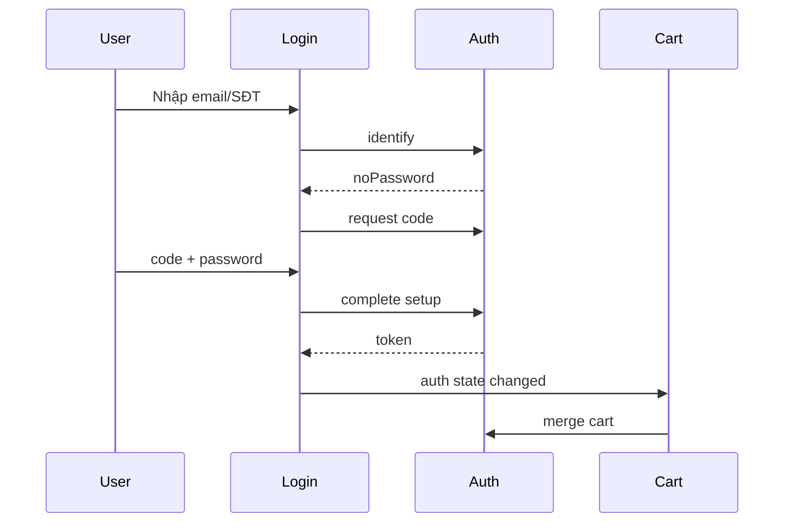

# I. Primer

## 1. TL;DR kiểu Feynman

- Sau khi khách mua hàng vãng lai, **không nên tự đăng nhập ngầm** vì họ chưa xác minh quyền sở hữu email/số điện thoại.
- Flow đúng hơn: cho khách **nhập email hoặc SĐT trước**, hệ thống nhận ra đây là khách từng mua nhưng **chưa có mật khẩu**, rồi hướng dẫn tạo mật khẩu lần đầu.
- Để an toàn, **không được cho tạo mật khẩu chỉ vì biết email/SĐT**; cần mã xác minh email/SĐT hoặc link xác minh.
- Khi tạo mật khẩu thành công, hệ thống tạo session như đăng nhập thật; `CartProvider` hiện đã có merge guest cart sau login nên giữ nguyên nguyên tắc không bắt buộc login khi checkout.
- Mục tiêu UX: mua hàng không bị ngắt quãng, sau mua có CTA “Tạo mật khẩu để theo dõi đơn”, và lần sau chỉ cần bắt đầu bằng email/SĐT.

## 2. Elaboration & Self-Explanation

Hiện tại `orders.placeOrder` tạo hoặc tìm `customers` bằng email/phone khi guest checkout. Customer được tạo từ guest order **không có `passwordHash`**, nên sau này họ vào `/account/login` sẽ bị kẹt: form bắt buộc `email + password`, còn backend `verifyCustomerLogin` trả lỗi generic nếu customer chưa có mật khẩu.

Điều cần sửa không phải là bắt guest phải login trước khi mua. Ngược lại, phải giữ checkout vãng lai mượt. Ta chỉ thêm một “cầu nối” sau mua và ở trang login: khách nhập email/SĐT, hệ thống kiểm tra tài khoản có password chưa. Nếu chưa có, UI nói rõ: “Bạn từng đặt hàng nhưng chưa tạo mật khẩu”, sau đó xác minh và tạo mật khẩu.

## 3. Concrete Examples & Analogies

- **Ví dụ:** Bạn mua giày bằng email `a@gmail.com` nhưng chưa đăng ký. Lần sau bấm “Đăng nhập”, bạn nhập `a@gmail.com`; hệ thống báo “Bạn đã từng mua hàng bằng email này nhưng chưa có mật khẩu. Nhận mã xác minh để tạo mật khẩu lần đầu.” Sau khi nhập mã + mật khẩu mới, bạn vào được `/account/orders` và thấy đơn cũ.
- **Analogy:** Guest order giống như shop đã giữ hồ sơ mua hàng của bạn, nhưng chưa đưa chìa khóa tài khoản. Tạo mật khẩu lần đầu là bước xác minh để shop chắc chắn người cầm chìa khóa đúng là bạn.

# II. Audit Summary (Tóm tắt kiểm tra)

## 1. Evidence hiện tại

- `app/(site)/checkout/page.tsx:285`, `803-818`: checkout đọc `customer` để prefill nếu có, nhưng vẫn gọi `api.orders.placeOrder` bằng form data + `cartId`; không bắt login.
- `convex/orders.ts:788-819`: guest order tìm customer theo email/phone; nếu chưa có thì tạo customer mới **không có `passwordHash`**.
- `convex/schema.ts:210-224`: `customers.passwordHash` là optional, nên “guest customer chưa có mật khẩu” đang được biểu diễn bằng `!passwordHash`.
- `app/(site)/account/login/page.tsx:13-14`, `58-84`: login page hiện chỉ có email + password, password required.
- `convex/auth.ts:573-613`: `verifyCustomerLogin` chỉ nhận email/password, tìm theo email raw, và từ chối nếu không có `passwordHash`.
- `app/(site)/auth/context.tsx:20-21`, `85-105`: auth context chỉ expose `login(email,password)` và `register(...)`; chưa có identifier-first/claim account flow.
- `lib/cart/CartContext.tsx:61-67`, `99-111`: guest session được giữ trong `localStorage`, và sau khi authenticated sẽ gọi `api.cart.mergeCart`.
- `convex/cart.ts:335-428`: merge cart backend đã có logic chuyển/gộp session cart sang customer cart.
- `components/site/Header.tsx:256-258`: header hiển thị “Đăng nhập” khi chưa authenticated; guest checkout xong vẫn logged out là expected theo code hiện tại.

## 2. Vấn đề chính

| ID | Severity | Nhóm | Vấn đề |
|---|---:|---|---|
| A1 | High | UX/Auth | Guest mua hàng xong có customer record nhưng không có password, login page không giải thích cách tạo password lần đầu. |
| A2 | High | Security | Không được set password chỉ bằng email/SĐT; cần verification để tránh account takeover. |
| A3 | Medium | Data/Identity | Email/phone chưa normalize nhất quán giữa checkout, register, login; dễ duplicate hoặc lookup lệch case. |
| A4 | Medium | UX | Register hiện chặn “Email đã tồn tại” dù đó có thể là guest customer chưa có password; nên chuyển sang claim account. |
| A5 | Medium | Cart | Merge cart đã có, nhưng auth success path mới phải reuse cùng token set flow để merge không bị miss. |

# III. Root Cause & Counter-Hypothesis (Nguyên nhân gốc & Giả thuyết đối chứng)

## 1. Root Cause Confidence (Độ tin cậy nguyên nhân gốc)

**High.** Code cho thấy rõ guest checkout tạo customer không password (`convex/orders.ts:811-819`) trong khi login page và `verifyCustomerLogin` bắt password (`account/login/page.tsx:74-84`, `convex/auth.ts:590-592`). Đây là mismatch giữa **guest purchase identity** và **account login credential**.

## 2. Counter-Hypothesis

- **Giả thuyết khác:** “Sau mua nên auto-login luôn.”  
  **Bác bỏ:** Không an toàn vì người nhập email/SĐT trong checkout chưa xác minh quyền sở hữu. Nếu auto-login, ai cũng có thể đặt đơn bằng email người khác và chiếm session.
- **Giả thuyết khác:** “Chỉ cần cho register ghi đè guest customer.”  
  **Bác bỏ:** Nếu không verification/normalize/conflict guard, vẫn có rủi ro chiếm account hoặc merge sai khách.

# IV. Proposal (Đề xuất)

## 1. Quyết định thiết kế

Áp dụng flow **Identifier-first + Guest Claim + Password Setup**:

1. User vào login, chỉ thấy một field đầu tiên: **Email hoặc số điện thoại**.
2. Backend kiểm tra customer theo normalized email/phone.
3. Nếu customer có `passwordHash`: UI chuyển sang bước nhập mật khẩu.
4. Nếu customer tồn tại nhưng chưa có `passwordHash`: UI chuyển sang bước “Tạo mật khẩu lần đầu”, kèm helper text và verification.
5. Nếu không có customer: UI gợi ý tạo tài khoản mới hoặc tiếp tục mua không cần login.
6. Sau khi verify + tạo password thành công: tạo `customerSessions`, lưu token qua `CustomerAuthProvider`, CartProvider tự merge guest cart.

## 2. Verification (Xác minh) để vừa an toàn vừa ít ngắt quãng

- **Best-practice mặc định:** gửi OTP/magic code tới email đã lưu của customer. Số điện thoại chỉ dùng để tìm customer; vì chưa thấy hạ tầng SMS, delivery ưu tiên email.
- OTP có hạn dùng ngắn, ví dụ 10 phút, giới hạn số lần thử, và lưu dạng hash/token hash.
- UI copy rõ:
  - Field 1: `Email hoặc số điện thoại`
  - Helper: `Nếu bạn từng mua hàng nhưng chưa tạo mật khẩu, nhập email/SĐT đã dùng khi đặt hàng. Chúng tôi sẽ giúp bạn tạo mật khẩu lần đầu.`
  - Guest branch: `Bạn đã từng đặt hàng bằng thông tin này nhưng chưa có mật khẩu. Nhập mã xác minh để tạo mật khẩu và xem lại đơn hàng.`

## 3. Post-purchase UX (Sau khi đặt hàng)

- Không auto-login sau thank-you page.
- Thêm CTA phụ ở `/checkout/thank-you`: **“Tạo mật khẩu để theo dõi đơn hàng”**.
- CTA dẫn tới `/account/login?mode=claim` hoặc `/account/login?identifier=...` nếu có thể prefill an toàn; không expose thông tin nhạy cảm trên URL nếu không cần.

## 4. Backend changes

### a) Normalize identifier chung

- Thêm helper trong `convex/auth.ts` hoặc shared helper:
  - `normalizeEmail(email)` → trim + lowercase.
  - `normalizePhone(phone)` → bỏ space/ký tự không cần thiết, chuẩn hóa `0...`/`+84...` nếu phù hợp.
  - `resolveCustomerByIdentifier(ctx, identifier)` → email nếu có `@`, ngược lại phone.

### b) Auth functions mới

- `identifyCustomerAuthState({ identifier })`
  - Rate-limited.
  - Trả state tối thiểu: `requiresPassword`, `requiresPasswordSetup`, `notFound`, kèm masked contact nếu cần.
  - Tránh leak quá nhiều dữ liệu; message UI có thể thân thiện nhưng backend không trả raw profile.

- `requestCustomerPasswordSetup({ identifier })`
  - Chỉ áp dụng customer Active + `!passwordHash`.
  - Tạo challenge record OTP/magic token, expiresAt, attempts.
  - Gửi OTP qua email nếu SMTP/email action có cấu hình.

- `completeCustomerPasswordSetup({ challengeId, code, password })`
  - Verify code còn hạn + attempts.
  - Hash password bằng helper hiện có `hashPassword`.
  - Patch `customers.passwordHash`.
  - Tạo `customerSessions` và trả token như login/register.

- Cập nhật `verifyCustomerLogin`:
  - Nhận `identifier` thay vì chỉ `email`, hoặc thêm function mới giữ backward compatibility.
  - Normalize lookup theo email/phone.
  - Nếu `!passwordHash`, trả code/message riêng để UI chuyển claim flow.

- Cập nhật `registerCustomer`:
  - Normalize email/phone trước khi insert/query.
  - Nếu email/phone match customer guest `!passwordHash`, không báo “Email đã tồn tại”; trả hướng dẫn claim/setup password.
  - Nếu match customer đã có password, báo đăng nhập.

### c) Challenge table

Thêm table mới trong `convex/schema.ts`:

- `customerAuthChallenges`
  - `customerId`
  - `purpose`: `password_setup`
  - `identifierHash` hoặc `targetHash`
  - `codeHash` hoặc `tokenHash`
  - `expiresAt`
  - `attempts`
  - `consumedAt?`
  - indexes: `by_customer_purpose`, `by_expiresAt`

Không đổi schema `customers` nếu chưa cần; `!passwordHash` vẫn là guest/no-password marker để giảm migration.

## 5. Order customer resolution (Tránh merge sai khách)

Cập nhật logic trong `orders.placeOrder`:

- Normalize email/phone trước lookup.
- Nếu đang authenticated, ưu tiên authenticated customerId; không resolve lại theo form gây merge sai.
- Nếu guest:
  - email match + phone match cùng customer → dùng customer đó.
  - chỉ email match hoặc chỉ phone match → dùng customer đó, patch nhẹ name/address; không overwrite phone/email nếu field đó đang thuộc customer khác.
  - email và phone match 2 customers khác nhau → không merge hai khách; tạo order theo email match và không patch phone, hoặc trả message kiểm tra lại thông tin nếu muốn strict. Đề xuất KISS: **email là primary**, không overwrite phone khi conflict, và log/notification nội bộ sau nếu cần.
- Sau khi order tạo, cập nhật `ordersCount/totalSpent` nếu hiện chưa được model xử lý.

## 6. Frontend changes

- `app/(site)/account/login/page.tsx`
  - Chuyển từ form email+password sang multi-step:
    1. Identifier step.
    2. Password step.
    3. Claim/setup password step.
  - Helper text cho khách từng mua.
  - Có link “Tôi chưa có mật khẩu / Tôi từng mua hàng”.

- `app/(site)/auth/context.tsx`
  - Thêm methods: `identify`, `requestPasswordSetup`, `completePasswordSetup`.
  - Tách helper `persistCustomerToken(token)` để login/register/claim đều set token giống nhau.

- `app/(site)/account/register/page.tsx`
  - Nếu backend báo guest no-password, chuyển user sang claim flow thay vì lỗi cứng.

- `app/(site)/checkout/thank-you/page.tsx`
  - Thêm CTA “Tạo mật khẩu để theo dõi đơn hàng”.
  - Không tự đăng nhập và không bắt buộc tạo account.

# V. Files Impacted (Tệp bị ảnh hưởng)

## Auth backend / schema

- `Sửa: convex/schema.ts`  
  Vai trò hiện tại: định nghĩa `customers`, `customerSessions`, cart tables.  
  Thay đổi: thêm `customerAuthChallenges` để lưu OTP/magic challenge an toàn, có expiry/attempts.

- `Sửa: convex/auth.ts`  
  Vai trò hiện tại: register/login/session/logout cho customer.  
  Thay đổi: thêm identifier-first lookup, guest password setup, normalize email/phone, cập nhật register/login để xử lý customer guest chưa password.

## Checkout / order

- `Sửa: convex/orders.ts`  
  Vai trò hiện tại: guest checkout tạo/fetch customer và tạo order.  
  Thay đổi: normalize contact, tránh merge sai email/phone conflict, cập nhật stats nếu cần.

- `Sửa: app/(site)/checkout/thank-you/page.tsx`  
  Vai trò hiện tại: hiển thị order success + bank QR.  
  Thay đổi: thêm CTA tạo mật khẩu/theo dõi đơn, không auto-login.

## Auth UI / context

- `Sửa: app/(site)/auth/context.tsx`  
  Vai trò hiện tại: giữ token và expose login/register/logout.  
  Thay đổi: thêm claim methods và helper lưu token dùng chung để CartProvider merge ổn định.

- `Sửa: app/(site)/account/login/page.tsx`  
  Vai trò hiện tại: form email + password bắt buộc.  
  Thay đổi: multi-step email/SĐT-first, password branch, guest claim branch, helper text.

- `Sửa: app/(site)/account/register/page.tsx`  
  Vai trò hiện tại: tạo customer mới và lỗi nếu email tồn tại.  
  Thay đổi: nếu email/SĐT thuộc guest customer chưa password thì chuyển sang claim/setup thay vì chặn.

## Cart

- `Giữ/Sửa nhẹ: lib/cart/CartContext.tsx`  
  Vai trò hiện tại: tự merge guest cart sau login.  
  Thay đổi: ưu tiên giữ nguyên; chỉ sửa nếu auth success path mới không kích hoạt merge đúng.

# VI. Execution Preview (Xem trước thực thi)

1. Đọc lại Convex generated types sau khi thêm schema để đảm bảo function references đúng.
2. Thêm normalize helpers + challenge table.
3. Implement backend identify/request/complete password setup.
4. Update login/register functions giữ backward compatibility.
5. Update orders customer resolution theo invariant không merge sai.
6. Update CustomerAuthProvider để claim flow set token như login/register.
7. Refactor login page thành multi-step nhẹ, helper text rõ.
8. Thêm CTA ở thank-you page.
9. Static review guest checkout guard: không thêm auth gate vào cart/checkout.

# VII. Verification Plan (Kế hoạch kiểm chứng)

- **Static review bắt buộc:** kiểm tra không có auth gate mới ở cart/checkout; không set password nếu chưa verify; không log token/OTP; normalize email/phone nhất quán.
- **Manual QA bởi tester:**
  1. Guest checkout từ cart vẫn đặt hàng được, không bị ép login.
  2. Thank-you page vẫn show success và có CTA tạo mật khẩu.
  3. Guest customer chưa password nhập email/SĐT ở login → đi vào flow tạo mật khẩu.
  4. Customer đã có password nhập email/SĐT → đi vào password login.
  5. Unknown identifier → không crash, gợi ý tạo tài khoản/mua tiếp.
  6. Sau complete password setup, token được lưu, header đổi sang user menu, `/account/orders` xem được đơn cũ.
  7. Nếu trước khi claim có guest cart mới, sau claim/login cart được merge.
  8. Email uppercase/lowercase và phone có khoảng trắng vẫn resolve đúng.
- **Command policy:** repo instruction cấm tự chạy lint/unit test; nếu cần typecheck thủ công khi implementation, dùng `bunx tsc --noEmit 2>&1 | Select-Object -First 10` theo rule repo hoặc để hook/tester xử lý.

# VIII. Todo

- [ ] Thêm `customerAuthChallenges` vào schema.
- [ ] Thêm normalize email/phone + resolve customer identifier.
- [ ] Thêm `identifyCustomerAuthState`, `requestCustomerPasswordSetup`, `completeCustomerPasswordSetup`.
- [ ] Cập nhật `verifyCustomerLogin` và `registerCustomer` cho guest/no-password branch.
- [ ] Cập nhật `orders.placeOrder` để resolve customer an toàn hơn.
- [ ] Refactor login page thành identifier-first flow.
- [ ] Cập nhật auth context để claim setup lưu token và kích hoạt cart merge.
- [ ] Thêm CTA ở thank-you page.
- [ ] Static review theo guest cart guard.

# IX. Acceptance Criteria (Tiêu chí chấp nhận)

- Guest vẫn mua hàng và checkout từ cart không cần đăng nhập.
- Sau guest checkout, hệ thống không auto-login ngầm.
- Customer guest chưa có password có thể bắt đầu login chỉ bằng email/SĐT và được hướng dẫn tạo mật khẩu lần đầu.
- Không thể tạo mật khẩu chỉ bằng biết email/SĐT nếu chưa qua verification.
- Customer có password cũ vẫn login bình thường.
- Register không chặn cứng guest customer bằng “Email đã tồn tại”; chuyển sang claim/setup.
- Cart merge vẫn chạy sau login/register/claim success.
- Không merge sai khi email/phone có conflict giữa hai customer.
- Helper text rõ ràng, không làm khách thấy checkout bị ép đăng ký.

# X. Risk / Rollback (Rủi ro / Hoàn tác)

- **Rủi ro email delivery:** repo có `nodemailer` dependency nhưng chưa thấy flow gửi OTP sẵn. Nếu SMTP/env chưa có, cần triển khai delivery nhỏ hoặc tạm dùng magic-code dev-only, tuyệt đối không log OTP production.
- **Rủi ro account enumeration:** identifier-first có thể làm lộ tài khoản tồn tại. Giảm bằng rate limit, masked contact, message generic ở một số nhánh.
- **Rủi ro merge sai customer:** email/phone conflict phải không merge silent; email primary + no overwrite phone conflict là hướng rollback-safe.
- **Rollback:** revert schema + auth functions + login UI changes; vì `customers.passwordHash` optional đã có sẵn nên không cần data migration lớn.

# XI. Out of Scope (Ngoài phạm vi)

- Không bắt buộc login trước checkout.
- Không triển khai social login/OAuth.
- Không redesign toàn bộ account dashboard.
- Không thay đổi cấu trúc cart schema ngoài việc đảm bảo merge hiện tại vẫn hoạt động.