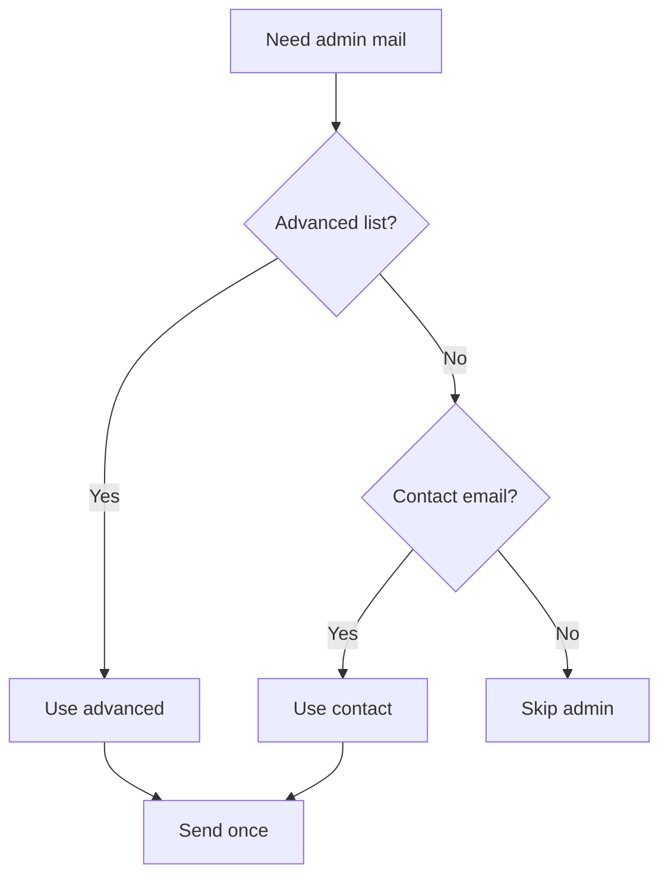
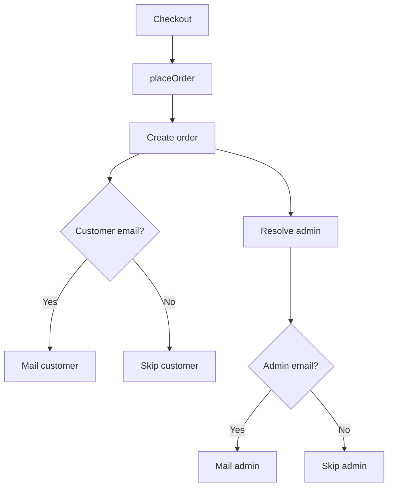

# I. Primer

## 1. TL;DR kiểu Feynman

- Sửa luồng email đơn hàng để **nguồn nhận email admin chính là tab Email ở `/admin/settings/advanced`**.
- Nếu tab Email không có `order_notification_emails`, hệ thống **fallback (dự phòng)** sang `contact_email` ở `/admin/settings/contact`.
- Nếu cả 2 chỗ đều không có email hợp lệ thì **không gửi email admin** để tránh gửi sai/spam.
- Chỉ gửi email tự động thật sự cần: **khách đặt hàng**, **admin nhận đơn mới**, **khách/admin liên quan khi hủy đơn**.
- Không gửi email cho mọi thay đổi trạng thái; bỏ email “đã giao” khỏi auto-flow để tiết kiệm quota Brevo/SMTP.
- Giữ cấu hình SMTP/Brevo hiện tại, không để tab Advanced vô tình ép `mail_driver` về `resend`.

## 2. Elaboration & Self-Explanation

Hiện tại hệ thống đã có service gửi email dùng `convex/email.ts`, và checkout đã gọi `api.orders.placeOrder`. Vấn đề nằm ở nguồn email admin: UI Advanced lưu `order_notification_emails` vào bảng `settings`, nhưng order flow lại đọc từ bảng `moduleSettings`, nên admin nhập email ở `/admin/settings/advanced?tab=email-config` không được dùng đúng.

Hướng sửa là tạo một đường đọc thống nhất trong `convex/orders.ts`: khi cần gửi email admin, đọc `settings.order_notification_emails` trước; nếu trống thì đọc `settings.contact_email`; nếu vẫn trống thì skip. Đồng thời siết lại policy gửi email để không spam: mỗi sự kiện quan trọng chỉ gửi tối đa một lần nhờ idempotency hiện có trong `emailDispatchLogs`.

## 3. Concrete Examples & Analogies

Ví dụ cụ thể:

- Advanced Email có `order_notification_emails = admin@shop.com`, Contact có `contact_email = hello@shop.com`:
  - Khách đặt đơn: gửi khách + `admin@shop.com`.
- Advanced Email trống, Contact có `hello@shop.com`:
  - Khách đặt đơn: gửi khách + `hello@shop.com`.
- Advanced Email trống, Contact cũng trống:
  - Khách đặt đơn: chỉ gửi khách, không gửi admin.
- Admin đổi trạng thái đơn sang “Đã giao”:
  - Không gửi email để tiết kiệm.
- Khách hủy đơn:
  - Gửi khách xác nhận hủy + gửi admin để biết có đơn bị khách hủy.
- Admin tự hủy đơn:
  - Gửi khách biết đơn bị hủy, không gửi admin vì admin là người thao tác.

Analogy đời thường: email admin giống chuông báo quầy thu ngân. Đơn mới hoặc khách hủy thì cần reo chuông; còn nhân viên tự đổi trạng thái nội bộ thì không cần chuông reo lại cho chính mình.

# II. Audit Summary (Tóm tắt kiểm tra)

- Observation: `/admin/settings/advanced` render từ `app/admin/settings/advanced/page.tsx` và tab email nằm trong `SettingsPageShell`.
- Evidence: `app/admin/settings/_components/SettingsPageShell.tsx:149-159` định nghĩa `order_notification_emails` trong `EMAIL_SETTING_KEYS`.
- Evidence: `app/admin/settings/_components/SettingsPageShell.tsx:864-870` lưu email config vào bảng `settings`, group `mail`.
- Evidence: `convex/orders.ts:1201-1208` đã gửi email xác nhận cho khách khi `placeOrder` thành công.
- Evidence: `convex/orders.ts:1212-1216` hiện đọc email admin từ `moduleSettings`, không phải `settings`.
- Evidence: `convex/email.ts:24-40` email sender đọc cấu hình provider/from từ `api.settings.getMultiple`.
- Evidence: `convex/email.ts:49-57` đã có idempotency theo `orderId:eventType`, giúp chống gửi trùng sau khi đã success.
- Evidence: `lib/modules/configs/settings.config.ts:53` Contact settings có field `contact_email`.

# III. Root Cause & Counter-Hypothesis (Nguyên nhân gốc & Giả thuyết đối chứng)

## 1. Root Cause Confidence (Độ tin cậy nguyên nhân gốc)

**High.** UI Advanced lưu `order_notification_emails` vào `settings`, còn order flow đọc `moduleSettings`; đây là mismatch trực tiếp giữa source-of-truth (nguồn sự thật) của UI và backend.

## 2. Counter-Hypothesis (Giả thuyết đối chứng)

- Có thể admin email được cấu hình ở `/system/integrations`; nhưng trang này cũng lưu `order_notification_emails` vào `settings`, nên order flow vẫn không đọc đúng.
- Có thể email admin vẫn gửi nếu tồn tại legacy `moduleSettings.order_notification_emails`; nhưng field này không có trong `orders.config.ts`, nên không phải đường cấu hình hợp lý hiện tại.
- Có thể lỗi do SMTP/Brevo; nhưng customer email đã dùng `settings`, còn mismatch admin nằm trước tầng gửi SMTP.

# IV. Proposal (Đề xuất)

## 1. Chính sách gửi email mới

| Sự kiện | Khách | Admin | Lý do |
|---|---:|---:|---|
| Đặt hàng thành công | Có, nếu khách có email hợp lệ | Có, theo Advanced → Contact fallback | Cần xác nhận cho khách và báo đơn mới cho shop |
| Khách hủy đơn | Có | Có, theo Advanced → Contact fallback | Admin cần biết đơn bị khách hủy |
| Admin hủy đơn | Có | Không | Admin đã thao tác, không cần tự gửi lại |
| Đơn đã giao / trạng thái final khác | Không | Không | Tiết kiệm email, tránh spam |
| Các trạng thái trung gian | Không | Không | Không cần thiết |
| Gửi thử email | Chỉ khi bấm thủ công | Không áp dụng | Không phải auto-flow |

## 2. Luồng fallback email admin

Ghi chú: `Advanced list` = `settings.order_notification_emails`; `Contact email` = `settings.contact_email`.

## 3. Luồng đặt hàng sau khi sửa

## 4. Chi tiết logic

- Thêm helper trong `convex/orders.ts`:
  - Parse danh sách email từ chuỗi, hỗ trợ phân tách bằng dấu phẩy/chấm phẩy/xuống dòng.
  - Loại email rỗng, email sai format, và email trùng.
  - `resolveOrderNotificationEmails(ctx)` đọc `settings.order_notification_emails` trước, sau đó fallback `settings.contact_email`.
- Thay toàn bộ chỗ đọc `moduleSettings.order_notification_emails` trong `convex/orders.ts` bằng helper mới.
- Cập nhật `handleOrderStatusTransition` nhận option kiểu `notifyShopOnCancel?: boolean`:
  - `cancelOwnOrder` và `cancelByCustomer`: truyền `true`.
  - `cancel` và `updateStatus` từ admin: không gửi email admin.
- Bỏ auto email “đã giao” trong `handleOrderStatusTransition` để giảm email không cần thiết.
- Cập nhật `convex/email.ts` parse recipient an toàn hơn để dedupe và không gửi tới email invalid.
- Cập nhật UI Advanced tab email:
  - Validate `order_notification_emails` nếu người dùng nhập.
  - Thêm microcopy: “Để trống sẽ dùng Email ở Cài đặt > Thông tin liên hệ; nếu cả hai trống thì không gửi email admin.”
  - Không ép `mail_driver` về `resend` khi save tab Advanced, để không phá cấu hình SMTP/Brevo hiện có.

# V. Files Impacted (Tệp bị ảnh hưởng)

## 1. Backend / Convex

- Sửa: `convex/orders.ts` — hiện tạo đơn và gửi email đơn hàng; sẽ đổi nguồn email admin sang `settings`, thêm fallback contact, và siết policy gửi email theo sự kiện.
- Sửa: `convex/email.ts` — hiện gửi email qua SMTP/Resend; sẽ parse/dedupe recipient để tránh gửi trùng hoặc gửi email invalid.

## 2. UI Admin

- Sửa: `app/admin/settings/_components/SettingsPageShell.tsx` — hiện lưu tab email Advanced; sẽ thêm validate danh sách admin emails, microcopy fallback, và không ghi đè `mail_driver` sai.

## 3. Không đổi

- Không sửa schema Convex.
- Không thêm migration dữ liệu.
- Không đổi template email trừ khi trong quá trình code phát hiện template bắt buộc phải chỉnh rất nhỏ để khớp subject/event.

# VI. Execution Preview (Xem trước thực thi)

1. Đọc lại vùng code liên quan trong `convex/orders.ts`, `convex/email.ts`, `SettingsPageShell.tsx`.
2. Thêm email parsing helper nhỏ, local, không thêm dependency.
3. Implement fallback `order_notification_emails` → `contact_email` trong `convex/orders.ts`.
4. Thay 2 chỗ đang đọc `moduleSettings.order_notification_emails`.
5. Điều chỉnh status transition để chỉ gửi email cancellation hợp lý, không gửi delivered email.
6. Update UI validation + helper text trong Advanced Email tab.
7. Tự review tĩnh các edge cases: email trống, email sai format, nhiều email, duplicate, customer không có email.
8. Kiểm tra diff, staged files, secret leak trước commit.
9. Commit thay đổi sau khi được duyệt triển khai; không push.

# VII. Verification Plan (Kế hoạch kiểm chứng)

## 1. Static verification (Kiểm chứng tĩnh)

- Review `git diff` để chắc chắn không đụng file ngoài scope.
- Kiểm tra không hardcode email thật/API key/secret.
- Kiểm tra `mail_driver` không bị Advanced tab ép về `resend`.
- Kiểm tra các event type giữ idempotency rõ ràng: `order_placed`, `order_placed_shop`, `order_cancelled`, `order_cancelled_shop`.

## 2. Functional verification (Kiểm chứng chức năng)

Tester/runtime có thể verify bằng các case:

1. Advanced có admin email, Contact có email khác → đơn mới gửi admin theo Advanced.
2. Advanced trống, Contact có email → đơn mới gửi admin theo Contact.
3. Advanced trống, Contact trống → đơn mới không tạo dispatch admin.
4. Khách có email → đơn mới gửi email xác nhận cho khách.
5. Khách hủy đơn → gửi khách + admin fallback đúng.
6. Admin hủy đơn → gửi khách, không gửi admin.
7. Đổi trạng thái Delivered → không gửi email.
8. Gọi lại cùng event đã success → không gửi trùng nhờ idempotency.

## 3. Validator (Bộ kiểm tra)

- Không chạy full build không cần thiết.
- Khi commit, hook của repo sẽ chạy staged `oxlint` và `tsc --noEmit` toàn dự án theo hướng dẫn repo.
- Nếu cần typecheck thủ công trước commit, dùng lệnh giới hạn output theo repo rule: `bunx tsc --noEmit 2>&1 | Select-Object -First 10`.

# VIII. Todo

1. Cập nhật helper resolve email admin trong `convex/orders.ts`.
2. Thay nguồn đọc admin email từ `moduleSettings` sang `settings` + fallback contact.
3. Siết policy status email để không spam.
4. Cập nhật recipient parser trong `convex/email.ts`.
5. Cập nhật validate/microcopy/save behavior trong Advanced Email tab.
6. Review diff và kiểm tra secret.
7. Commit thay đổi sau khi implementation pass.

# IX. Acceptance Criteria (Tiêu chí chấp nhận)

- Email admin đơn mới lấy từ `/admin/settings/advanced` tab Email nếu có email hợp lệ.
- Nếu Advanced Email trống, email admin fallback sang `/admin/settings/contact` field Email.
- Nếu cả Advanced Email và Contact Email trống/không hợp lệ, hệ thống không gửi email admin.
- Customer email vẫn được gửi khi đặt hàng nếu khách nhập email hợp lệ.
- Không còn đọc `moduleSettings.order_notification_emails` cho email admin đơn hàng.
- Không auto gửi email Delivered/trạng thái trung gian.
- Admin không nhận email khi chính admin hủy đơn.
- Customer hủy đơn thì admin vẫn nhận email cần thiết.
- Duplicate recipients bị loại bỏ trước khi gửi.
- Advanced Email save không phá cấu hình SMTP/Brevo hiện có.

# X. Risk / Rollback (Rủi ro / Hoàn tác)

- Rủi ro: Nếu shop đang phụ thuộc vào email Delivered, flow mới sẽ không gửi nữa. Đây là decision có chủ đích để giảm email không cần thiết.
- Rủi ro: Nếu có dữ liệu legacy trong `moduleSettings.order_notification_emails`, sau sửa sẽ không dùng nữa; nguồn đúng sẽ là Advanced Email hoặc Contact Email.
- Rollback: revert commit là đủ vì không đổi schema và không migration dữ liệu.
- Risk mitigation: helper fallback không ghi dữ liệu, chỉ đọc; nếu Advanced trống thì Contact vẫn bảo toàn hành vi thông báo admin cơ bản.

# XI. Out of Scope (Ngoài phạm vi)

- Không làm marketing email, abandoned cart, newsletter, review request.
- Không gửi email cho mọi status đơn hàng.
- Không thay đổi provider SMTP/Brevo/Resend hoặc API key.
- Không tạo UI quản lý quota Brevo mới.
- Không chỉnh dữ liệu thật trong Convex.