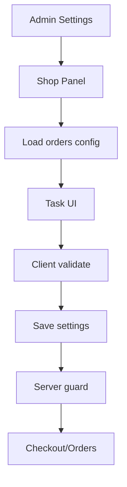

# I. Primer

## 1. TL;DR kiểu Feynman

- Tab **Cấu hình cửa hàng** hiện đang lấy lại UI cấu hình hệ thống `orders` rồi nhúng vào `/admin/settings/advanced`, nên nhanh/DRY nhưng tạo cảm giác “admin đang chỉnh đồ kỹ thuật”.
- QA tĩnh phát hiện 4 nhóm nợ chính: **Technical Debt** (loading/validation/save flow), **Design Debt** (reuse UI sai mental model), **UX Debt** (nested tabs, thiếu hướng dẫn), **Usability Issues** (table khó dùng trên mobile, xóa không xác nhận, lỗi fetch im lặng).
- Hướng xử lý đề xuất: tách một lớp **ShopConfigAdminPanel (Panel cấu hình shop cho Admin)** dùng cùng source dữ liệu `orders`, nhưng UI theo task của chủ shop: Vận chuyển → Thanh toán → Địa chỉ → Trạng thái → Nâng cao.
- Bổ sung validation trước khi lưu và server guard tối thiểu cho `orders` settings để tránh lưu ID rỗng/trùng, phí âm, trạng thái lỗi, JSON hỏng.
- Không chạy app/browser/lint/test trong bước này vì đang ở spec mode; audit dựa trên source code và line evidence.

## 2. Elaboration & Self-Explanation

Hiện tại route `http://localhost:3000/admin/settings/advanced` chỉ render `SettingsPageShell section="advanced"` tại `app/admin/settings/advanced/page.tsx`. Bên trong shell này, tab `shop-config` gọi `useModuleConfig(ordersModule)` và render `OrdersConfigTab` với `hideModuleStatus={true}`.

Vấn đề không phải là “thiếu chức năng”, mà là **chức năng đang lộ quá nhiều cấu trúc nội bộ**: admin thấy feature toggles của module orders, các bảng có cột `Mã`, `Step`, `id`, JSON fallback, và các tab lồng nhau. Người dùng không chuyên kỹ thuật sẽ không biết bật/tắt `Thanh toán` là tắt toàn bộ checkout payment hay chỉ chỉnh danh sách phương thức thanh toán.

Vì vậy spec này không đề xuất rewrite lớn. Nó đề xuất giữ Convex/module settings hiện có, nhưng thêm một lớp UI + validation dành riêng cho Admin để cấu hình dễ hiểu, có cảnh báo, có trạng thái lỗi rõ, và ít rủi ro phá checkout/order flow.

## 3. Concrete Examples & Analogies

- **Ví dụ cụ thể:** Admin muốn đổi phí ship từ `30.000đ` sang `35.000đ`. UI hiện tại cho phép sửa trực tiếp trong table cùng cột `id`, `Mã`, `Mô tả`, `Phí`, `Thời gian`; nếu nhập phí âm hoặc xóa nhầm dòng, hệ thống không chặn rõ trước khi lưu. UI mới sẽ hiển thị card “Giao hàng tiêu chuẩn”, field “Phí vận chuyển”, validate `>= 0`, nút xóa có confirm/undo.
- **Analogy:** Hiện tại giống như đưa chủ shop vào phòng kỹ thuật điện để tự bật/tắt cầu dao. Họ làm được, nhưng dễ sợ và dễ tắt nhầm. UI mới giống bảng điều khiển trong cửa hàng: “Thanh toán”, “Vận chuyển”, “Địa chỉ”, “Trạng thái đơn” — đúng ngôn ngữ nghiệp vụ.

# II. Audit Summary (Tóm tắt kiểm tra)

## 1. Scope đã kiểm tra

- Route: `app/admin/settings/advanced/page.tsx`
- Shell chính: `app/admin/settings/_components/SettingsPageShell.tsx`
- UI tab orders: `components/modules/orders/OrdersConfigTab.tsx`
- Editors: `PaymentMethodsEditor.tsx`, `ShippingMethodsEditor.tsx`, `OrderStatusesEditor.tsx`, `AddressPreview.tsx`
- Config/runtime: `lib/modules/hooks/useModuleConfig.ts`, `lib/modules/configs/orders.config.ts`, `lib/modules/configs/settings.config.ts`
- Convex liên quan: `convex/admin/modules.ts`, `convex/orders.ts`
- Public checkout/order consumers: `app/(site)/checkout/page.tsx`, `lib/orders/statuses.ts`

## 2. Findings chính theo nhóm nợ

| ID | Severity | Nhóm | Evidence | Vấn đề |
|---|---:|---|---|---|
| F1 | High | Technical Debt | `SettingsPageShell.tsx:233`, `319-321`, `1979-2000` | `ordersModuleConfig` được load riêng nhưng page loading không chờ `ordersModuleConfig.isLoading`; tab có thể render state mặc định/fallback trước khi data thật về. |
| F2 | High | Technical Debt | `SettingsPageShell.tsx:618-621`, `useModuleConfig.ts:326-382`, `convex/admin/modules.ts:974-989` | Save flow của shop config bỏ qua `validateForm`; `setModuleSetting` nhận `v.any()` nên không có domain validation cho payment/shipping/status. |
| F3 | High | Technical Debt / Usability | `SettingsPageShell.tsx:534-543`, `1316-1394` | `hasChanges` chỉ tính `ordersModuleConfig.hasChanges` khi đang ở tab shop-config; nếu sửa shop config rồi chuyển tab, footer có thể báo “Đã lưu” dù shop config còn dirty. |
| F4 | Medium/High | Technical Debt | `SettingsPageShell.tsx:233`, `useModuleConfig.ts:42-66` | `useModuleConfig(ordersModule)` chạy eager trong shell; hook có auto-heal seed config khi thiếu data, nghĩa là vào Admin Settings có thể kích hoạt side-effect không liên quan tab đang mở. |
| F5 | Medium | Technical Debt | `OrdersConfigTab.tsx:37-44`, `88-94`, `checkout/page.tsx:69-78`, `199-206` | JSON invalid fallback im lặng về default; admin không biết DB hỏng và có thể overwrite cấu hình cũ. |
| F6 | High | Design Debt / UX Debt | `OrdersConfigTab.tsx:216-236`, `settings.config.ts:17`, `checkout/page.tsx:142-144`, `212-213` | Tab “Cấu hình cửa hàng” hiển thị feature toggles `Thanh toán`, `Vận chuyển`, `Tracking`; admin có thể hiểu nhầm là chỉnh cấu hình, nhưng thực tế toggle ảnh hưởng checkout/order behavior. |
| F7 | Medium | UX Debt | `SettingsPageShell.tsx:1316-1394`, `OrdersConfigTab.tsx:159-205` | Có 2 lớp tabs: Advanced tabs bên ngoài + Orders tabs bên trong; thiếu intro/summary giải thích tác động từng nhóm. |
| F8 | High | Usability Issues | `PaymentMethodsEditor.tsx:57-104`, `ShippingMethodsEditor.tsx:48-100`, `OrderStatusesEditor.tsx:41-110` | Table nhiều cột chứa input/select/checkbox, không có responsive card/overflow rõ; khó dùng trên mobile/tablet. |
| F9 | Medium | Usability Issues | `PaymentMethodsEditor.tsx:36-37`, `ShippingMethodsEditor.tsx:27-28`, `OrderStatusesEditor.tsx:20-21` | Xóa item ngay trong local state, không confirm/undo; dễ mất cấu hình trước khi user nhận ra. |
| F10 | Medium | UX Debt / A11y | `OrderStatusesEditor.tsx:44-49`, `58`, `86-103`; `PaymentMethodsEditor.tsx:72` | Microcopy còn kỹ thuật (`Mã`, `Step`, `Pending`, `id`); checkbox raw thiếu label dễ hiểu và khó accessibility. |
| F11 | Medium | Usability Issues | `OrdersConfigTab.tsx:71-83`, `AddressPreview.tsx:91-130` | Fetch bank/address data lỗi im lặng hoặc không có loading/error UI; user chỉ thấy dropdown rỗng. |
| F12 | Medium | Design Debt | `orders.config.ts:27-127`, `OrdersConfigTab.tsx:216-236` | Khi `hideModuleStatus=true`, tab general chỉ còn FeaturesCard; các setting như `ordersPerPage`, `digitalDeliveryMode` tồn tại trong config nhưng không có narrative/placement rõ trong Admin UI. |

# III. Root Cause & Counter-Hypothesis (Nguyên nhân gốc & Giả thuyết đối chứng)

## 1. Root Cause Confidence (Độ tin cậy nguyên nhân gốc)

**Confidence: High.** Evidence nhất quán ở nhiều lớp: `SettingsPageShell` nhúng trực tiếp `OrdersConfigTab`; `OrdersConfigTab` vốn là UI cấu hình module hệ thống; editors thiếu validation/responsive; `useModuleConfig` save qua `setModuleSetting(v.any())`.

## 2. Audit protocol nhanh

1. **Triệu chứng expected vs actual:** Expected: admin thấy flow cấu hình shop rõ, an toàn, dễ hiểu. Actual: admin thấy nested tabs, feature toggles kỹ thuật, table nhiều cột, thiếu validation/lỗi rõ.
2. **Phạm vi ảnh hưởng:** Admin Settings advanced; gián tiếp ảnh hưởng checkout, order statuses, admin orders vì các setting này được public checkout/order flow đọc lại.
3. **Tái hiện tối thiểu:** Source-level ổn định: vào `/admin/settings/advanced?tab=shop-config`, code render `OrdersConfigTab` và editors như evidence trên.
4. **Dữ liệu còn thiếu:** Chưa có browser/mobile screenshot và chưa kiểm tra dữ liệu Convex hiện tại có JSON lỗi hay không.
5. **Giả thuyết thay thế:** Có thể user khó dùng chỉ vì wording; tuy nhiên code evidence cho thấy có debt thực tế về loading, dirty state, validation, responsive và side-effect.
6. **Rủi ro nếu fix sai:** Nếu chỉ đổi text mà không thêm validation/dirty-state guard, UI đẹp hơn nhưng vẫn có thể lưu cấu hình hỏng hoặc mất thay đổi.
7. **Pass/fail sau sửa:** Pass khi admin hoàn thành task vận chuyển/thanh toán/trạng thái/địa chỉ mà không thấy thuật ngữ kỹ thuật trừ khu vực “Nâng cao”, lỗi input được block trước save, mobile không vỡ layout.

# IV. Proposal (Đề xuất)

## 1. Hướng xử lý chính

Tạo/refactor lớp **Admin Shop Config Panel (Panel cấu hình shop cho Admin)** bọc quanh dữ liệu `ordersModule`, không reuse nguyên xi UI system config. Vẫn dùng source of truth `moduleSettings` hiện có để tránh đổi data model rộng.

## 2. Thay đổi logic cụ thể

### a) Loading + lazy container

- Không gọi `useModuleConfig(ordersModule)` eager trong toàn bộ `SettingsPageShell` nếu user chưa mở tab shop-config.
- Tách `ShopConfigAdminContainer` component riêng, render chỉ khi `advancedTab === 'shop-config' && canEditShopConfig`.
- Trong container, nếu `ordersModuleConfig.isLoading`, hiển thị skeleton/loading state riêng thay vì render fallback data.

### b) Dirty state + save flow an toàn

- `SettingsPageShell` cần biết dirty state của shop config ngay cả khi user chuyển tab, hoặc chặn chuyển tab khi có thay đổi chưa lưu.
- Ưu tiên KISS: khi đang dirty trong shop-config và user click tab advanced khác, hiện confirm “Bạn có thay đổi chưa lưu”.
- Save shop config chạy validation trước, rồi mới gọi save.

### c) Validation domain cho orders settings

Thêm helper validation dùng lại cho client/server:

- `shippingMethods`: `id` không rỗng, unique, `label` không rỗng, `fee >= 0`, number finite.
- `paymentMethods`: `id` unique, `label` không rỗng, `type` thuộc enum hợp lệ.
- `orderStatuses`: `key` unique, `label` không rỗng, `color` hex hợp lệ, `step` trong `1..4`, tối thiểu 1 status không final làm default hợp lý.
- `bankCode/bankName/bankAccountNumber`: validate tối thiểu khi chọn VietQR/bank transfer.
- `addressFormat`: chỉ nhận `text | 2-level | 3-level`.

Server guard tối thiểu trong `convex/admin/modules.ts` cho `moduleKey === 'orders'` để không phụ thuộc hoàn toàn vào UI.

### d) Rework UI theo task-oriented admin

- Đổi thứ tự tab/nội dung: **Tổng quan** → **Vận chuyển** → **Thanh toán** → **Địa chỉ** → **Trạng thái đơn** → **Nâng cao**.
- `Tổng quan` hiển thị summary: số phương thức ship/payment, preset status, định dạng địa chỉ, trạng thái feature payment/shipping.
- Đưa feature toggles vào khu vực “Nâng cao / Ảnh hưởng checkout” với mô tả rõ: “Tắt Thanh toán sẽ ẩn bước thanh toán ở checkout”.
- Không hiển thị field/config kỹ thuật trong default view nếu admin không cần.

### e) Responsive + usability editors

- Desktop có thể giữ table nếu cần, nhưng mobile chuyển sang card/accordion từng item.
- Thêm confirm/undo khi xóa phương thức ship/payment/status.
- Thêm inline error dưới field thay vì chỉ toast.
- Đổi microcopy:
  - `Mã` → `Mã nội bộ` + helper “Không đổi nếu đã có đơn hàng cũ”.
  - `Step` → `Bước tiến trình`.
  - `Pending` placeholder → `VD: PendingPayment` hoặc tiếng Việt có giải thích.
  - `Compact` → `Mẫu gọn có logo`, `Compact 2` → `Mẫu gọn tối giản`.

### f) Fetch/error states

- Bank list: thêm loading, empty, error + fallback nhập thủ công.
- Address preview: thêm try/catch, loading skeleton, error message “Không tải được dữ liệu địa chỉ mẫu”.
- JSON parse fail: hiển thị warning “Cấu hình hiện tại bị lỗi định dạng, chưa tự động ghi đè”.

# V. Files Impacted (Tệp bị ảnh hưởng)

## UI / Admin

- `Sửa: app/admin/settings/_components/SettingsPageShell.tsx`  
  Vai trò hiện tại: shell monolithic cho settings, advanced tabs và footer save.  
  Thay đổi: tách render shop config sang container riêng, lazy load, thêm guard chuyển tab khi dirty, giữ footer trạng thái đúng.

- `Thêm: components/modules/orders/ShopConfigAdminContainer.tsx`  
  Vai trò hiện tại: chưa có.  
  Thay đổi: container admin-only gọi `useModuleConfig(ordersModule)`, xử lý loading/error/save/validation trước khi render panel.

- `Thêm/Sửa: components/modules/orders/ShopConfigAdminPanel.tsx`  
  Vai trò hiện tại: chưa có hoặc tách từ `OrdersConfigTab`.  
  Thay đổi: UI task-oriented cho admin, summary cards, advanced toggles có cảnh báo tác động.

## Editors

- `Sửa: components/modules/orders/PaymentMethodsEditor.tsx`  
  Thay đổi: responsive card layout, inline validation, confirm/undo delete, microcopy nghiệp vụ.

- `Sửa: components/modules/orders/ShippingMethodsEditor.tsx`  
  Thay đổi: validate phí/ID/label, mobile card, confirm/undo delete.

- `Sửa: components/modules/orders/OrderStatusesEditor.tsx`  
  Thay đổi: validate key/color/step, label checkbox rõ, cảnh báo status default/final, mobile card.

- `Sửa: components/modules/orders/AddressPreview.tsx`  
  Thay đổi: loading/error state cho fetch address data, keyboard/a11y tốt hơn cho combobox nếu phạm vi cho phép.

## Shared / Validation

- `Thêm: lib/orders/config-validation.ts`  
  Vai trò hiện tại: chưa có.  
  Thay đổi: helper validate/normalize settings orders dùng cho client và Convex nơi phù hợp.

- `Sửa: convex/admin/modules.ts`  
  Vai trò hiện tại: mutation `setModuleSetting` đang nhận `v.any()` và ghi trực tiếp.  
  Thay đổi: thêm guard riêng cho `moduleKey === 'orders'` + `settingKey` nhạy cảm để reject cấu hình sai.

# VI. Execution Preview (Xem trước thực thi)

1. Đọc lại các consumers của orders settings để tránh đổi contract: checkout, admin orders, `parseOrderStatuses`.
2. Tạo validation helper và unit-level static reasoning cho các setting nhạy cảm.
3. Tách `ShopConfigAdminContainer` khỏi `SettingsPageShell` để tránh eager hook/side-effect.
4. Rework panel admin theo task-oriented UI, giữ source dữ liệu `ordersModule`.
5. Nâng cấp 3 editor + `AddressPreview`: responsive, inline errors, confirm delete, fetch states.
6. Bổ sung server guard tối thiểu trong Convex mutation.
7. Tự review tĩnh theo checklist: typing, null-safety, legacy data fallback, mobile layout, unsaved-change flow.

# VII. Verification Plan (Kế hoạch kiểm chứng)

- **Static review:** kiểm tra TypeScript types, null/undefined, JSON parse fail, duplicate IDs, unsaved changes khi chuyển tab.
- **Typecheck:** nếu bước implementation cần chạy thủ công, dùng `bunx tsc --noEmit 2>&1 | Select-Object -First 10` theo quy ước repo; lint/unit test không tự chạy theo rule dự án, trừ khi user yêu cầu/cho phép.
- **Manual QA bởi tester:**
  1. Mở `/admin/settings/advanced?tab=shop-config` với feature bật/tắt.
  2. Sửa phí ship, payment method, status, bank info; verify save/reload.
  3. Nhập lỗi: ID trùng, label rỗng, phí âm, color sai, JSON legacy hỏng; verify bị chặn và message rõ.
  4. Chuyển tab khi có thay đổi chưa lưu; verify warning/dirty state đúng.
  5. Test mobile/tablet: không tràn table, touch target đủ, xóa có confirm/undo.
  6. Kiểm tra checkout đọc lại payment/shipping/address/status đúng sau save.

# VIII. Todo

- [ ] Tách shop config khỏi `SettingsPageShell` bằng admin-only container.
- [ ] Thêm validation helper cho shipping/payment/status/bank/address settings.
- [ ] Thêm server guard tối thiểu cho `orders` module settings.
- [ ] Rework panel theo task-oriented admin UI + summary + advanced warning.
- [ ] Nâng cấp responsive editors và delete confirm/undo.
- [ ] Thêm loading/error states cho bank/address data và JSON parse fail.
- [ ] Static self-review + bàn giao checklist manual QA.

# IX. Acceptance Criteria (Tiêu chí chấp nhận)

- Admin vào tab **Cấu hình cửa hàng** hiểu trong 5 giây tab này dùng để chỉnh gì và ảnh hưởng checkout/order ra sao.
- Không render fallback/default như data thật khi `ordersModuleConfig` chưa load hoặc JSON đang lỗi.
- Không thể lưu cấu hình payment/shipping/status invalid: ID rỗng/trùng, label rỗng, phí âm, color sai, step ngoài range.
- Chuyển tab khi có thay đổi chưa lưu không làm footer báo sai “Đã lưu” và không làm user mất thay đổi im lặng.
- Mobile/tablet không vỡ layout table; mỗi item có controls dễ bấm, rõ label, target đủ lớn.
- Xóa payment/shipping/status có confirm hoặc undo trước khi mất khỏi draft.
- Feature toggles ảnh hưởng checkout được đặt trong khu vực nâng cao, có cảnh báo tác động.
- Checkout/admin orders vẫn đọc được settings cũ; không cần migration dữ liệu lớn.

# X. Risk / Rollback (Rủi ro / Hoàn tác)

- **Rủi ro:** Server guard mới có thể reject legacy config đang tồn tại nếu validation quá chặt. Giảm rủi ro bằng normalize mềm và chỉ block khi user lưu setting nhạy cảm.
- **Rủi ro:** Tách container có thể lệch dirty/save footer. Giảm rủi ro bằng props/callback rõ: `onDirtyChange`, `onSaveStateChange` hoặc giữ save trong container với sticky footer cục bộ.
- **Rollback:** revert các file UI/editor/helper/Convex guard; vì không đổi schema chính và không migration rộng, rollback bằng git là đủ.

# XI. Out of Scope (Ngoài phạm vi)

- Không redesign toàn bộ `/admin/settings/advanced` ngoài tab shop-config.
- Không đổi data model `moduleSettings` hoặc schema orders nếu không bắt buộc.
- Không thay đổi checkout UI ngoài việc đảm bảo nó vẫn đọc config hợp lệ.
- Không chạy browser automation/dev server trong spec này.