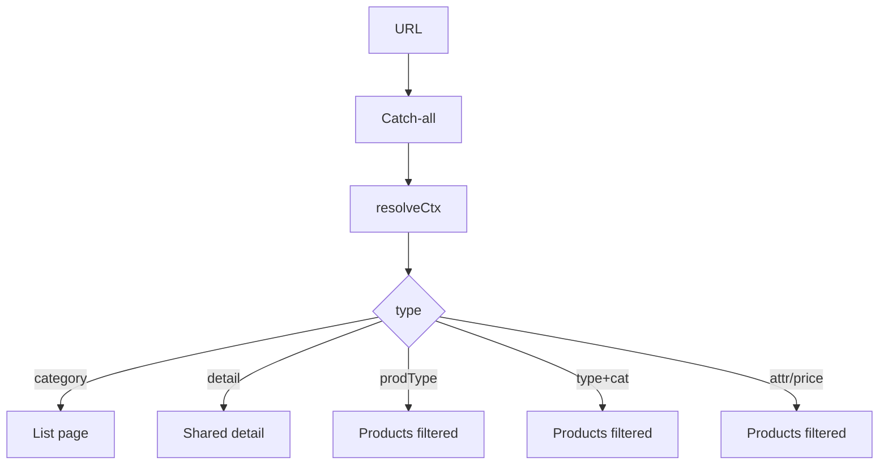

# I. Primer

## 1. TL;DR kiểu Feynman

- Có **2 nhóm lỗi route mới** ngoài media spec trước: product detail bị trống và product type/category filter bị 404.
- Nguyên nhân không nằm ở data: Convex resolver đúng vẫn resolve được `/ruou-manh` và `/ruou-vang-sam-panh/vang-do`.
- Nguyên nhân nằm ở **Next.js route shadowing (route cụ thể che route catch-all)**: các file mới `app/(site)/[categorySlug]` và `app/(site)/[categorySlug]/[recordSlug]` bắt URL trước `app/(site)/[...slugs]`.
- Route cụ thể đang dùng resolver cũ chỉ hiểu category/detail, không hiểu product type/filter; đồng thời product detail route dùng **ProductDetailPage duplicate cũ** không support `premium`.
- Fix đúng: đưa `app/(site)/[...slugs]/page.tsx` trở lại làm **source of truth (nguồn chuẩn)** cho unified IA route, xóa/delegate các route shadow mới, và bỏ duplicate ProductDetailPage cũ.

## 2. Elaboration & Self-Explanation

Trước commit đã push (`origin/master`), site dùng `app/(site)/[...slugs]/page.tsx` để xử lý các URL động như:

- `/vang-do/<product-slug>`: product detail theo category.
- `/ruou-manh`: product type landing.
- `/ruou-vang-sam-panh/vang-do`: product type + category landing.

Catch-all route này gọi `api.ia.resolveProductLandingContext`, đây là resolver đầy đủ: nó biết category, detail, product type, product type category, price range, attribute filter.

Sau đó code mới thêm route cụ thể:

- `app/(site)/[categorySlug]/page.tsx`
- `app/(site)/[categorySlug]/[recordSlug]/page.tsx`

Trong Next.js App Router, route cụ thể được match trước catch-all. Vì vậy:

- `/ruou-manh` bị `[categorySlug]/page.tsx` bắt, nhưng route này gọi `resolveUnifiedCategory`, resolver này chỉ tìm post/product/service category, không tìm product type → `null` → 404.
- `/ruou-vang-sam-panh/vang-do` bị `[categorySlug]/[recordSlug]/page.tsx` bắt, nhưng route này gọi `resolveUnifiedDetail`, resolver này chỉ hiểu category + record detail, không hiểu product type + category filter → `null` → 404.
- `/vang-do/ruou-vang-tarapaca...` cũng bị route 2 segment bắt. Resolver trả detail đúng, nhưng route này render bằng local duplicate `ProductDetailPage` cũ chỉ có `classic | modern | minimal`; setting thật đang là `premium`, nên không branch nào render → main content trống.

## 3. Concrete Examples & Analogies

### a) Ví dụ cụ thể trong repo

`/ruou-manh` hiện bị route này bắt:

```ts
// app/(site)/[categorySlug]/page.tsx
const resolvedCategory = await client.query(api.ia.resolveUnifiedCategory, { slug: categorySlug });
if (!resolvedCategory) notFound();
```

Nhưng query đúng lại là:

```bash
bunx convex run ia:resolveProductLandingContext '{"slugs":["ruou-manh"]}'
```

Kết quả đã đọc được:

```json
{
  "type": "productType",
  "productTypeSlug": "ruou-manh",
  "productTypeName": "Rượu mạnh"
}
```

Nghĩa là data đúng, route sai.

### b) Analogy đời thường

Giống như có một tổng đài chính biết chuyển cuộc gọi cho mọi phòng ban (`[...slugs]`), nhưng sau đó đặt thêm một lễ tân phụ ở cửa trước (`[categorySlug]`). Lễ tân phụ chỉ biết 3 phòng cũ, không biết phòng “product type”, nên khách hỏi “Rượu mạnh” bị báo “không có”, dù tổng đài chính biết chính xác phải chuyển đi đâu.

# II. Audit Summary (Tóm tắt kiểm tra)

## 1. Vấn đề A — Product detail blank ở `/vang-do/ruou-vang-tarapaca-gran-reserva-cabernet-sauvignon-750ml`

### a) Observation (Quan sát)

- Header/footer render bình thường.
- Main product detail trống.
- Product slug có data, setting detail đang là `premium`.

### b) Evidence (Bằng chứng)

- Route 2 segment đang import local duplicate:
  - `app/(site)/[categorySlug]/[recordSlug]/page.tsx:4`
  - `import ProductDetailPage from './_components/ProductDetailPage';`
- Local duplicate thiếu premium:
  - `app/(site)/[categorySlug]/[recordSlug]/_components/ProductDetailPage.tsx:44`
  - `type ProductDetailStyle = 'classic' | 'modern' | 'minimal';`
- Local duplicate chỉ render:
  - `classic`: khoảng line `961`
  - `modern`: khoảng line `1016`
  - `minimal`: khoảng line `1072`
- Shared component đúng có premium:
  - `app/(site)/_components/details/ProductDetailPage.tsx:55`
  - `type ProductDetailStyle = 'classic' | 'modern' | 'minimal' | 'premium';`
  - Premium branch tại khoảng line `1018`, implementation `PremiumStyle` khoảng line `2586`.
- Setting thật:
  - `product_detail_ui.value.layoutStyle = "premium"`
  - `products_detail_style.value = "premium"`

### c) Classification

- **Technical Debt:** duplicate component drift.
- **Design Debt:** route product detail có 2 source-of-truth render khác nhau.
- **UX Debt:** page blank không có fallback/error state.
- **Usability Issue:** user thấy header/footer nhưng không biết sản phẩm có bị mất hay không.

## 2. Vấn đề B — `/ruou-manh` bị 404 dù product type bật

### a) Observation (Quan sát)

- User bật product type trong module products.
- `/ruou-manh` vẫn 404.

### b) Evidence (Bằng chứng)

- Module setting đã bật:
  - `admin/modules:getModuleSetting { moduleKey: "products", settingKey: "enableProductTypes" }`
  - trả `value: true`.
- Resolver đúng resolve được:
  - `ia:resolveProductLandingContext { slugs: ["ruou-manh"] }`
  - trả `type: "productType"`, `productTypeName: "Rượu mạnh"`.
- Nhưng route match thực tế là:
  - `app/(site)/[categorySlug]/page.tsx`
- Route này gọi resolver hẹp:
  - `api.ia.resolveUnifiedCategory`
- Resolver hẹp chỉ tìm:
  - `postCategories`
  - `productCategories`
  - `serviceCategories`
  - evidence: `convex/ia.ts:6-23`
- Query hẹp với `ruou-manh` trả null, nên route gọi `notFound()`.

### c) Classification

- **Technical Debt:** route shadowing phá catch-all.
- **Design Debt:** route taxonomy chia thành nhiều resolver không đồng bộ.
- **UX Debt:** 404 sai dù module enabled.
- **Usability Issue:** navigation/filter link dẫn tới trang chết.

## 3. Vấn đề C — `/ruou-vang-sam-panh/vang-do` bị 404 dù type + category mapping tồn tại

### a) Observation (Quan sát)

- User bật product type và filter trong module products.
- `/ruou-vang-sam-panh/vang-do` vẫn 404.

### b) Evidence (Bằng chứng)

- Resolver đúng resolve được:
  - `ia:resolveProductLandingContext { slugs: ["ruou-vang-sam-panh", "vang-do"] }`
  - trả `type: "productTypeCategory"`, `productTypeSlug: "ruou-vang-sam-panh"`, `categorySlug: "vang-do"`.
- Nhưng URL 2 segment bị route này bắt:
  - `app/(site)/[categorySlug]/[recordSlug]/page.tsx`
- Route này gọi resolver hẹp:
  - `api.ia.resolveUnifiedDetail`
- Resolver hẹp chỉ hiểu `categorySlug + recordSlug` detail:
  - evidence: `convex/ia.ts:36-122`
- Nó không hiểu product type + category landing, nên trả null → `notFound()`.

### c) Classification

- **Technical Debt:** URL taxonomy product type category bị detail route shadow.
- **Design Debt:** IA route context không có single dispatcher ở route cụ thể.
- **UX Debt:** filter category landing chết dù config đúng.
- **Usability Issue:** user không phân biệt link filter sai code hay sai data.

## 4. Evidence từ git / regression window

- Branch hiện tại: `master...origin/master [ahead 4]`.
- `origin/master` là commit đã push trước đó theo local tracking.
- Diff `origin/master...HEAD` cho thấy các route mới được thêm:
  - `A app/(site)/[categorySlug]/page.tsx`
  - `A app/(site)/[categorySlug]/[recordSlug]/page.tsx`
  - `A app/(site)/[categorySlug]/[recordSlug]/_components/ProductDetailPage.tsx`
- `origin/master` đã có catch-all đúng:
  - `app/(site)/[...slugs]/page.tsx`
  - `app/(site)/_components/details/ProductDetailPage.tsx`
- Kết luận: user nói “commit đã push trước đó không bị” khớp evidence.

# III. Root Cause & Counter-Hypothesis (Nguyên nhân gốc & Giả thuyết đối chứng)

## 1. Root Cause Confidence (Độ tin cậy nguyên nhân gốc)

**High.** Có 3 lớp evidence độc lập:

1. Next route tree: route cụ thể mới tồn tại và shadow catch-all.
2. Convex data/resolver: resolver đúng `resolveProductLandingContext` trả kết quả hợp lệ cho cả 2 URL 404.
3. Component render: route detail cụ thể dùng duplicate ProductDetailPage không support `premium`, trong khi setting đang `premium`.

## 2. Audit Protocol Questions

1. **Triệu chứng expected vs actual:** Expected detail/product type/filter render nội dung; actual detail blank, type/category filter 404.
2. **Phạm vi ảnh hưởng:** Site public product IA route, gồm category, product detail, product type landing, product type category, price range, attribute filters.
3. **Tái hiện ổn định:** Có thể tái hiện bằng `/ruou-manh`, `/ruou-vang-sam-panh/vang-do`, `/vang-do/<product-slug>` với setting premium.
4. **Mốc thay đổi gần nhất:** Các route cụ thể `[categorySlug]`/`[categorySlug]/[recordSlug]` được thêm sau `origin/master`.
5. **Dữ liệu thiếu:** Chưa chạy browser e2e trong spec mode; tuy nhiên read-only Convex resolve đã đủ chứng minh data không thiếu.
6. **Giả thuyết thay thế chưa bị loại trừ:** Có thể category/type inactive hoặc mapping thiếu; đã loại trừ cho 2 URL bằng `resolveProductLandingContext` trả object hợp lệ và `enableProductTypes = true`.
7. **Rủi ro nếu fix sai:** Xóa route cụ thể quá rộng có thể ảnh hưởng metadata/layout nếu catch-all thiếu phần nào; giảm bằng so sánh catch-all hiện đã có metadata/schema/render đầy đủ.
8. **Pass/fail sau sửa:** 3 URL trên render đúng; no duplicate ProductDetailPage path active; `/[...slugs]` là source-of-truth.

## 3. Counter-Hypothesis (Giả thuyết đối chứng)

- **Không phải data thiếu:** `resolveProductLandingContext` trả đúng `productType` và `productTypeCategory`.
- **Không phải module setting chưa bật:** `enableProductTypes` đang `true`.
- **Không phải ảnh/media mới sửa gây blank:** blank detail xảy ra vì local ProductDetailPage không có premium branch.
- **Không phải Convex resolver chính sai:** resolver chính đúng; sai là route cụ thể gọi resolver hẹp.

# IV. Proposal (Đề xuất)

## 1. Decision (Quyết định)

Dùng lại `app/(site)/[...slugs]/page.tsx` làm **single source of truth (nguồn chuẩn duy nhất)** cho unified IA routes.

Lý do chọn hướng này:

- Đây là behavior của commit đã push trước đó và user xác nhận không lỗi.
- Catch-all đã có resolver đầy đủ `resolveProductLandingContext`.
- Catch-all đã import shared detail components có premium.
- Giảm duplicate và tránh drift tiếp.

## 2. Route flow sau khi sửa



Ghi chú: `resolveCtx` = `api.ia.resolveProductLandingContext`; `prodType` = product type landing.

## 3. Thay đổi cụ thể

### a) Remove/delegate route shadowing

- Xóa hoặc vô hiệu hóa route cụ thể:
  - `app/(site)/[categorySlug]/page.tsx`
  - `app/(site)/[categorySlug]/[recordSlug]/page.tsx`
  - `app/(site)/[categorySlug]/[recordSlug]/layout.tsx`
- Sau khi các route này không còn `page.tsx`, Next.js sẽ để `app/(site)/[...slugs]/page.tsx` bắt:
  - `/ruou-manh`
  - `/ruou-vang-sam-panh/vang-do`
  - `/vang-do/<product-slug>`

### b) Remove duplicate detail components nếu chỉ còn unused

Trước khi xóa, grep imports để đảm bảo không còn dùng ngoài route shadow:

- `app/(site)/[categorySlug]/[recordSlug]/_components/ProductDetailPage.tsx`
- `app/(site)/[categorySlug]/[recordSlug]/_components/PostDetailPage.tsx`
- `app/(site)/[categorySlug]/[recordSlug]/_components/ServiceDetailPage.tsx`

Nếu chỉ được import bởi route page bị xóa, remove để tránh future drift.

### c) Không sửa resolver Convex trước

- `convex/ia.ts` hiện có resolver đúng `resolveProductLandingContext`.
- Không đổi data/schema.
- Không chỉnh product type settings.

### d) Spec media trước đó vẫn giữ

- Bổ sung section route regression này vào spec hiện có:
  - `.factory/docs/2026-05-31-spec-x-l-technical-debt-design-debt-ux-debt-media-home-components.md`
- Hoặc tạo spec bổ sung nếu file hiện tại đã được commit và cần audit trail riêng.

# V. Files Impacted (Tệp bị ảnh hưởng)

## 1. Site routing

- **Xóa/Sửa:** `app/(site)/[categorySlug]/page.tsx` — hiện shadow catch-all cho 1 segment và dùng `resolveUnifiedCategory` hẹp. Sẽ remove route hoặc delegate hoàn toàn sang catch-all để `/ruou-manh` không 404.
- **Xóa/Sửa:** `app/(site)/[categorySlug]/[recordSlug]/page.tsx` — hiện shadow catch-all cho 2 segment và dùng duplicate detail components. Sẽ remove route hoặc delegate sang catch-all để `/ruou-vang-sam-panh/vang-do` và product detail dùng resolver đúng.
- **Xóa/Sửa:** `app/(site)/[categorySlug]/[recordSlug]/layout.tsx` — hiện generate metadata bằng `resolveUnifiedDetail` hẹp. Sẽ remove cùng route shadow để catch-all metadata đúng xử lý product type/filter/detail.

## 2. Duplicate components

- **Xóa nếu unused:** `app/(site)/[categorySlug]/[recordSlug]/_components/ProductDetailPage.tsx` — bản duplicate cũ không support `premium`; gây blank detail.
- **Xóa nếu unused:** `app/(site)/[categorySlug]/[recordSlug]/_components/PostDetailPage.tsx` — duplicate detail component chỉ phục vụ route shadow.
- **Xóa nếu unused:** `app/(site)/[categorySlug]/[recordSlug]/_components/ServiceDetailPage.tsx` — duplicate detail component chỉ phục vụ route shadow.

## 3. Source of truth giữ lại

- **Giữ/verify:** `app/(site)/[...slugs]/page.tsx` — source-of-truth đúng cho category/detail/product type/filter.
- **Giữ/verify:** `app/(site)/_components/details/ProductDetailPage.tsx` — shared detail component có premium support.
- **Giữ/verify:** `convex/ia.ts` — resolver `resolveProductLandingContext` đang resolve đúng.

## 4. Spec file

- **Sửa:** `.factory/docs/2026-05-31-spec-x-l-technical-debt-design-debt-ux-debt-media-home-components.md` — thêm mục “Route taxonomy regression: product detail premium blank + product type/filter 404”.

# VI. Execution Preview (Xem trước thực thi)

1. `git status --porcelain` để đảm bảo không đè việc đang làm.
2. Grep imports của các duplicate components trong `app/(site)/[categorySlug]/[recordSlug]/_components`.
3. Remove các route shadow tracked files nếu không còn cần:
   - `[categorySlug]/page.tsx`
   - `[categorySlug]/[recordSlug]/page.tsx`
   - `[categorySlug]/[recordSlug]/layout.tsx`
   - duplicate `_components` nếu chỉ unused.
4. Update spec file với audit route regression.
5. Chạy read-only route resolution checks:
   - `ia:resolveProductLandingContext ["ruou-manh"]`
   - `ia:resolveProductLandingContext ["ruou-vang-sam-panh","vang-do"]`
6. Typecheck theo quy định project nếu cần:
   - `bunx tsc --noEmit 2>&1 | Select-Object -First 10`
7. Review `git diff` và `git status`.
8. Commit thay đổi, không push.

# VII. Verification Plan (Kế hoạch kiểm chứng)

## 1. Static verification

- `git diff --name-status` cho thấy route shadow files đã bị xóa hoặc không còn page active.
- Grep không còn import active tới duplicate local ProductDetailPage:
  - `./_components/ProductDetailPage` dưới `[categorySlug]/[recordSlug]`.
- `app/(site)/[...slugs]/page.tsx` vẫn import:
  - `../_components/details/ProductDetailPage`
  - `api.ia.resolveProductLandingContext`

## 2. Convex read-only verification

- `ia:resolveProductLandingContext { slugs: ["ruou-manh"] }` trả `type: "productType"`.
- `ia:resolveProductLandingContext { slugs: ["ruou-vang-sam-panh", "vang-do"] }` trả `type: "productTypeCategory"`.
- `settings:getByKey product_detail_ui` vẫn có `layoutStyle: "premium"`, shared component support premium.

## 3. Runtime/manual QA

| URL | Expected |
|---|---|
| `/vang-do/ruou-vang-tarapaca-gran-reserva-cabernet-sauvignon-750ml` | Render product detail premium, không blank main. |
| `/ruou-manh` | Render ProductsPage filtered by product type Rượu mạnh, không 404. |
| `/ruou-vang-sam-panh/vang-do` | Render ProductsPage filtered by product type Sâm panh + category Vang đỏ, không 404. |
| `/vang-do` | Render product category list như trước. |
| `/posts-or-services-category/...` nếu có | Detail/list vẫn render qua catch-all. |

## 4. Regression checks

- Check canonical redirect vẫn hoạt động trong catch-all detail branch.
- Check SEO metadata vẫn render qua `generateMetadata` trong catch-all.
- Check JSON-LD product schema vẫn render detail branch.

# VIII. Todo

- [ ] Bổ sung audit route regression vào spec file.
- [ ] Grep import duplicate route detail components.
- [ ] Remove/delegate route shadow files `[categorySlug]` và `[categorySlug]/[recordSlug]`.
- [ ] Remove duplicate local detail components nếu unused.
- [ ] Verify catch-all handles 3 URL lỗi bằng runtime/manual QA.
- [ ] Run typecheck hoặc rely on git hook theo project rules.
- [ ] Commit changes, không push.

# IX. Acceptance Criteria (Tiêu chí chấp nhận)

- `/vang-do/ruou-vang-tarapaca-gran-reserva-cabernet-sauvignon-750ml` không còn blank; render premium product detail.
- `/ruou-manh` không còn 404; render product type listing.
- `/ruou-vang-sam-panh/vang-do` không còn 404; render product type + category listing.
- Không còn active route shadow gọi `resolveUnifiedCategory/resolveUnifiedDetail` cho URL taxonomy product type.
- Không còn active ProductDetailPage duplicate thiếu `premium` được dùng cho site product detail.
- `origin/master` behavior được khôi phục ở level route source-of-truth: catch-all là dispatcher chính.
- TypeScript pass / commit hook pass.

# X. Risk / Rollback (Rủi ro / Hoàn tác)

## 1. Rủi ro

- Removing route-specific files có thể thay đổi metadata/layout nếu catch-all thiếu một case; evidence hiện cho thấy catch-all đã đầy đủ hơn.
- Nếu có code khác import duplicate local detail components, cần grep trước khi remove.
- Nếu Next.js route cache/dev server còn stale, cần restart dev server sau khi route files bị xóa để verify.

## 2. Rollback

- Revert commit nếu có regression.
- Nếu muốn rollback nhỏ hơn: khôi phục route files nhưng đổi chúng thành thin wrapper gọi `resolveProductLandingContext` và shared components; tuy nhiên đây là fallback, không phải hướng chính.

# XI. Out of Scope (Ngoài phạm vi)

- Không thay đổi Convex schema/data product type/category.
- Không chỉnh product type/filter settings trong admin.
- Không rewrite `convex/ia.ts` nếu resolver hiện đã đúng.
- Không refactor toàn bộ SEO metadata ngoài route shadow issue.
- Không push remote.
