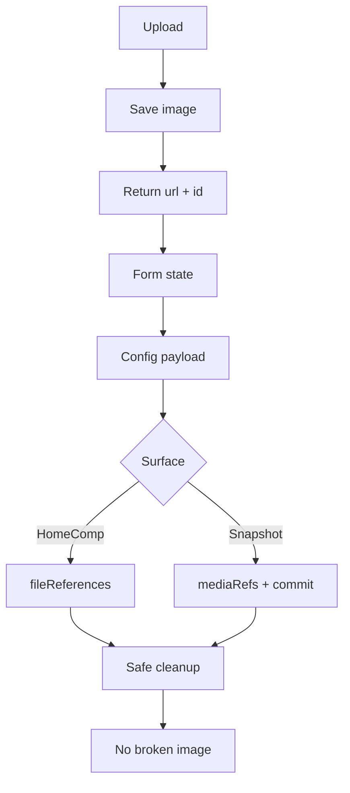

# I. Primer

## 1. TL;DR kiểu Feynman

- Vấn đề gốc không chỉ là “ảnh bị mất”, mà là **media identity (định danh ảnh)** chưa được giữ nhất quán từ upload → state form → config lưu DB → cleanup.
- Một số form upload ảnh nhận được `storageId` nhưng **bỏ qua hoặc set `storageId: undefined`**, nên hệ thống phải đoán bằng URL; đoán được thì sống, đoán sai hoặc snapshot không có reference thì ảnh có thể hỏng.
- Shared uploader còn **race condition (điều kiện đua)** khi upload nhiều ảnh cùng lúc: item mới được `onChange` nhưng `itemsRef` chưa chắc đã cập nhật trước khi upload xong.
- UX hiện tại chưa nói rõ “ảnh lỗi vì sao”, “xóa chỉ là xóa khỏi form hay xóa storage thật”, và một vài lỗi save chỉ báo chung chung.
- Hướng sửa: chuẩn hóa contract `url + storageId`, harden shared upload primitives, sửa snapshot media refs/draft commit, rồi nâng UX feedback cho ảnh lỗi/xóa/upload.

## 2. Elaboration & Self-Explanation

Trong hệ thống này, một ảnh upload lên Convex Storage ban đầu được xem là **draft upload (ảnh nháp)**. Nếu người dùng bấm lưu, record home-component phải lưu được `storageId`; backend `homeComponents.create/update` sẽ tạo `fileReferences` để nói với cleanup rằng “ảnh này đang được dùng”.

Debt hiện tại đến từ 4 lớp:

1. **Technical Debt (Nợ kỹ thuật)**: nhiều form dùng `SettingsImageUploader` nhưng chỉ lưu URL, bỏ `storageId`; `MultiImageUploader` upload nhiều file phụ thuộc timing React; snapshot không sync reference giống homeComponents thật.
2. **Design Debt (Nợ thiết kế hệ thống)**: contract media giữa uploader/form/config/snapshot chưa có một kiểu thống nhất. Có nơi dùng `{ image }`, nơi dùng `{ image, storageId }`, nơi dùng `mediaRefs`, nơi phụ thuộc URL fallback.
3. **UX Debt (Nợ trải nghiệm)**: user không biết thao tác xóa ảnh đã lưu thật chưa, upload lỗi do gì, ảnh broken do cleanup hay URL sai.
4. **Usability Issues (Vấn đề dễ dùng)**: broken image chỉ hiện icon/Error placeholder; batch upload dễ tạo trạng thái khó hiểu; save lỗi generic khiến user khó tự sửa.

Cách sửa tốt nhất trong repo này là **không làm rewrite lớn**, mà đi theo contract FLS sẵn có: uploader luôn trả `url + storageId`, form luôn giữ `storageId` nếu upload từ Convex, snapshot cũng phải lưu/commit media refs rõ ràng, UX hiển thị trạng thái lỗi/xóa dễ hiểu.

## 3. Concrete Examples & Analogies

### a) Ví dụ cụ thể trong repo

Hiện tại `category-products` có đoạn:

```tsx
onChange={(url) => updateDemoProduct(section.id, product.id, { image: url ?? '', storageId: undefined })}
```

Sau khi sửa, contract đúng phải là:

```tsx
onChange={(url, storageId) => updateDemoProduct(section.id, product.id, {
  image: url ?? '',
  storageId: storageId ? String(storageId) : null,
})}
```

Tức là nếu ảnh đến từ Convex Storage thì lưu cả URL để hiển thị và `storageId` để lifecycle/cleanup hiểu đúng.

### b) Analogy đời thường

URL ảnh giống “địa chỉ xem ảnh”, còn `storageId` giống “số hồ sơ sở hữu ảnh”. Nếu chỉ giữ địa chỉ mà mất số hồ sơ, bảo vệ kho vẫn có thể nhìn địa chỉ để đoán, nhưng khi hệ thống dọn kho tự động chạy, nó không chắc ảnh đó thuộc về ai. Giữ `storageId` là dán nhãn sở hữu rõ ràng lên ảnh.

# II. Audit Summary (Tóm tắt kiểm tra)

## 1. Technical Debt (Nợ kỹ thuật)

| Mức | Debt | Evidence | Tác động |
|---|---|---|---|
| High | `MultiImageUploader` upload nhiều ảnh có race giữa `onChange` và `itemsRef.current` | `app/admin/components/MultiImageUploader.tsx:301-385` | Ảnh upload xong có thể không gắn đúng item mới, đặc biệt khi chọn/drop nhiều file. |
| High | `category-products` strip `storageId` rõ ràng | `CategoryProductsForm.tsx:552-555`; type có `DemoCategoryProduct.storageId` tại `_types/index.ts:40-44` | Ảnh demo product mất source-of-truth explicit, FLS phải fallback URL. |
| Medium | `category-products` category image URL-only, chưa có storage field riêng | `CategoryProductsForm.tsx:524-527`; section type chỉ có `categoryImage` tại `_types/index.ts:49-53` | Ảnh danh mục upload không lưu được `storageId`. |
| Medium | `product-grid` upload demo product bỏ `storageId` | `ProductGridForm.tsx:714-717`; `DemoProductItem` có `storageId` trong `product-list/_types` | Dữ liệu demo product không đồng nhất với ProductList. |
| Medium | `service-list` upload demo service bỏ `storageId` và type thiếu field | `ServiceListForm.tsx:295-298`; `_types/index.ts:27-30` | Thumbnail demo service không có media identity. |
| High | Snapshot save không cập nhật/clear `mediaRefs` ổn định | `snapshots/[snapshotId]/.../edit/page.tsx:272-279`; `snapshotComponentSave.ts:41` | Snapshot xóa hết ảnh vẫn giữ refs cũ; upload mới qua dedicated editor không chắc được commit/ref. |
| High | Draft cleanup của uploader tự cleanup khi unmount, snapshot không có `fileReferences` để bảo vệ | `useFileDraftUploads.ts:30-35`; `fileLifecycle.cleanupDraftUploads` kiểm tra `hasFileReferences` | Ảnh upload trong snapshot có nguy cơ bị cleanup sau khi rời trang nếu chỉ lưu trong snapshot payload. |

## 2. Design Debt (Nợ thiết kế hệ thống)

| Mức | Debt | Evidence | Tác động |
|---|---|---|---|
| High | Media contract chưa thống nhất giữa uploader/form/config/snapshot | `SettingsImageUploader` trả `(url, storageId)` nhưng nhiều caller chỉ nhận `(url)` | Mỗi component tự quyết định lưu gì, dễ lặp lại bug strip storageId. |
| Medium | `SettingsImageUploader` khai báo prop `storageId` nhưng component không destructure/use prop này | `SettingsImageUploader.tsx:22-37` | API gây hiểu nhầm: caller tưởng truyền storageId sẽ được dùng, thực tế không. |
| Medium | Snapshot media lifecycle tách khỏi FLS của `homeComponents` nhưng chưa có contract riêng | `snapshotComponentSave.ts:10-41` | `mediaRefs` chỉ là payload metadata, không bảo vệ được draft nếu không commit. |
| Medium | URL-only và managed upload đang trộn trong cùng field | `SettingsImageUploader.tsx:181-186` URL mode set storageId `null`; nhiều form bỏ storageId | Server fallback URL tồn tại nhưng là safety net, không nên là source chính. |

## 3. UX Debt (Nợ trải nghiệm)

| Mức | Debt | Evidence | Tác động |
|---|---|---|---|
| Medium | Xóa ảnh trong uploader chưa phân biệt “xóa khỏi form” và “xóa storage thật” | `SettingsImageUploader.tsx:190-193`; `MultiImageUploader.tsx:461-489` | User không biết phải bấm Lưu để áp dụng hay ảnh đã bị xóa vĩnh viễn. |
| Medium | `deleteMode='immediate'` fail vẫn có thể remove khỏi UI | `MultiImageUploader.tsx:474-489` | Nếu backend từ chối xóa vì file đang dùng, user vẫn thấy item biến mất khỏi form state. |
| Medium | Save error generic ở nhiều edit page | ví dụ `category-products/[id]/edit/page.tsx`, `product-grid/[id]/edit/page.tsx`, `service-list/[id]/edit/page.tsx` | User không biết lỗi do validation, network, storage hay FLS. |
| Medium | Broken image feedback quá ít | `MultiImageUploader.tsx:701-770`; `SettingsImageUploader.tsx:236-243`, `333-335` | User chỉ thấy icon/Error, không có hướng sửa nhanh. |

## 4. Usability Issues (Vấn đề dễ dùng)

| Mức | Issue | Tác động |
|---|---|---|
| High | Batch upload có thể tạo trạng thái item rỗng/ảnh không gắn vào card | User tưởng upload lỗi hoặc mất ảnh. |
| Medium | Broken URL không có nút “Thử lại / đổi URL / upload lại” nổi bật | User phải đoán thao tác sửa. |
| Medium | Xóa nhiều ảnh hoặc thay ảnh không có undo/confirm nhẹ | Dễ mất thao tác, nhất là form dài nhiều item. |
| Low | Upload error message chưa phân loại rõ file quá lớn/network/server | User khó tự xử lý. |

## 5. Pass / No issue found (đã kiểm tra ổn)

- `convex/homeComponents.ts` đã có FLS sync ở create/update/updateConfig, có collect `storageId` và legacy URL fallback.
- `hero` là pattern tốt nhất: giữ `storageId`, track upload, commit draft sau save, dùng `deleteMode="defer"`.
- `partners/gallery/trust-badges/clients` hiện preserve `storageId` khi save; lỗi Partners vừa rồi chủ yếu ở shared uploader state/broken tracking đã được fix một phần.

# III. Root Cause & Counter-Hypothesis (Nguyên nhân gốc & Giả thuyết đối chứng)

## 1. Root Cause Confidence (Độ tin cậy nguyên nhân gốc)

**High.** Có evidence trực tiếp từ code:

- `SettingsImageUploader` trả `storageId` nhưng caller ở `category-products`, `product-grid`, `service-list` bỏ qua hoặc set undefined.
- `MultiImageUploader` tạo `newItems` rồi upload ngay khi `itemsRef.current` có thể chưa chứa item đó.
- Snapshot save helper giữ `mediaRefs` cũ khi không có media refs mới, và snapshot không đi qua `homeComponents.update` để tạo `fileReferences`.

## 2. Trả lời Audit Protocol tối thiểu

1. **Triệu chứng expected vs actual**: Expected upload/xóa/lưu ảnh phải ổn định; actual có ảnh hỏng/mất refs/batch upload không chắc gắn đúng item.
2. **Phạm vi ảnh hưởng**: Admin home-components create/edit/snapshot, chủ yếu media fields của demo products/services/categories và shared uploaders.
3. **Tái hiện ổn định**: Có thể tái hiện bằng upload nhiều ảnh qua `MultiImageUploader`, hoặc upload ảnh demo ở `category-products/product-grid/service-list` rồi inspect config thấy thiếu `storageId`.
4. **Dữ liệu thiếu**: Chưa có runtime QA trên browser và chưa inspect toàn bộ snapshot production payload.
5. **Giả thuyết thay thế**: Backend cleanup xóa bừa; đã giảm khả năng vì `homeComponents` có FLS guard, nhưng snapshot thiếu fileReferences là case riêng vẫn cần sửa.
6. **Rủi ro nếu fix sai**: Có thể giữ quá nhiều draft không cleanup, hoặc commit nhầm media refs; vì vậy fix phải nhỏ và có verify theo từng lifecycle.
7. **Tiêu chí pass/fail**: Config sau save có `storageId`; batch upload gắn đúng item; snapshot upload không bị cleanup sau route leave; broken image có action rõ.

## 3. Counter-Hypothesis (Giả thuyết đối chứng)

- **Không phải mọi URL-only đều gây mất ảnh ngay**: backend có legacy URL resolver trong `homeComponents.ts`, nên URL-only là risk chứ không phải bug chắc chắn ở mọi case.
- **Không cần rewrite toàn bộ media model ngay**: có thể đạt an toàn bằng patch trọng điểm: shared uploader + 3 form demo + snapshot refs + UX error states.
- **Không nên xóa fallback URL**: legacy data production còn cần fallback để không phá dữ liệu cũ.

# IV. Proposal (Đề xuất)

## 1. Mục tiêu

Chuẩn hóa lifecycle media cho các home-components bị audit, giảm rủi ro ảnh bị xóa/hỏng, và cải thiện UX khi upload/xóa/ảnh lỗi mà không rewrite toàn bộ hệ thống.

## 2. Luồng lifecycle mong muốn



Ghi chú: `id` trong diagram là `storageId`; `HomeComp` là homeComponents create/edit thật.

## 3. Phase A — Fix shared uploader technical debt

### a) `MultiImageUploader` batch upload consistency

- Tạo helper nội bộ `applyItems(nextItems)`:
  - cập nhật `itemsRef.current = nextItems` trước;
  - gọi `onChange(nextItems)` sau.
- Khi tạo `newItems` trong `handleMultipleFiles`, build snapshot mới trước khi upload:
  - `const nextItems = [...itemsRef.current, ...newItems]`;
  - `applyItems(nextItems)`;
  - sau đó mới gọi `handleFileUpload(newItems[i].id, file)`.
- Với nhánh crop-on-upload tạo item mới, cũng cập nhật `itemsRef.current` trước khi `handleSelectedFile`.
- Đổi ID item mới sang helper `createUploaderItemId()` dùng `crypto.randomUUID()` nếu có, fallback `Date.now + random`.
- Memoize `inputId` bằng `useId()` hoặc `useRef`, tránh đổi id input mỗi render.

### b) Delete failure UX trong `MultiImageUploader`

- Nếu `deleteMode === 'immediate'` và `deleteImage` throw:
  - hiển thị `toast.error(error.message || 'Không thể xóa ảnh vì đang được sử dụng')`;
  - **không remove item khỏi UI**;
  - return sớm.
- Với `deleteMode='defer'`, sau remove hiển thị message nhẹ nếu cần: “Đã bỏ khỏi form, bấm Lưu để áp dụng”.

### c) Broken image state

- Giữ fix hiện có `brokenImageUrls.get(item.id) === imageUrl`.
- Nâng placeholder thành component nhỏ: text “Ảnh không tải được” + actions “Upload lại” / “Nhập URL”.
- Không tự xoá URL trong state khi ảnh lỗi; giữ để user copy/sửa.

## 4. Phase B — Preserve storageId cho các form demo bị strip

### a) Category Products

- `DemoCategoryProduct` đã có `storageId?: string`; sửa callback product image:
  - nhận `(url, storageId)`;
  - lưu `image` + `storageId`;
  - nếu user nhập URL thủ công hoặc clear thì set `storageId: null/undefined` có chủ đích.
- Thêm field cho category image:
  - `categoryImageStorageId?: string | null` vào `DemoCategoryProductsSection`.
  - callback category image lưu `categoryImage` + `categoryImageStorageId`.
- Đảm bảo create/edit load/save không strip hai field này.

### b) Product Grid

- `DemoProductItem` đã có `storageId`; sửa `ProductGridForm` callback:
  - `onChange={(url, storageId) => updateDemoProduct(item.id, { image: url ?? '', storageId: storageId ? String(storageId) : null })}`.
- Đảm bảo `demoProducts` trong create/edit vẫn persist toàn object.

### c) Service List

- Thêm `storageId?: string | null` vào `DemoServiceItem`.
- Sửa `ServiceListForm` và `create/product-list/_shared.tsx` nếu đang dùng demo service shared UI:
  - lưu `image` + `storageId`.
- Ensure edit page không map lại bỏ `storageId` khi build preview/config.

## 5. Phase C — Snapshot mediaRefs + draft commit

### a) Thêm helper collect media ids từ config

- Thêm helper nhỏ trong snapshot/shared lib, ví dụ:
  - `app/admin/home-components/snapshots/_lib/collectSnapshotMediaRefs.ts`.
- Helper recursively collect:
  - key `storageId`;
  - key kết thúc bằng `StorageId` như `categoryImageStorageId`;
  - array `storageIds` nếu có.
- Dedupe, bỏ empty string.

### b) Sửa snapshot save wrapper

- Với Hero snapshot `onSave({ storageIds })`:
  - `const configIds = collectSnapshotMediaRefs(config)`;
  - `const nextMediaRefs = dedupe([...configIds, ...storageIds.map(String)])`;
  - truyền `mediaRefs: nextMediaRefs` **kể cả khi empty array** để xóa hết ảnh thì refs cũng clear.
- Với dedicated editors dùng `onSnapshotSave({ active, config, title })`:
  - collect ids từ config;
  - truyền `mediaRefs` vào `saveSnapshotComponent`.

### c) Chặn draft cleanup xóa ảnh snapshot vừa lưu

- Thêm mutation tolerant trong `convex/fileLifecycle.ts`, ví dụ `commitDraftUploadsByStorageIds` nhận `v.array(v.string())`, normalize bằng `ctx.db.normalizeId('_storage', value)`, commit những id hợp lệ.
- Snapshot edit page sau khi `saveSnapshotComponent` thành công gọi commit mutation với `nextMediaRefs`.
- Harden `cleanupDraftUploads`: nếu storageId chỉ có draft row đã `committed` thì không cleanup lại.

## 6. Phase D — SettingsImageUploader API + UX cleanup

### a) API clarity

- Destructure/use `storageId` prop hoặc đổi tên rõ hơn nếu chưa dùng.
- Khi `value` là Convex URL và `storageId` có sẵn, uploader giữ context managed-media.
- `onChange` contract document bằng type/comment ngắn:
  - upload Convex → `(url, storageId)`;
  - external URL → `(url, null)`;
  - remove → `(undefined, null)`.

### b) Error / broken UX

- Thay inline SVG “Error” bằng state rõ:
  - “Ảnh không tải được”;
  - nút “Thử lại”, “Đổi ảnh”, “Nhập URL”.
- Remove image toast:
  - “Đã xóa khỏi form. Bấm Lưu để áp dụng.”
- Upload error mapper:
  - validation file quá lớn/sai định dạng;
  - network/upload URL fail;
  - Convex saveImage fail.

## 7. Phase E — Guardrail audit sau patch

- Grep bắt buộc sau khi sửa:
  - `storageId: undefined`
  - `onChange={(url)` trong home-components media fields
  - `mediaRefs: storageIds.length > 0 ?`
  - `deleteMode="immediate"` trong edit form đã lưu record
- Những URL-only còn lại (`video`, `testimonials`, `services`, `footer`, `features`, `countdown`, `case-study`, `blog`, `about`, `benefits`) không sửa full trong phase đầu nếu không có field storage tương ứng, nhưng ghi TODO follow-up và chỉ giữ nếu là external URL hoặc legacy.

# V. Files Impacted (Tệp bị ảnh hưởng)

## 1. Shared UI / upload primitives

- **Sửa:** `app/admin/components/MultiImageUploader.tsx` — hiện xử lý batch upload dựa vào `itemsRef.current` có thể stale. Sẽ thêm helper cập nhật ref trước `onChange`, ổn định ID, chặn remove khi immediate delete fail, và nâng broken-image actions.
- **Sửa:** `app/admin/components/SettingsImageUploader.tsx` — hiện trả `storageId` nhưng nhiều state UX chưa rõ và prop `storageId` chưa được dùng. Sẽ làm rõ contract upload/URL/remove, hiển thị broken state có hướng xử lý.
- **Sửa:** `app/admin/components/useFileDraftUploads.ts` hoặc backend tương ứng nếu cần — hiện cleanup unmount có thể không biết snapshot đã commit. Sẽ phối hợp với commit snapshot để không cleanup lại media đã commit.

## 2. Home-component forms có strip storageId

- **Sửa:** `app/admin/home-components/category-products/_types/index.ts` — hiện product có `storageId` nhưng section category image chưa có storage field. Sẽ thêm `categoryImageStorageId?: string | null`.
- **Sửa:** `app/admin/home-components/category-products/_components/CategoryProductsForm.tsx` — hiện product image set `storageId: undefined` và category image URL-only. Sẽ lưu đầy đủ storage ids.
- **Sửa:** `app/admin/home-components/product-grid/_components/ProductGridForm.tsx` — hiện demo product image chỉ lưu URL. Sẽ lưu `storageId` vào `DemoProductItem`.
- **Sửa:** `app/admin/home-components/service-list/_types/index.ts` — hiện `DemoServiceItem` thiếu `storageId`. Sẽ thêm field optional.
- **Sửa:** `app/admin/home-components/service-list/_components/ServiceListForm.tsx` — hiện thumbnail demo service chỉ lưu URL. Sẽ lưu `storageId`.
- **Sửa:** `app/admin/home-components/create/product-list/_shared.tsx` — nếu demo service shared path cũng chỉ lưu URL, sẽ preserve `storageId` tương tự.

## 3. Snapshot lifecycle

- **Thêm:** `app/admin/home-components/snapshots/_lib/collectSnapshotMediaRefs.ts` — helper collect storage ids từ config snapshot.
- **Sửa:** `app/admin/home-components/snapshots/[snapshotId]/home-components/[componentKey]/edit/page.tsx` — hiện Hero snapshot giữ refs cũ khi `storageIds.length === 0`, và dedicated editors không truyền media refs. Sẽ collect refs từ config, commit drafts, và cho phép refs empty.
- **Sửa:** `app/admin/home-components/snapshots/_lib/snapshotComponentSave.ts` — hiện fallback `mediaRefs ?? component.mediaRefs`; giữ được nhưng cần caller truyền empty array đúng nghĩa. Có thể chỉ update type/comment nếu logic caller đủ.

## 4. Convex / FLS backend

- **Sửa:** `convex/fileLifecycle.ts` — thêm commit mutation tolerant nhận string storage ids hoặc harden cleanup để không cleanup media đã committed trong snapshot flow.
- **Đọc/không đổi dự kiến:** `convex/homeComponents.ts` — backend FLS cho homeComponents thật đang ổn; chỉ verify không cần patch nếu không phát hiện regression mới.

## 5. Spec file

- **Thêm:** `.factory/docs/2026-05-31-spec-home-components-media-technical-design-ux-debt.md` — lưu lại audit, root cause, plan và acceptance criteria theo yêu cầu.

# VI. Execution Preview (Xem trước thực thi)

1. Đọc lại các file impacted để cập nhật theo style hiện có, không rewrite rộng.
2. Patch `MultiImageUploader` trước vì đây là shared risk ảnh hưởng nhiều component.
3. Patch `category-products`, `product-grid`, `service-list` để preserve `storageId`.
4. Patch snapshot helper + wrapper + Convex draft commit để snapshot không mất ảnh sau save/unmount.
5. Patch UX states trong `SettingsImageUploader` và phần broken placeholder của `MultiImageUploader`.
6. Chạy grep audit smells và review static diff.
7. Chạy `bunx tsc --noEmit 2>&1 | Select-Object -First 10` nếu cần typecheck trước commit; không chạy lint thủ công theo AGENTS, để git hook chạy oxlint/tsc khi commit.
8. Commit toàn bộ thay đổi sau khi review staged diff không có secret.

# VII. Verification Plan (Kế hoạch kiểm chứng)

## 1. Static verification (Agent)

- Grep không còn các smell trọng điểm:
  - `storageId: undefined` trong home-component media save path.
  - `mediaRefs: storageIds.length > 0 ?` trong snapshot edit.
  - callback upload mới bỏ qua `(url, storageId)` ở 3 component chính.
- Typecheck:
  - `bunx tsc --noEmit 2>&1 | Select-Object -First 10`.
- Commit hook:
  - để Harness Engine chạy `oxlint --fix` + `tsc --noEmit` khi commit.

## 2. Manual QA / runtime verification (Tester/User)

| Flow | Pass criteria |
|---|---|
| MultiImageUploader batch upload | Chọn/drop 5 ảnh mới, tất cả card có đúng ảnh + `storageId`; không item rỗng bất thường. |
| Category Products create/edit | Upload category image + product image, save, reload, config còn `categoryImageStorageId` và product `storageId`. |
| Product Grid create/edit | Upload demo product image, save, reload, `demoProducts[*].storageId` còn. |
| Service List create/edit | Upload demo service thumbnail, save, reload, `demoServices[*].storageId` còn. |
| Snapshot edit | Upload ảnh mới trong snapshot, save, rời trang, quay lại ảnh vẫn còn; `mediaRefs` cập nhật. |
| Snapshot clear all | Xóa hết ảnh trong Hero snapshot, save, `mediaRefs` thành empty array thay vì giữ refs cũ. |
| Broken image UX | URL hỏng hiện text “Ảnh không tải được” + actions sửa. |
| Delete UX | Xóa deferred có thông báo “bấm Lưu để áp dụng”; immediate delete fail không remove khỏi UI. |

## 3. Post-audit (sau sửa)

- So lại FLS matrix: uploader → callback → type → normalizer → payload → backend/snapshot commit.
- Chạy read-only inspect config mẫu sau save nếu user cho phép thao tác data thật.

# VIII. Todo

- [ ] Tạo spec file trong `.factory/docs` sau khi user approve.
- [ ] Patch `MultiImageUploader` batch upload + delete/broken UX.
- [ ] Patch `SettingsImageUploader` API clarity + broken/remove feedback.
- [ ] Patch `category-products` để preserve `categoryImageStorageId` và product `storageId`.
- [ ] Patch `product-grid` demo product `storageId`.
- [ ] Patch `service-list` demo service `storageId`.
- [ ] Patch snapshot media refs + draft commit flow.
- [ ] Harden `convex/fileLifecycle.ts` cho committed draft cleanup.
- [ ] Grep audit smells và typecheck.
- [ ] Commit thay đổi, không push.

# IX. Acceptance Criteria (Tiêu chí chấp nhận)

- `MultiImageUploader` upload nhiều file không làm mất ảnh hoặc gắn nhầm item.
- Các media upload mới ở `category-products`, `product-grid`, `service-list` lưu được `storageId` trong config sau create/edit save.
- Snapshot save cập nhật `mediaRefs` từ config hiện tại và cho phép clear về `[]`.
- Ảnh snapshot upload mới không bị cleanup sau khi rời trang.
- Không còn code cố tình set `storageId: undefined` trong các flow được sửa.
- Broken image hiển thị trạng thái có thể hành động, không chỉ icon/Error im lặng.
- Delete failure ở immediate mode không làm item biến mất khỏi UI.
- TypeScript pass và commit hook pass.

# X. Risk / Rollback (Rủi ro / Hoàn tác)

## 1. Rủi ro

- Thêm storage fields vào config có thể làm payload cũ/các preview chưa đọc field mới; risk thấp vì optional.
- Snapshot commit draft nếu nhận invalid storage id có thể lỗi; giảm bằng mutation tolerant normalize string.
- UX copy/toast mới nếu quá nhiều có thể gây nhiễu; giữ text ngắn.
- Nếu cleanup bị harden quá mức, có thể giữ lại một số draft lâu hơn; chấp nhận hơn xóa nhầm ảnh production.

## 2. Rollback

- Rollback từng commit hoặc revert các file theo phase.
- Vì không đổi schema Convex bắt buộc, các field optional trong config có thể tồn tại mà không phá render cũ.
- Nếu snapshot commit mutation có vấn đề, có thể tạm disable call commit trong snapshot wrapper và giữ patch preserve storageId ở form.

# XI. Out of Scope (Ngoài phạm vi)

- Không migrate/khôi phục ảnh production đã bị xóa khỏi Convex Storage.
- Không chuẩn hóa toàn bộ URL-only fields của `video`, `testimonials`, `about`, `blog`, `footer`, `features`, `countdown`, `case-study`, `benefits` trong phase đầu, trừ khi chúng nằm trên đường sửa trực tiếp.
- Không redesign toàn bộ admin home-component editor.
- Không thay đổi `homeComponents` backend FLS nếu audit sau patch không phát hiện bug mới.
- Không push remote.
