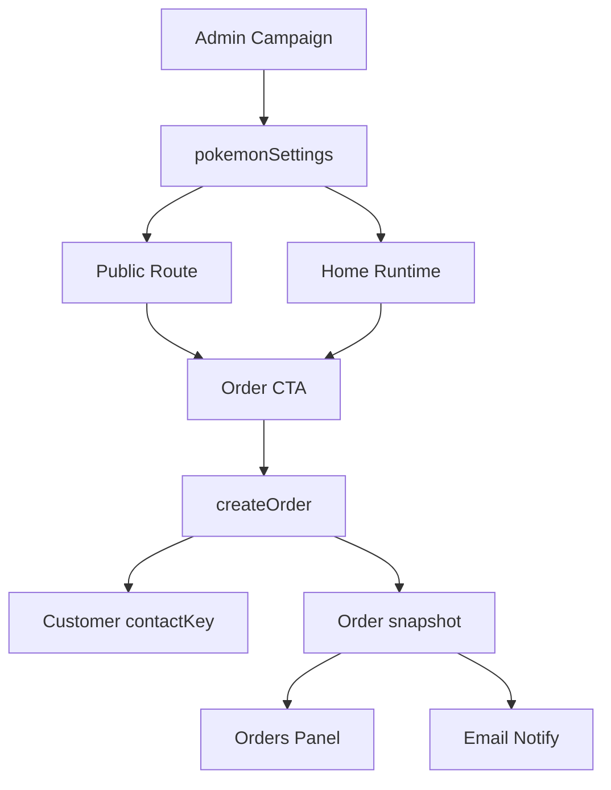

# I. Primer

## 1. TL;DR kiểu Feynman

- Mini-app hiện đã có dữ liệu Pokémon, items, orders, customers, nhưng banner và hero đang hardcode nên không đủ linh hoạt để chạy ads ngày mai.
- Ta sẽ thêm một tab **Campaign/Offers** trong `/admin/mini-apps/pokemon-champions` để bật/tắt banner “đơn đầu tiên tặng 1 Pokémon free” và cấu hình **Premium Pass Starter Pack**.
- Public mini-app và Home Component sẽ đọc cùng một source of truth (nguồn dữ liệu chuẩn) từ Convex settings, tránh preview/site lệch nhau.
- Order mới sẽ lưu snapshot (bản chụp nội dung ưu đãi tại thời điểm đặt) để admin biết khách bấm banner nào, gói nào, có eligible (đủ điều kiện) đơn đầu tiên hay không.
- Domain đề xuất: ưu tiên tên không chứa `pokemon`, `poke` để giảm rủi ro trademark/ads. Best pick: `TrainerVault.gg` hoặc `TrainerVault.vn` nếu còn mua được.

## 2. Elaboration & Self-Explanation

Khách muốn chạy ads nhanh, nên vấn đề chính không phải thiếu CRUD Pokémon mà là thiếu lớp campaign bán hàng: banner khuyến mãi, offer Premium Pass, CTA rõ, và thông tin order đủ ngữ cảnh cho admin chốt đơn. Code hiện có đã có `pokemonChampionsSettings`, `pokemonChampionsOrders`, `pokemonChampionsCustomers`, nhưng UI public đang bỏ qua settings ở vài nơi và dùng text cố định.

Hướng nâng cấp an toàn nhất là **Settings-first Campaign**: thêm cấu hình campaign vào `pokemonChampionsSettings`, mở rộng `createOrder` để nhận `source/promo/offer`, rồi render đồng bộ ở public route và Home Component. Không tạo bảng lớn mới vì hiện tại chỉ có 1 campaign và 1 pass cần bán gấp.

## 3. Concrete Examples & Analogies

Ví dụ copy banner đề xuất:

- Badge: `Launch promo`
- Title: `Đơn đầu tiên tặng 1 Pokémon miễn phí`
- Body: `Đặt Pokémon Champions hôm nay, đơn đầu tiên được tặng thêm 1 Pokémon theo danh sách áp dụng. Admin sẽ xác nhận qua Discord/Instagram/WhatsApp.`
- CTA: `Nhận ưu đãi`
- Terms: `Áp dụng theo contact đầu tiên, số lượng có hạn, admin xác nhận trước khi giao.`

Ví dụ Premium Pass Starter Pack:

- `+50 slot lưu Pokémon vĩnh viễn`
- `30 vé nhận Pokémon / Teammate Tickets`
- `50 vé train / Training Tickets`
- `Gói Starter Pack cho người mới build team nhanh`

Analogy: hiện mini-app giống một quầy hàng có sản phẩm và sổ ghi đơn, nhưng chưa có bảng quảng cáo trước cửa. Spec này thêm bảng quảng cáo, gói combo nổi bật, và ghi rõ khách vào từ bảng nào để admin chốt đúng deal.

# II. Audit Summary (Tóm tắt kiểm tra)

- Observation (Quan sát): route admin là `app/admin/mini-apps/[slug]/page.tsx`, host qua `features/mini-apps/AdminMiniAppHost.tsx` và renderer chính là `features/mini-apps/pokemon-champions/PokemonChampionsMiniApp.tsx`.
- Evidence: `PokemonChampionsMiniApp.tsx:121` có query `api.pokemonChampions.getSettings`, nhưng public component alias thành `_settingsDoc` tại `PokemonChampionsMiniApp.tsx:278`, nghĩa là settings chưa được dùng đúng cho banner/hero public.
- Evidence: `PokemonChampionsMiniApp.tsx:2525` `HomeComponentPanel` cũng nhận `settingsDoc` nhưng alias `_settingsDoc`, nên preview/home config chưa bám campaign settings.
- Evidence: `convex/pokemonChampions.ts:439` có `getSettings`, `convex/pokemonChampions.ts:445` có `updateSettings`, nhưng field hiện chỉ gồm hero/announcement/shopStatus/social.
- Evidence: `convex/pokemonChampions.ts:789` `createOrder` chỉ lưu `pokemonId`, `gameItemId`, `note`, chưa lưu campaign source, promo eligibility hoặc offer snapshot.
- Evidence: `convex/schema.ts:817`, `convex/schema.ts:894`, `convex/schema.ts:928` lần lượt là tables game items, orders, settings cần expand schema.
- Ảnh đính kèm xác nhận benefit Starter Pack: `+50 storage`, `30 Teammate Tickets`, `50 Training Tickets`, có thêm bài hát trong bản official. Spec chỉ đưa benefit liên quan slot/tickets theo yêu cầu khách, không claim official affiliation.

# III. Root Cause & Counter-Hypothesis (Nguyên nhân gốc & Giả thuyết đối chứng)

## 1. Root Cause Confidence (Độ tin cậy nguyên nhân gốc)

High. Code đã có nền mini-app và settings nhưng campaign/offers chưa được mô hình hóa thành data contract. Public/Home UI đang hardcode text bán hàng, còn order chưa lưu đủ context để vận hành ads.

## 2. Trả lời audit tối thiểu

1. Triệu chứng: expected là admin cấu hình banner/offer cho ads, actual là banner/hero/quick order hardcode và order không biết đến ưu đãi.
2. Phạm vi: mini-app Pokémon Champions admin, public route `/pokemon-champions`, Home Component runtime/preview, Convex orders/settings.
3. Tái hiện: mở `/admin/mini-apps/pokemon-champions`, thấy chỉ có `Dữ liệu CRUD` và `Home-component`, chưa có tab campaign/settings.
4. Mốc thay đổi gần nhất: không cần git history để kết luận vì evidence nằm trực tiếp ở code hiện tại.
5. Dữ liệu thiếu: chưa biết domain availability thực tế, giá pass, và danh sách Pokémon free áp dụng. Những phần này để config admin nhập, không block implementation.
6. Giả thuyết thay thế: chỉ hardcode banner trong JSX. Bị loại vì mai chạy ads cần chỉnh copy/terms nhanh mà không deploy lại.
7. Rủi ro fix sai: order nhận từ ads không có context, admin chốt nhầm ưu đãi hoặc bị abuse “đơn đầu tiên”.
8. Pass/fail: admin bật campaign, site/home hiển thị đúng, bấm CTA tạo order có `source/promo/offerSnapshot`, orders panel/email hiển thị đủ.

## 3. Counter-Hypothesis (Giả thuyết đối chứng)

- Dùng global `services` module cho Premium Pass: chưa chọn vì scope rộng, cần wiring cart/service, không cần cho mục tiêu ads ngày mai.
- Tạo bảng `pokemonChampionsOffers`: hợp lý nếu sau này nhiều pass/campaign. Hiện tại chưa cần, vì 1 promo + 1 starter pass có thể nằm trong `pokemonChampionsSettings` để nhanh và dễ rollback.

# IV. Proposal (Đề xuất)

## 1. Source of truth (Nguồn dữ liệu chuẩn)

- `pokemonChampionsSettings` là source of truth cho hero, announcement, promo banner, premium pass.
- `pokemonChampionsOrders` là source of truth cho order đã submit, có snapshot để giữ lịch sử dù sau này admin đổi copy/benefits.
- `site_url` trong global settings chỉ dùng sau khi chọn domain thật, không hardcode domain vào mini-app.

## 2. Data contract mới

Expand `pokemonChampionsSettings` bằng optional objects:

```ts
promoBanner?: {
  enabled: boolean;
  badge?: string;
  title: string;
  body: string;
  ctaText: string;
  terms?: string;
  campaignCode: 'FIRST_ORDER_FREE_POKEMON';
};
premiumPass?: {
  enabled: boolean;
  title: string;
  subtitle?: string;
  priceLabel?: string;
  ctaText: string;
  benefits: {
    storageSlots: number; // default 50
    storageDuration: 'permanent';
    teammateTickets: number; // default 30
    trainingTickets: number; // default 50
  };
};
```

Expand `pokemonChampionsCustomers` và `pokemonChampionsOrders` bằng optional fields:

```ts
contactKey?: string; // `${contactType}:${normalizedHandle}`
source?: 'pokemon-card' | 'quick-order' | 'promo-banner' | 'premium-pass';
promoCode?: 'FIRST_ORDER_FREE_POKEMON';
promoEligible?: boolean;
promoSnapshot?: Record<string, unknown>;
offerSlug?: 'premium-pass-starter';
offerSnapshot?: Record<string, unknown>;
```

## 3. Admin UX

Thêm top tab `Campaign/Offers` trong `PokemonChampionsMiniApp.tsx`:

- Shop status: open/paused.
- Hero: title/subtitle/announcement/instructions.
- Promo banner: bật/tắt, badge, title, body, CTA, terms.
- Premium Pass: bật/tắt, title, price label, benefits `50/30/50`, CTA.
- Preview block nhỏ ngay trong tab để admin thấy banner/pass trước khi ra site.

## 4. Public/Home UI

- Public route dùng `settingsDoc.heroTitle`, `settingsDoc.heroSubtitle`, `settingsDoc.announcement` thay vì hardcode.
- Nếu `promoBanner.enabled`, hiển thị banner nổi bật phía trên filter/list.
- Nếu `premiumPass.enabled`, hiển thị card “Premium Pass Starter Pack” ngay dưới banner, có benefit chips và CTA.
- CTA promo mở quick order với `source='promo-banner'`, `promoCode='FIRST_ORDER_FREE_POKEMON'`.
- CTA premium pass mở quick order với `source='premium-pass'`, `offerSlug='premium-pass-starter'`.

## 5. Preview ↔ Site parity map

| Surface | File | Contract cần giữ |
|---|---|---|
| Admin create/edit home component | `app/admin/home-components/create/pokemon-champions/page.tsx`, `app/admin/home-components/pokemon-champions/[id]/edit/page.tsx` | Không đổi schema home-component hiện có, chỉ giữ config style/maxItems/route |
| Admin mini-app | `features/mini-apps/pokemon-champions/PokemonChampionsMiniApp.tsx` | Campaign tab lưu vào `pokemonChampionsSettings`, preview dùng cùng fallback/default |
| Public mini-app | `features/mini-apps/pokemon-champions/PokemonChampionsMiniApp.tsx` | Hero/banner/pass đọc từ settings, không hardcode copy ads |
| Home runtime | `components/site/home/sections/PokemonChampionsRuntimeSection.tsx` | Render cùng promo/pass với public route, giữ brand colors và responsive |
| Convex | `convex/schema.ts`, `convex/pokemonChampions.ts` | Optional expand, không phá dữ liệu cũ, order snapshot giữ lịch sử |

## 6. Domain recommendation

Không nên mua domain chứa `pokemon`, `poke`, `pokemonchampions` vì rủi ro trademark và ads review. Đề xuất theo thứ tự:

1. `TrainerVault.gg` hoặc `TrainerVault.vn` (best fit, nghe game, gợi ý storage slots/pass)
2. `BattleReadyBox.com` hoặc `.gg` (dễ hiểu cho offer build team)
3. `ChampionVault.gg` (bám “Champions” nhưng không dùng Pokémon)
4. `TeamTicket.gg` (bám ticket/pass, ngắn)

Sau khi mua domain, cập nhật `site_url` ở `/admin/settings/general`, route mini-app vẫn là `/pokemon-champions` hoặc `/apps/pokemon-champions` theo cấu hình hiện có.

## 7. Data flow



# V. Files Impacted (Tệp bị ảnh hưởng)

## 1. Convex/server

- Sửa: `convex/schema.ts`. Vai trò hiện tại là định nghĩa tables Pokémon Champions. Thay đổi: expand optional fields cho settings/customers/orders, thêm index `by_contactKey` nếu dùng `contactKey`.
- Sửa: `convex/pokemonChampions.ts`. Vai trò hiện tại là CRUD/settings/order mutations. Thay đổi: update validators, defaults, `updateSettings`, `createOrder` source/promo/offer snapshot, first-order eligibility theo `contactKey`.
- Sửa: `convex/emailTemplates.ts`. Vai trò hiện tại là email admin cho order mới. Thay đổi: hiển thị campaign/promo/pass snapshot để admin biết đơn đến từ banner hay premium pass.

## 2. Admin/Public UI

- Sửa: `features/mini-apps/pokemon-champions/PokemonChampionsMiniApp.tsx`. Vai trò hiện tại là admin CRUD, home panel, public mini-app. Thay đổi: thêm tab Campaign/Offers, dùng settings thật cho hero/banner/pass, truyền source/promo/offer vào quick order.
- Sửa: `components/site/home/sections/PokemonChampionsRuntimeSection.tsx`. Vai trò hiện tại là home runtime section và quick order modal. Thay đổi: render promo/pass đồng bộ với public route, truyền source/promo/offer vào order.

## 3. Mini-app defaults/config

- Sửa nếu cần: `lib/mini-apps/registry.ts`. Vai trò hiện tại là default mini app config. Thay đổi nhỏ: chỉ cập nhật default home style/copy nếu cần, không đổi route mặc định nếu không cần.

# VI. Execution Preview (Xem trước thực thi)

1. Expand Convex schema bằng optional fields để dữ liệu cũ không vỡ.
2. Cập nhật validators/defaults trong `convex/pokemonChampions.ts`.
3. Thêm helper normalize contact handle và `contactKey` trong `createOrder`.
4. Cập nhật `createOrder` để tính `promoEligible` theo orderCount trước khi tạo order.
5. Thêm Campaign/Offers panel trong admin mini-app, lưu qua `api.pokemonChampions.updateSettings`.
6. Đổi public mini-app từ hardcode sang đọc `settingsDoc` với fallback an toàn.
7. Đổi Home Runtime Section để hiển thị cùng banner/pass và giữ parity với preview/site.
8. Cập nhật Orders Panel và email template để hiện source, promo eligibility, offer snapshot.
9. Tự review tĩnh theo data contract, null-safety, legacy records, responsive và long text.
10. Commit local sau khi implement xong, không push.

# VII. Verification Plan (Kế hoạch kiểm chứng)

- Type/schema: kiểm tra các Convex validators khớp `schema.ts`, optional fields không làm lỗi records cũ.
- UI static review: admin tab lưu được draft, public/home không crash khi `settingsDoc` null hoặc thiếu field mới.
- Repro thủ công cho tester:
  1. Vào `/admin/mini-apps/pokemon-champions`.
  2. Bật promo banner và premium pass.
  3. Mở `/pokemon-champions`, thấy banner/pass đúng copy.
  4. Bấm CTA promo, submit contact mới, order có `promoEligible=true`.
  5. Submit lại cùng contact, order mới có `promoEligible=false`.
  6. Bấm CTA premium pass, order có `source='premium-pass'` và `offerSnapshot`.
  7. Mở tab Orders, email preview/log thể hiện đúng source/promo/pass.
- Validator dự kiến sau implement: chạy typecheck phù hợp repo bằng `bunx tsc --noEmit 2>&1 | Select-Object -First 10`; không chạy build nếu không cần. Commit hook sẽ kiểm tra staged lint/type theo cấu hình repo.

# VIII. Todo

- [ ] Expand schema/settings/orders/customers theo data contract.
- [ ] Cập nhật Convex mutations/validators/defaults.
- [ ] Thêm tab Campaign/Offers trong admin mini-app.
- [ ] Render promo banner và premium pass ở public route.
- [ ] Render promo banner và premium pass ở Home Runtime, giữ preview/site parity.
- [ ] Hiển thị source/promo/pass trong Orders Panel và email admin.
- [ ] Tự review tĩnh, chạy validator phù hợp, commit local.

# IX. Acceptance Criteria (Tiêu chí chấp nhận)

- Admin có thể bật/tắt và sửa copy banner “đơn đầu tiên tặng 1 Pokémon free” mà không sửa code.
- Admin có thể bật/tắt Premium Pass Starter Pack và chỉnh benefit/price label/CTA.
- Public mini-app và Home Component hiển thị cùng nội dung campaign, không lệch preview/site.
- Order từ promo banner lưu source, promo code, eligibility, snapshot.
- Order từ Premium Pass lưu source, offer slug, offer snapshot.
- Order cũ không vỡ vì fields mới là optional.
- Domain recommendation rõ ràng và `site_url` có chỗ cập nhật sau khi mua domain.

# X. Risk / Rollback (Rủi ro / Hoàn tác)

- Risk: `first order` chỉ chống abuse theo contact handle/contact type, khách vẫn có thể dùng account khác. Mitigation: hiển thị terms “admin xác nhận”, lưu eligibility để admin duyệt.
- Risk: domain có thể đã bị mua. Mitigation: list nhiều option và check registrar trước khi cập nhật `site_url`.
- Risk: trademark nếu dùng `Pokemon/Poke` trong domain hoặc ads copy. Mitigation: không đề xuất domain chứa trademark, copy tránh claim official affiliation.
- Rollback: tắt `promoBanner.enabled` và `premiumPass.enabled` trong settings là ẩn campaign ngay. Code optional fields không cần migrate rollback dữ liệu cũ.

# XI. Out of Scope (Ngoài phạm vi)

- Không tích hợp thanh toán/cart/service module đầy đủ cho Premium Pass trong vòng nâng cấp này.
- Không tự mua domain hoặc cấu hình DNS/Vercel domain.
- Không kiểm tra availability domain theo registrar trong spec này.
- Không dùng ảnh official làm asset quảng cáo nếu chưa có quyền sử dụng.