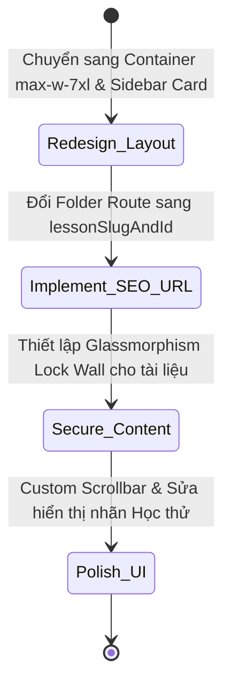

# I. Primer

## 1. TL;DR kiểu Feynman
- Giao diện trang bài học riêng hiện tại bị lỗi bố cục rời rạc: Sidebar nằm sát tịt lề trái màn hình, trong khi nội dung chính (video/tài liệu) lại nằm lệch về bên phải, tạo ra một khoảng trống rộng rất xấu và thiếu chuyên nghiệp.
- **Sửa lỗi Layout & Sidebar:** Đưa cả Sidebar và Cột nội dung chính vào một Container chung `max-w-7xl mx-auto`. Thiết kế Sidebar thành một khối thẻ (Card Layout) bo góc `rounded-xl`, có viền `border-slate-200` và bóng đổ nhẹ `shadow-sm` thay vì kéo dài sát lề.
- **Sửa lỗi đường dẫn (Route URL):** Chuyển URL bài học từ ID thô (`/bai-hoc/vx765...`) sang định dạng SEO thân thiện: `/bai-hoc/slug-tieu-de-bai-hoc--[lessonId]` bằng phương pháp Route lai (Hybrid Route) không làm thay đổi cấu trúc Database.
- **Bảo mật tài liệu bài học:** Che mờ nội dung tài liệu (Glassmorphism Blur) bên dưới Video Player nếu người dùng chưa đăng nhập hoặc chưa mua khóa học.
- **Phân biệt nhãn học thử:** Kể cả khi chưa đăng nhập, các bài học xem thử vẫn hiển thị nhãn "Học thử" để kích thích tạo tài khoản, chỉ có bài học chính thức mới hiển thị icon ổ khóa `Lock`.

## 2. Elaboration & Self-Explanation
- **Về Bố cục trang (Layout):** Việc sử dụng thuộc tính `max-w-4xl mx-auto` cho cột chính mà không giới hạn độ rộng bao quát của toàn trang khiến Next.js đẩy hai khối chính về hai phía đối lập trên màn hình lớn. Bằng cách bao bọc cả hai khối trong một Grid Container có độ rộng tối đa `max-w-7xl` căn giữa màn hình, Sidebar và Cột chính sẽ đứng cạnh nhau với khoảng cách `gap-6` (24px) thống nhất. Sidebar thiết kế dạng Card rời rạc, có chiều cao giới hạn theo khung nhìn (`100vh`) và thanh cuộn ẩn tinh tế giúp giao diện tổng thể gọn gàng, cân đối.
- **Về URL lai thân thiện SEO:** Để tránh rủi ro khi thay đổi cấu trúc bảng Convex (do bảng `courseLessons` chưa có trường `slug`), chúng ta tạo slug động trên client từ `title` của bài học, sau đó nối với ID thật qua dấu `--`. Hệ thống Next.js sẽ parse ID từ URL để thực hiện query dữ liệu, đảm bảo URL đẹp cho SEO mà không cần migration dữ liệu.
- **Về Login Wall cho tài liệu:** Người dùng yêu cầu khóa học miễn phí hay có phí đều phải đăng nhập mới xem được. Do đó, nếu chưa đăng nhập hoặc chưa mua khóa học, phần tài liệu mô tả chi tiết bài học ở dưới sẽ bị áp một lớp kính mờ (Backdrop blur) che phủ hoàn toàn, ngăn chặn việc rò rỉ tài liệu học tập.

## 3. Concrete Examples & Analogies
- **Ví dụ cụ thể:** 
  - URL trước cải tiến: `/khoa-hoc-kien-truc-noi-than/bai-hoc/vx765sabssvx28f54wxp1c5b8x87y3g2`
  - URL sau cải tiến: `/khoa-hoc-kien-truc-noi-than/bai-hoc/bai-1-lam-quen-autocad-va-tieu-chuan-ban-ve--vx765sabssvx28f54wxp1c5b8x87y3g2`
  - Trên màn hình máy tính lớn, Sidebar bài học (đã bo góc đẹp, có viền mảnh) nằm căn lề thẳng hàng với Logo Dohy ở phía trên. Kế bên phải là trình phát video và tài liệu, liên kết chặt chẽ và không còn khoảng trống thừa thải nào ở giữa.
- **Hình ảnh so sánh:** Giống như một cuốn sách giáo khoa điện tử. Trang sách được thiết kế đẹp mắt với mục lục nằm ngay bên lề trang nội dung (Sidebar Card). Nếu mục lục bị xé rời và dán ở bìa trước, còn trang nội dung nằm ở bìa sau và ở giữa là một khoảng trống rỗng, người đọc sẽ thấy cuốn sách cực kỳ chắp vá và khó theo dõi. Việc đưa chúng vào chung một khung hình giúp trải nghiệm đọc liền mạch và tự nhiên.

---

# II. Audit Summary (Tóm tắt kiểm tra)

Sau khi rà soát kỹ hình ảnh giao diện thực tế do người dùng cung cấp và mã nguồn [page.tsx](file:///e:/NextJS/job/job_from_system_vietadmin/system_dohy/app/(site)/khoa-hoc/[slug]/bai-hoc/[lessonId]/page.tsx):

1. **Vấn đề Khoảng cách & Bố cục (Layout Split):**
   - Thẻ `<main>` sử dụng cấu trúc `flex-col lg:flex-row` kéo dài toàn màn hình nhưng cột nội dung lại dùng `max-w-4xl mx-auto` làm cột chính bị co lại ở giữa, tách biệt quá xa so với Sidebar bài học ở biên trái.
   - Sidebar được thiết kế kéo dài sát biên trái, không có viền bao ngoài hay bo góc, tạo cảm giác thô sơ và không đồng bộ với ngôn ngữ thiết kế chung (Card UI).
   - Scrollbar mặc định của trình duyệt ở sidebar quá to và thô.

2. **Vấn đề URL Routing:**
   - Folder route hiện tại là `app/(site)/khoa-hoc/[slug]/bai-hoc/[lessonId]` sử dụng ID thô của Convex làm địa chỉ URL.

3. **Vấn đề Phân quyền hiển thị:**
   - Toàn bộ bài học hiển thị icon `Lock` khi chưa đăng nhập, che khuất thông tin bài nào được phép học thử sau khi đăng nhập.
   - Tài liệu mô tả chi tiết của bài học ở dưới vẫn hiển thị đầy đủ cho người chưa đăng nhập.

---

# III. Root Cause & Counter-Hypothesis (Nguyên nhân gốc & Giả thuyết đối chứng)

- **Nguyên nhân gốc 1 (Lỗi khoảng trống Sidebar):** Việc thiếu một Container giới hạn chiều rộng bao quanh (`max-w-7xl`) làm mất kiểm soát khoảng cách giữa Sidebar (align-left) và Cột chính (align-center) trên màn hình độ phân giải lớn.
- **Nguyên nhân gốc 2 (Lỗi URL):** Folder route được đặt tên parameter theo ID thô `[lessonId]` thay vì route động SEO `[lessonSlugAndId]`.
- **Giả thuyết đối chứng:** Nếu đưa toàn bộ layout vào trong một Container `max-w-7xl mx-auto flex flex-col lg:flex-row gap-6 px-4 py-8`, đồng thời thiết kế Sidebar thành một Card card-style (`border border-slate-200 rounded-xl bg-white shadow-sm`), khoảng trống thừa sẽ biến mất, Sidebar và Cột chính sẽ đứng cạnh nhau hài hòa, nâng tầm thẩm mỹ giao diện.

---

# IV. Proposal (Đề xuất)

Chúng tôi đề xuất kế hoạch triển khai nâng cấp toàn diện trang chi tiết bài học như sau:



### 1. Tier 0: Sửa lỗi bố cục Sidebar rời rạc & URL SEO lai (Critical)
- **a) Thiết kế Container layout Max-W-7xl:**
  - Gom toàn bộ layout trong `page.tsx` vào Container:
    ```tsx
    <main className="min-h-screen bg-slate-50 flex justify-center pb-24">
      <div className="w-full max-w-7xl flex flex-col lg:flex-row gap-6 px-4 py-8">
        {/* Sidebar Card */}
        <aside className="w-full lg:w-80 shrink-0 bg-white border border-slate-200 rounded-xl shadow-sm flex flex-col h-auto lg:h-[calc(100vh-120px)] lg:sticky lg:top-24 overflow-y-auto">
          ...
        </aside>
        
        {/* Main Content */}
        <section className="flex-1 min-w-0 flex flex-col gap-6">
          ...
        </section>
      </div>
    </main>
    ```
  - Thay đổi này giúp Sidebar và Cột chính đứng cạnh nhau gọn gàng, cân đối, loại bỏ hoàn toàn khoảng trống thừa ở giữa.
- **b) Cấu hình URL SEO lai:**
  - Tạo hàm `convertToSlug` trong `courseUtils.ts` để chuyển tiêu đề bài học thành slug không dấu.
  - Đổi tên thư mục route thành `app/(site)/khoa-hoc/[slug]/bai-hoc/[lessonSlugAndId]/page.tsx`.
  - Trong code `page.tsx`, lấy ID bài học từ parameter `lessonSlugAndId` bằng cách tách chuỗi sau ký tự `--`.
  - Thay đổi toàn bộ liên kết hướng trang bài học sang định dạng mới: `/khoa-hoc/${course.slug}/bai-hoc/${convertToSlug(lesson.title)}--${lesson._id}`.

### 2. Tier 1: Bảo mật nội dung tài liệu & Phân biệt nhãn Học thử (High Priority)
- **a) Khóa nội dung mô tả (Content Lock Wall):**
  - Nếu `hasAccess === false`, áp dụng bộ lọc mờ `blur-sm pointer-events-none select-none` cho phần mô tả bài học bên dưới.
  - Hiển thị một khung thông báo Glassmorphism đè lên trên vùng bị mờ: *"Bạn cần Đăng nhập/Kích hoạt khóa học để xem tài liệu bài học này."*
- **b) Tối ưu hóa nhãn hiển thị trên Sidebar:**
  - Hiển thị rõ nhãn "Học thử" màu xanh lá cây hoặc icon Play cho các bài học xem thử kể cả khi chưa đăng nhập. Chỉ hiển thị icon ổ khóa `Lock` đối với các bài học trả phí không được xem thử.
  - Tăng khoảng cách padding cho mỗi hàng bài học (`py-3.5 px-5`), đường viền trái active dày 4px mang màu thương hiệu vàng đen rõ rệt.

### 3. Tier 2: Làm đẹp chi tiết giao diện - Polish (Medium Priority)
- **a) Custom Scrollbar cho Sidebar:**
  - Thêm CSS tùy biến cho scrollbar trong `aside` để tạo thanh cuộn mỏng nhẹ Premium, tự động ẩn khi người dùng không hover chuột vào sidebar.
- **b) Loại bỏ thư mục route cũ:**
  - Xóa hoàn toàn thư mục route `app/(site)/khoa-hoc/[slug]/bai-hoc/[lessonId]` để dọn dẹp dự án sạch sẽ.

---

# V. Files Impacted (Tệp bị ảnh hưởng)

### UI Components (Giao diện)
- #### [MODIFY/RENAME] [page.tsx](file:///e:/NextJS/job/job_from_system_vietadmin/system_dohy/app/(site)/khoa-hoc/[slug]/bai-hoc/[lessonId]/page.tsx)
  - Vai trò: Giao diện trang bài học riêng.
  - Thay đổi: Đổi tên thư mục cha sang `[lessonSlugAndId]`. Thiết kế lại bố cục Card Container Max-w-7xl, bổ sung Lock Wall cho tài liệu giáo trình và tùy biến CSS scrollbar.
- #### [MODIFY] [CourseDetailPage.tsx](file:///e:/NextJS/job/job_from_system_vietadmin/system_dohy/app/(site)/_components/courses/CourseDetailPage.tsx)
  - Vai trò: Trang chi tiết khóa học.
  - Thay đổi: Cập nhật đường dẫn URL liên kết bài học sang định dạng URL lai có chứa slug tiêu đề bài học.

### Shared Utilities (Tiện ích dùng chung)
- #### [MODIFY] [courseUtils.ts](file:///e:/NextJS/job/job_from_system_vietadmin/system_dohy/lib/courses/courseUtils.ts)
  - Vai trò: Các hàm tiện ích khóa học.
  - Thay đổi: Thêm và export hàm `convertToSlug` chuyển đổi tiếng Việt có dấu thành slug không dấu.

---

# VI. Execution Preview (Xem trước thực thi)

1. **Bước 1 (Cập nhật courseUtils):** Viết thêm hàm `convertToSlug` vào `courseUtils.ts`.
2. **Bước 2 (Chuyển đổi URL lai):** Sửa liên kết bài học trong `CourseDetailPage.tsx` và `CoursePreview.tsx` sang dạng URL lai mới.
3. **Bước 3 (Đổi tên Folder Route):** Tiến hành chuyển đổi thư mục Next.js của trang bài học thành `[lessonSlugAndId]`.
4. **Bước 4 (Cập nhật page.tsx mới):** Viết lại mã nguồn `page.tsx` trong route bài học mới để cấu hình container `max-w-7xl`, thiết kế Sidebar Card, tùy biến custom scrollbar, sửa hiển thị nhãn Học thử và làm mờ bảo mật phần mô tả tài liệu bên dưới.
5. **Bước 5 (Dọn dẹp):** Xóa thư mục route ID thô cũ.

---

# VII. Verification Plan (Kế hoạch kiểm chứng)

### Manual Verification (Kiểm chứng thủ công)
- Truy cập trang chi tiết khóa học: nhấp vào một bài học bất kỳ.
- Xác nhận URL hiển thị đẹp mắt có chứa tiêu đề bài học và ID, ví dụ: `/khoa-hoc/khoa-hoc-kien-truc-noi-that/bai-hoc/bai-1-lam-quen-autocad--vx765...`.
- Xác nhận bố cục: Sidebar bài học và Cột chính đứng cạnh nhau gọn gàng, thẳng lề với các phần tử Header phía trên, không còn khoảng trống thừa rộng. Sidebar có viền và bo góc đẹp.
- Khi chưa đăng nhập:
  - Xác nhận Sidebar hiển thị rõ nhãn "Học thử" cho bài học xem thử, các bài khác hiện icon Lock.
  - Xác nhận phần tài liệu mô tả bên dưới bị mờ đi và có bảng thông báo yêu cầu đăng nhập đè lên.

---

# VIII. Todo

- [ ] Bổ sung hàm `convertToSlug` vào [courseUtils.ts](file:///e:/NextJS/job/job_from_system_vietadmin/system_dohy/lib/courses/courseUtils.ts).
- [ ] Thay đổi liên kết bài học trong [CourseDetailPage.tsx](file:///e:/NextJS/job/job_from_system_vietadmin/system_dohy/app/(site)/_components/courses/CourseDetailPage.tsx) và [CoursePreview.tsx](file:///e:/NextJS/job/job_from_system_vietadmin/system_dohy/components/experiences/previews/CoursePreview.tsx) sang URL lai.
- [ ] Cấu hình lại thư mục route Next.js thành `[lessonSlugAndId]`.
- [ ] Thiết lập trang [page.tsx](file:///e:/NextJS/job/job_from_system_vietadmin/system_dohy/app/(site)/khoa-hoc/[slug]/bai-hoc/[lessonSlugAndId]/page.tsx) mới với container `max-w-7xl`, thiết kế Sidebar Card, tùy biến custom scrollbar, và logic khóa mô tả tài liệu bên dưới.
- [ ] Xóa thư mục route cũ `[lessonId]`.

---

# IX. Acceptance Criteria (Tiêu chí chấp nhận)

- **Layout tổng thể:**
  - Sidebar và Cột chính nằm trong container `max-w-7xl mx-auto`. Có khoảng cách `gap-6` đều đặn, không có khoảng trống thừa rộng ở giữa.
  - Sidebar thiết kế dạng Card có border, rounded-xl và shadow-sm. Custom scrollbar hoạt động trơn tru, ẩn hiện tự nhiên.
- **URL thân thiện:**
  - URL bài học có dạng `/khoa-hoc/[slug]/bai-hoc/tieu-de-bai-hoc--[lessonId]`. Dữ liệu bài học tải lên chính xác.
- **Bảo mật mô tả giáo trình:**
  - Khách chưa đăng nhập/chưa mua khóa học không thể đọc nội dung tài liệu chi tiết bài học bên dưới. Nội dung tài liệu bị làm mờ (blur) hoàn toàn.
- **Nhãn hiển thị:**
  - Phân biệt rõ ràng bài nào được "Học thử" và bài nào bị "Lock" trên Sidebar kể cả trước khi đăng nhập.
