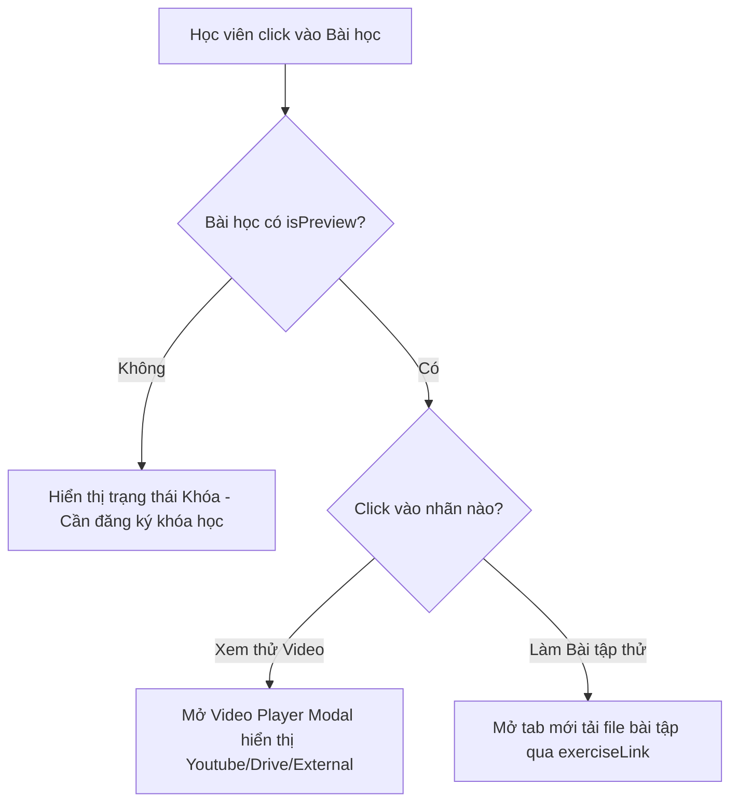

# I. Primer

## 1. TL;DR kiểu Feynman
- Trang chi tiết khóa học hiện tại đã hiển thị danh sách chương và bài học, nhưng trải nghiệm tương tác với "Tóm tắt chương" (summary) và "Bài học xem thử" (preview/exercise) vẫn còn thô sơ.
- **Tóm tắt chương (summary):** Thay vì ẩn đi hoặc hiển thị text thô lộn xộn, ta sẽ hiển thị tóm tắt chương ở đầu danh sách bài học **khi mở Accordion** với thiết kế khối ghi chú (Note Box) tinh tế. Hệ thống sẽ tự động phát hiện và ẩn các dữ liệu rác (Legacy summary) để tránh lặp thông tin.
- **Bài học xem thử (isPreview):** Thay vì chỉ hiển thị nhãn "Xem thử" dạng text tĩnh, ta sẽ biến nó thành nút bấm tương tác (Interactive Button) có icon Play. Khi click vào, một hộp thoại (Modal Video Player) sẽ hiện lên chiếu trực tiếp video bài học đó.
- **Bài tập thử (Exercise Link):** Nếu bài học có đính kèm bài tập thử (`exerciseLink`), ta hiển thị thêm biểu tượng luyện tập để học viên tải về làm thử, tạo kích thích chuyển đổi đăng ký học rất lớn.

## 2. Elaboration & Self-Explanation
Việc bổ sung tính năng tương tác trực tiếp cho học viên trước khi họ quyết định mua khóa học là đòn bẩy quan trọng để tăng tỷ lệ chuyển đổi.
- **Về Tóm tắt chương:** Bản chất trường `summary` trong table `courseChapters` là tùy chọn (optional). Thiết kế hợp lý nhất là khi đóng accordion, ta giữ giao diện tối giản nhất. Khi mở accordion ra, nếu chương đó có mô tả tóm tắt, ta hiển thị nó như một đoạn dẫn nhập (Introduction) được trang trí bằng một đường viền bên trái (border-left) mang màu thương hiệu, sau đó mới liệt kê danh sách bài học chi tiết ở dưới. Việc này giúp học viên định hình được kiến thức trọng tâm của chương đó.
- **Về Bài học xem thử và Bài tập thử:** Cấu trúc DB Convex hiện tại đã có sẵn các trường dữ liệu quý giá như `isPreview` (boolean), `videoUrl` (string), `videoType` (youtube/drive/external) và `exerciseLink` (string) nhưng giao diện site thực tế chưa khai thác. Khi chuyển đổi nhãn "Xem thử" từ dạng tĩnh sang dạng động (clickable), ta cho phép học viên học thử ngay lập tức thông qua một Video Player Modal. Nếu bài học có bài tập đi kèm, một liên kết mở tab mới cho phép họ trải nghiệm chất lượng học tập thực tế.

## 3. Concrete Examples & Analogies
- **Ví dụ cụ thể:** Học viên truy cập khóa học "Thiết kế hệ thống SaaS", họ mở Chương 2 "Kết nối và hiển thị dữ liệu". Đầu chương hiển thị một hộp ghi chú màu vàng/xám giới thiệu: *"Chương này sẽ giúp bạn nắm vững cách Convex DB hoạt động..."*. Dưới đó là danh sách bài học, bài số 2.1 có icon Play màu emerald kèm chữ "Học thử". Học viên click vào, một màn hình video Youtube/Drive hiện lên dạy bài "Làm quen với Convex DB". Bên cạnh có link "Tải bài tập thực hành" để họ làm thử file code.
- **Hình ảnh so sánh:** Giống như bạn đi mua ô tô. Thay vì chỉ đứng ngoài nhìn qua cửa kính (giao diện tĩnh) hoặc đọc tờ catalog (summary thô), nhân viên bán hàng mở cửa xe mời bạn ngồi vào ghế lái (mở Accordion xem tóm tắt chương) và cho phép bạn nổ máy lái thử một vòng quanh showroom (Play video xem thử + làm bài tập thử). Trải nghiệm thực tế này chắc chắn sẽ làm tăng mong muốn mua xe của bạn lên gấp nhiều lần.

---

# II. Audit Summary (Tóm tắt kiểm tra)

Sau khi kiểm tra cấu trúc schema của Convex DB tại [schema.ts](file:///e:/NextJS/job/job_from_system_vietadmin/system_dohy/convex/schema.ts) dòng 1265:
- Bảng `courseChapters` có trường `summary` (v.optional(v.string())) chứa tóm tắt chương học.
- Bảng `courseLessons` có các trường:
  - `isPreview`: `v.boolean()` (xác định bài học được học thử).
  - `videoType`: `v.union(v.literal("none"), v.literal("youtube"), v.literal("drive"), v.literal("external"))`.
  - `videoUrl`: `v.optional(v.string())` (đường dẫn video học thử).
  - `exerciseLink`: `v.optional(v.string())` (đường dẫn bài tập đi kèm).

Hiện tại giao diện hiển thị:
- Chỉ render tên bài học và nhãn "Xem thử" tĩnh, hoàn toàn không cho phép click hay tương tác để xem video hoặc bài tập.

---

# III. Root Cause & Counter-Hypothesis (Nguyên nhân gốc & Giả thuyết đối chứng)

- **Nguyên nhân gốc:** Giao diện chi tiết khóa học hiện tại chỉ được xây dựng như một trang thông tin tĩnh (Information Page) thay vì một trang trải nghiệm học tập (Learning Experience Page). Các trường dữ liệu phục vụ tương tác như `videoUrl` hay `exerciseLink` chưa được kết nối (wire up) vào các sự kiện click trên giao diện.
- **Giả thuyết đối chứng:** Nếu ta tích hợp một React State để quản lý video học thử đang phát (`activePreviewVideo`) và mở một hộp thoại Modal hiển thị Video Player tương ứng với `videoType` (Youtube iframe hoặc video player chuẩn) khi học viên click vào bài học xem thử, đồng thời hiển thị link tải bài tập nếu có `exerciseLink`, trang web sẽ trở nên sống động và tăng đáng kể độ uy tín chuyên nghiệp.

---

# IV. Proposal (Đề xuất)

Chúng tôi đề xuất giải pháp tích hợp trải nghiệm học thử và xem tóm tắt chương tối ưu nhất như sau:

### 1. Trải nghiệm Tóm tắt chương (Summary)
- Hiển thị tóm tắt chương học (`chapter.summary`) ngay đầu nội dung Accordion khi được mở ra.
- Thiết kế hộp tóm tắt (`Summary Box`):
  - Background xám nhạt/vàng nhạt `bg-slate-50 border-l-4 border-amber-500` (đồng bộ màu thương hiệu Dohy).
  - Sử dụng icon `BookOpen` hoặc `Lightbulb` nhỏ màu thương hiệu ở đầu đoạn để làm điểm nhấn.
  - Sử dụng component `RichContent` để hỗ trợ render định dạng HTML/Markdown đầy đủ mà admin nhập vào.

### 2. Trải nghiệm Học thử (Video Preview Modal)
- **a) Thiết kế hàng bài học có tính năng xem thử:**
  - Thay đổi nhãn "Xem thử" tĩnh thành một nút bấm có hiệu ứng hover mượt mà: `bg-emerald-50 text-emerald-700 hover:bg-emerald-100 transition-colors cursor-pointer`.
  - Bổ sung icon `PlayCircle` (kích thước 14px) nằm trước tiêu đề bài học để tạo gợi ý trực quan cho việc click phát video.
- **b) Tích hợp Video Player Modal:**
  - Khi học viên click vào nút "Xem thử" hoặc tiêu đề bài học xem thử, hệ thống sẽ mở một hộp thoại Dialog nổi trên màn hình (Modal overlay).
  - Tự động parse `videoUrl` dựa trên `videoType`:
    - **Youtube:** Sử dụng iframe embed chuẩn (`https://www.youtube.com/embed/{videoId}`).
    - **Drive:** Sử dụng Google Drive preview embed.
    - **External/Direct:** Sử dụng thẻ `<video>` HTML5 mặc định kèm các nút điều khiển.
  - Thiết kế Modal sang trọng: Nền đen mờ (Backdrop blur), nút đóng (Close button) nổi bật ở góc phải, tiêu đề bài học hiển thị rõ ràng trên đầu video.

### 3. Trải nghiệm Bài tập thử (Exercise Link)
- Nếu bài học có trường `exerciseLink` tồn tại, hiển thị thêm một nút nhỏ dạng icon `Download` hoặc `FileSpreadsheet` màu xanh lam bên cạnh nhãn xem thử:
  - Nhãn hiển thị: "Bài tập thử" hoặc icon tải bài tập.
  - Khi click vào, hệ thống tự động mở liên kết `exerciseLink` ở một tab mới (`target="_blank"`) để người dùng tải file tài liệu thực hành.

---

# V. Files Impacted (Tệp bị ảnh hưởng)

### UI Components (Giao diện)
- #### [MODIFY] [CourseDetailPage.tsx](file:///e:/NextJS/job/job_from_system_vietadmin/system_dohy/app/(site)/_components/courses/CourseDetailPage.tsx)
  - Vai trò: Trang hiển thị chi tiết khóa học trên site thực tế.
  - Thay đổi: Tích hợp state `activeVideo` để hiển thị Modal Video Player. Cập nhật cấu trúc hiển thị bài học xem thử và tích hợp nút tải bài tập.
- #### [MODIFY] [CoursePreview.tsx](file:///e:/NextJS/job/job_from_system_vietadmin/system_dohy/components/experiences/previews/CoursePreview.tsx)
  - Vai trò: Trang preview giao diện khóa học trong Admin.
  - Thay đổi: Đồng bộ hóa logic hiển thị nút xem thử và giả lập Modal phát video mẫu để người quản trị có trải nghiệm trực quan giống hệt site thực tế.

---

# VI. Execution Preview (Xem trước thực thi)

1. **Bước 1 (Xây dựng Modal Video Player trong CourseDetailPage.tsx):**
   - Viết component con `VideoPreviewModal` hoặc nhúng trực tiếp cấu trúc Modal sử dụng overlay và iframe phát video.
   - Thêm React State: `const [previewVideo, setPreviewVideo] = useState<{ title: string; url: string; type: string } | null>(null);`.
2. **Bước 2 (Gắn sự kiện click cho bài học xem thử):**
   - Chuyển thẻ bọc thông tin bài học thành nút bấm hành động nếu có `lesson.isPreview`.
   - Khi click, set thông tin video vào state `previewVideo` để mở modal.
3. **Bước 3 (Hiển thị liên kết bài tập):**
   - Kiểm tra điều kiện `lesson.exerciseLink` để hiển thị thêm nhãn liên kết tải tài liệu.
4. **Bước 4 (Đồng bộ sang CoursePreview.tsx):**
   - Đảm bảo bản Preview cũng có đầy đủ logic giả lập này để kiểm tra cấu hình thiết kế bo góc, màu sắc của Modal phát video.

---

# VII. Verification Plan (Kế hoạch kiểm chứng)

### Manual Verification (Kiểm chứng thủ công)
- Truy cập trang chi tiết khóa học thực tế trên site.
- Click mở Accordion một chương bất kỳ:
  - Xác nhận xem "Tóm tắt chương" hiển thị trong Summary Box viền vàng/xám có đẹp và cân đối không.
  - Xác nhận bài học xem thử có icon Play màu emerald và nhãn "Xem thử" nổi bật.
- Rà soát tính năng click:
  - Click vào nút "Xem thử" của bài học. Xác nhận một Modal xuất hiện ở giữa màn hình phát video mượt mà. Nhấn phím `ESC` hoặc click ra ngoài overlay để đóng modal.
  - Click vào icon bài tập thử (nếu có). Xác nhận liên kết được mở ở tab mới chính xác.

---

# VIII. Todo

- [ ] Import thêm icon `Play`, `Download`, `X` từ `lucide-react` trong [CourseDetailPage.tsx](file:///e:/NextJS/job/job_from_system_vietadmin/system_dohy/app/(site)/_components/courses/CourseDetailPage.tsx).
- [ ] Xây dựng React State và Component Modal Video phát thử bài học trong [CourseDetailPage.tsx](file:///e:/NextJS/job/job_from_system_vietadmin/system_dohy/app/(site)/_components/courses/CourseDetailPage.tsx).
- [ ] Cập nhật logic render bài học có nhãn `Xem thử` và `Bài tập` để kết nối sự kiện click mở video và tải bài tập.
- [ ] Đồng bộ hóa toàn bộ logic và giao diện giả lập phát video sang [CoursePreview.tsx](file:///e:/NextJS/job/job_from_system_vietadmin/system_dohy/components/experiences/previews/CoursePreview.tsx).

---

# IX. Acceptance Criteria (Tiêu chí chấp nhận)

- **Tóm tắt chương:**
  - Hiển thị ngay đầu nội dung Accordion khi mở ra. Có viền trái dày màu thương hiệu và khoảng cách padding thông thoáng, dễ đọc.
- **Xem thử video bài học:**
  - Nhấp vào tiêu đề bài học xem thử hoặc nút "Xem thử" sẽ mở ra một Modal phát video dạng iframe/HTML5.
  - Video phát đúng đường dẫn và định dạng (Youtube/Drive) được cấu hình trong Convex DB.
  - Đóng Modal hoạt động chính xác khi nhấp nút đóng `X`, nhấn phím `ESC` hoặc click vùng trống ngoài màn hình (overlay).
- **Tải bài tập thực hành:**
  - Bài học có link bài tập sẽ hiển thị biểu tượng tải về, click vào mở đúng link sang tab mới an toàn.
- **Đồng bộ Preview:**
  - Tính năng giả lập hiển thị nút phát video hoạt động trơn tru trên trang preview trong Admin.
