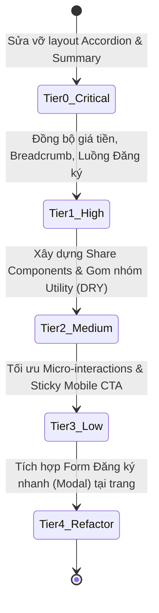

# I. Primer

## 1. TL;DR kiểu Feynman
- Trang chi tiết khóa học (`courses-detail`) hiện tại đang gặp một số lỗi hiển thị và cấu trúc làm trang web trông thiếu chuyên nghiệp.
- **Lỗi hiển thị nội dung khóa học:** Phần tóm tắt chương học (summary) đang hiển thị danh sách bài học một cách lộn xộn (dính chữ, tràn dòng, lệch icon mũi tên) ngay cả khi đang đóng accordion.
- **Lỗi giao diện (Design Debt):** Font chữ giá tiền `đ` có gạch chân lạ mắt, khoảng cách các chữ chưa thoáng, màu sắc breadcrumb mờ khó đọc.
- **Lỗi trải nghiệm (UX Debt):** Skeleton loader (khung xương tải trang) nhìn rất đơn sơ và lệch tông so với giao diện chính khi load xong. Nhấn nút "Đăng ký" lại chuyển hướng sang trang liên hệ dài dòng thay vì đăng ký nhanh.
- **Nợ kỹ thuật (Technical Debt):** Code giao diện xem trước (Preview) trong Admin và giao diện thực tế (Site) đang bị sao chép trùng lặp rất nhiều (vi phạm nguyên tắc DRY - Don't Repeat Yourself).
- **Giải pháp:** Phân loại các lỗi thành 5 nhóm ưu tiên (Tier 0 đến Tier 4) để sửa đổi từng bước, bắt đầu từ sửa lỗi vỡ layout đến tái cấu trúc code sạch sẽ.

## 2. Elaboration & Self-Explanation
Trang chi tiết khóa học là điểm chạm quan trọng nhất để thuyết phục học viên đăng ký học (quyết định tỷ lệ chuyển đổi - Conversion Rate). Qua kiểm tra thực tế giao diện khi có dữ liệu chạy thực tế, hệ thống đang tồn đọng 4 nhóm vấn đề lớn (Debt):
- **Technical Debt (Nợ kỹ thuật):** Sự thiếu đồng bộ giữa `CourseDetailPreview.tsx` và `CourseDetailPage.tsx`. Cả hai file đều tự định nghĩa lại cấu trúc HTML, CSS tailwind và mock data giống hệt nhau. Khi muốn đổi một chi tiết thiết kế, lập trình viên phải sửa cả hai nơi. Đồng thời, cơ chế quản lý trạng thái mở rộng chương học (Accordion state) ở bản Preview đang dùng chỉ mục mảng (`index`), còn bản thực tế dùng ID của Convex DB (`chapter._id`).
- **Design Debt (Nợ thiết kế):** Lỗi định dạng đơn vị tiền tệ `₫` hiển thị với ký tự gạch chân chân phương không tương thích tốt với font chữ hiện tại. Breadcrumb màu vàng nhạt trên nền trắng vi phạm quy chuẩn tương phản WCAG 2.2, gây khó đọc cho người thị lực kém. Khoảng cách (spacing) giữa các khối thiếu sự phân cấp rõ ràng.
- **UX Debt (Nợ trải nghiệm người dùng):** Luồng đăng ký học bắt buộc chuyển hướng sang trang liên hệ `/contact?subject=...` khiến người dùng phải điền lại form từ đầu, làm tăng tỷ lệ bỏ cuộc (bounce rate). Skeleton loader chưa có sự đồng bộ về mặt cấu trúc cột, tạo cảm giác giật lag mạnh khi dữ liệu tải xong.
- **Usability Issues (Vấn đề khả dụng):** Việc chèn danh sách bài học dạng text thô vào trường `summary` của chương học dẫn đến tình trạng text bị hiển thị tràn lan trên cùng một dòng (ở chương 3) hoặc hiển thị danh sách bài học nhưng icon mũi tên accordion lại bị đẩy lệch xuống dưới (ở chương 1). Người dùng không phân biệt được đâu là nội dung mở rộng của accordion và đâu là nội dung mô tả tĩnh.

## 3. Concrete Examples & Analogies
- **Ví dụ cụ thể:** Khi học viên mở chương 1 "AUTOCAD KIẾN TRÚC", họ thấy danh sách từ Buổi 1 đến Buổi 8 xổ xuống, nhưng nút mũi tên đóng/mở accordion lại nằm lơ lửng ở bên phải của dòng "Buổi 4 - Một đứng - một cắt chung cư" thay vì nằm thẳng hàng với tiêu đề chương. Sang chương 3, các bài học lại dính liền vào nhau thành một đoạn văn bản dài loằng ngoằng kết thúc bằng dấu ba chấm `...` trông cực kỳ mất mỹ quan.
- **Hình ảnh so sánh:** Giống như bạn đi ăn ở một nhà hàng cao cấp. Thực đơn (Menu) được in trên giấy rất đẹp nhưng giá tiền lại viết tay nguệch ngoạc và gạch xóa. Khi bạn muốn gọi món (nhấn Đăng ký), nhân viên không ghi nhận ngay mà bắt bạn đi bộ sang quầy lễ tân ở tòa nhà bên cạnh để điền phiếu yêu cầu. Trải nghiệm đứt gãy này khiến khách hàng không muốn quay lại.

---

# II. Audit Summary (Tóm tắt kiểm tra)

Sau khi rà soát kỹ lưỡng hai file [CoursePreview.tsx](file:///e:/NextJS/job/job_from_system_vietadmin/system_dohy/components/experiences/previews/CoursePreview.tsx) và [CourseDetailPage.tsx](file:///e:/NextJS/job/job_from_system_vietadmin/system_dohy/app/(site)/_components/courses/CourseDetailPage.tsx), chúng tôi xác định các điểm bất cập sau:

1. **Vấn đề Accordion & Summary:**
   - Trong Convex DB, trường `summary` của table `chapters` đang chứa dữ liệu HTML/Text liệt kê danh sách bài học cũ (legacy data).
   - Khi render, component dùng `<RichContent content={chapter.summary} />` ngay dưới tiêu đề chương, dẫn đến việc thông tin bài học hiển thị đúp hoặc hiển thị thô dạng text dính liền (Chương 3) ngay cả khi Accordion đang đóng.
   - Icon `ChevronDown` được đặt trong một button bao quát cả phần `summary`, khiến button này có chiều cao rất lớn. Icon căn giữa theo chiều dọc của toàn button nên bị kéo lệch xuống dưới (ở Chương 1 nằm ngang hàng Buổi 4).

2. **Vấn đề Price Formatting (Định dạng giá cả):**
   - Hàm `formatPrice` sử dụng `new Intl.NumberFormat('vi-VN', { currency: 'VND', style: 'currency' })` trả về ký hiệu `₫` (đ có gạch dưới chân). Font chữ hệ thống render ký hiệu này bị lệch dòng và gạch chân trông giống như một liên kết bị lỗi.

3. **Vấn đề Trùng lặp Code (DRY):**
   - Cả 2 file đều định nghĩa hàm `getRadiusClass`, `getSmallRadiusClass` giống nhau.
   - Phần render UI chi tiết chương học, sidebar thông tin, layout 2 cột được copy-paste gần như 90% dẫn đến nợ kỹ thuật lớn khi cần cập nhật UI.

---

# III. Root Cause & Counter-Hypothesis (Nguyên nhân gốc & Giả thuyết đối chứng)

- **Nguyên nhân gốc 1 (Vỡ layout Accordion):** Thiết kế thẻ `<button>` bọc toàn bộ tiêu đề chương và mô tả `summary` (chứa text HTML thô của bài học) làm phá vỡ cấu trúc flexbox và đẩy icon điều hướng đi sai vị trí. Việc lạm dụng trường `summary` để chứa danh sách bài học cứng thay vì render động từ table `lessons` tạo ra dữ liệu rác trên giao diện.
- **Nguyên nhân gốc 2 (Format tiền tệ lỗi font):** Trình duyệt trên Windows hiển thị ký tự `₫` chuẩn của Unicode với font chữ mặc định đôi khi tự động thêm đường gạch chân (underline) hoặc hiển thị không đồng đều giữa các trình duyệt.
- **Giả thuyết đối chứng 1:** Nếu tách biệt phần tiêu đề chương (chỉ chứa tên chương và số lượng bài học/giờ học) thành thanh tiêu đề click độc lập, và đưa phần mô tả `summary` (nếu có) xuống dưới vùng nội dung mở rộng (collapse content) cùng với danh sách bài học chi tiết, giao diện sẽ trở nên ngay ngắn, icon mũi tên luôn nằm đúng vị trí của tiêu đề chương.
- **Giả thuyết đối chứng 2:** Nếu thay thế định dạng tiền tệ mặc định của `Intl.NumberFormat` bằng một hàm format tùy chỉnh trả về chữ `đ` thường hoặc `VNĐ` viết hoa không gạch chân và đồng bộ font, lỗi giao diện giá tiền sẽ được khắc phục hoàn toàn.

---

# IV. Proposal (Đề xuất)

Chúng tôi đề xuất phân chia kế hoạch xử lý thành các Tier ưu tiên cụ thể như sau để người dùng lựa chọn:

### 1. Tier 0: Khắc phục lỗi vỡ layout & dữ liệu hiển thị (Critical - Hotfix)
- **a) Sửa lỗi Accordion Chương học:**
  - Tách tiêu đề chương ra khỏi phần `summary`. Phần click đóng/mở Accordion chỉ bao gồm tiêu đề chương (Chương X: Tên chương) và thông tin phụ (Số bài học - Số giờ). Icon `ChevronDown` sẽ luôn căn giữa dọc so với tiêu đề chương này.
  - Chuyển `chapter.summary` và danh sách bài học (`lessons`) vào bên trong phần collapse (chỉ hiển thị khi `isOpen === true`).
- **b) Loại bỏ text bài học thô trong Summary:**
  - Viết logic lọc dữ liệu: Nếu `chapter.summary` có chứa các từ khóa dạng danh sách bài học cũ (ví dụ: "Buổi 1-", "Bài 19:"), ta sẽ tự động ẩn đi hoặc lọc bỏ để tránh hiển thị trùng lặp với danh sách bài học thật được lấy từ DB (`lessonsByChapter`).

### 2. Tier 1: Cải thiện thẩm mỹ & Sửa lỗi Design Debt (High Priority)
- **a) Định dạng lại giá tiền:**
  - Sửa hàm `formatPrice` để hiển thị chữ `đ` sạch sẽ (không gạch dưới chân) bằng cách dùng chuỗi thay thế: `new Intl.NumberFormat(...).format(price).replace('₫', 'đ')` hoặc hiển thị hậu tố `đ` thống nhất.
- **b) Cải thiện độ tương phản Breadcrumb:**
  - Thay đổi màu sắc của breadcrumb "Khóa học autocad - Cơ bản" từ màu vàng nhạt/xám mờ sang màu đậm hơn hoặc có nền tương phản rõ ràng để đáp ứng chuẩn WCAG 2.2 AA.
- **c) Tăng khoảng cách (Spacing) & Phân cấp thị giác:**
  - Tăng khoảng cách giữa H1 và hàng meta thông tin dưới tiêu đề (30 bài học, 12 giờ học).
  - Canh lề thụt đầu dòng (indentation) cho danh sách bài học con thụt lùi vào so với tiêu đề chương cha khoảng `pl-6` để tạo cấu trúc sơ đồ cây rõ ràng.

### 3. Tier 2: Tái cấu trúc mã nguồn - Gom nhóm DRY (Medium Priority)
- **a) Gom các helper và type dùng chung:**
  - Tạo file utility dùng chung cho cả Preview và Site thực tế như `getRadiusClass`, `getSmallRadiusClass`, `formatPrice` để tránh lặp code.
- **b) Đồng bộ hóa Skeleton Loader:**
  - Thiết kế lại component `CourseDetailSkeleton` để hiển thị cấu trúc 2 cột chính xác theo tỷ lệ của trang thật (cột chính chiếm 2/3, sidebar chiếm 1/3), tránh giật màn hình khi tải trang xong.

### 4. Tier 3: Đánh bóng trải nghiệm người dùng (Low Priority / Polish)
- **a) Tối ưu hiệu ứng Accordion:**
  - Thêm transition mượt mà cho phần đóng/mở accordion (sử dụng CSS grid transition hoặc framer-motion đơn giản) thay vì đóng/mở đột ngột.
- **b) Tinh chỉnh Sticky CTA trên Mobile:**
  - Thêm khoảng đệm `pb-20` vào cuối body trang chi tiết khóa học trên thiết bị di động để đảm bảo thanh sticky bottom CTA không che khuất thông tin bản quyền (Footer) hoặc các nút tương tác cuối trang.

### 5. Tier 4: Nâng cấp tính năng đăng ký (Future Enhancements)
- **a) Đăng ký nhanh qua Modal:**
  - Thay vì chuyển hướng sang trang `/contact`, tích hợp một Modal đăng ký ngay tại trang chi tiết. Khi nhấn "Đăng ký học", một hộp thoại hiện lên yêu cầu nhập: Họ tên, Số điện thoại, Email. Sau đó tự động tạo một contact lead trong Convex DB. Điều này giúp tối ưu hóa tỷ lệ chuyển đổi khách hàng.

---

# V. Files Impacted (Tệp bị ảnh hưởng)

### UI Components (Giao diện)
- #### [MODIFY] [CoursePreview.tsx](file:///e:/NextJS/job/job_from_system_vietadmin/system_dohy/components/experiences/previews/CoursePreview.tsx)
  - Vai trò: Giao diện xem trước cấu hình trong Admin.
  - Thay đổi: Cập nhật cấu trúc Accordion chương học, đồng bộ hàm format giá tiền và căn chỉnh khoảng cách các khối.
- #### [MODIFY] [CourseDetailPage.tsx](file:///e:/NextJS/job/job_from_system_vietadmin/system_dohy/app/(site)/_components/courses/CourseDetailPage.tsx)
  - Vai trò: Trang chi tiết khóa học chính thức trên site thực tế.
  - Thay đổi: Cập nhật cấu trúc Accordion thực tế, chỉnh sửa luồng hiển thị `summary` và danh sách bài học, đồng bộ hóa hàm định dạng giá tiền và cải thiện độ tương phản breadcrumb.

### Shared Utilities (Tiện ích dùng chung)
- #### [NEW] [courseUtils.ts](file:///e:/NextJS/job/job_from_system_vietadmin/system_dohy/lib/courses/courseUtils.ts)
  - Vai trò: Lưu trữ các hàm định dạng giá cả, tính toán CSS bo góc (`getRadiusClass`) dùng chung để tối ưu mã nguồn.

---

# VI. Execution Preview (Xem trước thực thi)

1. **Bước 1 (Tạo Utility dùng chung):** Tạo tệp `courseUtils.ts` để chứa các hàm format tiền tệ và class bo góc dùng chung.
2. **Bước 2 (Cập nhật CourseDetailPage):** 
   - Tách biệt phần tiêu đề Accordion và vùng nội dung chi tiết.
   - Chuyển `chapter.summary` vào trong vùng Accordion nội dung.
   - Sửa lỗi hiển thị chữ `đ` bị gạch chân.
   - Cân đối lại khoảng cách padding/margin của các bài học con.
3. **Bước 3 (Cập nhật CoursePreview):** Đồng bộ các thay đổi của Accordion và giá tiền sang tệp Preview để đảm bảo trải nghiệm hiển thị giống hệt trang thật.
4. **Bước 4 (Cải thiện thẩm mỹ & Responsive):** Kiểm tra hiển thị trên thiết bị di động (Mobile) đối với phần Sticky CTA và breadcrumb.

---

# VII. Verification Plan (Kế hoạch kiểm chứng)

### Automated Tests (Kiểm thử tự động)
- Chạy lệnh kiểm tra kiểu TypeScript của dự án để đảm bảo không phát sinh lỗi kiểu dữ liệu:
  `bunx tsc --noEmit`

### Manual Verification (Kiểm chứng thủ công)
- Truy cập trang cấu hình trải nghiệm: `http://localhost:3000/system/experiences/courses-detail` để chuyển đổi qua lại giữa 3 Layout (Classic, Modern, Minimal) trên các kích thước màn hình khác nhau (Desktop, Tablet, Mobile).
- Truy cập trang chi tiết khóa học thực tế trên site:
  - Kiểm tra xem icon mũi tên Accordion đã căn giữa tiêu đề chương học hay chưa.
  - Xác nhận danh sách bài học con thụt lề rõ ràng, chữ không bị dính liền hay tràn hàng.
  - Xác nhận giá tiền hiển thị đẹp mắt, không có nét gạch dưới chân kỳ lạ tại chữ `đ`.
  - Kiểm tra xem breadcrumb có dễ đọc hay không.

---

# VIII. Todo

- [ ] Tạo file [courseUtils.ts](file:///e:/NextJS/job/job_from_system_vietadmin/system_dohy/lib/courses/courseUtils.ts) để khai báo các helper dùng chung.
- [ ] Chỉnh sửa Accordion hiển thị chương/bài học trong [CourseDetailPage.tsx](file:///e:/NextJS/job/job_from_system_vietadmin/system_dohy/app/(site)/_components/courses/CourseDetailPage.tsx).
- [ ] Sửa định dạng tiền tệ và màu sắc Breadcrumb trong [CourseDetailPage.tsx](file:///e:/NextJS/job/job_from_system_vietadmin/system_dohy/app/(site)/_components/courses/CourseDetailPage.tsx).
- [ ] Đồng bộ hóa cấu trúc và helper sang [CoursePreview.tsx](file:///e:/NextJS/job/job_from_system_vietadmin/system_dohy/components/experiences/previews/CoursePreview.tsx).
- [ ] Điều chỉnh CSS padding cuối trang trên thiết bị di động để tránh bị thanh Sticky CTA che khuất nội dung.

---

# IX. Acceptance Criteria (Tiêu chí chấp nhận)

- **Giao diện Accordion:**
  - Nút bấm đóng/mở Accordion chỉ bao trùm tiêu đề chương học. Icon mũi tên luôn căn giữa dọc thẳng hàng với tiêu đề.
  - Mô tả chương học (`summary`) và danh sách bài học chi tiết chỉ hiển thị khi Accordion được mở ra.
  - Không còn tình trạng bài học bị hiển thị nối liền thành một đoạn văn thô có dấu ba chấm `...` khi Accordion đang đóng.
- **Thẩm mỹ giao diện:**
  - Chữ `đ` trong phần hiển thị giá tiền không bị gạch chân.
  - Danh sách bài học thụt lề `pl-6` hoặc `pl-8` tạo sự phân cấp rõ ràng so với chương.
  - Breadcrumb có độ tương phản đạt chuẩn, dễ nhìn trên nền trắng.
- **Độ nhất quán:**
  - Giao diện thực tế (Site) và giao diện xem trước (Preview) trong Admin hiển thị giống nhau hoàn toàn về mặt bố cục và định dạng.

---

# X. Risk / Rollback (Rủi ro / Hoàn tác)

- **Rủi ro:** Một số chương học có thể không có danh sách bài học cụ thể mà admin chỉ nhập thông tin tổng quan vào `summary`. Nếu ta mặc định ẩn `summary` khi accordion đóng, người dùng sẽ phải click mở accordion mới thấy thông tin tổng quan đó. Tuy nhiên điều này là hợp lý vì accordion sinh ra là để tối ưu hóa không gian hiển thị, tránh làm trang quá dài.
- **Hoàn tác:** Sử dụng Git để hoàn tác các thay đổi trên file:
  `git checkout -- app/(site)/_components/courses/CourseDetailPage.tsx components/experiences/previews/CoursePreview.tsx`

---

# XI. Out of Scope (Ngoài phạm vi)

- Không thay đổi thiết kế cơ bản của Header, Navigation chính và Footer của website.
- Chưa tiến hành cấu hình hệ thống thanh toán tự động hay giỏ hàng cho khóa học trong đợt tối ưu hóa này.

---

# XII. Open Questions (Câu hỏi mở)

- Bạn có muốn triển khai trực tiếp cổng Đăng ký nhanh qua Modal (Tier 4) ngay trong đợt này để tăng trải nghiệm người dùng không, hay chỉ cần sửa giao diện và chuyển hướng sang trang liên hệ như hiện tại (Tier 0 & Tier 1)?
