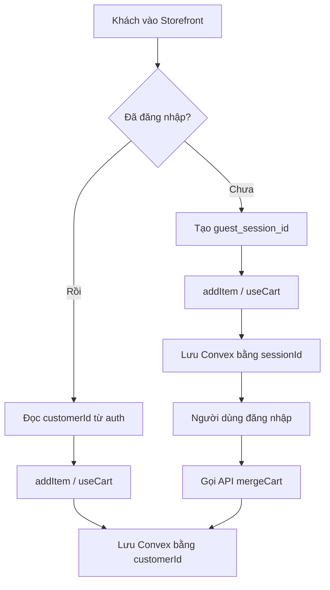

# Tài liệu thiết kế: Luồng hoạt động Giỏ hàng vãng lai (Guest Cart Flow)

## 1. Tổng quan kiến trúc
Hệ thống giỏ hàng hỗ trợ cả hai trạng thái người dùng:
- **Khách vãng lai (Guest)**: Chưa đăng nhập, giỏ hàng được xác định bằng một `guest_session_id` được tạo tự động và lưu ở cookie/localStorage phía client.
- **Thành viên (Customer)**: Đã đăng nhập, giỏ hàng được xác định và liên kết trực tiếp bằng `customerId` trong cơ sở dữ liệu.

Khi khách vãng lai đăng nhập, hệ thống sẽ thực hiện **gộp giỏ hàng (merge cart)** tự động bằng cách chuyển toàn bộ sản phẩm từ guest session sang giỏ hàng của tài khoản thành viên vừa đăng nhập.

## 2. Ma trận xử lý phân loại sản phẩm (Variant Matrix)

| Loại sản phẩm | Yêu cầu `variantId` | Nhãn phân loại trên UI (Variant Label) | API Convex (`addItem`) |
| :--- | :---: | :---: | :--- |
| **Không có phân loại (No-variant)** | Không | Không hiển thị | `variantId` truyền trống hoặc `undefined` |
| **Có phân loại (Has-variants)** | Bắt buộc | Hiển thị dạng `Tên tùy chọn: Giá trị` | Phải truyền `variantId` hợp lệ |

## 3. Các thành phần giao diện bị ảnh hưởng (Impacted Surfaces)

1. **Ngăn kéo giỏ hàng (Cart Drawer)**:
   - File: `components/site/CartDrawer.tsx`
   - Hành vi: Hiển thị giỏ hàng trực tiếp cho cả guest và customer bằng hook `useCart()`. Hiện variant label nếu sản phẩm trong giỏ có `variantId`. Không bắt buộc đăng nhập.
2. **Trang giỏ hàng chính (`/cart`)**:
   - File: `app/(site)/cart/page.tsx`
   - Hành vi: Cho phép guest xem và chỉnh sửa số lượng vật phẩm. Hỗ trợ 3 layout `drawer`, `page`, `table` render variant label.
3. **Trang thanh toán (`/checkout?fromCart=true`)**:
   - File: `app/(site)/checkout/page.tsx`
   - Hành vi: Cho phép guest thanh toán trực tiếp các vật phẩm từ giỏ hàng hiện tại qua `useCart()`. Không yêu cầu đăng nhập. Hiển thị form trống cho guest tự nhập thông tin.
4. **Các nút Add to Cart / Buy Now**:
   - File: `app/(site)/_components/products/ProductsPage.tsx`, `ProductDetailPage.tsx`
   - Hành vi: Bỏ cơ chế chặn check auth. Khách vãng lai bấm nút sẽ thêm vào giỏ hàng vãng lai bình thường.

## 4. Danh sách kiểm tra hồi quy (Regression Checklist)

- [ ] **Thêm giỏ hàng ẩn danh**: Truy cập ẩn danh, thêm sản phẩm thành công và số lượng giỏ hàng trên Header tăng lên.
- [ ] **Mở Drawer giỏ hàng**: Drawer hiển thị đúng danh sách sản phẩm đã thêm, kèm theo size/màu sắc (nếu có).
- [ ] **Trang giỏ hàng `/cart`**: Hiển thị đầy đủ sản phẩm, cho phép tăng/giảm số lượng và xóa vật phẩm.
- [ ] **Thanh toán ẩn danh**: Bấm nút Thanh toán từ giỏ hàng đưa tới trang `/checkout` thành công, đặt hàng thành công và giỏ hàng được xóa sạch.
- [ ] **Gộp giỏ hàng (Merge)**: Thêm sản phẩm khi chưa đăng nhập -> Tiến hành đăng nhập -> Sản phẩm được chuyển vào tài khoản thành công.
- [ ] **Bảo vệ wishlist**: Bấm nút Wishlist khi chưa đăng nhập vẫn hiển thị form yêu cầu đăng nhập.
