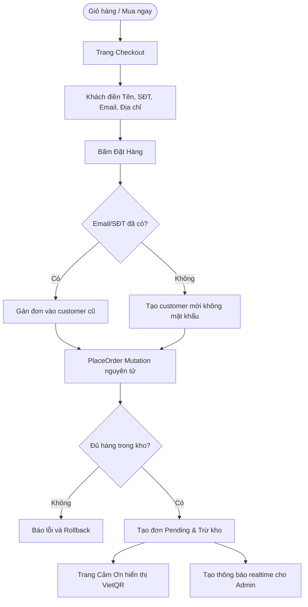
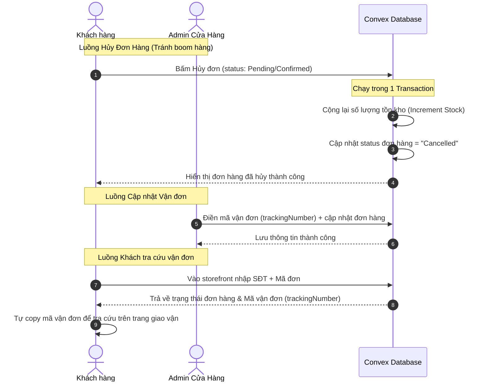
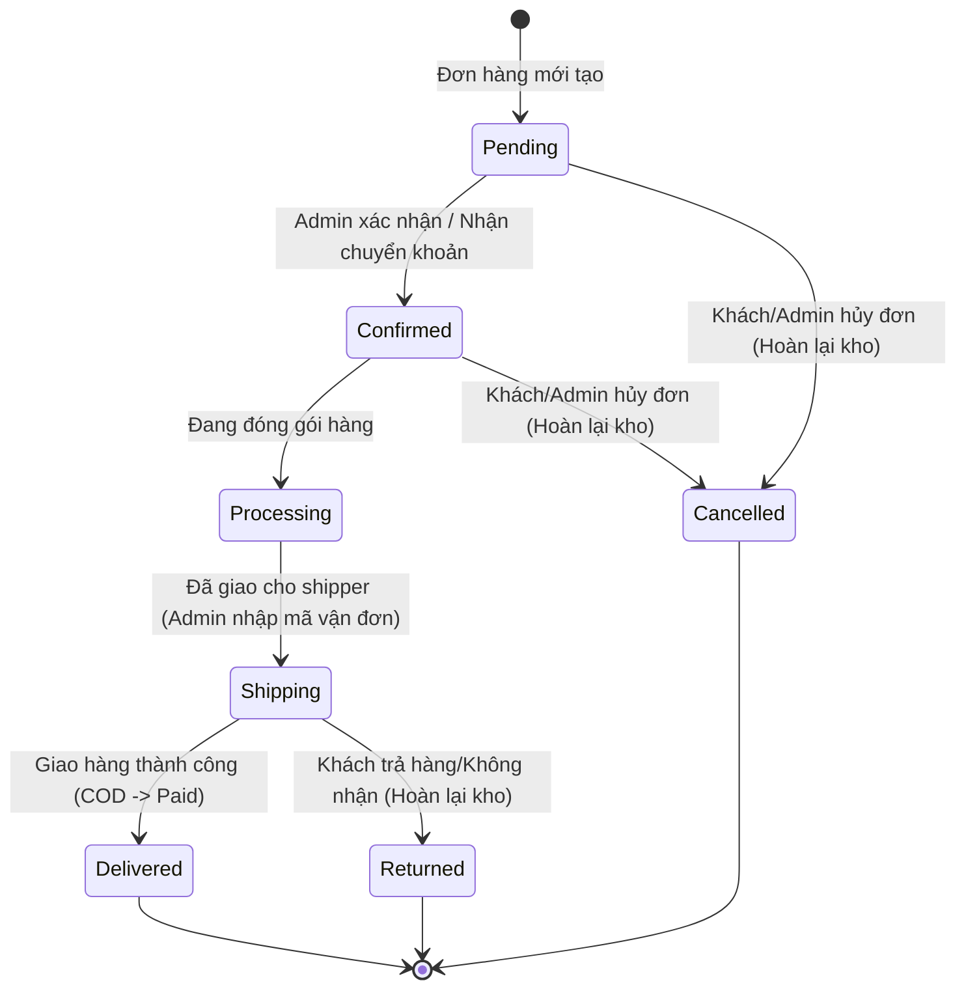

# I. Primer

## 1. TL;DR kiểu Feynman
Hãy tưởng tượng hệ thống đặt hàng giống như một dòng nước chảy từ giỏ hàng đến storefront và cuối cùng là trang quản lý của cửa hàng:
* **Khách vãng lai nhặt đồ thoải mái:** Không cần đăng nhập vẫn thêm sản phẩm vào giỏ. Hệ thống nhớ giỏ hàng bằng mã Session ID lưu trên trình duyệt.
* **Mua ngay cực nhanh:** Chọn kích cỡ (Variant), bấm một nút là bay thẳng tới trang thanh toán, bỏ qua các bước trung gian.
* **Thanh toán tự động nhận diện:** Khách chỉ cần điền Tên, Số điện thoại và Email. Hệ thống tự động kiểm tra xem thông tin này đã từng mua chưa để gán vào tài khoản cũ hoặc tự động tạo tài khoản mới tinh mà không bắt tạo mật khẩu phức tạp.
* **Trả tiền bằng mã QR thông minh:** Hệ thống tự tạo mã VietQR động có sẵn số tiền và nội dung chuyển khoản chứa mã đơn hàng (ví dụ: `THANSHEOS ORD-123`). Khách quét là xong. Admin kiểm tra tài khoản, thấy khớp tiền thì duyệt đơn trực tiếp trên trang `/admin`.
* **Thông báo đơn hàng ngay trên hệ thống:** Không cần ứng dụng bên thứ ba (như Telegram), hệ thống tự báo có đơn hàng mới trực tiếp trên trang quản trị `/admin` một cách trực quan, realtime.
* **Tra cứu vận đơn chủ động:** Admin nhập mã vận đơn khi gửi hàng. Khách muốn biết hàng đi đến đâu chỉ cần vào trang storefront nhập thông tin là tự check được hành trình.
* **Cho phép khách hủy đơn thoải mái:** Khách đặt xong nếu đổi ý có thể bấm "Hủy đơn" trực tiếp trên storefront, hệ thống tự động trả lại hàng vào kho, tránh việc khách boom hàng gây rắc rối cho khâu vận chuyển.

---

## 2. Elaboration & Self-Explanation
Quy trình đặt hàng, thanh toán và quản lý đơn hàng được tối ưu hóa để đảm bảo sự thuận tiện tối đa cho cả khách hàng, admin và lập trình viên:

a) **Anonymous Cart (Giỏ hàng ẩn danh) & Merge Cart (Hợp nhất giỏ hàng):**
Khách hàng có thể thêm sản phẩm có biến thể (variants) vào giỏ hàng mà không cần đăng nhập. Khi khách hàng tiến hành đăng nhập hoặc đăng ký ở bất cứ bước nào, toàn bộ sản phẩm trong giỏ vãng lai sẽ được tự động gộp (merge) vào giỏ hàng chính thức của họ qua một Convex Mutation.

b) **Guest Checkout & Auto-creation:**
Khách hàng điền form thanh toán (Tên, SĐT, Email). Hệ thống tự động kiểm tra:
* Nếu Email/SĐT đã tồn tại: Đơn hàng tự động liên kết với Customer đó.
* Nếu chưa tồn tại: Hệ thống tự động tạo mới một Customer ẩn danh để tích lũy doanh số và lưu lịch sử.

c) **Thanh toán VietQR động & Quản lý đơn hàng trên `/admin`:**
Mã QR Code động được tự động hiển thị ở trang hoàn tất đơn hàng với số tiền chính xác và nội dung là mã đơn hàng. Admin kiểm tra biến động số dư ngân hàng thủ công, sau đó quản lý và duyệt các đơn hàng này trực tiếp trên giao diện quản trị `/admin` thông qua tính năng thông báo realtime (Notification Bell & Toast notifications).

d) **Quản lý Vận đơn (Shipping Tracking):**
Khi giao hàng cho đơn vị vận chuyển, admin sẽ điền mã vận đơn (`trackingNumber`) vào chi tiết đơn hàng trên trang quản trị `/admin`. Storefront sẽ cung cấp một giao diện tra cứu đơn hàng tinh gọn, cho phép khách hàng chủ động nhập mã đơn hàng hoặc số điện thoại để kiểm tra trạng thái và lấy mã vận đơn tự đi tra cứu hành trình giao hàng.

e) **Tự do hủy đơn hàng (Customer Self-Cancellation):**
Khách hàng có thể tự hủy đơn hàng trực tiếp trên trang chi tiết đơn hàng ở storefront bất cứ lúc nào trước khi hàng được giao đi. Khi khách hủy đơn, hệ thống sẽ thực hiện hoàn trả tồn kho (`increment stock`) tự động cho các sản phẩm/variant tương ứng, đồng thời cập nhật trạng thái đơn hàng thành `Cancelled`. Điều này giúp giảm thiểu rủi ro vận chuyển và chi phí đóng gói vô ích khi khách hàng đổi ý.

---

## 3. Concrete Examples & Analogies
* **Ví dụ về Hủy đơn tránh boom hàng:**
  Giống như bạn đặt đồ ăn qua app giao hàng. Nếu bạn lỡ tay đặt nhầm hoặc thay đổi ý định, việc app cho phép bạn bấm nút "Hủy đơn" ngay trong 5-10 phút đầu tiên (trước khi cửa hàng làm đồ ăn hoặc giao cho shipper) sẽ giúp ích cho cả hai bên: cửa hàng không mất công làm đồ và shipper không mất công chạy đi giao rồi bị bạn từ chối nhận (boom hàng).
* **Ví dụ về Tra cứu vận đơn:**
  Tương tự như khi bạn gửi một bưu phẩm ở bưu điện, nhân viên đưa cho bạn một biên nhận có dãy số (Mã vận đơn). Bưu điện không cần nhắn tin báo bưu phẩm đang đi tới đâu, mà bạn có thể tự lên trang web của bưu điện, gõ dãy số đó vào để biết vị trí gói hàng. Ở đây, Admin chỉ cần dán mã đó vào đơn hàng, khách sẽ tự vào xem và lấy mã đó để kiểm tra.

---

# II. Audit Summary (Tóm tắt kiểm tra)

Qua việc kiểm tra các tệp tin trong hệ thống, cấu trúc hiện tại như sau:
1. **Schema dữ liệu (`convex/schema.ts`):**
   * Đã có bảng `carts` hỗ trợ cả `customerId` và `sessionId`.
   * Đã có bảng `cartItems` lưu `variantId` của các phiên bản sản phẩm.
   * Đã có bảng `orders` chứa thông tin chi tiết đơn hàng: `customerId`, `items`, `paymentMethod`, `paymentStatus`, `shippingAddress`, `shippingFee`, `status`, `trackingNumber`, và mã đơn hàng `orderNumber`.
   * Đã có bảng `notifications` hỗ trợ thông báo realtime.
2. **Cấu hình cửa hàng (`lib/modules/configs/orders.config.ts`):**
   * Đã định nghĩa các phương thức thanh toán (`paymentMethods`), vận chuyển (`shippingMethods`), và thông tin tài khoản ngân hàng để sinh VietQR (`bankName`, `bankCode`, `bankAccountName`, `bankAccountNumber`, `vietQrTemplate`).
   * Đã có preset trạng thái đơn hàng (`orderStatusPreset` và `orderStatuses`).

---

# III. Root Cause & Counter-Hypothesis (Nguyên nhân gốc & Giả thuyết đối chứng)

* **Vấn đề cần giải quyết:** Tích hợp quy trình checkout đồng bộ, thiết kế luồng khách hàng tự hủy đơn trên storefront (tự động hoàn kho), luồng admin cập nhật mã vận đơn trên `/admin`, và luồng khách tra cứu thông tin đơn nhận mã vận đơn để tự đi check hành trình.
* **Độ tin cậy thiết kế (Confidence): High.** Hệ thống dữ liệu hiện tại hỗ trợ rất tốt các thao tác này, chỉ cần sửa đổi và viết thêm các mutation Convex để xử lý gộp giỏ hàng, đặt hàng nguyên tử, hủy đơn hàng tự động hoàn kho, và API cập nhật mã vận đơn từ admin.

---

# IV. Proposal (Đề xuất)

Để xây dựng luồng đặt hàng chuẩn chỉnh, chúng ta đề xuất các giải pháp sau:

## 1. Sơ đồ luồng hoạt động (Mermaid Diagrams)

### a) Luồng Đặt hàng & Tự động tạo tài khoản

### b) Luồng Vận đơn & Khách hàng tự hủy đơn

### c) Vòng đời trạng thái đơn hàng (Order State Lifecycle)

## 2. Giải pháp kỹ thuật chi tiết

### a) Hợp nhất giỏ hàng (Merge Cart)
* Mutation `mergeCart` nhận vào `customerId` và `sessionId`.
* Tìm giỏ hàng vãng lai (`sessionId` hoạt động) và giỏ hàng chính thức (`customerId` hoạt động).
* Đọc các `cartItems` của giỏ vãng lai, duyệt qua và chuyển `cartId` sang giỏ chính thức (nếu trùng sản phẩm+variant thì cộng dồn số lượng).
* Chuyển trạng thái giỏ vãng lai thành `"Converted"`, tính toán lại tổng tiền của giỏ chính thức.

### b) Đặt hàng nguyên tử (placeOrder)
* Nhận thông tin: Khách hàng (tên, email, sđt, địa chỉ), danh sách items đặt mua, thông tin thanh toán, vận chuyển.
* **ACID Transaction trong Convex:**
  1. Kiểm tra tồn kho của tất cả items. Nếu bất cứ sản phẩm nào không đủ tồn kho, ném lỗi `throw new Error` để rollback toàn bộ.
  2. Tìm kiếm customer theo `email` hoặc `phone`. Nếu chưa có, insert customer mới có `status: "Active"`.
  3. Tạo đơn hàng mới trong bảng `orders` với trạng thái `status: "Pending"`, `paymentStatus: "Pending"`.
  4. Trừ tồn kho (`decrement stock`) của các sản phẩm/variant trong đơn hàng.
  5. Xóa các mặt hàng tương ứng trong giỏ hàng.
  6. Tạo thông báo có đơn hàng mới trong bảng `notifications` với `targetType: "users"`, hiển thị realtime trên thanh header hoặc trang `/admin`.

### c) Thông báo đơn hàng mới tại giao diện `/admin`
* Khi đơn hàng được tạo thành công, hệ thống ghi nhận một thông báo có kiểu `type: "success"` và `status: "Sent"` trong bảng `notifications`.
* Trên giao diện quản trị `/admin`, sử dụng query Convex `notifications:getUnread` để subscribe danh sách thông báo chưa đọc theo thời gian thực.
* Mỗi khi danh sách này tăng thêm phần tử, giao diện admin sẽ kích hoạt âm thanh thông báo và hiển thị một Toast popup báo có đơn hàng mới ở góc màn hình.

### d) Quản lý Vận đơn (trackingNumber)
* **Phía Admin:** Trang chi tiết đơn hàng `/admin/orders/[id]` cung cấp ô nhập văn bản **Mã vận đơn** (`trackingNumber`) và nút cập nhật. Khi admin bàn giao hàng cho đơn vị vận chuyển (trạng thái đơn hàng chuyển sang `Shipping`), admin điền mã vận đơn này vào.
* **Phía Khách hàng:** Storefront thiết kế một trang `/tra-cuu-don-hang` (Order Tracking).
  * Khách hàng nhập **Số điện thoại** hoặc **Mã đơn hàng** (`orderNumber`).
  * Hệ thống truy vấn và trả về danh sách đơn hàng tương ứng.
  * Khi click vào chi tiết đơn hàng, hệ thống hiển thị:
    * Trạng thái đơn hàng hiện tại (Đang chuẩn bị, Đang giao, Đã giao...).
    * **Mã vận đơn** (`trackingNumber`) kèm theo hướng dẫn: *"Sử dụng mã vận đơn này để tra cứu trực tiếp hành trình trên website của đơn vị vận chuyển."*

### e) Khách hàng tự hủy đơn hàng (Order Self-Cancellation)
* Cho phép khách hàng tự hủy đơn hàng khi đơn ở trạng thái `Pending` (Chờ xử lý) hoặc `Confirmed` (Đã xác nhận) trước khi chuyển qua đóng gói/giao hàng (`Processing` hoặc `Shipping`).
* **Storefront:** Trang chi tiết đơn hàng của khách hàng hiển thị nút **Hủy đơn hàng**.
* **API Backend - Mutation `orders:cancelByCustomer`:**
  * Nhận vào `orderId` và lý do hủy đơn (tùy chọn).
  * Kiểm tra trạng thái đơn hàng hiện tại trong DB. Nếu đơn hàng đã chuyển sang `Processing`, `Shipping` hoặc `Delivered`, từ chối hủy đơn và báo lỗi.
  * Nếu hợp lệ (đang là `Pending` hoặc `Confirmed`):
    1. Cập nhật `status` của đơn hàng thành `"Cancelled"`.
    2. Duyệt qua danh sách `items` trong đơn hàng, tiến hành cộng trả lại số lượng tồn kho cho các sản phẩm/variant tương ứng (`increment stock`).
    3. Ghi log hoạt động hủy đơn của khách hàng vào bảng `activityLogs`.
    4. Cập nhật trạng thái sử dụng của promotion (nếu có) để trả lại lượt dùng cho khách.

---

# V. Files Impacted (Tệp bị ảnh hưởng)

### a) Sửa đổi logic backend (Convex):
* **Sửa:** [convex/orders.ts](file:///e:/NextJS/job/job_from_system_vietadmin/system_thanshoes/convex/orders.ts)
  * Vai trò hiện tại: Định nghĩa API Convex cho Đơn hàng.
  * Thay đổi: Bổ sung mutation `placeOrder` (đặt hàng nguyên tử, tự tạo customer, kiểm tra/trừ kho), viết mutation `cancelByCustomer` để khách tự hủy đơn hàng và tự động cộng trả tồn kho.
* **Sửa:** [convex/cart.ts](file:///e:/NextJS/job/job_from_system_vietadmin/system_thanshoes/convex/cart.ts)
  * Vai trò hiện tại: Quản lý giỏ hàng.
  * Thay đổi: Thêm mutation `mergeCart` gộp giỏ hàng vãng lai khi đăng nhập.

### b) Sửa đổi giao diện Frontend (Storefront & Admin):
* **Thêm mới/Sửa:** `app/(site)/checkout/page.tsx`
  * Vai trò: Trang thanh toán.
  * Thay đổi: Tích hợp gọi mutation `placeOrder`, hỗ trợ Session ID cho giỏ hàng ẩn danh và sessionStorage cho luồng Mua ngay.
* **Thêm mới:** `app/(site)/don-hang/page.tsx` hoặc `app/(site)/tra-cuu/page.tsx`
  * Vai trò: Trang tra cứu đơn hàng cho khách.
  * Thay đổi: Nhập SĐT/Mã đơn hàng hiển thị trạng thái đơn hàng, nút **Hủy đơn** (nếu đơn hàng chưa giao), và hiển thị **Mã vận đơn** (`trackingNumber`) để khách tự đi check.
* **Sửa:** `app/admin/orders/[id]/page.tsx`
  * Giao diện chi tiết đơn hàng của Admin, hỗ trợ cập nhật trường mã vận đơn (`trackingNumber`) và trạng thái giao hàng.
* **Sửa:** `app/admin/components/NotificationBell.tsx` (hoặc file layout admin tương đương)
  * Vai trò: Chuông thông báo trên Admin Dashboard.
  * Thay đổi: Lắng nghe realtime từ Convex bảng `notifications` và hiển thị toast/chạy âm thanh khi có đơn mới.

---

# VI. Execution Preview (Xem trước thực thi)

1. **Bước 1 (Backend):** 
   * Cập nhật logic trong [convex/orders.ts](file:///e:/NextJS/job/job_from_system_vietadmin/system_thanshoes/convex/orders.ts) để hỗ trợ `placeOrder` nguyên tử và `cancelByCustomer` (hủy đơn hoàn kho).
   * Viết mutation `mergeCart` trong [convex/cart.ts](file:///e:/NextJS/job/job_from_system_vietadmin/system_thanshoes/convex/cart.ts).
2. **Bước 2 (Storefront - Checkout & Thank You):**
   * Xây dựng luồng thanh toán tại trang Checkout.
   * Xây dựng trang cảm ơn hiển thị VietQR động dựa trên settings ngân hàng.
3. **Bước 3 (Storefront - Tra cứu & Hủy đơn):**
   * Xây dựng trang tra cứu đơn hàng theo SĐT/Mã đơn.
   * Hiển thị nút Hủy đơn cho phép khách tự hủy đơn hàng (gọi mutation `cancelByCustomer`).
   * Hiển thị mã vận đơn để khách tự kiểm tra.
4. **Bước 4 (Admin Dashboard):**
   * Đảm bảo ô nhập mã vận đơn (`trackingNumber`) hiển thị và hoạt động trên trang chi tiết đơn hàng admin.
   * Wiring hệ thống thông báo realtime cho admin khi có bản ghi mới trong bảng `notifications`.
5. **Bước 5 (Đánh giá tĩnh):** Kiểm tra tính null-safety, kiểm tra logic rollback của các mutation Convex.

---

# VII. Verification Plan (Kế hoạch kiểm chứng)

### 1. Kế hoạch kiểm tra tự động
* Viết script scratch giả lập gọi mutation `cancelByCustomer` trên Convex:
  * Kiểm tra xem tồn kho của sản phẩm có tăng trở lại đúng số lượng ban đầu của đơn hàng không.
  * Kiểm tra xem trạng thái đơn hàng có chuyển thành `Cancelled` không.
  * Thử hủy đơn hàng có trạng thái `Shipping` và xác nhận mutation ném ra lỗi (không cho phép hủy khi đang giao).

### 2. Kế hoạch kiểm chứng thủ công
* **Kiểm tra luồng Hủy đơn hàng phía khách:**
  1. Đặt 1 đơn hàng thành công, ghi nhận tồn kho của sản phẩm giảm đi 1.
  2. Truy cập trang tra cứu đơn hàng ở storefront, nhập SĐT để xem đơn vừa đặt.
  3. Bấm nút **Hủy đơn hàng**.
  4. Xác nhận trạng thái đơn hàng chuyển thành "Đã hủy" ở storefront.
  5. Vào trang admin kiểm tra tồn kho sản phẩm đã tự động tăng trở lại 1 chưa.
* **Kiểm tra luồng Vận đơn phía khách:**
  1. Vào admin cập nhật đơn hàng thành trạng thái `Shipping` và điền mã vận đơn `VTP-987654321`.
  2. Dùng điện thoại/trình duyệt khách truy cập trang tra cứu đơn hàng.
  3. Kiểm tra xem mã vận đơn `VTP-987654321` có hiển thị rõ ràng trên chi tiết đơn hàng của khách hàng không.

---

# VIII. Todo

- [ ] 1. Khảo sát cấu trúc bảng `orders` và `customers` trong `convex/schema.ts`.
- [ ] 2. Viết logic Backend trên Convex:
  - [ ] a. Thêm mutation `mergeCart` vào [cart.ts](file:///e:/NextJS/job/job_from_system_vietadmin/system_thanshoes/convex/cart.ts).
  - [ ] b. Viết mutation `placeOrder` (đặt hàng nguyên tử) vào [orders.ts](file:///e:/NextJS/job/job_from_system_vietadmin/system_thanshoes/convex/orders.ts).
  - [ ] c. Viết mutation `cancelByCustomer` (khách hủy đơn hoàn kho) vào [orders.ts](file:///e:/NextJS/job/job_from_system_vietadmin/system_thanshoes/convex/orders.ts).
- [ ] 3. Xây dựng giao diện storefront:
  - [ ] a. Tích hợp trang Checkout và trang Thank You hiển thị VietQR.
  - [ ] b. Trang Tra cứu đơn hàng hỗ trợ tra cứu mã vận đơn và hủy đơn hàng.
- [ ] 4. Tích hợp chuông thông báo đơn hàng mới realtime trên Admin Dashboard.

---

# IX. Acceptance Criteria (Tiêu chí chấp nhận)

1. **Khách hàng tự hủy đơn thành công và tự động hoàn kho:** Nút hủy đơn hiển thị khi trạng thái đơn hàng là `Pending` hoặc `Confirmed`. Khi khách hàng click hủy, đơn hàng được cập nhật trạng thái `Cancelled` và tồn kho sản phẩm tăng trở lại chính xác.
2. **Loại bỏ Telegram Bot:** Không gửi dữ liệu đơn hàng ra bên ngoài qua Telegram API, toàn bộ thông tin đơn hàng mới chỉ lưu vết nội bộ và báo cáo realtime trên trang `/admin`.
3. **Mã vận đơn hoạt động đúng:** Admin điền mã vận đơn (`trackingNumber`) ở trang admin thì khách hàng có thể tra cứu và nhìn thấy mã này ở storefront để chủ động theo dõi hành trình.
4. **Hợp nhất giỏ hàng chính xác:** Hợp nhất các item trùng lặp (cộng dồn số lượng) khi khách vãng lai đăng nhập tài khoản.

---

# X. Risk / Rollback (Rủi ro / Hoàn tác)

* **Rủi ro:** Khi hoàn tồn kho lúc hủy đơn hàng, nếu sản phẩm hoặc biến thể sản phẩm đó đã bị xóa khỏi hệ thống, mutation hủy đơn có thể gặp lỗi và không hoàn thành được.
* **Biện pháp giảm thiểu:** Kiểm tra sự tồn tại của sản phẩm trước khi cập nhật số lượng tồn kho. Nếu sản phẩm đã bị xóa, chỉ cần bỏ qua việc tăng kho của sản phẩm đó và ghi log hoạt động cảnh báo.
* **Kế hoạch hoàn tác:** Rollback code frontend và backend về commit ổn định gần nhất nếu có lỗi phát sinh.

---

# XI. Out of Scope (Ngoài phạm vi)

* **Không tích hợp dịch vụ giao vận tự động:** Không gọi API của các hãng vận chuyển (GHTK, GHN, Viettel Post) để lấy mã vận đơn tự động hay đẩy đơn vận chuyển. Admin sẽ tự liên hệ đơn vị vận chuyển bên ngoài để gửi hàng, lấy mã vận đơn ghi tay rồi dán vào hệ thống.
* **Không làm tính năng xác thực OTP khi hủy đơn:** Việc hủy đơn hàng ở storefront chỉ yêu cầu khách hàng nhập đúng Mã đơn hàng + Số điện thoại đi kèm đơn hàng để xác minh quyền sở hữu, không cần gửi mã OTP xác thực qua SMS.

---

# XII. Open Questions (Câu hỏi mở)

* *Có nên giới hạn thời gian tự hủy đơn của khách hàng (ví dụ: chỉ cho phép hủy trong vòng 2 giờ kể từ khi đặt đơn) để tránh trường hợp cửa hàng đã đóng gói xong chuẩn bị giao cho shipper mới bấm hủy hay không?*
