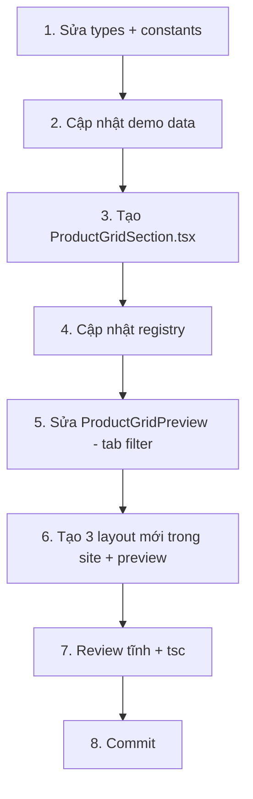

# Product Grid (Catalog) — Overhaul Spec

---

# I. Primer

## 1. TL;DR kiểu Feynman

- **ProductGrid hiện tại reuse 100% code của ProductList** — cả admin preview lẫn site render đều gọi cùng 1 component `ProductListSection`. Nên nó trông y hệt, không có gì riêng biệt.
- **Category tabs** đã lưu config nhưng **site render không đọc** config này → tab không hiện trên site thật.
- **Tab ấn không lọc** vì chỉ là nút "trang trí" — chưa có state management filter ở cả preview lẫn site.
- **Grid chỉ hiện 4 items (1 dòng)** vì code site hardcode `.slice(0, 4)` → cần sửa thành 8 items (2 dòng).
- **Bento/Carousel/Showcase** là layout của ProductList (danh sách cuộn), không phù hợp cho Catalog Grid → cần thay bằng layout grid chuyên dụng.
- **Demo mode** thiếu ảnh mẫu + không có trường category → trải nghiệm tạo nhanh kém.

## 2. Elaboration & Self-Explanation

ProductGrid (Catalog) và ProductList hiện tại là cùng 1 component có 2 tên gọi. Registry ở `home/registry.tsx` map cả hai về `ProductListSection`. Điều này dẫn tới:

1. **Không có identity riêng**: Catalog Grid nên là grid tĩnh 2+ dòng với tab lọc danh mục, khác với ProductList là carousel/slider cuộn ngang.
2. **Tab lọc danh mục chỉ tồn tại ở admin form** — chưa được truyền xuống site render vì `ProductListSection` không đọc `config.categoryTabIds` hay `config.showCategoryTabs`.
3. **Mỗi layout style đều hardcode `slice(0, 4)`** — chỉ hiển thị 4 sản phẩm tối đa, trong khi catalog grid cần 8+ items.

Hướng giải quyết: **Tách riêng `ProductGridSection`** khỏi `ProductListSection` ở site render, với logic riêng: grid layout, category tab filtering, 8+ items mặc định.

## 3. Concrete Examples & Analogies

**Ví dụ thực tế trong repo**: Khi user tạo component ProductGrid với style "commerce", chọn 3 danh mục tab (Thùng carton, Seal, Vật liệu) → Trang site chỉ hiện 4 sản phẩm, không có tab, không lọc được — giống hệt ProductList. User kỳ vọng thấy 8 sản phẩm dạng grid + hàng nút lọc danh mục phía trên.

**Analogy**: Giống như quán cà phê có 2 loại thực đơn (dạng bảng và dạng cuộn) nhưng in cùng 1 bản — khách gọi "cho tôi xem bảng" thì vẫn nhận cuộn.

---

# II. Audit Summary (Tóm tắt kiểm tra)

| # | Vấn đề | Vị trí | Mức độ |
|---|--------|--------|--------|
| 1 | Demo mode: không ảnh, không trường category | `ProductGridForm.tsx` DEFAULT_DEMO_PRODUCTS | Medium |
| 2 | Site thật không render category tabs | `ProductListSection.tsx` — không đọc `config.categoryTabIds` | **Critical** |
| 3 | Tab ấn không lọc sản phẩm | `ProductGridPreview.tsx` — tab chỉ đổi active state, không filter items | **Critical** |
| 4 | Grid chỉ hiện 4 items thay vì 8 | `ProductListSection.tsx` — `.slice(0, 4)` hardcode | High |
| 5 | Bento/Carousel/Showcase không phù hợp Grid | Style reuse từ ProductList, không có grid-specific layouts | High |
| 6 | Thiếu features chuẩn SaaS | Chưa có badge, responsive grid config tối ưu | Medium |

---

# III. Root Cause & Counter-Hypothesis (Nguyên nhân gốc & Giả thuyết đối chứng)

**Root Cause — Confidence: High (95%)**

ProductGrid không có component render riêng trên site. Registry (`home/registry.tsx`) map `ProductGrid → ProductListSection`. Toàn bộ logic filter, layout, item count đều dùng chung code của ProductList.

**Counter-Hypothesis đã loại trừ:**
- "Có thể ProductListSection đã handle ProductGrid khác biệt" → Đã đọc kỹ: code không phân biệt `componentType`, không đọc `categoryTabIds`.
- "Có thể tab rendering nằm ở middleware/wrapper" → `ComponentRenderer.tsx` chỉ pass `config` và render component, không inject thêm gì.

---

# IV. Proposal (Đề xuất)

## A. Tạo riêng `ProductGridSection` cho site render

Tách component mới `components/site/ProductGridSection.tsx` — **không sửa** `ProductListSection` (giữ nguyên cho ProductList).

### Layout styles cho ProductGrid:

| Style ID | Tên | Mô tả |
|----------|-----|-------|
| `commerce` | **Commerce Grid** | Grid 4 cột desktop, 2 cột mobile. Card có border, button "Xem chi tiết". **Tăng lên 8 items (2 dòng)** |
| `minimal` | **Minimal Grid** | Grid 4 cột desktop, 2 cột mobile. Clean, hover reveal button. **Tăng lên 8 items** |
| `compact` | **Compact Grid** | Grid 4 cột dense. Card nhỏ gọn. **Tăng lên 8 items** |
| `magazine` | **Magazine Grid** *(mới, thay bento)* | Grid không đều: item đầu span 2 cột + các items nhỏ bên cạnh, tổng 8 items. Highlight sản phẩm nổi bật |
| `catalog` | **Catalog Standard** *(mới, thay carousel)* | Grid 3 cột desktop, 2 mobile. Card lớn hơn, hiện description ngắn. Catalog truyền thống |
| `mosaic` | **Mosaic Grid** *(mới, thay showcase)* | Grid 4 cột với item đầu chiếm 2×2, items còn lại 1×1 xen kẽ. Layout sinh động |

> **Backward compat**: Config cũ có `style: 'bento'|'carousel'|'showcase'` → fallback về `commerce`.

## B. Category Tab Filtering (Client-side)

### Logic lọc:
1. Đọc `config.categoryTabIds`, `config.showCategoryTabs` (backward compat: default `true`)
2. Fetch `productCategories.listActive` ở site render
3. Render hàng tab pills (brand color) giữa header và grid
4. State `activeTabId: string | null` (null = "Tất cả")
5. Filter products theo `product.categoryId === activeTabId` (client-side) — chấp nhận vì max 20 items
6. Mobile: tab scroll horizontal, có visual cue bên phải

### Giới hạn tab:
- Max 5 tabs hiển thị (best practice UX) — admin form gợi ý không quá 5
- "Tất cả" tab luôn có

## C. Demo Mode cải thiện

1. **Dùng ảnh Unsplash** trong DEFAULT_DEMO_PRODUCTS (giống ProductList đã có ảnh mock)
2. **Thêm trường `category`** vào demo items → để preview tab filter hoạt động

## D. Grid 2 dòng (8 items mặc định)

- Mọi layout grid: hiện `itemCount` items (default 8), grid 4 cột desktop → 2 dòng
- Mobile: grid 2 cột → 4 dòng
- Tablet: grid 3 cột

## E. Tính năng bổ sung (SaaS research)

Dựa trên phân tích Shopify, WooCommerce, BigCommerce, Saleor:

| Tính năng | Ưu tiên | Mô tả |
|-----------|---------|-------|
| **Sale/New/Hot badge** trên card | P1 | Hiện badge góc card dựa vào product data |
| **Hover scale ảnh** | P1 | Đã có, giữ nguyên |
| **Nút "Xem tất cả"** cuối grid | P1 | Link `/products` hoặc `/products?category=slug` nếu tab active |
| **Responsive grid columns** | P1 | 2 col mobile / 3 col tablet / 4 col desktop |
| Wishlist heart icon | P3 — skip | Cần auth system, ngoài scope |
| Quick view modal | P3 — skip | Phức tạp, ngoài scope |
| Pagination/Load more | P3 — skip | Homepage section hiển thị tối đa, không cần paging |

> Chỉ implement P1. P3 ghi nhận nhưng ngoài scope lần này.

---

# V. Files Impacted (Tệp bị ảnh hưởng)

## Site Render (core)

| File | Vai trò | Thay đổi |
|------|---------|----------|
| `components/site/ProductGridSection.tsx` | Chưa có | **Thêm:** Component render riêng cho ProductGrid trên site. 6 layout styles + category tab filtering + grid 8 items |
| `components/site/home/registry.tsx` | Registry map type → component | **Sửa:** `ProductGrid → ProductGridSection` (thay vì `ProductListSection`) |

## Admin (form + preview)

| File | Vai trò | Thay đổi |
|------|---------|----------|
| `product-grid/_components/ProductGridForm.tsx` | Form cấu hình | **Sửa:** Cập nhật demo data (ảnh + category) |
| `product-grid/_components/ProductGridPreview.tsx` | Admin preview | **Sửa:** Tab click → filter items, tách preview riêng khỏi ProductListPreview |
| `product-grid/_types/index.ts` | Types | **Sửa:** Cập nhật `ProductGridStyle` — thay `bento`/`carousel`/`showcase` bằng `magazine`/`catalog`/`mosaic` |
| `product-grid/_lib/constants.ts` | Default config & styles | **Sửa:** Cập nhật PRODUCT_GRID_STYLES list + demo data |

---

# VI. Execution Preview (Xem trước thực thi)

### Chi tiết:

1. **Sửa types**: `ProductGridStyle = 'minimal' | 'commerce' | 'compact' | 'magazine' | 'catalog' | 'mosaic'`
2. **Demo data**: Thêm ảnh Unsplash + category vào constants
3. **Tạo `ProductGridSection.tsx`**: Clone structure từ `ProductListSection`, thêm tab filter logic, thay slice 4 → itemCount, implement 6 layouts
4. **Registry**: Swap `ProductGrid → ProductGridSection`
5. **Preview**: Tab click filter displayItems trước khi render
6. **3 layout mới**: magazine (hero + grid), catalog (3-col), mosaic (2×2 hero + mix)
7. **Review + tsc**
8. **Commit**

---

# VII. Verification Plan (Kế hoạch kiểm chứng)

| Bước | Kiểm tra | Phương pháp |
|------|----------|-------------|
| 1 | TypeScript pass | `bunx tsc --noEmit` |
| 2 | Site render đúng layout | Truy cập localhost, tạo ProductGrid mới |
| 3 | Tab lọc hoạt động | Click tab → grid chỉ hiện sản phẩm thuộc category |
| 4 | Grid hiện 8 items | Đếm items desktop (4×2) |
| 5 | Demo mode có ảnh | Tạo component demo mode |
| 6 | Backward compat | Component cũ style `bento` → fallback `commerce` |

---

# VIII. Todo

- [ ] Sửa `product-grid/_types/index.ts` — thay style types
- [ ] Sửa `product-grid/_lib/constants.ts` — styles list + demo data
- [ ] Sửa `product-grid/_components/ProductGridForm.tsx` — demo ảnh + category
- [ ] Tạo `components/site/ProductGridSection.tsx` — site render riêng (6 layouts + tabs)
- [ ] Sửa `components/site/home/registry.tsx` — map ProductGrid → ProductGridSection
- [ ] Sửa `product-grid/_components/ProductGridPreview.tsx` — tách preview riêng, tab filter items
- [ ] Cập nhật `create/product-grid/page.tsx` và `[id]/edit/page.tsx` — style selector mới
- [ ] Review tĩnh: types, null-safety, edge cases, backward compat
- [ ] `bunx tsc --noEmit`
- [ ] Commit

---

# IX. Acceptance Criteria (Tiêu chí chấp nhận)

1. **Site thật** hiển thị category tabs (pill buttons) phía trên grid khi config có `categoryTabIds`
2. **Click tab** → grid chỉ hiện sản phẩm thuộc category đó; click "Tất cả" → hiện lại tất cả
3. **Grid mặc định 8 items**: desktop 4×2, tablet 3×3, mobile 2×4
4. **Demo mode** có ảnh placeholder + category → preview hiển thị đầy đủ
5. **6 layout styles** hoạt động: commerce, minimal, compact, magazine, catalog, mosaic
6. **Backward compatibility**: config cũ `style: 'bento'|'carousel'|'showcase'` → fallback `commerce`
7. **TypeScript**: `bunx tsc --noEmit` pass clean

---

# X. Risk / Rollback (Rủi ro / Hoàn tác)

| Rủi ro | Xác suất | Mitigation |
|--------|----------|------------|
| Break ProductList khi sửa shared preview | Medium | Tách riêng — **không sửa** `ProductListSection.tsx` |
| Component cũ đã lưu style bento/carousel | Low | Fallback logic: style invalid → default commerce |
| Category tab fetch thêm 1 query per page | Low | `productCategories.listActive` đã cached, nhẹ |

**Rollback**: Revert commit. Registry quay về `ProductGrid → ProductListSection`. Không ảnh hưởng ProductList.

---

# XI. Out of Scope (Ngoài phạm vi)

- Wishlist / favorite functionality (cần auth)
- Quick view modal
- Pagination / infinite scroll (homepage section không cần)
- Server-side tab filtering (client-side đủ cho ≤20 items)
- Sửa ProductList component

---

# XII. Open Questions (Câu hỏi mở)

1. **Tên 3 layout mới**: `magazine` / `catalog` / `mosaic` — có muốn đổi tên hoặc concept khác?
2. **Giới hạn tab**: Max 5 tabs — OK hay cần linh hoạt hơn?
3. **Demo ảnh**: Dùng URL Unsplash trực tiếp hay tải về `/public/demo/`?
