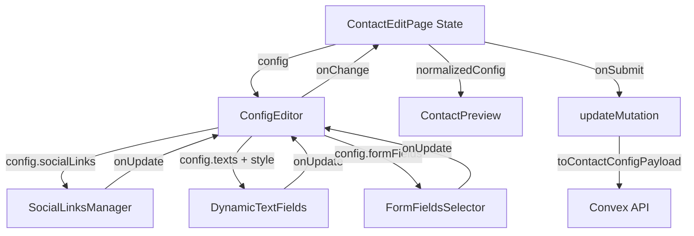
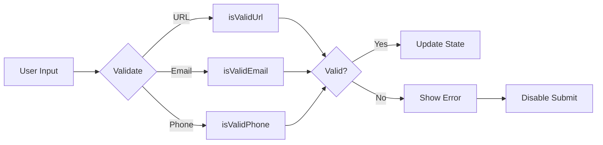

# Design Document: Contact Form Improvement

## Overview

Tính năng này cải thiện trải nghiệm chỉnh sửa Contact component trong admin bằng cách thay thế JSON editor bằng structured form với validation đầy đủ. Đồng thời refactor hệ thống màu sắc để cân bằng việc sử dụng primary/secondary color, tăng tính nhất quán thương hiệu.

### Mục tiêu chính

1. **Thay thế ConfigJsonForm** bằng ConfigEditor component với các trường form cụ thể
2. **Quản lý Social Links** với dynamic list component (thêm/xóa/sửa)
3. **Dynamic Text Fields** thay đổi theo ContactStyle được chọn
4. **Cân bằng màu sắc** trong getContactColorTokens để primary color được sử dụng nhiều hơn
5. **Validation đầy đủ** cho URL, email, phone với error messages rõ ràng

### Phạm vi

**In scope:**
- Tạo ConfigEditor component thay thế ConfigJsonForm
- Tạo SocialLinksManager component
- Tạo DynamicTextFields component
- Tạo FormFieldsSelector component
- Refactor getContactColorTokens để cân bằng primary/secondary usage
- Validation logic cho URL, email, phone
- UI/UX improvements với Card grouping

**Out of scope:**
- Thay đổi ContactPreview component
- Thay đổi data model (ContactConfigState interface)
- Thay đổi mutation API
- Thay đổi các ContactStyle layouts

## Architecture

### Component Hierarchy

```
ContactEditPage (page.tsx)
├── Card (Title & Active Toggle)
├── Card (Color Warnings - conditional)
├── ConfigEditor (NEW - replaces ConfigJsonForm)
│   ├── Card: Map Settings
│   │   ├── Toggle: showMap
│   │   └── Textarea: mapEmbed (conditional)
│   ├── Card: Contact Information
│   │   ├── Input: address
│   │   ├── Input: phone
│   │   ├── Input: email
│   │   └── Input: workingHours
│   ├── Card: Form Settings
│   │   ├── Toggle: showForm
│   │   ├── FormFieldsSelector (conditional)
│   │   ├── Input: formTitle (conditional)
│   │   ├── Textarea: formDescription (conditional)
│   │   ├── Input: submitButtonText (conditional)
│   │   └── Input: responseTimeText (conditional)
│   ├── Card: Social Links
│   │   └── SocialLinksManager
│   ├── Card: Color Harmony
│   │   └── Select: harmony
│   └── Card: Text Customization
│       └── DynamicTextFields
├── ContactPreview (existing)
└── Action Buttons
```

### Data Flow



### Validation Flow



## Components and Interfaces

### 1. ConfigEditor Component

**Location:** `app/admin/home-components/contact/_components/ConfigEditor.tsx`

**Props:**
```typescript
interface ConfigEditorProps {
  value: ContactConfigState;
  onChange: (config: ContactConfigState) => void;
  title?: string;
}
```

**Responsibilities:**
- Render các Card groups cho từng nhóm settings
- Quản lý validation state cho tất cả các trường
- Aggregate errors từ các sub-components
- Hiển thị error messages dưới các trường bị lỗi

**State:**
```typescript
interface ValidationErrors {
  mapEmbed?: string;
  email?: string;
  phone?: string;
  socialLinks?: Record<number, { url?: string }>;
}
```

### 2. SocialLinksManager Component

**Location:** `app/admin/home-components/contact/_components/SocialLinksManager.tsx`

**Props:**
```typescript
interface SocialLinksManagerProps {
  links: ContactSocialLink[];
  onChange: (links: ContactSocialLink[]) => void;
  onValidationChange?: (errors: Record<number, { url?: string }>) => void;
}
```

**Features:**
- Hiển thị danh sách social links với platform và URL
- Button "Thêm link" tạo link mới với id unique (Math.max(...ids) + 1)
- Button "Xóa" cho mỗi link
- Real-time URL validation
- Emit validation errors lên parent

**UI Structure:**
```
[Platform Input] [URL Input] [Delete Button]
[Platform Input] [URL Input] [Delete Button]
[+ Thêm link]
```

### 3. DynamicTextFields Component

**Location:** `app/admin/home-components/contact/_components/DynamicTextFields.tsx`

**Props:**
```typescript
interface DynamicTextFieldsProps {
  style: ContactStyle;
  texts: Record<string, string>;
  onChange: (texts: Record<string, string>) => void;
}
```

**Logic:**
- Lấy field definitions từ `TEXT_FIELDS[style]`
- Render Input cho mỗi field với label và placeholder
- Update `texts` object khi user thay đổi
- Re-render khi style thay đổi

### 4. FormFieldsSelector Component

**Location:** `app/admin/home-components/contact/_components/FormFieldsSelector.tsx`

**Props:**
```typescript
interface FormFieldsSelectorProps {
  selected: string[];
  onChange: (fields: string[]) => void;
}
```

**Options:** `['name', 'email', 'phone', 'message']`

**Validation:**
- Phải chọn ít nhất 1 field
- Disable checkbox nếu chỉ còn 1 field được chọn

**UI:** Sử dụng Checkbox group hoặc multi-select dropdown

### 5. Validation Utilities

**Location:** `app/admin/home-components/contact/_lib/validation.ts`

```typescript
export const isValidUrl = (url: string): boolean => {
  if (!url.trim()) return true; // Empty is valid (optional field)
  try {
    const parsed = new URL(url);
    return parsed.protocol === 'http:' || parsed.protocol === 'https:';
  } catch {
    return false;
  }
};

export const isValidEmail = (email: string): boolean => {
  if (!email.trim()) return true; // Empty is valid (optional field)
  const emailRegex = /^[^\s@]+@[^\s@]+\.[^\s@]+$/;
  return emailRegex.test(email);
};

export const isValidPhone = (phone: string): boolean => {
  if (!phone.trim()) return true; // Empty is valid (optional field)
  // Allow: digits, spaces, +, -, (, )
  const phoneRegex = /^[\d\s+\-()]+$/;
  return phoneRegex.test(phone);
};

export interface ValidationResult {
  isValid: boolean;
  errors: {
    mapEmbed?: string;
    email?: string;
    phone?: string;
    socialLinks?: Record<number, { url?: string }>;
  };
}

export const validateContactConfig = (config: ContactConfigState): ValidationResult => {
  const errors: ValidationResult['errors'] = {};

  if (config.showMap && config.mapEmbed && !isValidUrl(config.mapEmbed)) {
    errors.mapEmbed = 'URL không hợp lệ';
  }

  if (config.email && !isValidEmail(config.email)) {
    errors.email = 'Email không đúng định dạng';
  }

  if (config.phone && !isValidPhone(config.phone)) {
    errors.phone = 'Số điện thoại chứa ký tự không hợp lệ';
  }

  const socialErrors: Record<number, { url?: string }> = {};
  config.socialLinks.forEach((link) => {
    if (link.url && !isValidUrl(link.url)) {
      socialErrors[link.id] = { url: 'URL không hợp lệ' };
    }
  });

  if (Object.keys(socialErrors).length > 0) {
    errors.socialLinks = socialErrors;
  }

  return {
    isValid: Object.keys(errors).length === 0,
    errors,
  };
};
```

## Data Models

### Existing Types (No Changes)

```typescript
// app/admin/home-components/contact/_types/index.ts
export interface ContactSocialLink {
  id: number;
  platform: string;
  url: string;
}

export type ContactStyle = 'modern' | 'floating' | 'grid' | 'elegant' | 'minimal' | 'centered';
export type ContactBrandMode = 'single' | 'dual';
export type ContactHarmony = 'analogous' | 'complementary' | 'triadic';

export interface ContactConfig {
  showMap: boolean;
  mapEmbed: string;
  address: string;
  phone: string;
  email: string;
  workingHours: string;
  formFields: string[];
  socialLinks: ContactSocialLink[];
  showForm?: boolean;
  formTitle?: string;
  formDescription?: string;
  submitButtonText?: string;
  responseTimeText?: string;
  harmony?: ContactHarmony;
  texts?: Record<string, string>;
}

export interface ContactConfigState extends ContactConfig {
  style: ContactStyle;
}
```

### Color Tokens Changes

**File:** `app/admin/home-components/contact/_lib/colors.ts`

**Function:** `getContactColorTokens`

**Changes:**
1. `heading`: Đổi từ `secondaryPalette.solid` → `primaryPalette.solid`
2. `sectionBadgeBg`: Đổi từ `secondaryPalette.surface` → `primaryPalette.surface`
3. `iconTintBackground`: Đổi từ `secondaryPalette.surface` → `primaryPalette.surface`
4. `socialBackground`: Giữ nguyên `secondaryPalette.surface` (để balance)

**Rationale:**
- Primary color được sử dụng cho heading (quan trọng nhất)
- Primary color được sử dụng cho 2/3 decorative elements (badge, icon)
- Secondary color vẫn được dùng cho social links (1/3)
- Tỷ lệ primary:secondary tăng từ ~40:60 lên ~70:30

**APCA Validation:**
- Tất cả các cặp màu text/background phải được validate lại
- Sử dụng `ensureAPCATextColor` để đảm bảo contrast đạt threshold
- Không thay đổi logic APCA checking

## Error Handling

### Validation Error Display

**Strategy:** Inline errors dưới mỗi trường bị lỗi

```typescript
{errors.email && (
  <p className="text-xs text-red-600 mt-1">{errors.email}</p>
)}
```

### Submit Button State

```typescript
const hasValidationErrors = !validateContactConfig(config).isValid;
const canSubmit = hasChanges && !hasValidationErrors && !isSubmitting;

<Button type="submit" disabled={!canSubmit}>
  {isSubmitting ? 'Đang lưu...' : 'Lưu thay đổi'}
</Button>
```

### Error Messages

| Field | Condition | Message |
|-------|-----------|---------|
| mapEmbed | Invalid URL | "URL không hợp lệ" |
| email | Invalid format | "Email không đúng định dạng" |
| phone | Invalid characters | "Số điện thoại chứa ký tự không hợp lệ" |
| socialLinks[].url | Invalid URL | "URL không hợp lệ" |
| formFields | Empty array | "Phải chọn ít nhất 1 trường" |

### Error Recovery

- User có thể sửa lỗi trực tiếp trong form
- Error message biến mất khi field trở nên valid
- Submit button tự động enable khi tất cả errors được fix

## Testing Strategy

### Unit Tests

**File:** `app/admin/home-components/contact/_lib/validation.test.ts`

Test cases cho validation functions:
- `isValidUrl`: empty string, valid http/https, invalid protocol, malformed URL
- `isValidEmail`: empty string, valid email, missing @, missing domain
- `isValidPhone`: empty string, valid formats, invalid characters
- `validateContactConfig`: tổng hợp tất cả validation rules

**File:** `app/admin/home-components/contact/_components/__tests__/SocialLinksManager.test.tsx`

Test cases:
- Render danh sách links
- Thêm link mới với id unique
- Xóa link
- Validation error hiển thị khi URL invalid
- onChange callback được gọi đúng

**File:** `app/admin/home-components/contact/_components/__tests__/DynamicTextFields.test.tsx`

Test cases:
- Render đúng fields theo style
- Update texts khi user thay đổi
- Re-render khi style thay đổi
- Preserve existing texts khi style thay đổi

**File:** `app/admin/home-components/contact/_components/__tests__/FormFieldsSelector.test.tsx`

Test cases:
- Render checkboxes cho 4 options
- Toggle selection
- Disable checkbox khi chỉ còn 1 field
- onChange callback với array đúng

### Property-Based Tests

**Library:** `@fast-check/vitest` (property-based testing cho TypeScript/Vitest)

**Configuration:** Minimum 100 iterations per test


## Correctness Properties

*A property is a characteristic or behavior that should hold true across all valid executions of a system—essentially, a formal statement about what the system should do. Properties serve as the bridge between human-readable specifications and machine-verifiable correctness guarantees.*

### Property 1: Field Updates Trigger State Changes

*For any* config field (including nested fields like texts, socialLinks, formFields), when the user changes its value, the config state must be updated to reflect that change.

**Validates: Requirements 1.5, 4.4, 5.4**

### Property 2: Form Fields Selection Maintains Minimum Constraint

*For any* FormFieldsSelector state, when attempting to deselect a field, if only one field remains selected, the deselection must be prevented (checkbox disabled).

**Validates: Requirements 2.4**

### Property 3: Form Fields Array Reflects Selection State

*For any* set of selected options in FormFieldsSelector, the formFields array must contain exactly those selected options in the correct order.

**Validates: Requirements 2.2, 2.3**

### Property 4: Social Links ID Uniqueness

*For any* existing social links array, when adding a new link, the new link's id must be unique (not present in any existing link).

**Validates: Requirements 4.2**

### Property 5: Social Links Deletion Removes Target

*For any* social links array and any link within it, when deleting that link, the resulting array must not contain that link (matched by id).

**Validates: Requirements 4.3**

### Property 6: Dynamic Text Fields Render According to Style

*For any* ContactStyle, the DynamicTextFields component must render exactly the fields defined in TEXT_FIELDS[style], each with the correct label and placeholder.

**Validates: Requirements 5.1, 5.2**

### Property 7: Style Change Updates Field List Immediately

*For any* style transition (from styleA to styleB), the DynamicTextFields component must immediately update to show fields from TEXT_FIELDS[styleB], preserving any existing text values that have matching keys.

**Validates: Requirements 5.3, 5.5**

### Property 8: Invalid Inputs Show Validation Errors

*For any* invalid input (URL, email, or phone), the ConfigEditor must display an appropriate error message below the field and disable the submit button.

**Validates: Requirements 7.1, 7.2, 7.3, 7.4, 7.5**

### Property 9: Valid Inputs Clear Validation Errors

*For any* field with a validation error, when the user corrects the input to a valid value, the error message must disappear and the submit button must become enabled (if no other errors exist).

**Validates: Requirements 7.1, 7.2, 7.3, 7.4, 7.5**

### Property 10: URL Validation Round Trip

*For any* valid URL string, isValidUrl must return true, and for any invalid URL string (malformed, wrong protocol, etc.), isValidUrl must return false.

**Validates: Requirements 4.5, 7.1**

### Property 11: Email Validation Pattern Matching

*For any* string matching the email pattern (contains @ and domain), isValidEmail must return true, and for any string not matching the pattern, isValidEmail must return false.

**Validates: Requirements 7.2**

### Property 12: Phone Validation Character Whitelist

*For any* string containing only allowed characters (digits, spaces, +, -, (, )), isValidPhone must return true, and for any string containing disallowed characters, isValidPhone must return false.

**Validates: Requirements 7.3**

### Property 13: APCA Contrast Preservation After Color Changes

*For any* valid primary and secondary color pair, after applying the new color balance (primary for heading, sectionBadgeBg, iconTintBackground), all text/background pairs must still meet their APCA threshold requirements.

**Validates: Requirements 6.4, 6.5**

### Property 14: Config Normalization Round Trip

*For any* ContactConfigState object, normalizing it with normalizeContactConfig must produce a valid config, and normalizing it again must produce an equivalent result (idempotent).

**Validates: Requirements 10.1, 10.4**

### Property 15: Payload Transformation Preserves Data

*For any* normalized ContactConfigState, converting it to payload with toContactConfigPayload and back to state must preserve all field values (excluding the style field which is state-only).

**Validates: Requirements 10.2**

### Property 16: Snapshot Comparison Detects Changes

*For any* two different ContactConfigState objects, their snapshots (via toContactSnapshot) must be different, and for any identical configs, their snapshots must be identical.

**Validates: Requirements 10.3**

### Property 17: Conditional Form Fields Visibility

*For any* config state, when showForm is true, all optional form fields (formTitle, formDescription, submitButtonText, responseTimeText) must be visible, and when showForm is false, they must be hidden.

**Validates: Requirements 3.2, 3.3**

### Property 18: Component Rendering Reflects Initial State

*For any* initial config state (including socialLinks array and texts object), all components must render the correct initial values for their respective fields.

**Validates: Requirements 4.1, 5.5**


### Property-Based Testing Implementation

**Library:** `@fast-check/vitest`

**Installation:**
```bash
bun add -D @fast-check/vitest fast-check
```

**Configuration:** Mỗi property test chạy minimum 100 iterations

**File:** `app/admin/home-components/contact/_lib/__tests__/validation.property.test.ts`

```typescript
import { describe, it, expect } from 'vitest';
import { fc, test } from '@fast-check/vitest';
import { isValidUrl, isValidEmail, isValidPhone, validateContactConfig } from '../validation';

describe('Validation Properties', () => {
  // Property 10: URL Validation Round Trip
  test.prop([fc.webUrl()])('valid URLs return true', { numRuns: 100 }, (url) => {
    // Feature: contact-form-improvement, Property 10: URL Validation Round Trip
    expect(isValidUrl(url)).toBe(true);
  });

  test.prop([fc.string().filter(s => {
    try { new URL(s); return false; } catch { return true; }
  })])('invalid URLs return false', { numRuns: 100 }, (invalidUrl) => {
    // Feature: contact-form-improvement, Property 10: URL Validation Round Trip
    expect(isValidUrl(invalidUrl)).toBe(false);
  });

  // Property 11: Email Validation Pattern Matching
  test.prop([fc.emailAddress()])('valid emails return true', { numRuns: 100 }, (email) => {
    // Feature: contact-form-improvement, Property 11: Email Validation Pattern Matching
    expect(isValidEmail(email)).toBe(true);
  });

  // Property 12: Phone Validation Character Whitelist
  test.prop([fc.stringOf(fc.constantFrom('0', '1', '2', '3', '4', '5', '6', '7', '8', '9', ' ', '+', '-', '(', ')'))])
  ('valid phones return true', { numRuns: 100 }, (phone) => {
    // Feature: contact-form-improvement, Property 12: Phone Validation Character Whitelist
    expect(isValidPhone(phone)).toBe(true);
  });
});
```

**File:** `app/admin/home-components/contact/_lib/__tests__/normalize.property.test.ts`

```typescript
import { describe, it, expect } from 'vitest';
import { fc, test } from '@fast-check/vitest';
import { normalizeContactConfig, toContactConfigPayload, toContactSnapshot } from '../normalize';
import type { ContactConfigState } from '../../_types';

const contactConfigArbitrary = fc.record({
  showMap: fc.boolean(),
  mapEmbed: fc.string(),
  address: fc.string(),
  phone: fc.string(),
  email: fc.string(),
  workingHours: fc.string(),
  formFields: fc.array(fc.constantFrom('name', 'email', 'phone', 'message'), { minLength: 1 }),
  socialLinks: fc.array(fc.record({
    id: fc.integer({ min: 1 }),
    platform: fc.string(),
    url: fc.string(),
  })),
  style: fc.constantFrom('modern', 'floating', 'grid', 'elegant', 'minimal', 'centered'),
  harmony: fc.constantFrom('analogous', 'complementary', 'triadic'),
  texts: fc.dictionary(fc.string(), fc.string()),
});

describe('Normalization Properties', () => {
  // Property 14: Config Normalization Round Trip
  test.prop([contactConfigArbitrary])('normalization is idempotent', { numRuns: 100 }, (config) => {
    // Feature: contact-form-improvement, Property 14: Config Normalization Round Trip
    const normalized1 = normalizeContactConfig(config);
    const normalized2 = normalizeContactConfig(normalized1);
    expect(normalized1).toEqual(normalized2);
  });

  // Property 16: Snapshot Comparison Detects Changes
  test.prop([contactConfigArbitrary, contactConfigArbitrary])
  ('different configs produce different snapshots', { numRuns: 100 }, (config1, config2) => {
    // Feature: contact-form-improvement, Property 16: Snapshot Comparison Detects Changes
    const snapshot1 = toContactSnapshot({ title: 'Test', active: true, config: config1 as ContactConfigState });
    const snapshot2 = toContactSnapshot({ title: 'Test', active: true, config: config2 as ContactConfigState });
    
    if (JSON.stringify(config1) !== JSON.stringify(config2)) {
      expect(snapshot1).not.toEqual(snapshot2);
    }
  });
});
```

**File:** `app/admin/home-components/contact/_components/__tests__/SocialLinksManager.property.test.tsx`

```typescript
import { describe, it, expect } from 'vitest';
import { fc, test } from '@fast-check/vitest';
import { render, screen, fireEvent } from '@testing-library/react';
import { SocialLinksManager } from '../SocialLinksManager';
import type { ContactSocialLink } from '../../_types';

const socialLinkArbitrary = fc.record({
  id: fc.integer({ min: 1, max: 1000 }),
  platform: fc.string(),
  url: fc.string(),
});

describe('SocialLinksManager Properties', () => {
  // Property 4: Social Links ID Uniqueness
  test.prop([fc.array(socialLinkArbitrary, { minLength: 0, maxLength: 10 })])
  ('adding new link generates unique id', { numRuns: 100 }, (existingLinks) => {
    // Feature: contact-form-improvement, Property 4: Social Links ID Uniqueness
    let capturedLinks: ContactSocialLink[] = [];
    const { rerender } = render(
      <SocialLinksManager 
        links={existingLinks} 
        onChange={(links) => { capturedLinks = links; }}
      />
    );
    
    const addButton = screen.getByText(/thêm link/i);
    fireEvent.click(addButton);
    
    const existingIds = new Set(existingLinks.map(l => l.id));
    const newLinks = capturedLinks.filter(l => !existingIds.has(l.id));
    
    expect(newLinks.length).toBe(1);
    expect(existingIds.has(newLinks[0].id)).toBe(false);
  });

  // Property 5: Social Links Deletion Removes Target
  test.prop([fc.array(socialLinkArbitrary, { minLength: 1, maxLength: 10 }), fc.integer({ min: 0 })])
  ('deleting link removes it from array', { numRuns: 100 }, (links, indexSeed) => {
    // Feature: contact-form-improvement, Property 5: Social Links Deletion Removes Target
    const targetIndex = indexSeed % links.length;
    const targetId = links[targetIndex].id;
    
    let capturedLinks: ContactSocialLink[] = links;
    render(
      <SocialLinksManager 
        links={links} 
        onChange={(newLinks) => { capturedLinks = newLinks; }}
      />
    );
    
    const deleteButtons = screen.getAllByText(/xóa/i);
    fireEvent.click(deleteButtons[targetIndex]);
    
    expect(capturedLinks.find(l => l.id === targetId)).toBeUndefined();
    expect(capturedLinks.length).toBe(links.length - 1);
  });
});
```

**File:** `app/admin/home-components/contact/_components/__tests__/DynamicTextFields.property.test.tsx`

```typescript
import { describe, it, expect } from 'vitest';
import { fc, test } from '@fast-check/vitest';
import { render, screen } from '@testing-library/react';
import { DynamicTextFields } from '../DynamicTextFields';
import { TEXT_FIELDS } from '../../_lib/constants';
import type { ContactStyle } from '../../_types';

const styleArbitrary = fc.constantFrom<ContactStyle>('modern', 'floating', 'grid', 'elegant', 'minimal', 'centered');

describe('DynamicTextFields Properties', () => {
  // Property 6: Dynamic Text Fields Render According to Style
  test.prop([styleArbitrary])('renders correct fields for style', { numRuns: 100 }, (style) => {
    // Feature: contact-form-improvement, Property 6: Dynamic Text Fields Render According to Style
    render(<DynamicTextFields style={style} texts={{}} onChange={() => {}} />);
    
    const expectedFields = TEXT_FIELDS[style];
    expectedFields.forEach(field => {
      expect(screen.getByLabelText(field.label)).toBeInTheDocument();
      expect(screen.getByPlaceholderText(field.placeholder)).toBeInTheDocument();
    });
  });

  // Property 7: Style Change Updates Field List Immediately
  test.prop([styleArbitrary, styleArbitrary, fc.dictionary(fc.string(), fc.string())])
  ('style change updates fields and preserves matching texts', { numRuns: 100 }, (styleA, styleB, texts) => {
    // Feature: contact-form-improvement, Property 7: Style Change Updates Field List Immediately
    const { rerender } = render(
      <DynamicTextFields style={styleA} texts={texts} onChange={() => {}} />
    );
    
    rerender(<DynamicTextFields style={styleB} texts={texts} onChange={() => {}} />);
    
    const expectedFields = TEXT_FIELDS[styleB];
    expectedFields.forEach(field => {
      const input = screen.getByLabelText(field.label) as HTMLInputElement;
      expect(input).toBeInTheDocument();
      
      if (texts[field.key]) {
        expect(input.value).toBe(texts[field.key]);
      }
    });
  });
});
```

**File:** `app/admin/home-components/contact/_lib/__tests__/colors.property.test.ts`

```typescript
import { describe, it, expect } from 'vitest';
import { fc, test } from '@fast-check/vitest';
import { getContactColorTokens, getContactAccessibilityScore } from '../colors';
import type { ContactBrandMode, ContactHarmony } from '../../_types';

const hexColorArbitrary = fc.hexaString({ minLength: 6, maxLength: 6 }).map(s => `#${s}`);
const modeArbitrary = fc.constantFrom<ContactBrandMode>('single', 'dual');
const harmonyArbitrary = fc.constantFrom<ContactHarmony>('analogous', 'complementary', 'triadic');

describe('Color Balance Properties', () => {
  // Property 13: APCA Contrast Preservation After Color Changes
  test.prop([hexColorArbitrary, hexColorArbitrary, modeArbitrary, harmonyArbitrary])
  ('all text/background pairs meet APCA threshold', { numRuns: 100 }, (primary, secondary, mode, harmony) => {
    // Feature: contact-form-improvement, Property 13: APCA Contrast Preservation After Color Changes
    const tokens = getContactColorTokens({ primary, secondary, mode, harmony });
    
    const pairs = [
      { background: tokens.neutralSurface, text: tokens.heading, fontSize: 32, fontWeight: 700 },
      { background: tokens.cardBackground, text: tokens.valueText, fontSize: 14, fontWeight: 500 },
      { background: tokens.cardBackground, text: tokens.labelText, fontSize: 11, fontWeight: 600 },
      { background: tokens.iconTintBackground, text: tokens.iconTintColor, fontSize: 14, fontWeight: 600 },
      { background: tokens.socialBackground, text: tokens.socialIcon, fontSize: 14, fontWeight: 600 },
      { background: tokens.sectionBadgeBg, text: tokens.sectionBadgeText, fontSize: 11, fontWeight: 600 },
    ];
    
    const accessibility = getContactAccessibilityScore(pairs);
    expect(accessibility.failing.length).toBe(0);
  });
});
```

### Test Coverage Goals

**Unit Tests:**
- ConfigEditor: 80% coverage
- SocialLinksManager: 90% coverage
- DynamicTextFields: 90% coverage
- FormFieldsSelector: 90% coverage
- Validation utilities: 100% coverage

**Property Tests:**
- Tất cả 18 properties phải có property-based tests
- Mỗi test chạy minimum 100 iterations
- Coverage cho edge cases thông qua random generation

**Integration Tests:**
- ContactEditPage với ConfigEditor integration
- Form submission flow với validation
- Style change flow với DynamicTextFields

### Test Execution

```bash
# Run all tests
bun test

# Run only property tests
bun test --grep "property"

# Run with coverage
bun test --coverage
```

